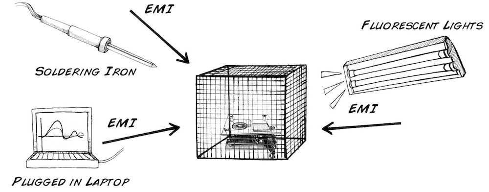
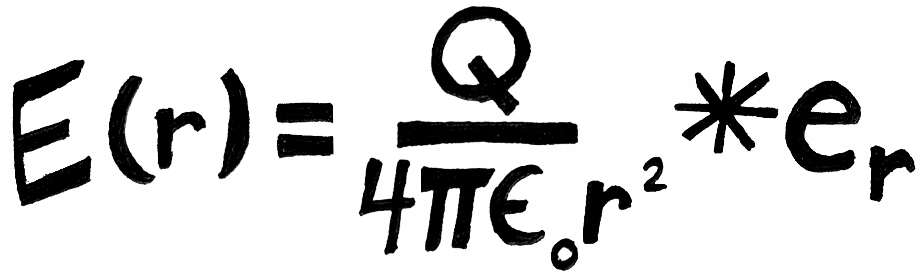
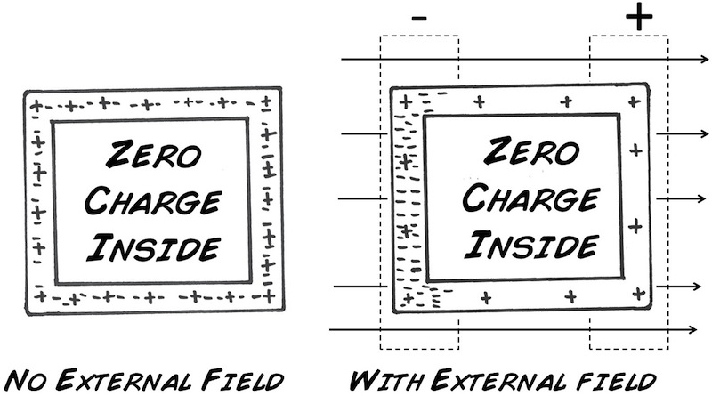
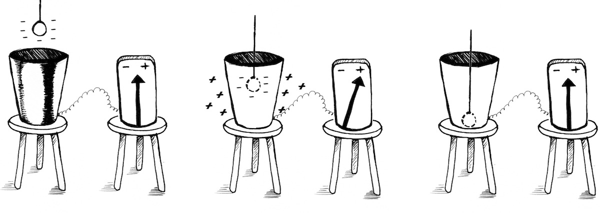
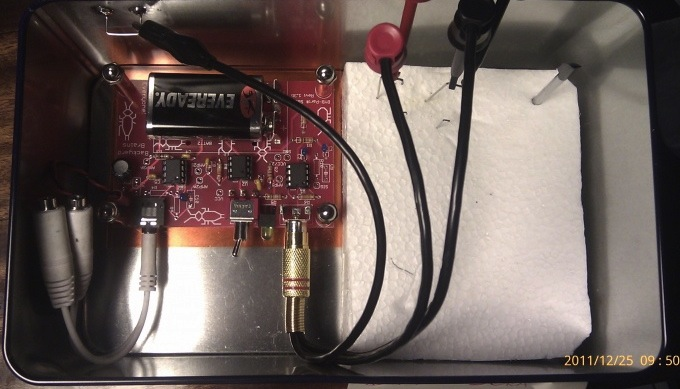

# Experiment: DIY Faraday Cage

Even the best amplifiers in the world (and ours is not) can be susceptible to
electromagnetic noise. You've got your killer experiment designed, your
preparation and electrode in place, but BLAST! where is that infernal noise
coming from that's drowning out your spikes? You can thank Nikola Tesla for
your electrical noise, but, have no fear, Michael Faraday has come to your
rescue!

**Time:**  30 Minutes

**Difficulty:**   Beginner

#### What will you learn?

In the lesson you will learn exactly what makes electromagnetic interference
(EMIs) and how they interfere with your recordings. You will also learn how a
faraday cage helps shield your recordings from (EMIs). Finally you will build
your very own faraday cage and enlist in the battle against noisy data!

##### Prerequisite Labs

  * [SpikerBox](spikerbox) \- You should become familiar with how to use your SpikerBox.

##### Equipment

* [SpikerBox](https://backyardbrains.com/products/spikerbox)
* [Faraday Cage](https://backyardbrains.com/products/faradaycage)
* [Cable_ Laptop](https://backyardbrains.com/products/laptopcable)
* [Phone](https://backyardbrains.com/products/smartphonecable)

## Background

A Faraday cage is a container made of conducting material, such as wire mesh
or metal plates, that shields what it encloses from external electric fields.
In our experiments, a Faraday cage can be used to prevent external
electromagnetic interference (EMI, or noise) from interfering with our neural
recordings. As you know, the neural signals that we are recording are very
small (on the order of micro-volts), and we use our Spikerboxes to amplify
these small signals to a large enough amplitude that we can hear and record
them. Depending on our environment, though, there can be electromagnetic,
radio, microwave, or other types of invisible emissions that can travel
through the air and interact with the metal needles and wire that we use as
electrodes. The metal then propagates the noise signal like an antenna into
our neural recordings, interfering with or even drowning out our recordings so
that all we hear, in the worst cases, is a radio station! A Faraday cage then
can be used to block many of these noise sources.

The Faraday cage is named after 1800s scientist Michael Faraday, but to learn
how the cage works we start with another famous scientist, [Charles-Augustin
de Coulomb](https://en.wikipedia.org/wiki/Charles-Augustin_de_Coulomb). Coulomb
did much work on the dynamics of charged particles and the electric fields
that they generate. Coulomb determined that the electric field, "E", at a
radius "r" away from a stationary point charge, "Q", could be calculated by
this equation_

Where ε0 is the permittivity of free space and er is the radial unit vector.
If you don't understand the math (you will one day), it means the electric
field strength declines the further away you are from an electric source. If
you are driving on a highway and notice a radio station fading, for example,
it's because you are getting further away from the big radio transmitter
tower.

The take-home is that this law gives us the foundation for a mathematical
relationship that relates charge and electric fields within a fixed volume of
space. A Faraday cage encloses such a fixed volume of space, and, if the cage
is made of conductive material, the cage's defining characteristic is that it
prevents external charges from inducing electric fields within that volume.
Here are two of the main rules that govern this barrier effect_

  1. Coulomb's Law demands that the charges in a conductor at equilibrium be as far apart as possible, and thus the net electric charge of a conductor resides entirely on its surface. 
  2. Any net electric field inside the conductor would cause charge to move since it is abundant and mobile, but equilibrium demands that the net force within the conductor is equal to zero. Thus, the electric field inside of the conductor is zero.

Rule 2 tells us that the electric field inside the conductor at equilibrium is
zero, and Rule 1 tells us that the charge of the conductor will be found
entirely at the surface (boundary). In other words, the surface of the
conducting volume becomes a barrier where charges move to and around the
surface to generate fields exactly opposing any charge that seeks to cross the
border, thus maintaining an interior free from external electrical
interference.

Faraday first demonstrated this in a [famous ice bucket and metal sphere
experiment](https://en.wikipedia.org/wiki/Faraday's_ice_pail_experiment).
Faraday lowered a metal ball charged with static electricity into a metal
bucket supported by a wooden chair that insulated the bucket from the ground.
When the charged ball was lowered into the bucket without touching the bucket,
the charges on the surface of the bucket became redistributed through
electrostatic induction. This concept became known as the Faraday cage
principle you are studying today.

Below we will examine the effects of the Faraday cage on various conditions
when doing neural recordings with the SpikerBox, along with an easy experiment
you can do at home. Here is a video explaining a very simple way to build and
use a Faraday Cage.

## Video

## Procedure

##### Building the Faraday Cage

Note that we also sell [pre-made Faraday Cages](https://www.backyardbrains.com/products/faradaycage) if you do not want
to visit the hardware store.

  1. Measure out an 8 x 16 inch rectangle of screen metal mesh 
  2. Cut out the rectangle with heavy duty scissors 
  3. Measure and cut five 8-inch lengths of wood strips 
  4. Carefully unroll metal mesh rectangle so that it lays flat 
  5. Begin Stapling metal mesh through wood strips 
  6. Staple first strip at end of mesh. 
  7. Staple second strip 5.5 inches away from first strip, again length-wise on mesh 
  8. Staple third strip 2.5 inches distant from second strip 
  9. Staple fourth strip 5.5 inches distant from third strip 
  10. Staple fifth strip at far end of mesh 
  11. The wood strips are braces, so after stapling them into place, fold the mesh at each strip to form a rectangular box

##### Using the Faraday Cage for Spikes

  1. Set up a standard cockroach leg recording prep as described in [Experiment 1](./spikerbox)
  2. Create a noisy environment by hooking up a laptop to wall outlet and turning on a soldering iron or other high power appliance. Place your SpikerBox by these electronics, and also turn on all fluorescent lights in the room. Record your observations on noise level vs. neural signal level. 
  3. Clip an alligator clip to the ground (outside of RCA connector) on the Spikerbox. 
  4. Place your Spikerbox into your Faraday cage, with cage open. Record your observations on noise level vs. neural signal level. 
  5. Close your Faraday cage but don't connect the alligator clip to anything. Record your observations on noise level vs. neural signal level 
  6. Connect your alligator cable to the screen mesh of the cage. Record your observations on noise level vs. neural signal level

##### Using the Faraday Cage on Cell Phones

Microwave ovens are examples of Faraday cages, because they are meant to
prevent the radiation used to cook the food from escaping into the
environment. Aluminum foil is a conductive material, which may also be used to
create a quick, impromptu Faraday cage (just ask your neighborhood
neuroscientist).

  1. Call your cell phone and make sure that it rings (this is your control). 
  2. Next, take your cell phone and put it in a (turned off!) microwave. 
  3. Call the cell phone from another phone. Does it ring? 
  4. Next, open the microwave door and dial your house phone number on the cell phone. As soon as you hit 'send', shut the microwave door quickly. Does your house phone ring? 
  5. Finally, wrap the cell phone in aluminum foil. Call the cell phone again? Does it ring?

## Discussion Questions

  1. What do you think a Faraday cage would do to an electromagnetic signal that comes from within the cage? Would someone outside of the Faraday Cage be able to receive that signal? 
  2. Where would be the perfect place to do a recording? 
  3. What do you think would happen if you used large hole chicken wire instead of small hole screen metal mesh for your Faraday Cage? 
  4. Why do you think cell phone noise still interferes with the SpikerBox even though the holes in our Faraday Cage are smaller than the 1.4 cm we calculated?

## Extra (user-submitted)

One can also use an old metal box after eating all the cookies from it.
Instead of a using double alligator cable to clip the reference to your
Faraday cage, you can make your probe cable consist of three wires. Two usual
electrodes (reference + recording electrode) + one extra reference with
alligator clip that you connect to the metal cookie box.

