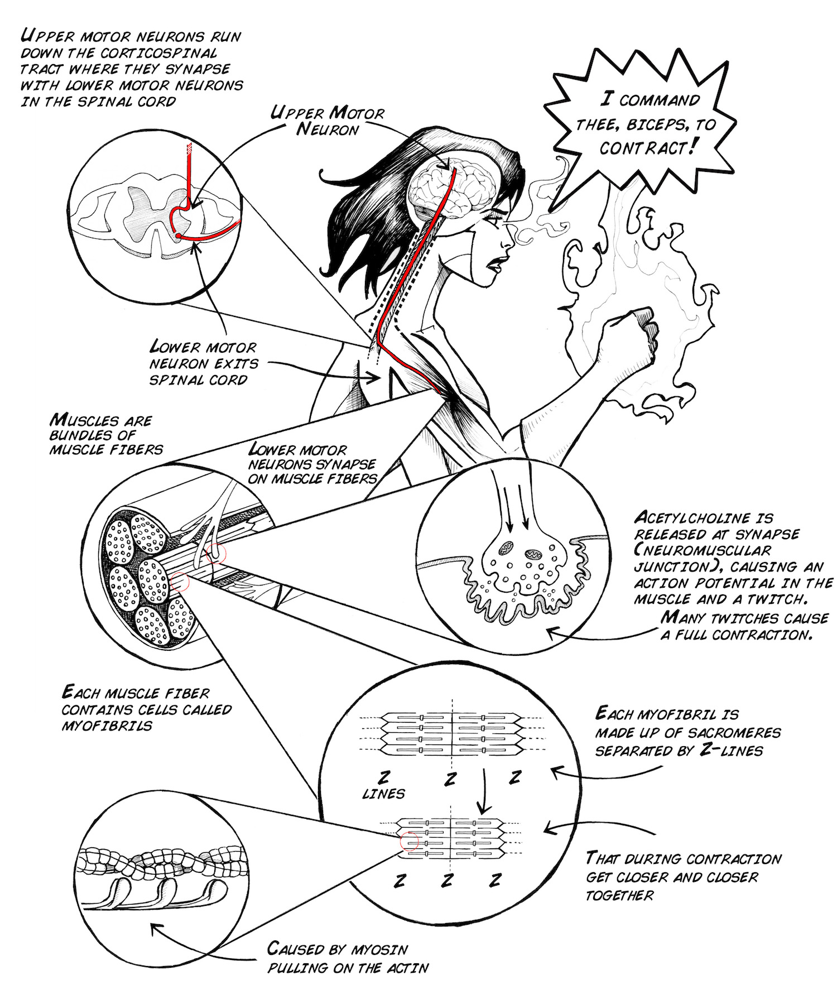
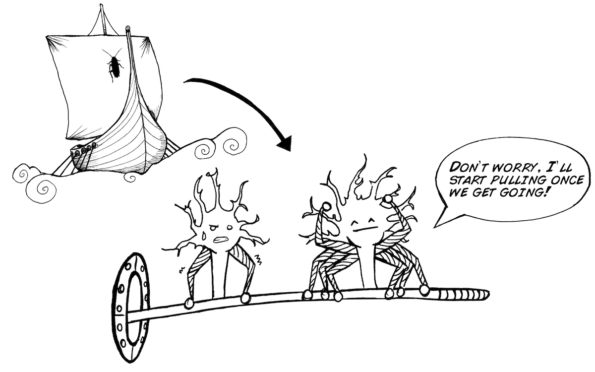
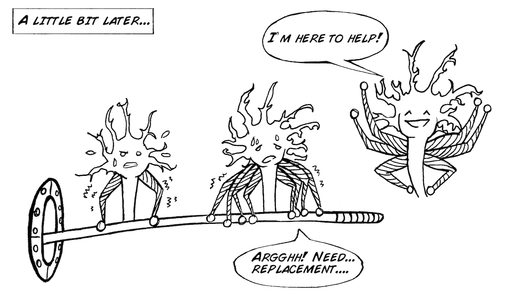
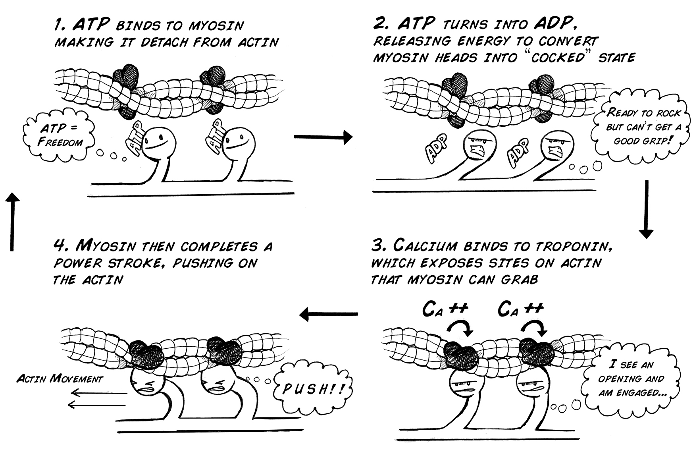
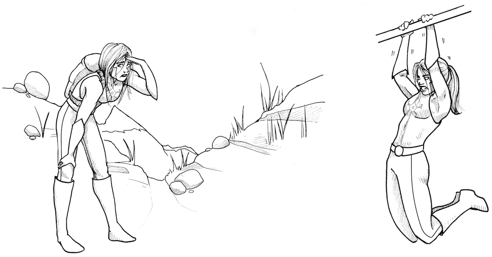
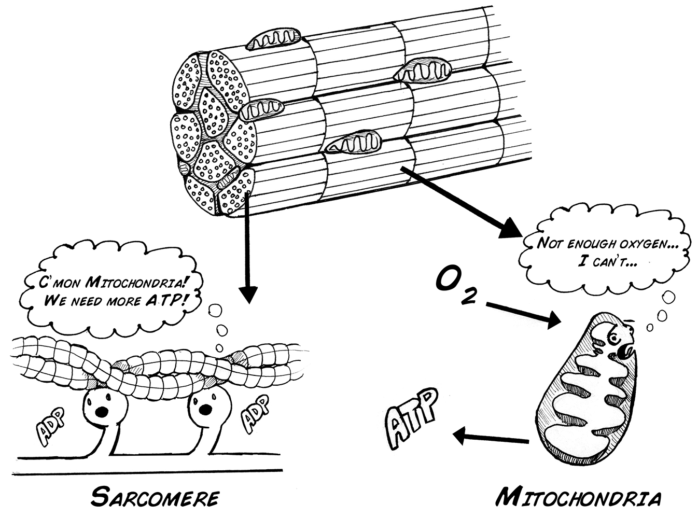
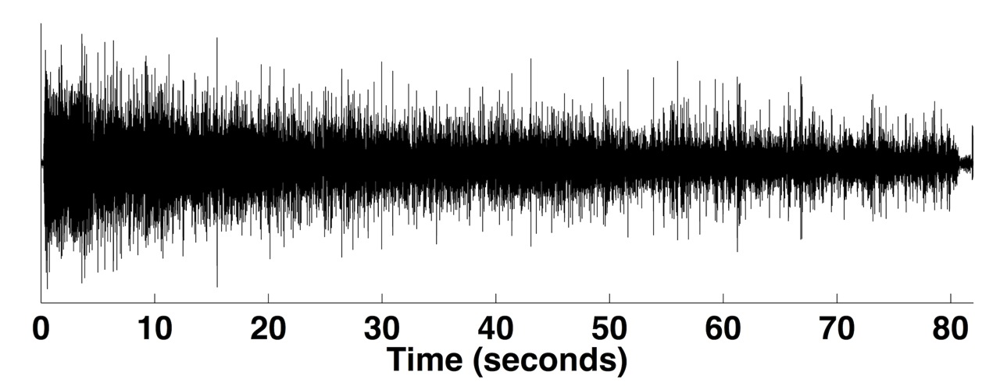

You're at your local gym, getting your pump on and lifting dumbbells. You're
feeling strong and decide to try a 30 lb curl. 1 rep, 2 rep, 3 rep....Ugh...
why is it getting so hard to lift? In this muscle fatigue lab we will
introduce you to some more in depth muscle physiology and why your muscles get
tired.

**Time**  30 Minutes

**Difficulty**  Intermediate

#### What will you learn?

You will use the Muscle SpikerBox to record your bicep or forearm muscles
while doing isometric muscle contractions until fatigue/failure occurs. You
will measure the EMG amplitude during the contractions to learn about changes
in muscle cells and neural signals during fatigue.

#### Prerequisite Labs

* [Muscle SpikerBox](./muscleSpikerBox.md) - You should read the "Introduction to EMG's" experiment for you to understand what motor units are.
  * [Oxygen and Spiking](./oxygen.md ) - You should also read our experiment on Oxygen and Neuronal Spiking to learn some basic metabolism and biochemistry. 

#### Equipment

* [Muscle SpikerBox](https://backyardbrains.com/products/muscleSpikerboxBundle)

* [Dumbbell](http://en.wikipedia.org/wiki/Dumbbell)

* [Hand Strength Meter, or](http://www.amazon.com/Electronic-Dynamometer-Capturing-Achieved-Gymnasts/dp/B00A8K4L84/ref=sr_1_3?ie=UTF8&qid=1376000756&sr=8-3&keywords=dynamometer)

* [Spring Compressor](http://www.amazon.com/Black-Gym-Hand-Grip-Strengthener/dp/B004I3O204/ref=sr_1_1?ie=UTF8&qid=1373932340&sr=8-1&keywords=25+kg+hand+strengthener)

## Background

Our muscle system is the largest system in our body (40%-50% of our weight).
This system includes your heart, which is a pump made of specialized cardiac
muscle, and the smooth muscles in your guts, allowing food to move.

But to make voluntary actions such as lifting a soldering iron or kicking a
soccer ball, you use your skeletal muscles! Your skeletal muscles allow you to
do all the wonderful movements with which you pass your days. Your muscles
contract and enable movement by sliding microscopic actin and myosin protein
filaments across each other, with a full support cast of other players
including proteins (troponin and tropomyosin), ions (Na+, K+, Ca2+), energy
carriers (ATP), and blood circulation to deliver O2 and remove CO2.

Each of your muscles is subdivided into functional groups of muscle fibers
called motor units (Again, see our [Introduction to EMG's](./muscleSpikerBox.md) experiment). A
motor unit is a motor neuron and all of the muscle fibers it innervates. To
achieve great things, like lifting a heavy weight, motor units join together
in a systematic way to supply the force required to achieve strength. This
teamwork among motor units is called "Orderly Recruitment" by scientists, and
as stated before, motor units with the smallest number of muscle fibers begin
contracting first during a movement, followed by the motor units with the
largest number of fibers afterward, to allow for a smooth, strong muscle
contraction.

In addition, a motor unit can be recruited to replace an already active motor
unit that is experiencing fatigue.

So...how does this all relate to your muscles getting tired?

## Muscle Fatigue

When a muscle cell fires an action potential due to a motor neuron command,
this causes a release of calcium (Ca2+) inside the muscle fiber from the
sarcoplasmic reticulum. The Ca2+ then flows into the area where the actin and
myosin is (the sarcomere), initiating a complex cellular reaction with ATP
that allows the myosin to pull on the actin. The movement of myosin pulling on
actin in the sarcomeres is called a "[sliding filament model](http://en.wikipedia.org/wiki/Sliding_filament_model)" and consists of 4
steps.

As long as calcium and ATP are available, the actin and myosin will continue
pulling on each other and the twitching will continue. Note that the calcium
is rapidly transported back into the sarcoplasmic reticulum where the process
must be initiated again by the muscle firing an action potential to cause
another twitch. The summing together of many of these incredibly tiny "pulling
events" produces a twitch (a very tiny, very fast force). When many twitches
occur in a row, the twitches sum together and produce a larger force. ATP is
continually provided in the muscle by breaking down glucose (see our ["Oxygen Experiment"](./oxygen.md) for an explanation of this metabolism. If
glucose isn't available, fatty acids can be used to make pyruvate and keep the
Krebs cycle and the oxidative phosphorylation pathway operating. As long as
oxygen (O2) is present and can be readily transported to the muscle cell, the
oxidative phosphorylation pathway can produce ATP at incredible rates. This is
called **aerobic contraction** , meaning "using oxygen."

_Yes, but again, how does this all relate to your muscles getting tired?_

Muscle Fatigue occurs when the muscle experiences a reduction in its ability
to produce force and accomplish the desired movement. The factors that explain
fatigue are complex and after more than 100 years of investigation are still a
topic of active research.

For example, short term fatigue (failure to lift a heavy weight, do more push-
ups, etc.) is different than long term fatigue such as as a marathon run, a
100 mile bicycle ride, or a full-day hike through the Rocky Mountains of
Colorado.

We do understand though some of the basic reasons that muscles become fatigued
during high intensity exercise, most notably that the demand for oxygen can be
greater than the supply. The blood flow to the muscle can be reduced because
of 1) muscles intensely contracting can reduce blood flow and thus oxygen
availability, or 2) the muscle is simply working so intensely that there
literally is not enough oxygen to meet demand (a sprint at top speed).

If such O2 isn't available as an electron acceptor , the Krebs cycle and
electron transport chain cannot operate, and the muscle must gain ATP from
other sources. For example, for rapid, intense activity, phosphocreatine
(synthesized from amino acids) can serve as a phosphate donor to allow ATP
formation. This is called **anaerobic contraction** , meaning "not using
oxygen."

However, anaerobic contraction can lead to build-up of metabolites and waste
products, and a significant increase in the acidity (decreased pH) inside the
muscle cell, which can interfere with the many biochemical reactions necessary
for the actin and myosin to produce force and slide against each other. This
chemical change is thought to be the cause of the "stinging" or burning
sensation you feel in your muscles as you become fatigued (such as in arm
wrestling or in the last few reps of a difficult weight lifting set).

We can observe the effects of these fatigue processes, albeit indirectly, by
examining the amplitude of the EMG signal during a muscle contraction. As
fatigue progresses, 1) the firing rate of motor neurons drops, which in turn
drops the number of action potentials the muscles themselves then fire,
leading to a reduction in strength, and 2) muscles can often also continue
generating action potentials due to neural drive, but the muscle is unable to
contract due to molecular fatigue events in the muscle fibers, which in turn
leads to a reduction in strength.

#### Downloads

> Before you begin, make sure you have the [Backyard Brains Spike Recorder](https://backyardbrains.com/products/spikerecorder) installed on
> your computer/smartphone/tablet. The Backyard Brains Spike Recorder program
> allows you to visualize and save the data on your computer when doing
> experiments. We have also built a simple lab handout to help you tabulate
> your data.
>
> [Spike Recorder Computer Software](https://backyardbrains.com/products/spikerecorder)

## Video

## Experiment

[Note: In truth you can use any muscle you like for this experiment, as long
as you can figure out how to produce fatigue in that muscle in a controlled
fashion.]

**Isometric biceps hold**

  1. Hook up your EMG patch electrodes to your bicep, plug the electrodes into your Muscle SpikerBox, and hook up your SpikerBox to either your mobile software or PC. 
  2. Select a dumbbell that is at about 60% of your maximum lifting weight. Depending on your strength, this will be ~10-25 lbs (~5-12 kg). With your back to a wall to control your posture and arm position, hold the weight in your hand for as long as you can, with your elbow at a 90 degree angle. This is called an "**isometric** " contraction since your muscles are working, but your joints are not moving. [Note: you will probably find that your wrist gets tired faster than your bicep. You can avoid this problem by hanging a weight off your wrist rather than holding the dumbbell in your hand (see video above).]
  3. Record your EMG during this task using SpikeRecorder on tablet/smartphone or your computer. 
  4. Observe the amplitude (height) and firing rate (number of impulses) in the EMG. What do you see over time? The gross signal may look similar to this: 

**Hand Gripper Isometric Test**

  1. Connect the EMG electrode patches to your inner forearm and hook up the cables and SpikerBox as previously noted.
  2. Use a [hand-dynamometer](http://www.amazon.com/Electronic-Dynamometer-Capturing-Achieved-Gymnasts/dp/B00A8K4L84/ref=sr_1_3?ie=UTF8&qid=1376000756&sr=8-3&keywords=dynamometer) or [hand gripper](http://www.amazon.com/Ironman-Club-Strong-Hand-Kw-105/dp/B000RZF9KE/ref=sr_1_3?s=sporting-goods&ie=UTF8&qid=1376000649&sr=1-3&keywords=40+kg+hand+grip) (you should buy one in the 50-100 lb (25-45 kg) range), and squeeze the grip for as hard as you can for as long as you can.
  3. Record your EMG during this task and observe the amplitude and firing rate as before. 

## Science Fair Project Ideas

* Sometimes, when hiking in your favorite park (like the [Wonderland Trail](http://en.wikipedia.org/wiki/Wonderland_Trail) or [Torres del Paine](http://en.wikipedia.org/wiki/Torres_del_Paine_National_Park)), you find, even if you are not very fit, you can hike for 6-10 hours. However, if you tried to lift a 100 pound (45 kg) barbells repeatedly, you would rapidly get tired within 5-30 reps over a couple minutes depending on your athletic ability. Why is the time scale of fatigue so different in these two activities?
  * Try the biceps and forearms fatigue tests on both arms and hands to see if you observe anything different. As you know, you have a dominant arm/hand (left-handed vs right-handed). Is your dominant arm/hand stronger or more fatigue resistant than the other?
  * How can two muscles that are about the same size be so different in their fatigue properties? We didn't cover it here, but you can begin reading about [slow twitch and fast twitch](http://en.wikipedia.org/wiki/Skeletal_striated_muscle) muscle fibers to learn more. 
  * Are there muscles that are very fatigue resistant? Can you give us some examples? 
  * Work out your biceps for a month at your school gym. Measure your fatigue time and EMG changes before the period of training and after the period training using the same test load/force.
