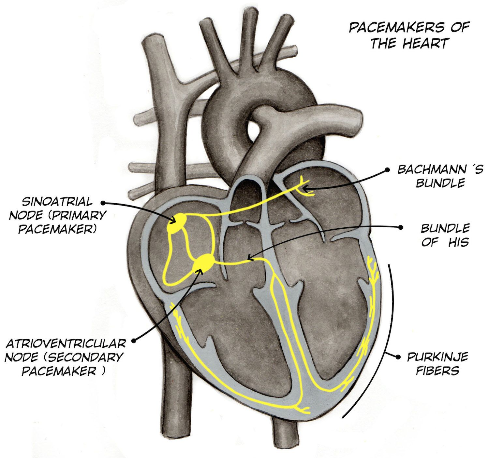
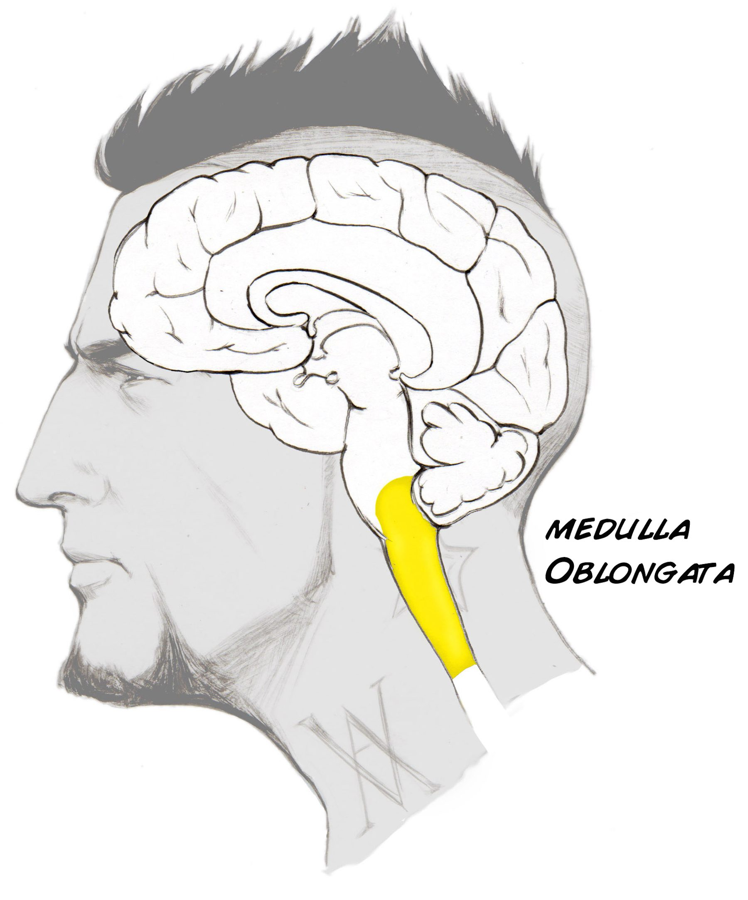
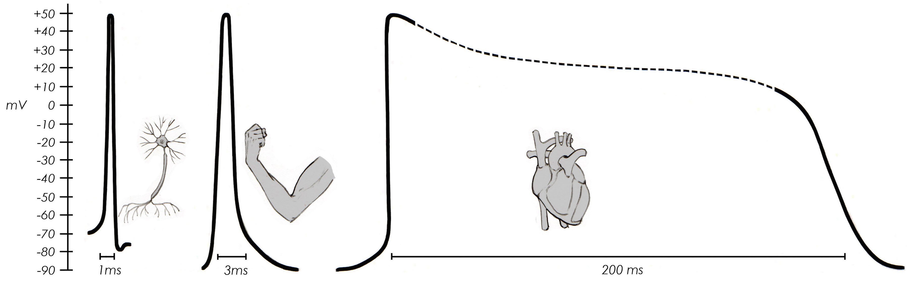
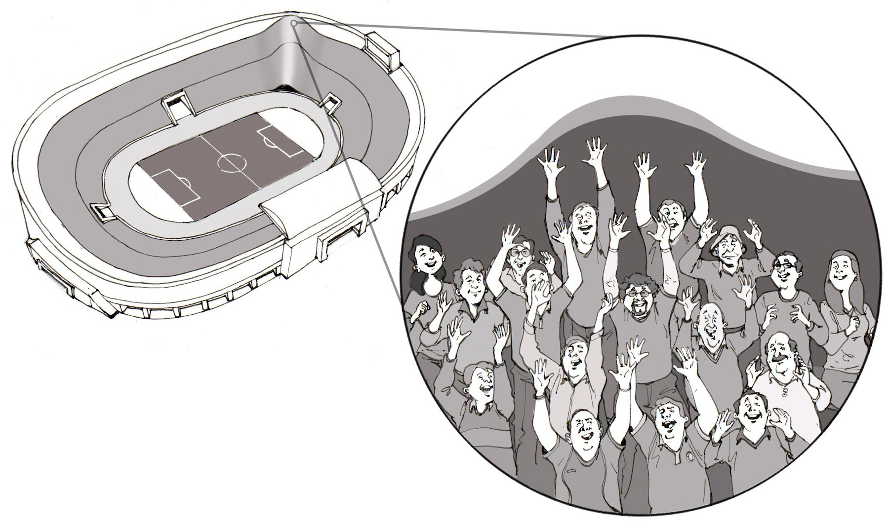
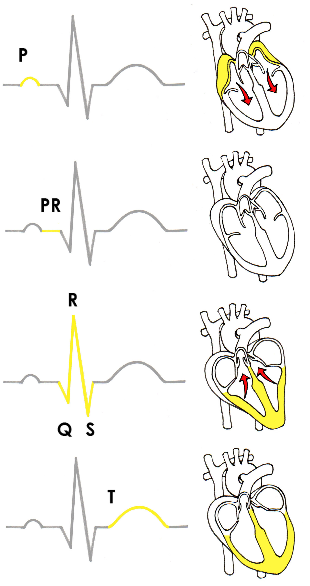
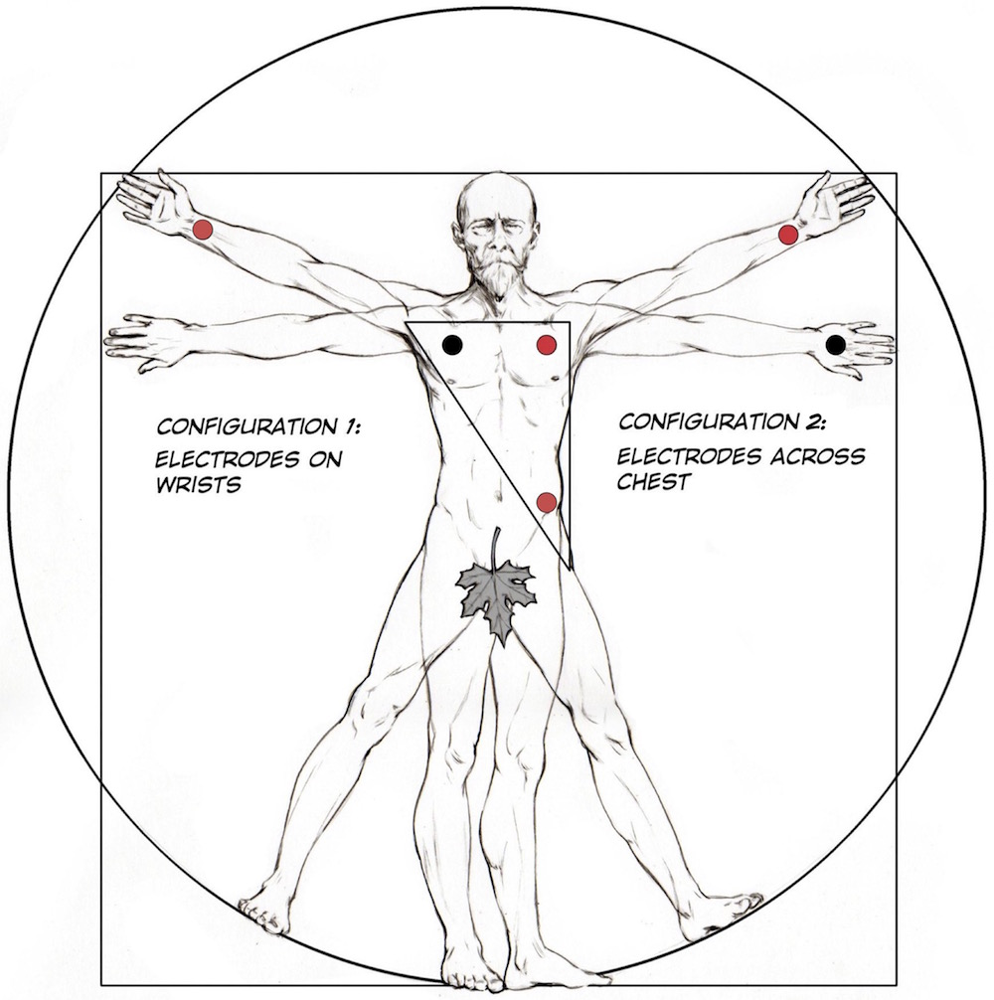

# Experiment: Heart Action Potentials

You've seen spikes from voluntary muscle contractions, what could _beat_ that?
How about getting down with your own internal rhythm: your heart rate! It's
something we can't live without, so let's try and see this in action!

**Time**  3 hours

**Difficulty**  Advanced

#### What will you learn?

With this experiment, you can learn about the cardiovascular system through
the use of electrocardiograms (EKGs). You will have an understanding of the
communication taking place between your brain and your heart, and you will see
and listen to the contractions of your heart.

##### Prerequisite Labs

##### Equipment

* [Heart & Brain SpikerBox](https://backyardbrains.com/products/heartAndBrainSpikerBox)

## Background

Pump, Pump, Pump. Your hearts works continuously, day in and day out, to
supply blood and [oxygen](./oxygen)
through your body. Did you know that, like
[neurons](./spikerbox) and
[muscles](./emgspikerbox), your heart
uses spikes (electrical impulses) to function as well? Our hearts are made up
of four chambers, of which the upper two chambers are called the atria and the
lower two are called ventricles. Regular, rhythmic electrical signals
originate from the right atrium, your heart's pacemaker, and then throughout
the rest of the heart, causing the heart muscles to contract and pump blood
throughout your circulatory system.

These electrical signals are regulated by your brain's cardiovascular center
located in the medulla oblongata. The medulla is the last stop in your brain
before you are in the spinal cord and it controls basic body functions such
breathing, heart rate, and blood pressure. Interestingly, your heart can beat
without instructions from the brain, but in situations where your brain
decides your heart rate needs to be adjusted, such as when you are exercising,
or when hormones like epinephrine (adrenaline) are being released (often
associated with emotions like fear, excitement, and nervousness) your
cardiovascular centre sends signals to your heart, changing both the rate of
your heart's beating and the strength of contraction.

The signal we will be recording is called an **electrocardiogram** , also
known as an ECG or EKG, which is a measurement of the coordinated "electrical
wave" of different parts of your heart contracting in a controlled sequence.
Since the heart is made up of specialized muscle cells, and these muscle cells
fire action potentials to contract, we can measure these in much the same way
we have previously measured [skeletal muscle contraction](./emgspikerbox). But
these action potentials, at 200 ms in length, are much slower than the action
potentials of your neuron (1 ms) and muscles (3 ms). Moreover, spiking of
neurons and muscles is measured in spikes per second (or Hz), but the spiking
of your heart is measured in beats per minute (BPM). The action potential
cardiac muscle cells uses Sodium and Potassium as well, but the potassium
channels take longer to open, causing a longer action potential.

The heart contains special myocardial cells called pacemaker cells (see first
illustration above) that spontaneously generate rhythmic action potentials to
control your heart. These Pacemaker cells rhythmically cause the rest of the
heart's myocardial cells to contract in a specific pattern (atria first,
delay, then ventricles). This is why your heart can beat on its own without
neural input. These pacemaker cells are vitally important is telling the rest
of the heart to contract in a synchronized manner (when the cardiac muscle
cells fire and contract in a disorganized manner, this is called
["fibrillation" ](http://en.wikipedia.org/wiki/Fibrillation) and can be
fatal). Imagine the wave in a stadium sports event. Many people have to be
precisely coordinated for the wave to occur, and similar principles apply to
heart contraction. Select groups of cardiac muscle cells must contract at the
right time for effective pumping.

We can observe the coordinated contraction of the heart muscle cells with our
Heart and Brain SpikerBox! Normal heart contraction has a very distinctive
electrical profile, now culturally iconic due to its use in medical dramas:
the classic P wave, QRS complex, and T wave. Seeing these depends critically
on where you place your electrodes across your body, but let's give it a shot!

#### Downloads

> Before you begin, make sure you have the [Backyard Brains Spike Recorder](https://backyardbrains.com/products/spikerecorder) installed on your computer. Backyard Brains Spike Recorder program allows you to visualize and save the data on your computer when doing experiments. We [made a video](https://www.youtube.com/watch?v=L23Aeo6WXjA) for you to explain this!

#### Print Materials

> If you're looking for a PDF to print and scribble on, or a google doc to
> edit, [check out this repository of print resources here!](https://drive.google.com/drive/folders/1bE1B0DvsGNauhyj-z8YjzuBXmFYivfkR?usp=sharing)

[Spike Recorder Software for Displaying and Saving Data on Computer](https://backyardbrains.com/products/spikerecorder)

## Tutorial Video of Experiment

## Procedure

In this experiment, we are going to monitor our heart rate and examine changes
in it caused by our brain's cardiovascular center.

  1. You have many options for where to place the electrodes. We at BYB are only beginning to learn about the concept of the ["Einhoven Triangle"](http://en.wikipedia.org/wiki/Willem_Einthoven), and the art of placing electrodes and interpreting ECG is [university taught](http://www.healthcare.ac.uk/cppd/short-courses-undergraduate/12-lead-ecg-interpretation/). We have found that the easiest signal can be obtained by placing the electrodes across the inner wrists. 
  2. Place one adhesive electrode on each inner wrist, and the another adhesive electrode on the back of one of your palms. 
  3. Connect the red alligator clips on your inner wrists, and the bare metal clip on your back palm. Note: Prior to Summer 2015 we shipped cables that had red, black, and bare alligator clips. If you have this older cable, place the red on your inner left wrist, the black on your inner right, and the ground (bare metal alligator clip) on the back of your hand. 
  4. Sometimes placing electrodes on the wrists can be slightly noisy (don't flex your wrists, be completely relaxed), so the the cleanest signal can be found by attaching the red electrode clips above and below your heart on your upper left chest, and the black electrode ground clip on your upper right chest. This can be a little awkward in public settings though. 
  5. Plug your orange interface cable in the orange port on your Heart and Brain SpikerBox. 
  6. Plug one end of the USB cable to the Heart and Brain SpikerBox and the other end into the computer, or conenct via the Green Smartphone cable to your mobile device. 

  7. Open the SpikeRecorder software, and connect to the USB port in the settings menu. 
  8. Wait 1-2 seconds, and you should begin to see heart muscle contraction pulses on your screen. 
  9. If you see a high level of noise, try to use a different computer as the power source. We have found that the SpikerBox is very sensitive to noise in the power source - laptops running off battery power, and computers connected through UPSs and surge protectors work best to produce a good signal. Also, hold still while you are connected to the EKG - muscle movements can also be picked up, which causes interference with your EKG reading. Resting with your hands on your knees provides provides the most stable signal. 
  10. If your EKG appears upside down during recordings, simply swap the two red electrode alligator clips to the opposite wrists. 
  11. If you want to record the data, press the red "record" button in the upper right side of the Spike Recorder Screen. The data will be saved as a .wav file. 
  12. Disconnect your electrodes, and do some jumping jacks, jump rope, or running in place to increase your heart rate. 
  13. Reconnect your electrode cables. You should see your increased heart rate on the Spike Recorder software. 

## Discussion / Further Work

  1. Are we recording Cardiac Action Potentials from the Pacemaker Cells, or are we recording the muscle contractions of the heart. Why or why not? 
  2. Our SpikeRecorder Software is designed to be easy to use, but if you want to hack an interface, you can modify our legacy processing sketch that also saves and displays the data. [Download it here](files/BYB_Heart_Rate_Monitor_Processing_SaveData.pde.zip). To do this, you need to use a different Arduino Sketch, [that you can find in this link](files/BYB_Heart_Monitor_Arduino_Sketch_timer.ino.zip). 

## Science Fair Project Ideas

  * There are lots of different places you can put the electrodes for this experiment-what effect(s) do the different placements have on the signal you see? Is the signal different if you move the electrodes closer to one another? Closer to the heart? 
  * Look at the effects of certain states on the amplitude and rate of heart action potentials-Recently run, recently drank caffeine, holding your breath, deep slow breaths vs rapid ones, sitting vs standing, age, general athleticism, etc. 
  * If it's cold or hot outside, try comparing heart rates when you're inside vs when you're exposed to the weather. Stay safe though! 
  * What about before and after you're eating? Why might that be? What, if anything, does the movement of your blood have to do with eating? 
  * What other things do you think would affect heart rate? Experiment some, but make sure to stay safe! 
