## History: In Search of the Spike

---
id: "_history__in_search_of_the_spike"
title: " History: In Search of the Spike"
slug: "/retired/experiments/history"
---

While not an experiment, this gives you the historical context behind the
efforts of scientists to amplify the neural signals that you regularly observe
every day with Backyard Brains.

**Time:**  2 hours

**Difficulty:**   Advanced

#### What will you learn?

For 235 years we have been trying to isolate, understand, and analyze the
elusive action potential, and here we tell the story that continues today.

##### Prerequisite Labs

none

##### Equipment

* [A mind willing to learn](https://en.wikipedia.org/wiki/Humanity)

## Background

The progress of understanding Action Potentials can be classed into three main
endeavors_

  1. **Amplification** , 
  2. **Recording / Visualization**
  3. **Analysis**

We now enter the history.

## 1\. Amplification

The amplifiers that gave us the first hint of the electrical impulses
generated by neurons came from biological tissue itself! Scientists of the
18th and early 19th century used the contractions of muscles as
"bioamplifiers" to indirectly measure neural firing. Using [friction
machines](https://en.wikipedia.org/wiki/Electrostatic_generator) (spark
generators), [Leyden jars](https://en.wikipedia.org/wiki/Leyden_jar) (primitive
capacitors), or [Voltaic Piles](https://en.wikipedia.org/wiki/Voltaic_pile)
(the first batteries), electrical stimuli could be delivered to motor neurons
that were still attached to muscles. The electrical stimulation would cause
the nerve to fire action potentials (so people hypothesized), the muscle would
then contract, and the force of contraction could be measured with a spring.
With increasing electrical stimuli strength (thus more action potentials in
the motor neurons), the muscle would contract with increasing force. This
technique worked, but led to vigorous debates as to whether the neural tissue
was [ actually generating its own action
potentials](https://backyardbrains.com/experiments/microstimulation) at all,
or whether the muscle contraction was just a direct result of electrical
stimulation.

[ 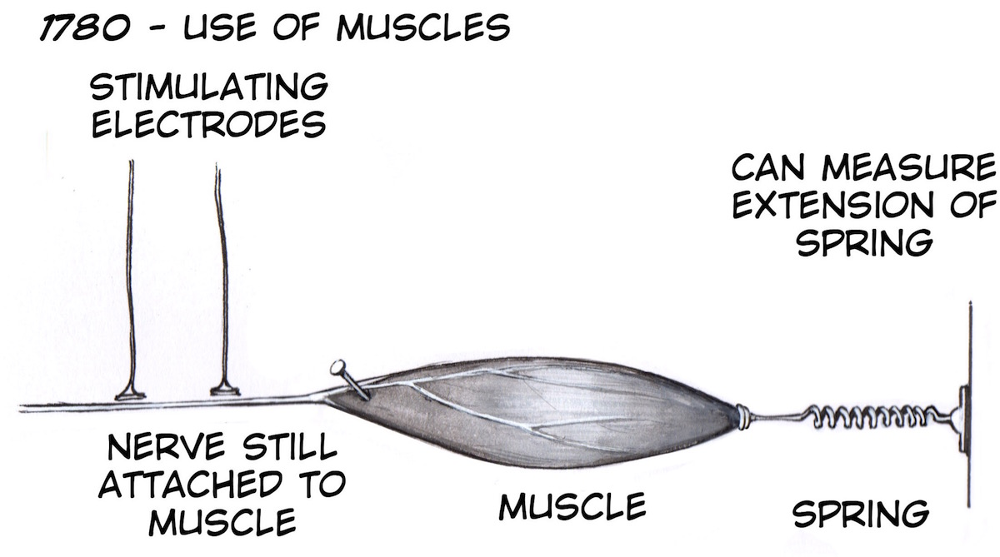](./img/MuscleAmp_eng.jpg)

By the mid-19th century, galvanometers had been invented, and it was possible
to see that nerves were indeed generating their own action potentials. These
galvanometers exploited the then new technology of
[electromagnets](https://en.wikipedia.org/wiki/Electromagnet). For example,
Emil de Bois-Reymond built by hand a type of galvanometer with 24,000 turns
around an iron plate. When the nerve fired action potentials, a metal needle
suspended by the plate would deflect. These devices worked, but the needle
movement was not fast enough to separate the 1 ms individual action
potentials, and the machines occupied a lot of time to construct.

[ 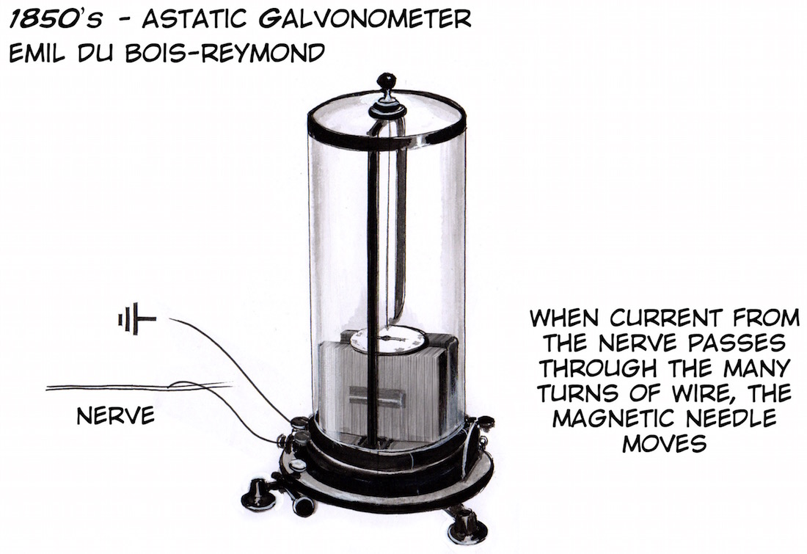](./img/Galvanometro_eng.jpg)

In the late 19th century, French scientist Gabriel Lippmann invented the
capillary electrometer, which consisted of a test tube filled with mercury and
capped with a layer of sulphuric acid. A wire was connected from the nerve to
the mercury bath and the ground to the sulphuric acid. When the voltage of a
nerve changed due to action potential firing, the shape of the meniscus
between the mercury and sulphuric acid would change and could be observed
underneath a microscope. A "liquid state amplifier," if you will. Capillary
Electrometers were sensitive but, like the early galvanometers, also suffered
from mechanical sloth (the meniscus did not change fast enough to isolate
individual action potentials).

[ 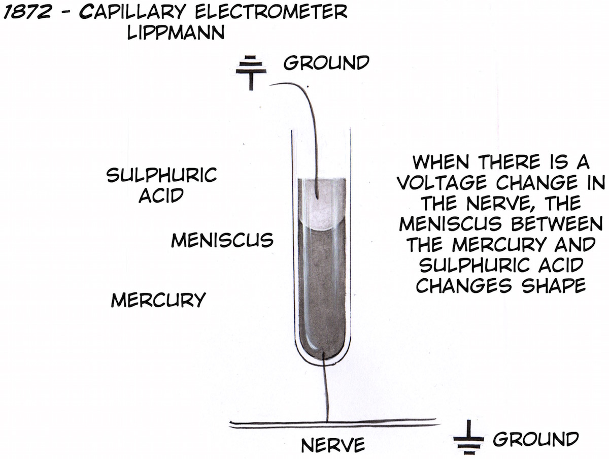](./img/CapillaryElectrometer_eng.jpg)

In 1902, on the cusp of the radio age and electronic revolution, Wilhelm
Einhoven invented the most sensitive amplifier yet, the string galvanometer.
This consisted of a gold coated glass string suspended between two high power
electromagnets. Similar to the Astatic Galvanometer but more sensitive (as the
electromagnets were actively powered), the string would oscillate when the
nerve fired action potentials. A light could be presented on the string, and
the movement of the shadow could be recorded on photographic film. Wilhelm
used his string galvanometer to record the
[Electrocardiogram](https://backyardbrains.com/experiments/heartrate), for
which he is famous.

[ 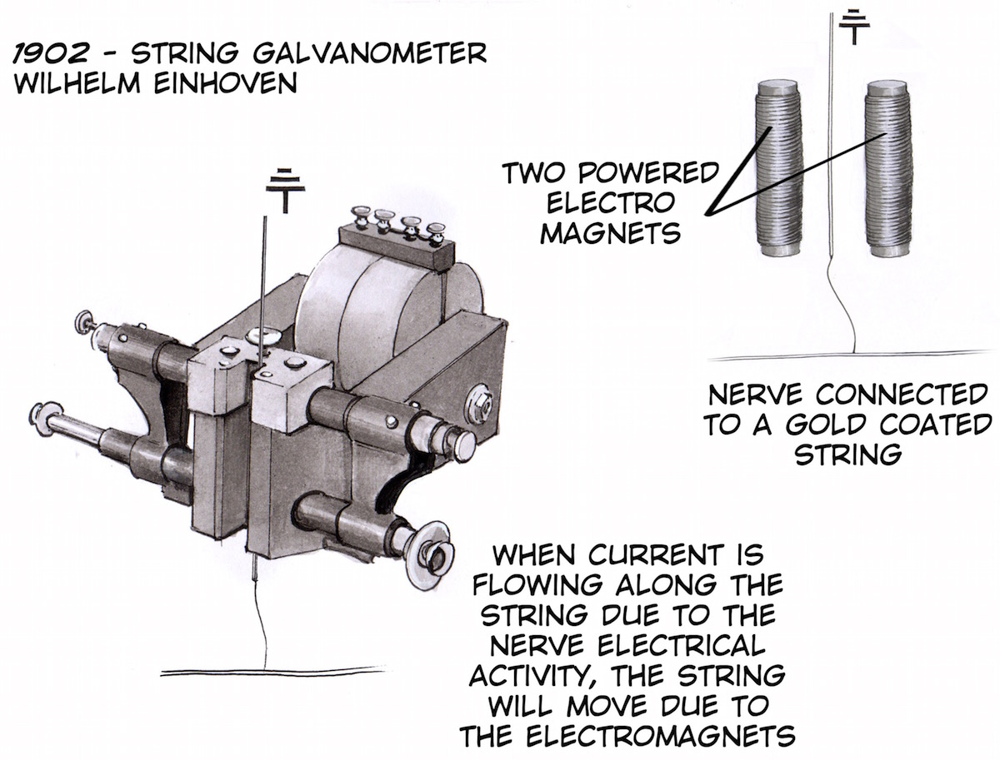](./img/String_Galvanometro_eng.jpg)

And thus the electro-mechanical era came to an end and gave way to the radio /
electronic era. The radio pioneer Lee De Forest invented his [ Audion
tube](https://en.wikipedia.org/wiki/Audion) to amplify the radio signals
transmitted from distant stations. And history never looked back. Rapid
technological developments of radio technology followed, giving way to the
vacuum tube, which allowed the work of neuroscientists of the early 20th
century, such as [Edgar
Adrian](https://en.wikipedia.org/wiki/Edgar_Adrian,_1st_Baron_Adrian), [Hodgkin
& Huxley](https://en.wikipedia.org/wiki/Hodgkin%E2%80%93Huxley_model),
[Erlanger & Gasser](https://en.wikipedia.org/wiki/Joseph_Erlanger), etc., to
finally isolate and understand the action potential. Sweden gave out many
medals.

[ 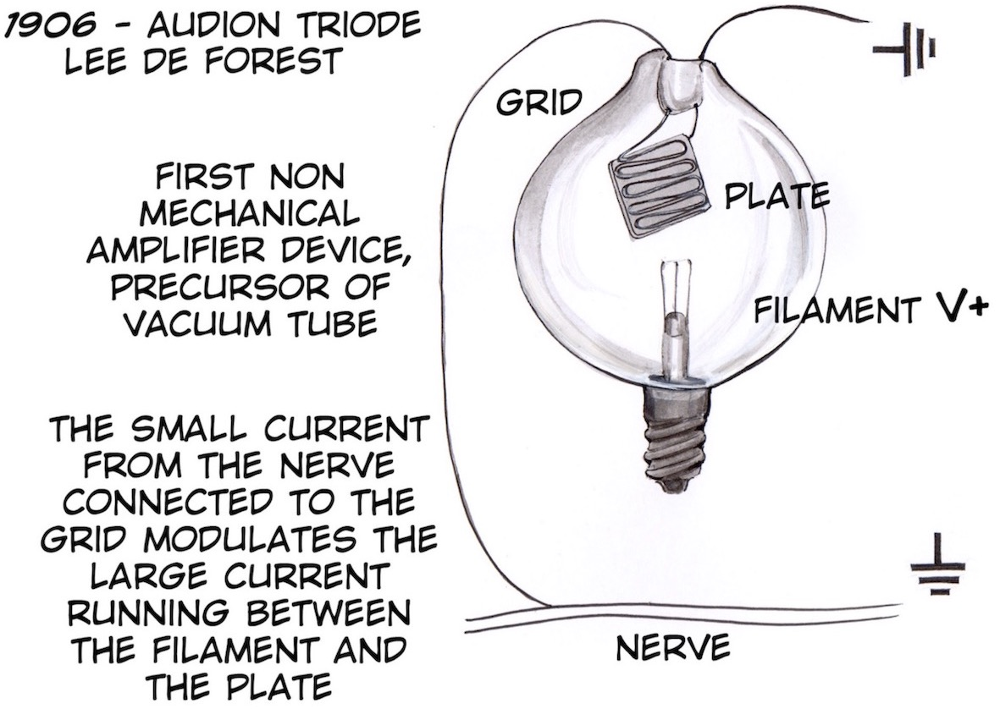](./img/Audio_Triode_eng.jpg)

Vacuum tubes were used extensively in the first half of the 20th century, but
they were notoriously fragile and power hungry. To improve the reliability of
long distance communications, the trilogy of scientists Bardeen, Brattain, and
Shockley at Bell Labs developed the most important invention of the 20th
century_ the transistor, a wonderful little device [we have previously
discussed in detail](https://backyardbrains.com/experiments/transistorTheory).
Thus, in the 50's and 60's scientists began using transistor-based amplifiers
to measure neural signals. The transistor also had an [important cultural
impact](https://www.youtube.com/watch?v=kqXSBe-qMGo) on the youth of the era.

[ 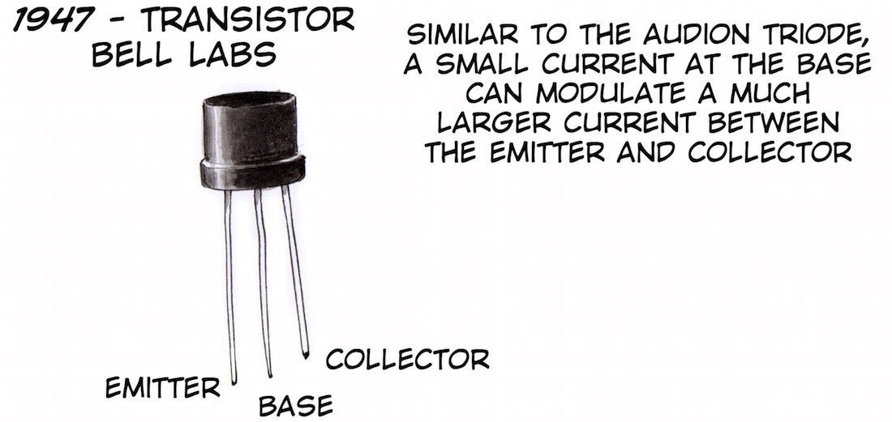](./img/Transistor_eng.jpg)

But, a problem remained to be solved in circuit design; you still had to
solder wires, transistors, capacitors, and resistors together to build a
circuit (open an electrical artifact built before ~1965 to see this), making
complex circuits labor intensive to build and susceptible to failure. For
example, building [a DIY
SpikerBox](https://backyardbrains.com/products/diyspikerbox) by hand in this
epoch would have required a couple hundred of components, rather than the 24
discrete parts it currently has today. Would it be possible to make a complex
circuit on a monolithic piece of silicon? In 1958 the possibility became.

[ 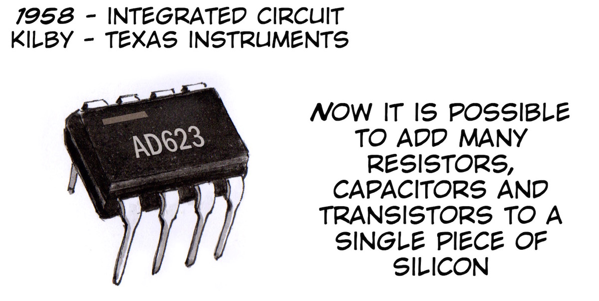](./img/IntegratedCircuit_eng.jpg)

With the development of integrated circuits, we entered the modern era, and
this is why your SpikerBox has three integrated circuits (three chips!) in its
design. Now, where do we find ourselves? Every year components get smaller,
less power hungry, and it becomes easier and easier to build electronic boards
at low cost.... and there is still [plenty of room at the
bottom](https://en.wikipedia.org/wiki/There%27s_Plenty_of_Room_at_the_Bottom).

[ 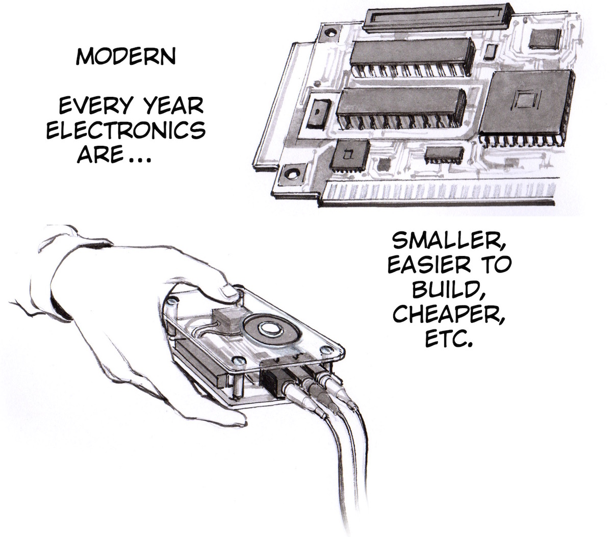](./img/ModernElectronics_eng.jpg)

## 2\. Recording/Visualization

It's not enough to merely amplify the neural signal, we have to try to record
the data to be able to 1) visualize it, and 2) analyze it at a later date.
Since neural events are fast (the action potential is 1 ms long), recording
such is a challenge. The first notable physiological recording equipment was
the kymograph, also known as the "smoked drum." This was sufficient for slower
physiological events like respiration and muscle movement, but not fast enough
to record neural signals.

The technology for inventing a recording device rapid enough the visualize the
action potential was not available in the 19th century, but [Julius
Bernstein](https://en.wikipedia.org/wiki/Julius_Bernstein) in 1868 devised a a
remarkable work-around that allowed the signal to be repeatedly digitized and
averaged, allowing a reconstruction of the neural impulse. The "Rheotome" had
a rapidly rotating platter and momentary mercury contacts for both a pair of
stimulating electrodes and a pair of recording electrodes connected to a
nerve. By changing the time difference (space on the platter) between the
stimulating and recording electrode pairs, combined with a traditional astatic
galvanometer for amplification (see above), and taking many averages, he
reconstructed the action potential he called the"negativen Schwankung."
Julius, venne, e vide e vinse. Test your German and read the 38 page paper.
[On the last page](files/Source-bernstein1868.pdf), Figure C, our first
glimpse is revealed.

[ 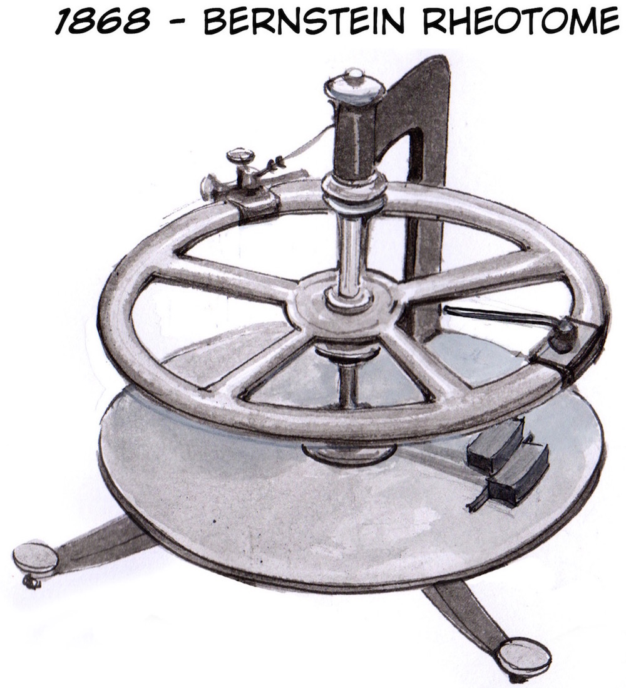](./img/Rheotome.jpg)

[ 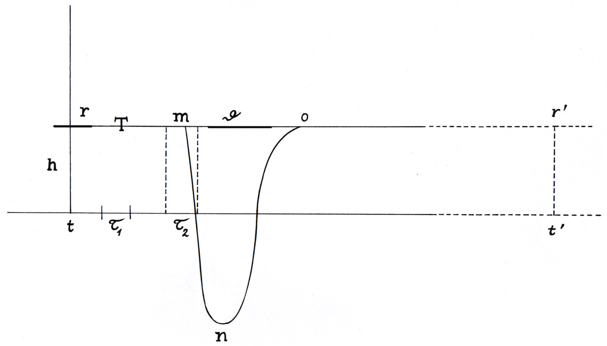](./img/negativen_Schwankung_web.jpg)

But, beyond the Bernstein Rheotome, the technology of recording and
visualization was limited to photography, videography, and paper machines_ All
of which are too slow to record the 1 ms action potential of neurons. These
three techniques though did allow for steady progress in
[Electroencephalography](https://backyardbrains.com/experiments/eeg) (eeg),
[Electrocardiography](https://backyardbrains.com/experiments/heartrate)
(EKG's), and general physiology of respiration and movement.

[ 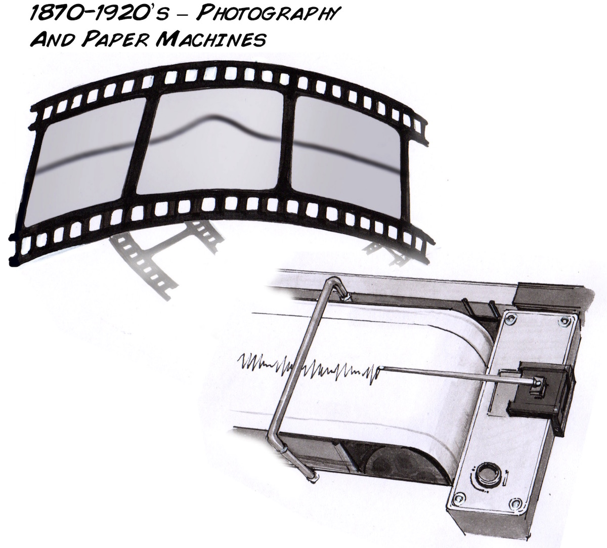](./img/Film_and_Paper.jpg)

But, to see the individual, un-averaged action potential, live and direct, it
took the invention of vacuum tubes, and their subsequent transformation into
[vacuum-phosphene
tubes](https://en.wikipedia.org/wiki/Vacuum_tube#Cathode_ray_tubes), to allow

us to finally visualize the action potential. Done famously for the first time
[by Herbert Gasser and Joseph
Erlanger](files/GasserErlanger1922_firstAPoscilloscope.pdf) in 1922 on a
Western Electric oscilloscope, no self-respecting electrophysiology lab today
is without a [descendent](https://en.wikipedia.org/wiki/Oscilloscope) of this
device.

[ 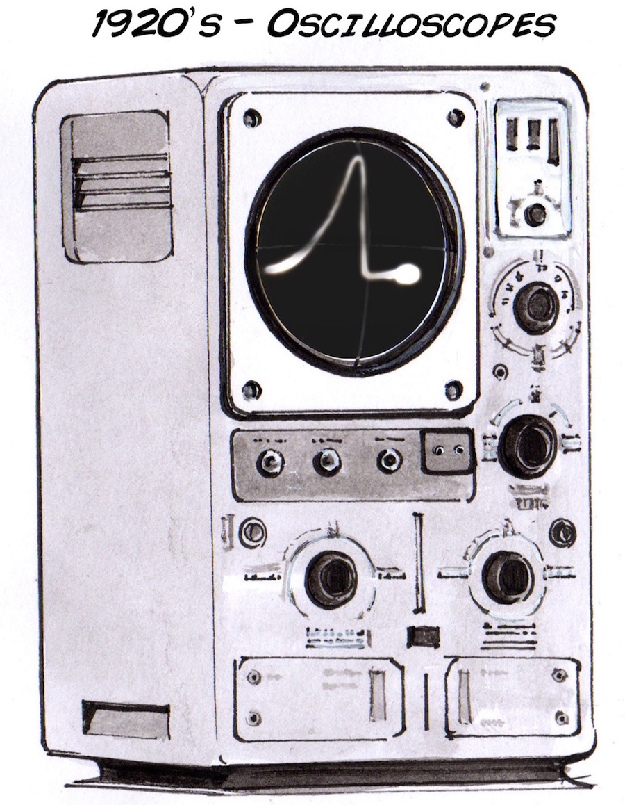](./img/Oscilloscopes.jpg)

Now, with the oscilloscope, we could see the action potential, but how can we
record it for later data analysis? Indeed, Gasser and Erlanger above simply
took a photograph of the oscilloscope screen in their seminal publication.
But, once [magnetic tape](https://en.wikipedia.org/wiki/Tape_recorder) was
invented, scientists could have high-fidelity storage of their neural data. If
you talk to an electrophysiologist who has some miles (>60 years), they may
indeed have some of their graduate thesis data stored on magnetic tape.

[ 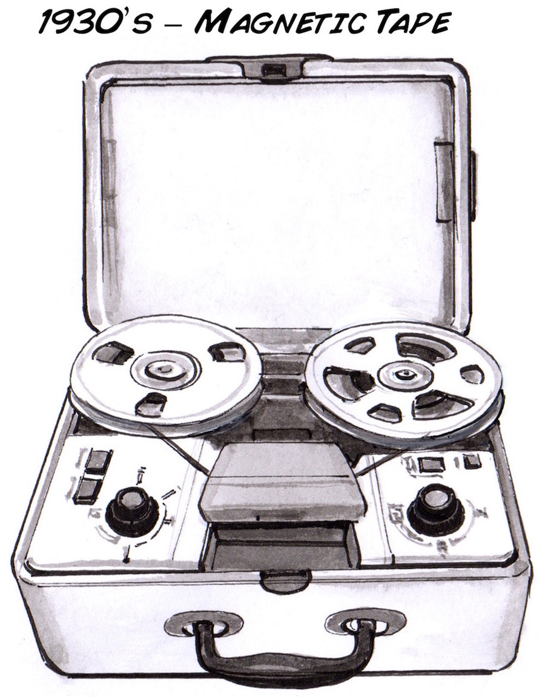](./img/MagneticTape.jpg)

And now, today, we find ourselves in the computer and mobile era, [where we
can see and record neural
data](https://journals.plos.org/plosone/article?id=10.1371/journal.pone.0030837)
anywhere we go, anywhere in the world.

[ 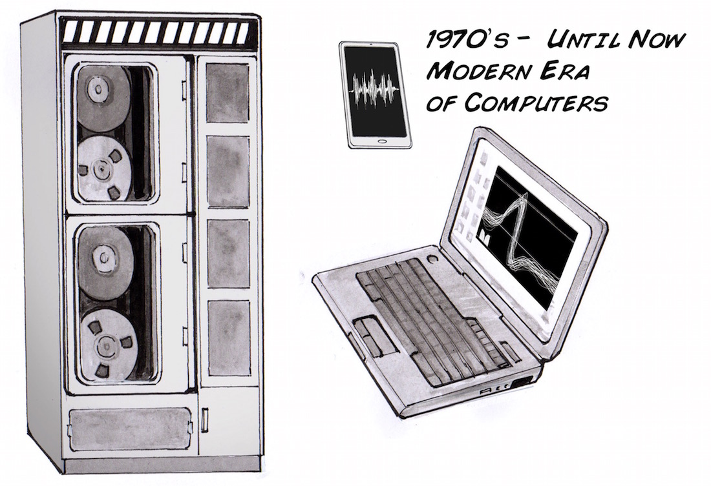](./img/ModernComputerEra.jpg)

## 3\. Data Analysis

The third problem, analyzing the neural data from experiments, was typically
done by hand calculation until the invention of calculating machines, then
computers, etc... Due to the continually growing cultural and economic
significance of the Computer Revolution, it is [extremely well
documented](https://www.youtube.com/watch?v=sX5g0kidk3Y), and we do not occupy
ourselves in its very wonderful story here.

[ 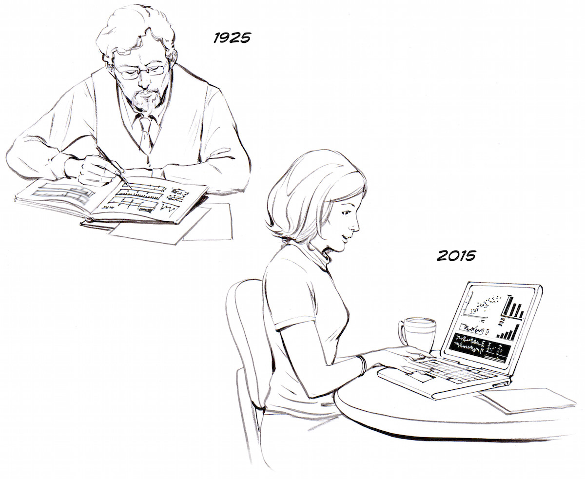](./img/Analysis.jpg)

## The Future Speculative

What lies beyond today? What new technology shall humanity invent to allow us
to further understand how brain circuits function? Where does the road lead?
Where are we going?

A technology currently used by many scientists is called "[voltage sensitive
dyes](https://en.wikipedia.org/wiki/Voltage-sensitive_dye)," whereby a solution
containing a pigment is injected into an animal or applied to the surface of
its brain, and the color or luminance of the dye changes depending on the
local voltage changes. Some dyes can even also detect levels of calcium,
important for neurotransmitter release. The advantage of this technology is
that it allows multiple neurons to be measured simultaneously, but the
disadvantage is that you have to open the skull to image the brain (*neuro-
nerds- shaving the skull to a very thin thickness doesn't count). In addition,
these experiments often require lasers, 2-Photon Microscopes, and equipment
that takes up a whole room. The optics revolution remains to manifest.

[ 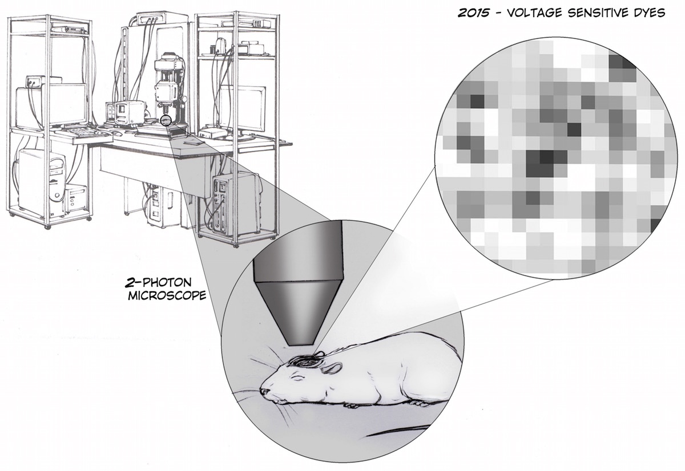](./img/SensitiveDyes_Now.jpg)

To record individual neurons in a human brain, as we [have stated
before](https://backyardbrains.com/experiments/eeg), you need to open the
skull and insert electrodes. This is cumbersome and risky, and thus is not
used beyond medical necessity. But, perhaps, as electronics become smaller and
more energy-efficient, "Nano-Amplifier-Bots" could be ingested that cross the
blood brain barrier, attach to neurons, and wirelessly transmit neurosignals.

[ 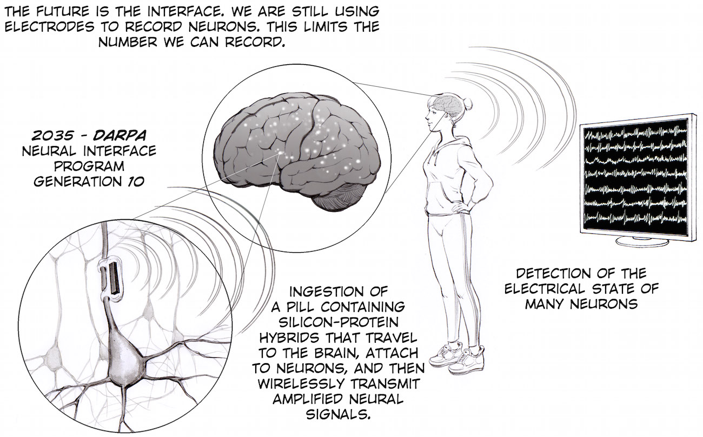](./img/NanoRobots_NearFuture.jpg)

Such technology would indeed be revolutionary, but only partially, as it still
requires we "put something" in the body, a crude technique. Will there be a
new physics, something as dramatic as electromagnetism in 19th century, and
atomic physics in the 20th century, that will enable us to sense neurons in
ways scratching the edge of our imagination? Is there a fundamental science, a
fundamental type of way the universe works, something as yet not understood,
which is all about us yet we cannot detect, that will lead to a new
technological revolution? [Gravity](https://en.wikipedia.org/wiki/Gravity)
remains a stubborn force to tackle. Perhaps new understandings will lead to
new interfaces and the ability to detect and amplify the voltage of anything
from afar.

[ 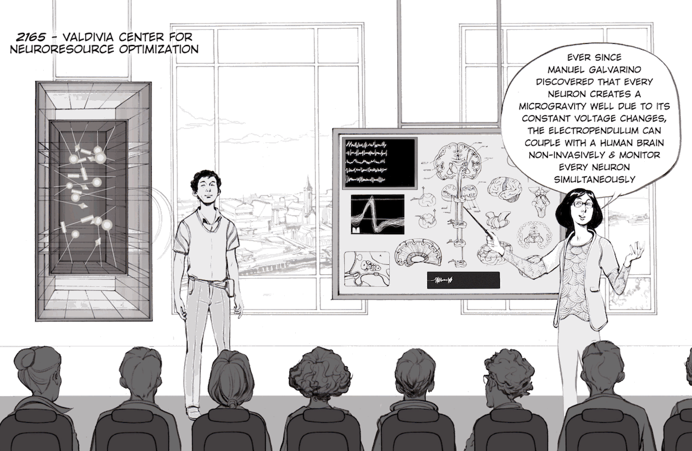](./img/Valdivia_SuperFuture.gif)

Now invent the future!

##  Sources / Notes

1. [Galvani's Spark_ The Story for the Nerve Impulse](https://www.amazon.com/Galvanis-Spark-Story-Nerve-Impulse/dp/0199751757/ref=sr_1_1?ie=UTF8&qid=1430943886&sr=8-1&keywords=Galvani%27s+Spark), by Alan McComas 
  2. [The Spark of Life_ Electricity in the Human Body](https://www.amazon.com/Spark-Life-Electricity-Human-Body/dp/039334679X/ref=sr_1_1?ie=UTF8&qid=1430943988&sr=8-1&keywords=Spark+of+Life) by Frances Ashcroft 
  3. [Practical Electronics for Inventors](https://www.amazon.com/Practical-Electronics-Inventors-Paul-Scherz/dp/0071771336/ref=sr_1_1?ie=UTF8&qid=1430944078&sr=8-1&keywords=practical+electronics+for+inventors) by Paul Scherz and Simon Monk
  4. [Hackers_ Heroes of the Computer Revolution](https://www.amazon.com/Hackers-Computer-Revolution-Anniversary-Edition/dp/1449388396) by Steven Levy 
  5. [PBS American Experience_ Silicon Valley](https://www.pbs.org/wgbh/americanexperience/features/introduction/silicon-introduction//?flavour=mobile)

Gracias goes to [Italo Ahumada Morasky](https://www.italoahumada.cl/about/), a
Chilean artist who worked closely with us on this historical treatment.
