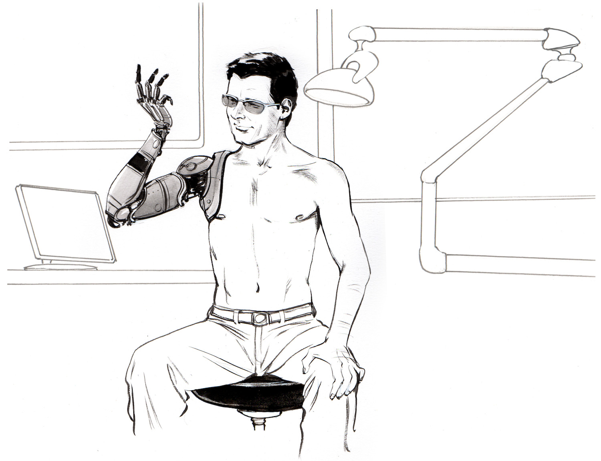
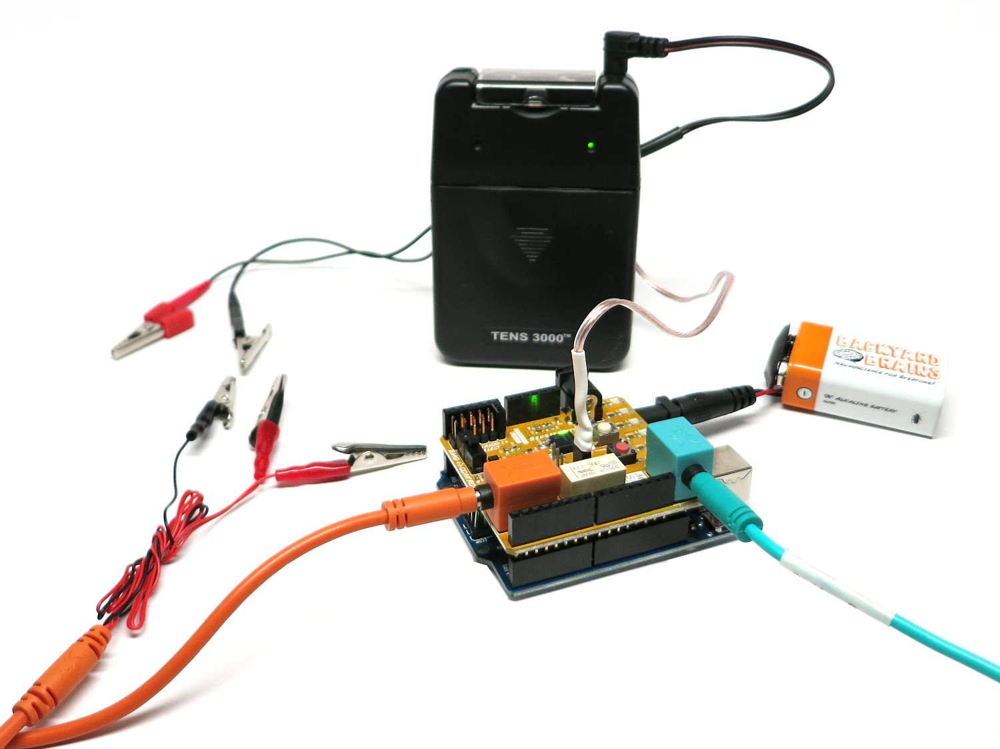
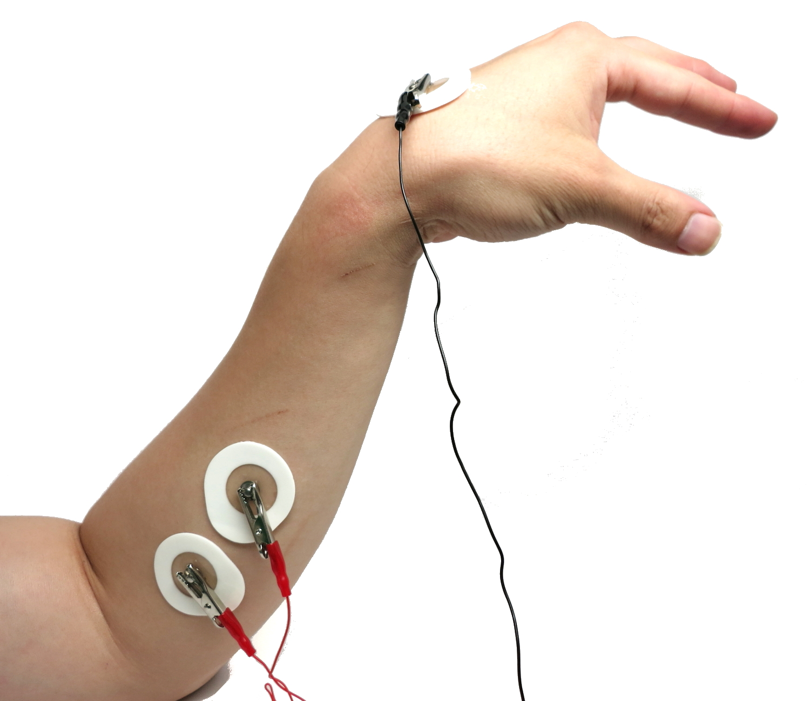
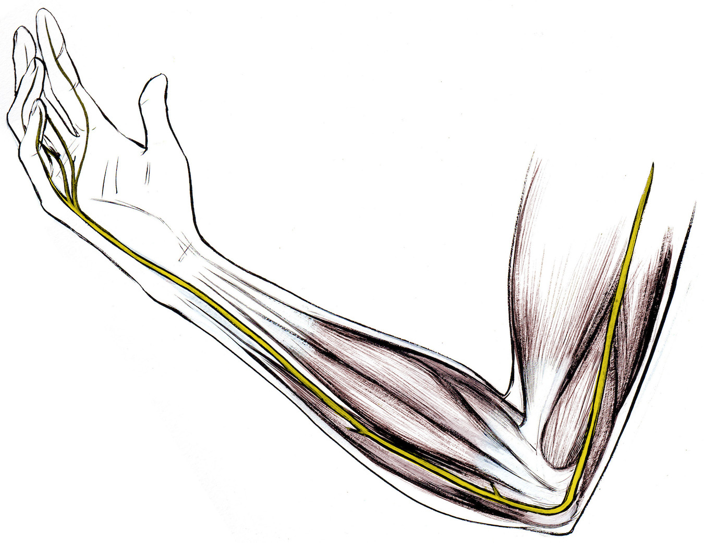
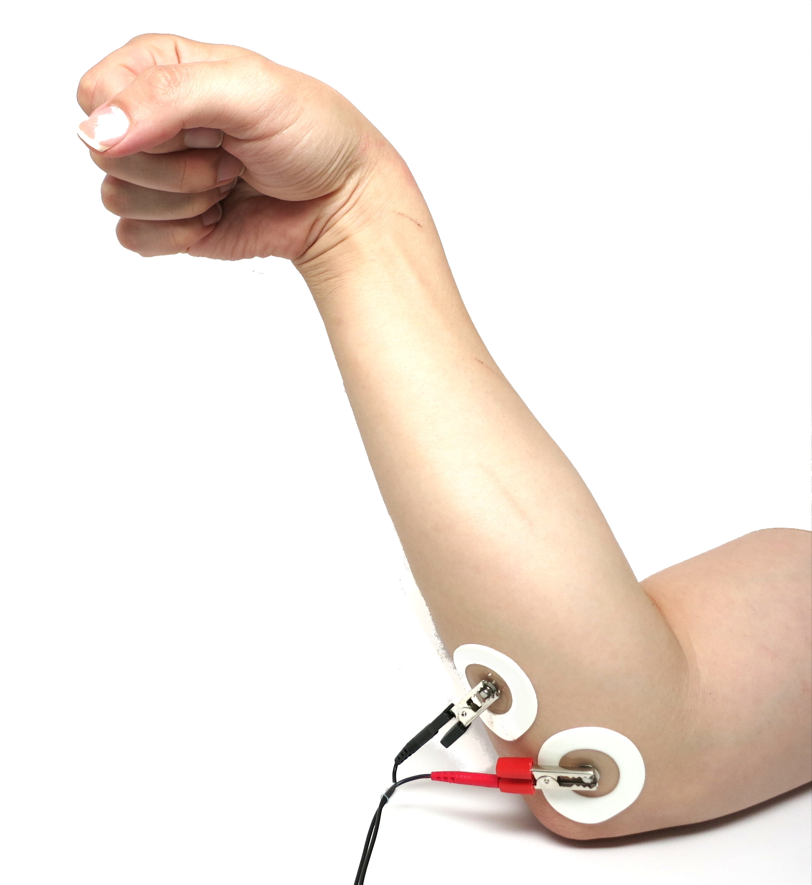
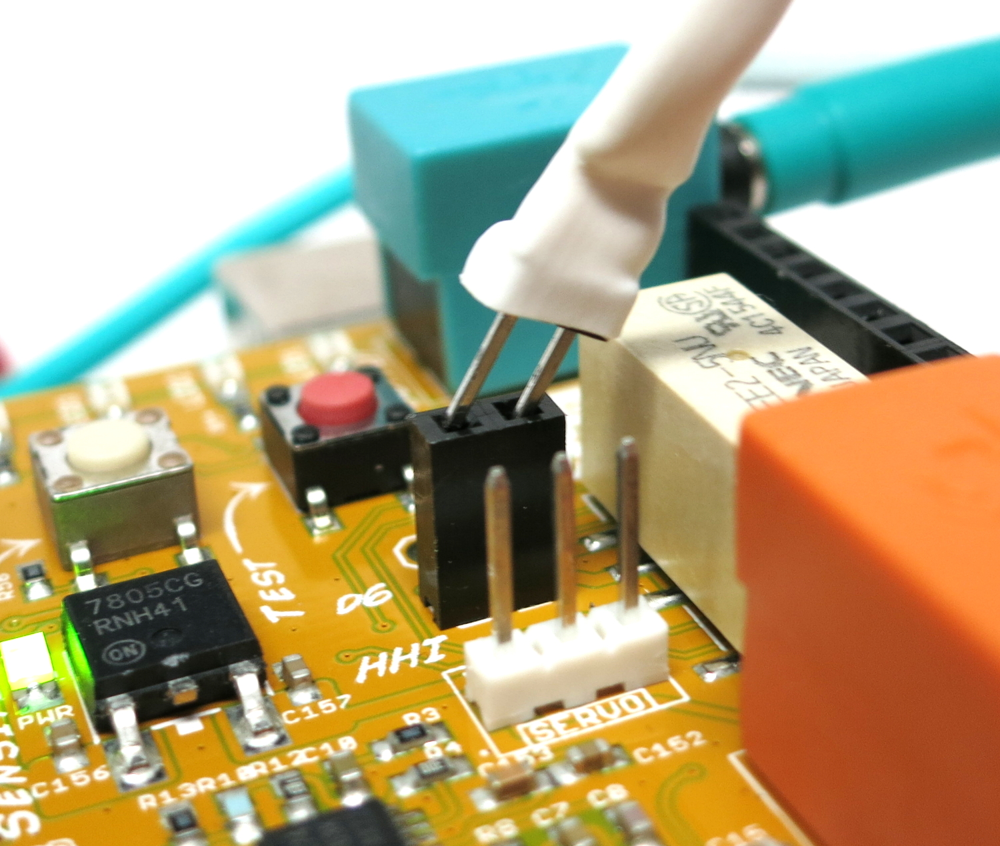

# Experiment: Advanced NeuroProsthetics: Take Someone's Free Will

Have you ever had the desire to lose your free will? Or, alternatively, have
you ever had the desire to take someone's free will? Now you can with our new
"Human-Human-Interface Experiment."

**Time**  2 hours

**Difficulty**  Advanced

#### What will you learn?

In a continuation of our [1) Neuroprosthetics Experiment](./neuroprosthetics.md) and
[2) Muscle SpikerShield Experiment](muscleSpikerShield.md), you will learn how to use your muscle signal to control other devices, in this
case, a TENS (transcutaneous electrical nerve stimulator) to excite and
contract the muscle of another human.

##### Prerequisite Labs

  * [Muscle SpikerShield](muscleSpikerShield.md) - You should become familiar with how to use your Muscle SpikerShield and an Arduino

##### Equipment

[Human-Human Interface](https://backyardbrains.com/products/HHI)

## Background

Note: A TENS unit by definition delivers enough current to cause muscle
contraction.**Do not place electrodes across the muscles of the throat or the
chest.** This experiment is appropriate for college students. Adult
supervision is needed for younger (high school) users.

We have previously discussed "neuroprosthetics," that is, designing a machine
that interfaces with living neurons to control a device or for sensory
substitution. But what about muscles? If people have damage to their spinal
nerves, the muscles themselves can be stimulated, and this line of research is
called "functional electrical stimulation."

For example, functional electrical stimulation can often be used to help
someone stand up, or to improve walking by helping to swing a foot forward.

In addition, if someone has an artificial limb, such as a robotic arm, they
can use the electrical activity generated by the electromyographic signals in
their pectoral muscles to control the motors and control systems in the
robotic arm. A notable example is [Jesse
Sullivan](https://www.youtube.com/watch?v=ddInW6sm7JE), who lost his arms
during an electrical installation. There is also a company called RSLSTEEPER
that has developed a bionic arm called the
["bebionic3"](https://www.youtube.com/watch?v=_qUPnnROxvY) which functions on
very similar principles, but uses muscular activity in the amputee's stump to
control the wrist and hand movements.

**Relation to RoboRoach**

Fans of the [RoboRoach](https://backyardbrains.com/products/roboroach) have
often asked us: "When will you get this working on humans?" We responded and
solved this customer request by launching our
["Society"](http://blog.backyardbrains.com/2013/03/backyard-brains-launches-
society-an-invention-for-controlling-human-behavior-and-thoughts/) invention.
But many people were left unsatisfied. They wanted something more direct.

On the other hand, critics of the RoboRoach have often asked us: "How would
you like it if someone controlled you with electrical stimulation?" Now, after
months in the research lab, we finally now have the answer, and it is...

"...it depends.""

If you like who is controlling you, the feeling can be quite nice.

#### Downloads

> Your HHI arduino comes pre-loaded with the HHI code. If you use your arduino
> for other projects, if you accidentally press the reset button, or would
> like to adjust the thresholds, you will have to re-upload the code! You can
> do this with the Arduino software. If you are new to Arduino and need to
> learn how to upload code, check out [this helpful guide](http://arduino.cc/en/Guide/HomePage)
>
> [Arduino Software](http://arduino.cc/en/main/software#.Uxd6XYWhZMk)
>
> Download our Arduino(.ino) Human-Human-Interface Sketch. Check out the comments for some insight into how it works! (You can also use this code for [the Claw Experiment!)](./MuscleSpikerShield_GripperHand.md) 
>
> [Human-Human-Interface and Claw](./files/HHIClawCombined.zip)

## Video

#### Print Materials

> If you're looking for a PDF to print and scribble on, or a google doc to
> edit, [check out this repository of print resources here!](https://drive.google.com/drive/folders/1bE1B0DvsGNauhyj-z8YjzuBXmFYivfkR?usp=sharing)

## Experimental Procedure

### Set Up

**The Controller**

  1. Plug the orange electrode cable into the SpikerShield. 
  2. Place two EMG electrodes on the forearm, one on the back of the hand, and clip on the EMG cables using the alligator clips. Reds on the forearm muscle and black on the back of the hand. 

  3. Now, have the controller flex their forearm muscles. With a sufficient strong flex, your controller should be able to light up all the LEDs, just like the [wholesale paper cup](https://www.somepromotional.com/mugs-bottle/paper-cup) [Muscle SpikerShield experiment](muscleSpikerShield.md). 

**Note** Press the white button directly below the LEDs to change the
sensitivity level to make it easier or harder to light up the LEDs.

Now you are ready to hook up the "Controlled Human."

**The Controlled**

  1. First, you need to set the frequency of the TENS device by sliding down the front face of the black TENS device: we set a ~50-80 ms pulse duration and a 10-20 Hz frequency. 
  2. Place two surface EMG electrodes close to each other across the ulnar nerve. The nerve runs up the back of your forearm. We recommend placing the electrodes just past the elbow on the backside of the forearm, but you can experiment with placement! Anywhere on the forearm will probably incite a response... 

  3. Plug the Tens cables male header pins into the Muscle SpikerShield Stimulator output. 

**Taking Control**

  1. The TENS device included with the HHI has two channels, but we'll only be using one. Take note of which side you plug your cable into; you will use the knob on that same side to control the gain, or power, that the TENS device will output. 
  2. Now, begin with the TENS device turned onto the lowest setting and have your controller flex. When they light up the red LEDs, the circuit will trigger and the TENS device will send stimulation to the Controlled subject! But... at this super low setting, you probably won't see a reaction 
  3. Have the Controller keep flexing, and slowly begin to turn up the power of the TENS device until you see a response. We typically see responses around settings 3-5. 
  4. Enjoy! The controller has complete and total power of the controlled's arm... For now... 
  5. To disarm the experiment, first turn off the TENS device totally. Then have the Controller remove their electrodes, and finally, free the controlled from their clips. 
  6. ****Important** If the Controller pulls their electrodes off before the TENS device is turned off, or the controlled is set free, it will cause the circuit to short and constantly send stimulation to the controlled. Avoid this!**

Happy hacking! [Let us know](mailto:info@backyardbrains.com) what you connect
your EMG signals to! Let your creative mind flow and invent.

## Common Questions

We receive a lot of questions regarding this experiment, and we collect some
of the most common.

* **Can you achieve more full control, like say, an entire limb?** These experiment works because the ulnar nerve lies just below the surface of the skin in your forearm and elbow, and it is relatively easy to stimulate. Putting the electrodes in other places on the arm stimulates the muscles more than the nerves. While someone could place more pairs of stimulating electrodes on the arm, the movements will always appear "jerky" due to stimulation thresholds and types of muscle fibers activated.
* **Can you control another person by using your brain waves (eeg) instead of muscle electrical activity (EMG)?** [Some research groups](http://www.washington.edu/news/2013/08/27/researcher-controls-colleagues-motions-in-1st-human-brain-to-brain-interface/) have had success with analogous experiments, but the set-up is more complicated and susceptible to false positives. EMG is much easier to amplify and control things with.  [https://backyardbrains.com](https://backyardbrains.com/products/css/index.html)

## Troubleshooting

If your device is not working, try these solutions first!

* If the LEDs are not lighting up at all, and/or if you only have one blinking red light, you may have accidentally reset your Arduino! If this happens, reupload your code to the device. Look under the Downloads section above for instructions. 
* If you are having trouble getting all the LEDs to light up with your flexing, there are two options: 1) reposition the muscle electrodes - 2) lower the thresholds in the code. 

## Science Fair Project Ideas

* This setup is only one channel, but you can stack the Muscle SpikerShields to have up to three analog input channels (and our TENs unit has two output channels!). If you have two degrees of output control and three input control signals, do you think you can cause more sophisticated movements?
* We've noticed that some people respond at lower or higher stimulation levels than others. What factors could you measure that may affect the level of someone's response to the same level of stimulation-age? Gender? How regularly they work out? If they're tired or not? 
* What other movements do you think you could induce with the Human-Human Interface? Remember to consider the earlier warnings about safe use of a TENS unit. Some suggestions-the medial nerve (another nerve in your arm), the patellar reflex (your leg moves when the center of your knee is hit), or trying to get individual fingers to move. 
* The stimulation of the muscles with the TENS, while interesting, is not nearly as elegant and smooth as the natural movements you can make with your own volitional control. Why do you think this is? How could you compare the two in an experiment? Which do you think would be stronger-your natural movements or those induced by the huge amouont of current coming from the TENS? 
* While this is a fun neuroprosthetic demo for public and classroom demonstrations, what would it take to make this a useful device for the clinic? We make tongue-in-cheek jokes about "controlling humans" here in this experiment, but what do you think it would take to fully control movements?
