## Experiment:The Dancing Cockroach Leg-Microstimulation of Neurons and

---
id: "the_dancing_cockroach_leg-microstimulation_of_neurons_and_muscles"
title: "The Dancing Cockroach Leg-Microstimulation of Neurons and Muscles"
slug: "/retired/experiments/microstimulation"
---

Muscles

Electricity plays a critical role in how our nervous and muscle systems work.
In this experiment you are going to stimulate a cockroach's leg muscles using
the music output of your mobile phone.

**Time**  30 minutes

**Difficulty**  Beginner

#### What will you learn?

In this lab you will learn about the history and use of microstimulation in
studying the nervous system, and you will investigate the effect of frequency
on the electrical excitability of cockroach nerves.

##### Prerequisite Labs

* [SpikerBox](spikerbox) - You should do the SpikerBox basic experiment first to learn about neurons before doing this lab.

##### Equipment

* [Stimulation Cable](https://backyardbrains.com/products/stimulationcable)
* [Cockroaches](https://backyardbrains.com/products/cockroaches)

## Background

Long before scientists were able to record spikes, they were able to stimulate
the nervous system using batteries ([Leyden Jars](http://en.wikipedia.org/wiki/Leyden_jar)). Since nerves use electricity
to communicate, they can be manipulated with electricity as well. [Luigi Galvani](http://en.wikipedia.org/wiki/Luigi_Galvani), an Italian scientist in
the 1700's, discovered that electricity applied to the nerves of frog legs
caused the large muscles to twitch.

[ 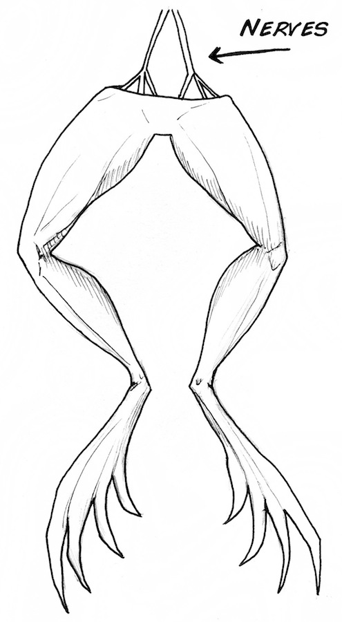](./img/Exp5_froglegs.jpeg)

Such discoveries led to debates at the time as to whether "animal electricity"
was different from the electricity during lightning storms. Galvani also
tested this by hanging frog legs off his back porch during thunderstorms &
watching the legs twitch. These phenomena were the direct inspiration for Mary
Shelley's "Frankenstein."

"Perhaps a corpse would be re-animated; galvanism had given token of such
things: perhaps the component parts of a creature might be manufactured,
brought together, and endured with vital warmth." -Mary Shelley, Introduction
to Frankenstein

[ 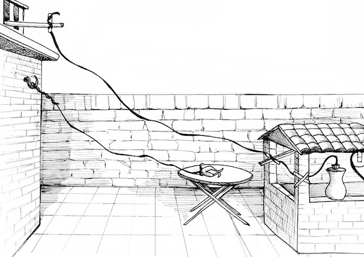](./img/Exp5_galvani.jpeg)

Eventually the scientific community discovered that while electricity can
indeed stimulate nervous system and muscle tissue, the tissue itself generates
electricity. This led to the beginnings of contemporary neuroscience which you
are studying today.

[ 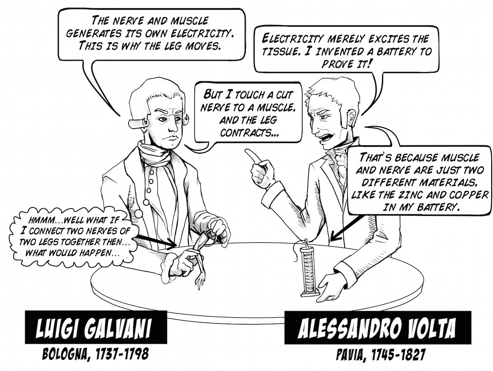](./img/GalvaniversusVolta_web.jpg)

In another famous experiment, German Medical Scientists [Eduard Hitzig](http://de.wikipedia.org/wiki/Eduard_Hitzig) and [Gustav Theodor Fritsch](http://de.wikipedia.org/wiki/Gustav_Theodor_Fritsch) in 1870 applied electricity current to the exposed cerebral cortex (wrinkly part of brain) in dogs in their kitchens (yes, it was odd even back then), showing that stimulation of different parts of the brain can cause different types of movements.

[ 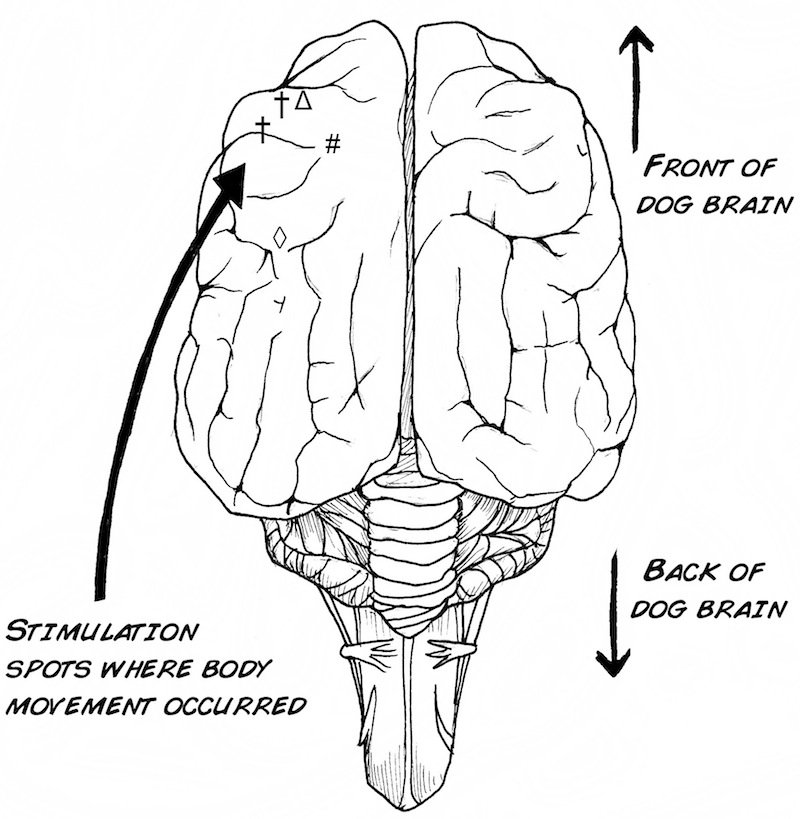](./img/Exp5_fig3.jpeg)

Today, such techniques are used in patients, most notably those afflicted with
Parkinson's disease.

By inserting a small, long electrode into a specific part of the brain called
the subthalamic nucleus, the shaking and tremors associated with the disease
can be lessened. Sometimes there are side-effects though, like increased
gambling and other compulsive behaviors.

Today, some advanced research groups are designing small chips that stimulate
the nerves of the eye as a cure for blindness.

[ 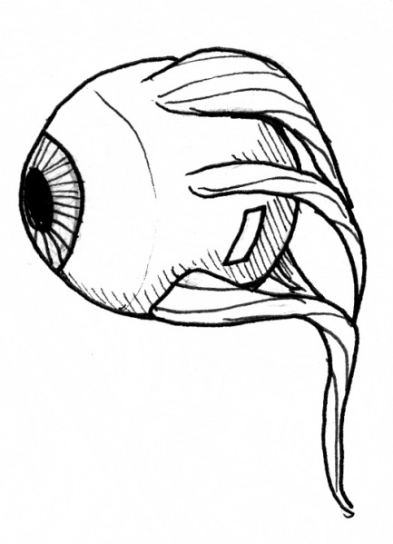](./img/Exp5_eye.jpeg)

## Video

Video explanation of experiment.

## Procedure

* Using your mobile phone or computer, plug your stimulation cable in the headphone jack 
* Attach the micro-clips from the stimulation cable to the needles placed in the cockroach leg. 

[ 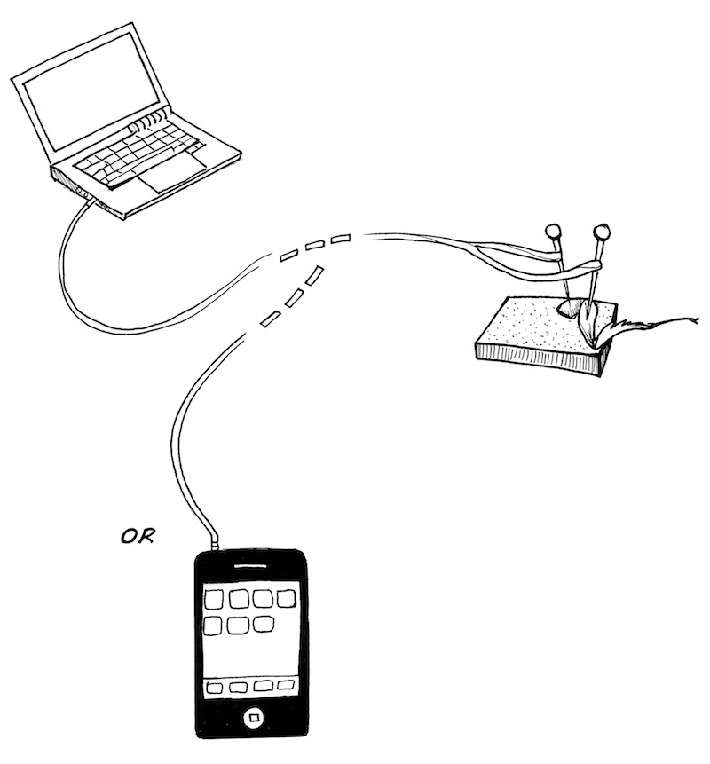](./img/Exp5_fig10.jpeg)

* Select a song with a lot of bass (we prefer anything from the album ["Paul's Boutique"](http://en.wikipedia.org/wiki/Paul's_Boutique)), turn your volume up half-way, and slowly increase the volume. At some point the leg should begin to "twitch" in time to the bass line of the song. 
* Now select a song with a lot of treble (such as [J.H. Bach](http://en.wikipedia.org/wiki/Johann_Sebastian_Bach)), and observe the cockroach leg. Does it move? 
* It would be ideal, of course, to have finer control over the stimulation than simply playing music. Fear not; there is an easy way to do this. Using free applications like [ToneGen](http://www.macupdate.com/app/mac/29891/tonegen) on your laptop, or [FreqGen](https://itunes.apple.com/us/app/freqgen/id325832805?mt=8) on your iPhone, you can control the frequency and amplitude of the stimulus you deliver to the leg. In humans with implanted devices like cochlear implants & deep brain stimulators, the signal (also called a "biphasic pulse train") looks like this: 

[ 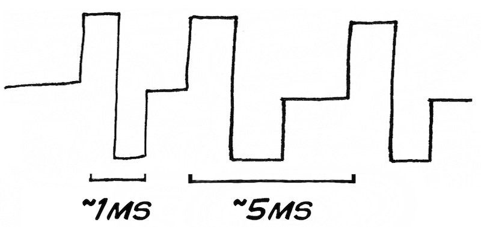](./img/Exp5_fig9_option1.jpeg)

* Put your settings on "square wave," and adjust the rate (frequency)... 

[ 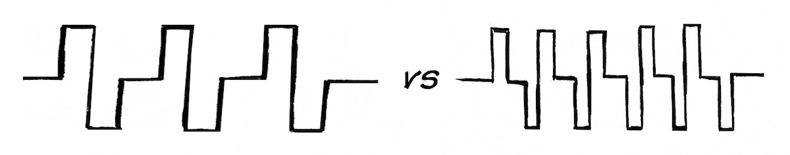](./img/Exp5_frequency.jpeg)

* and volume (amplitude). 

[ 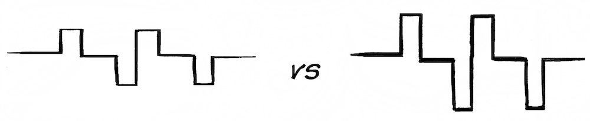](./img/Exp5_volumevsamp.jpeg)

Can you find a "sweet spot" of the lowest volume & best frequency to cause
evoked movement? Use the table below as a guide.

[ 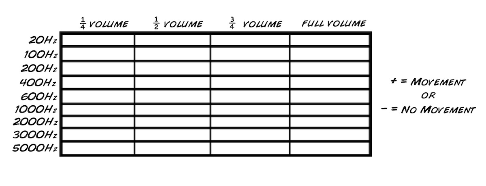](./img/Exp5_fig13.jpeg)

You can get a sense of what these frequencies mean, using the 88 key piano
below.

[ 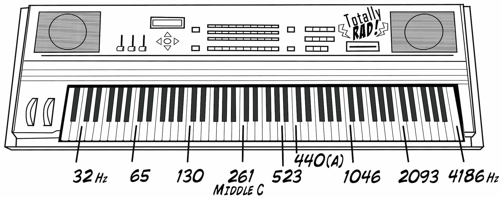](./img/keyboard3_web.jpg)

## Update

If you like, you can study microstimulation in an even simpler experiment,
using only:

[ 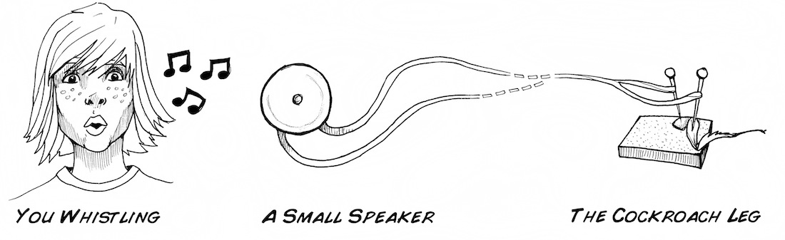](./img/Exp5_fig6.jpeg)

First, some theory on how speakers work:

[ 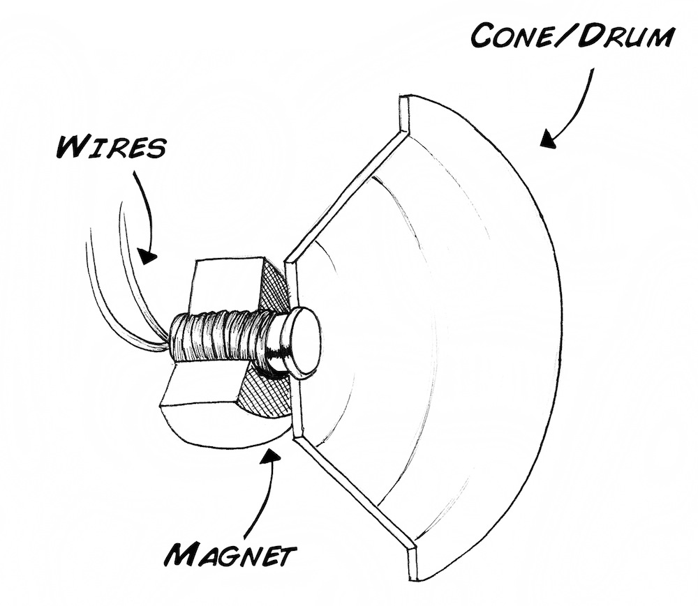](./img/Exp5_fig7.jpeg)

The sound, represented by the electric current traveling through the wires,
passes through a magnetic field in the speaker, which causes the cone/drum to
move, pushing the air and creating the sound that you hear. For example, have
you ever seen a bass woofer vibrate at a rock concert?

This principle also works in reverse, and this is how microphones work. If you
speak into a microphone/speaker, the movement of the cone/drum causes a
current to flow in the wires. If we use a special speaker called a
[piezoelectric](http://www.radioshack.com/product/index.jsp?productId=2062397),
we can generate quite large voltages (1-3 V), large enough to actually excite
nervous & muscle tissue!

Connect the two leads of the speaker to the needles in the cockroach leg using
alligator clip wire, place the speaker close to your mouth, and try to whistle
as loud as you can. Watch the leg; as you whistle louder and louder, the leg
should begin to move.

## Science Fair Project Ideas

* What kind of music gets what kind of responses from the leg? Try a few different genres, as well as some pure tones. Why do you think certain frequencies generate different degrees of response?
* How long can the leg maintain a constant flex from a constant stimulation? Does the level of stimulation change this time? What causes it to stop? How long after removal before the leg stops responding to music? If it stops moving to music, does it still produce spikes on a SpikerBox? Why might that be or not be the case? 
* Does the placement of the electrodes affect the response you get? Why might that be or not be the case? 
