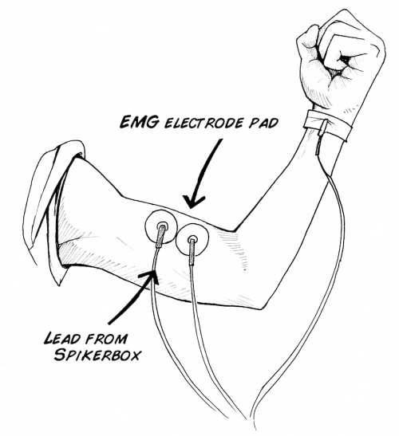
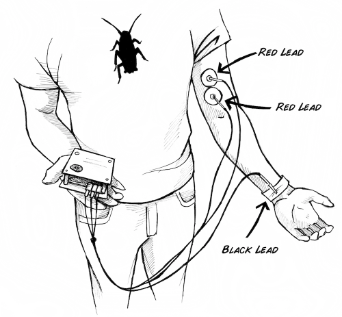
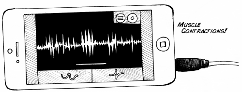

You may have heard and seen spikes from invertebrates. But what about
yourself? Your body uses electricity to communicate and control parts of the
body. Though all cells have ionic gradients across their membranes, the most
well known organ systems that use electricity are the brain, the muscles, and
the heart.

Your neurons and muscles work together to allow your body to move quickly. We
have previously recorded the action potentials from
[insects](http://www.backyardbrains.com/experiments/spikerbox) and
[worms](http://www.backyardbrains.com/experiments/speed), and now let's try to
record muscle action potentials in humans! This muscle physiology lab activity
is great for students of all ages.

**Time**  30 Minutes

**Difficulty**  Beginner

#### What will you learn?

With this experiment, you can learn about muscle physiology through
electromyograms (EMGs). You will have an understanding of neuron/muscle
communication, and you will listen to the electrical impulses of muscles at
rest and during contraction.

##### Prerequisite Labs

* None

##### Equipment

* [Muscle SpikerBox](https://backyardbrains.com/products/emgspikerbox)
* [Cable: Laptop](https://backyardbrains.com/products/laptopcable) 
* [Cable: Phone](https://backyardbrains.com/products/smartphonecable)

## Background

When your brain decides to move a muscle, neurons from your motor cortex
(called "upper motor neurons") travel to your spinal cord, where they synapse
with "lower motor neurons" (also called "alpha motor neurons"). These motor
neurons then synapse with muscle to make a "motor unit." A motor unit is a
single motor neuron and the multiple muscle fibers it innervates. A muscle
fiber is a very special type of cell that can change its shape due to
myosin/actin chains sliding across each other.

A single motor neuron can synapse with multiple muscle fibers. In general, a
large, powerful muscle like your bicep has motor neurons that innervate 1000s
of muscle fibers, whereas small muscles that require a lot of precision, such
as your eyeball muscles, have motor neurons that only innervate ~10 muscle
fibers.

When a motor neuron fires an action potential, this causes a release of
acetylcholine at the synapse between the neuron and the muscle (this synapse
is also called the Neuromuscular Junction). This acetylcholine then causes
changes in the electrical potential of the muscle. Once this electrical
potential reaches a threshold, an actual action potential occurs in the muscle
fiber! This action potential propagates across the membrane of the muscle,
causing voltage gated calcium channels to open, which begins the cellular
cascade that ultimately causes muscle contraction.

When you contract a muscle, this is the result of many muscle fibers firing
action potentials and changing shape. We can record this our activity with our
Muscle SpikerBox.

## Video

#### Print Materials

> If you're looking for a PDF to print and scribble on, or a google doc to
> edit, [check out this repository of print resources here!](https://drive.google.com/drive/folders/1bE1B0DvsGNauhyj-z8YjzuBXmFYivfkR?usp=sharing)

## Experiment

In this experiment, we are going to record the group activity of 1000's of
muscle fibers within the bicep muscle.

  1. Remove the sticky backing from your Large Muscle electrodes, and place these surface electrodes close to each other on your bicep. 

  2. Hook up the Muscle SpikerBox leads (the 2 red alligator clips) to the two surface electrodes on your bicep. 

  3. Place the reference electrode (Black) anywhere on the body. In the figure above we show it attached to a metal bracelet near the wrist. You can also use another surface electrode placed anywhere on the back of your hand (like in the movie above), or if you have any metal rings on your fingers, you can clip the reference electrode to your ring. 
  4. Turn on the Muscle SpikerBox and listen for changes in activity. Do you notice a difference when you flex your muscles?
  5. Plug in your [SmartPhone Cable](https://backyardbrains.com/products/smartphonecable) (with our free [Android](https://play.google.com/store/apps/details?id=com.backyardbrains) or [iPhone](https://itunes.apple.com/gb/app/backyard-brains/id367151200?mt=8) apps installed) or computer (using our [Backyard Brains PC app](http://www.backyardbrains.com/files/Backyard_Brains_Neuron_Recorder_Install.air.zip) and a USB cable if you have the [Muscle SpikerBox Pro](https://backyardbrains.com/products/musclespikerboxpro)). Pick up something heavy. Do you see and hear a difference? The "Whoosh" is the sound of many action potentials occurring in your muscles as the muscles contract. You are listening to the conversation between your brain and muscle! 

## Science Fair Project Ideas

* You are recording through the skin, and from several muscle fibers simultaneously. How would the recordings differ if you were recording right next to one of those cells? Inside the cell? Would you see the same number and type of spikes? How would the amplitude change? Think on a way you could test or compare this with invertebrate muscles, possibly using the Neuron Spikerbox. 
* What causes the spikes that you saw? Specifically, what is occurring when the spike is positive? What is occurring when the spike is negative? Keep in mind you are doing extracellular recordings, and of several fibers. 
* What does [muscle fatigue](https://backyardbrains.com/experiments/fatigue) look like, how could you measure it, and what's causing this? Do different people have different rates of fatigue? Different muscles? Is there anything you could eat or drink that you think would affect this? 
* Do you think you could record the activity of sensory neurons with this setup? The impulses are sent from where you sense something up to the brain-try touching the hand that's setup, see what happens!

## Notes

If you have our original Muscle SpikerBox with 3 separate leads (not a single
orange cable), the colors of the alligator clips are different. The Red and
Black clips should go around the muscle of interest, while the white is used
as the ground electrode.

