## Getting Started with the Muscle SpikerBox Pro: Agonist/Antagonist Muscle Pairs

Now that you've completed the ["Getting Started with the Muscle Spikerbox"](./muscleSpikerBox.md) experiment,
you've learned about muscle physiology through viewing electromyograms (EMGs)
of your own muscles. More specifically, you've observed the electrical
impulses that muscles fibers create to cause a contraction of a muscle. In
this experiment, we will take a wider perspective of the muscles. Now, learn
about the agonist and antagonist muscles and how we rely on them for balance,
posture and smooth, controlled movements.

**Time**  30 Minutes

**Difficulty**  Beginner

#### What will you learn?

Get started with the [Muscle SpikerBox Pro](https://backyardbrains.com/products/emgTwoChannelSpikerbox)
and learn about the relationships between different pairs of muscles in your
body. This will give you an understanding of the difference between agonist
muscles (cause movement by contracting) and antagonist muscles (opposes a
specific movement) and how the two combined allow us to perform all sorts of
amazing motions with precision and balance. You will also learn the difference
between flexor and extensor muscles.

##### Prerequisite Labs

* [Getting Started with the Muscle SpikerBox](./muscleSpikerBox.md) - You should read this experiment first to learn about electromyography (EMG) and motor units. 

##### Equipment

* [Muscle SpikerBox Pro and Included Cables](https://backyardbrains.com/products/MuscleSpikerBoxPro)
* [BYB Spike Recorder](https://backyardbrains.com/products/spikerecorder)

## Background

As explained in the experiment: [Getting Started with the Muscle
SpikerBox](./muscleSpikerBox.md), when you decide to make a movement your upper motor
neurons from the motor cortex of your brain send action potentials (spikes!)
traveling down your corticospinal tract (spinal cord) where they synapse with
lower motor neurons which continue to propagate the signal to the designated
muscle fibers. There, each single motor neuron and the muscle fibers they
innervate create a "motor unit." At this neuromuscular junction, a
neurotransmitter called acetylcholine is released which leads to the
generation of an action potential in the muscle fiber. Upon receiving this
excitatory signal, the muscles fibers contract. Movement!

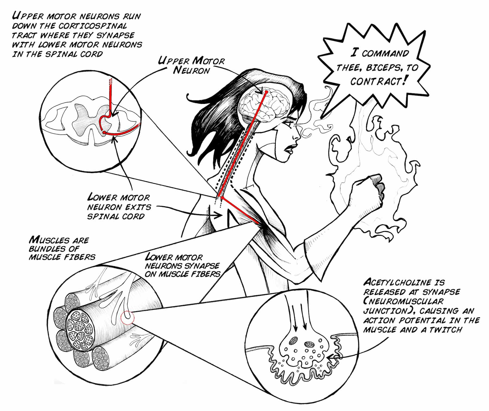

Your body uses this cascade of electrical and chemical signaling to control
motion, but it's important to point out that each movement doesn't rely on
just one muscle, but often many! _There are over 600 skeletal muscles in the
human body!_ Most of these muscles function in "antagonistic pairs", which
means that when one muscles contracts (shortens), the other in the pair
relaxes with careful control to allow elongation (stretching). Coordinating
muscles together in this way gives us the ability to move gracefully, for
example touching the tip your nose without smacking yourself in the face. This
musclular parternship also helps us make precise movements, such as threading
a needle.

Let's talk more about these "antagonistic pairs". A great example pair is your
biceps brachii and triceps brachii.

[ 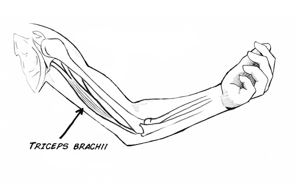](./img/BicepTricepBone.gif)

Before we go any further, we need to first review a few anatomical terms of
motion. "Flexion" is a bending movement where the angle between two parts
decreases. Contracting your biceps exhibit flexion, i.e. it brings your
forearm closer to your upper arm and decreasing the angle between the two. So,
your biceps is described as a "flexor" muscle. In the illustration below, the
image on the right shows the biceps flexing. The opposing muscle of a flexor
is called the "extensor" muscle. Your triceps is an extensor. When you
contract your triceps your arm straightens and the angle between the forearm
and the upper arm increases. You may have already guessed but this is called
"extension" and you can see that in the left illustration below. These
designations are intrinsic, meaning they are an unchangeable property of the
muscle. This means that contracting a flexor muscle will always exhibits
flexion and never extension (and vice versa for contracting extensor muscles).

[ 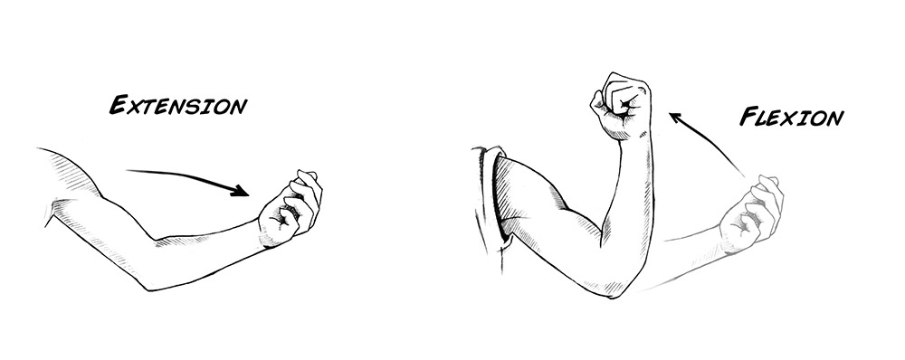](./img/flexextend.jpg)

Okay, so now that we have our terms of motion established we can discuss these
antagonistic pairs properly! The two muscles in an antagonistic pair are in
opposition. That is, if one extends a limb during its contraction, the other
will return the limb to its original position when flexed. In each pair,
depending on the movement, one muscle plays the role of the "agonist" and the
other muscle plays the role of "antagonist". The agonist is a muscle that
contracts to cause the movement. The antagonist is an opposing muscle that
relaxes relatively to stretch. These two roles, agonist and antagonist, can be
exchanged back and forth. To visualize this, let's jump back to our biceps and
triceps example. Image waving at your best friend: when your hand is moving
away from you, your triceps is an agonist, contracting to extend your arm.
Your biceps is an antagonist, relaxing to allow elongation while possibly
contracting ever-so-lightly to control the speed of that moving forearm.

[Antagonist Extension](./img/antagExt.png)

When your hand is moving back in during your waving motion your biceps is an
agonist, flexing your arm towards you. In this case, your triceps is an
antagonist and must relax to stretch to allow the movement. So you can see
that unlike the intrinsic designations of the flexors and extensors, the two
roles of antagonistic pairs are dependent on the motion. If the motion is
reversed, the agonist and the antagonist switch roles.

[Antagonist Flexion](./img/antagflex.png)

It's not always this simple though! In some movements, such as a push-up, the
agonist doesn't change with the direction of motion. During push-ups, the
triceps is the agonist whether you're lowering your body towards the ground or
pushing up. This is because of the applied load from gravity. With a constant
force always pulling you down, you're triceps must remain in contraction to
hold you up, whether you're moving up or down. Now, drop and give me 20!

Taking it one step further, it's important to realize that even when you are
not moving you have muscles constantly working at your service to maintain
posture. Yes, even when you are slouching in your La-Z-Boy your brain is
commanding muscles to contract! So the key point is that when you think to
make any movement or even just to stand still, our brain (specifically the
motor cortex) is sending action potentials (spikes!) along our nerves to not
just one but multiple muscles to coordinate the movement with control or
simply just to stay balanced and upright.

#### Print Materials

> If you're looking for a PDF to print and scribble on, or a google doc to
> edit, [check out this repository of print resources here!](https://drive.google.com/drive/folders/1bE1B0DvsGNauhyj-z8YjzuBXmFYivfkR?usp=sharing)

## Experiment

Now let's put that Muscle SpikerBox Pro to use by investigating our favorite
antagonistic pair.

[ 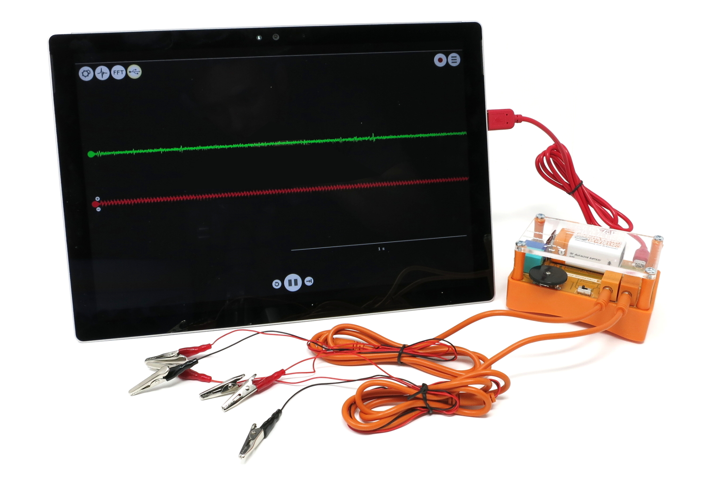](./img/MuscleProExp13.jpg)

  1. Place two of your sticker electrode patches on your biceps and connect the 2 red alligator clips from channel 1 (the left input jack) to the metal nub of the electrodes. Then place two electrode stickers on your triceps and connect the channel 2 red cables to them. Finally, place one sticker electrode on the back of your hand and connect both black alligator clips (from ch1 & ch2) to this electrode. 

[ 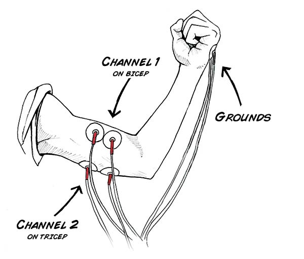](./img/bicep_tricep_Red.jpg)

  2. Begin by opening the [SpikeRecorder](https://backyardbrains.com/products/spikerecorder) software. Next, connect your MusclePro to your computer using the red USB cable. When you do, you should see a new button pop up on your screen. This is the button to pair your MusclePro to the App. 

[ 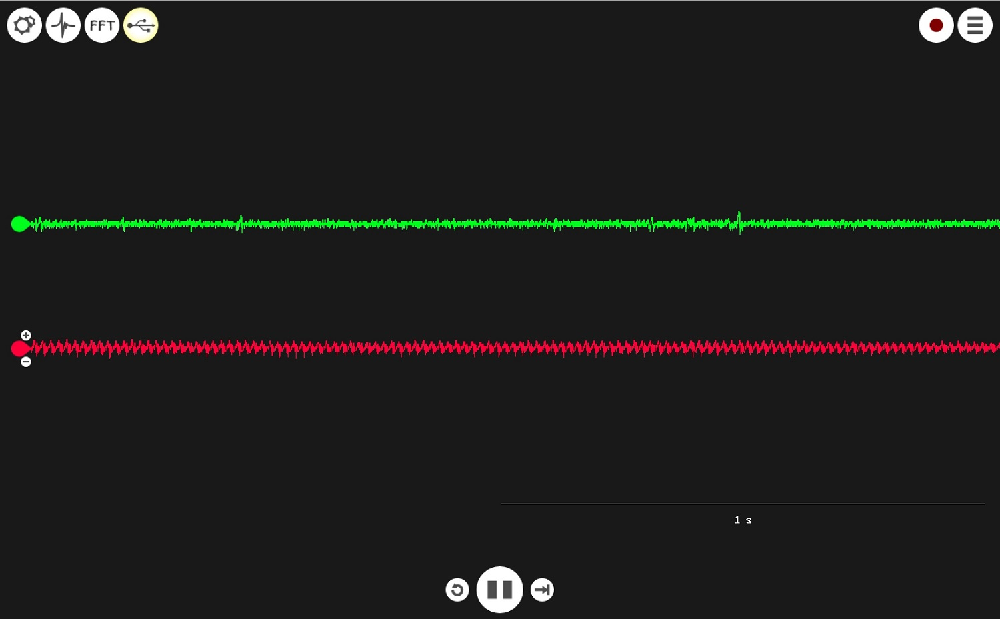](./img/MuscleProExp3.jpg)

  3. To listen to your EMG signals, adjust the gain by rotating the thumbwheel until you hear activity during contraction of your biceps and your triceps. Now, look at the app and make sure you can see your signals! If the signals are clipping (hitting the tops and bottoms of the window), you can adjust the in-app gain with the + and - buttons on the left side of each signal individually. 
  4. Now, look at your raw signals. In the above example, the red signal is experiencing some noisy interference! IF you encounter electrical interference like this, try unplugging your laptop from the wall socket or moving to someplace less "noisy." 
  5. Now let the experimentation begin!   

A) Let's start with waving. Can you get someone to wave back at you? Which
muscles do you think you are using to perform this action? To investigate your
hypothesis, create an experiment by changing the placement of your sticker
electrodes until you observe an EMG full of action potentials. Remember to be
a good scientist by documenting your method and collecting data! In the
screenshots below, the Green signal is the Triceps, and Red the Biceps. You
can see below where our subject begins the wave by flexing their bicep, then
extends their arm with the triceps, and continues to alternate. What do we see
in this data? First, neither muscle is totally relaxed during either movement,
but there definitely is a difference in magnitude! When the biceps signal is
strong, the triceps signal is weaker, and vice versa!

[ 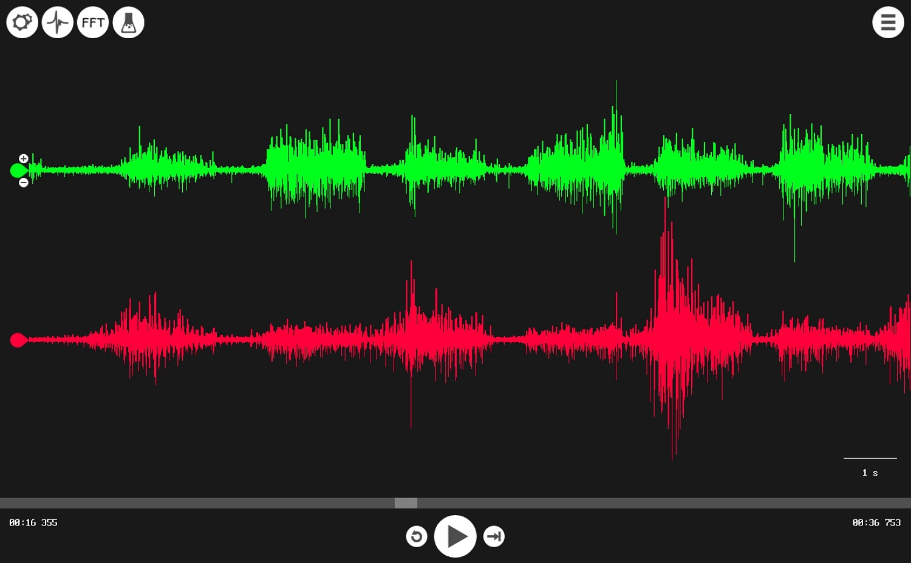](./img/MuscleProExp4.jpg)

Pump up your gestural greeting with extra muscular effort (wave with muscle!)
so you can visualize/hear the EMG better. Don't go for speed, go for strength!
This should make the differences in your signals much more dramatic like you
can see below. Can you use your two EMGs to verify which muscle is the agonist
when you flex your arm? How about when you extend your arm?

[ 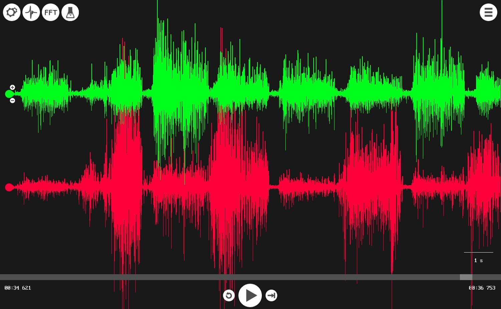](./img/MuscleProExp5.jpg)

B) The antagonist muscle might show spiking as well, why do you think? Try to
explore your arm motions until you can completely relax the antagonist (no
spikes).

  6. Let's go a step further, do a push-up! (If the floor is dirty or you're just not a fan of push-ups, you can also do a push-up on the edge of a sturdy table by leaning into it.) Can you verify with your EMGs that the triceps are the agonist whether you are going up or down? 

Here are our results (again, biceps red, triceps green):

[ 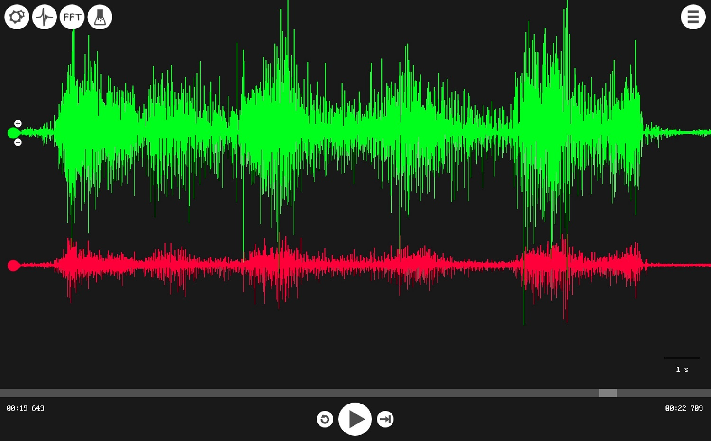](./img/MuscleProExp6.jpg)

This screenshot above shows the two EMGs during the two phases of a push-up.
Beginning with arms extended and then lowering down, the biceps look like the
relaxed antagonist and those triceps are definitely firing more spikes as the
agonist! Then, pressing back up, we can see that even though the direction of
motion has reversed, the triceps are still bearing the load and playing the
role of the agonist.

### Further experimentation suggestions:

[ 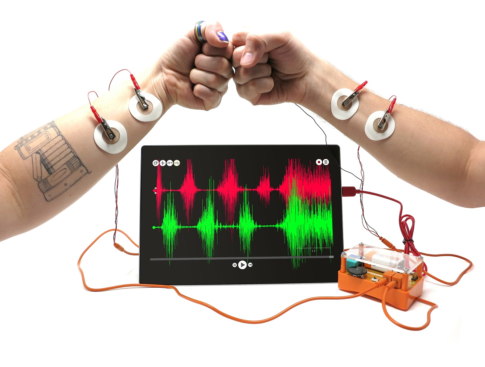](./img/MuscleProExp14.jpg)

Can you think of other antagonistic pairs in your body? Test out your
hypothesis by recording EMGs from those two muscles to see if you are right.
Remember, one should show lots of spikes (agonist) while the other shows few
or none at all (antagonist) and vis versa. Another fun exploration would be to
try and find two muscles that display action potentials in their EMGs even
when you are standing or sitting still. The Muscle SpikerBox Pro can also let
you compare your muscles to your friends'. Observe your EMGs while arm
wrestling!

[ 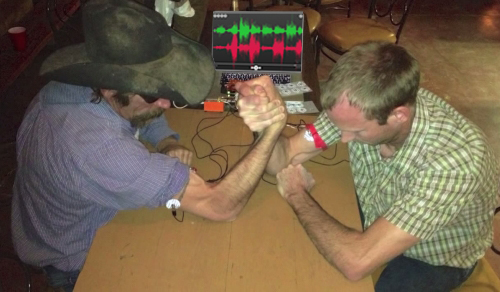](./img/ArmWrestlersPRO.jpg)

Or try a hands-free arm wrestling match. Winner goes to whoever can keep their
spikes up longer!

Take advantage of these pro featuress and let us know your experimental
results! Email us your process and findings at
[hello@backyardbrains.com](mailto:hello@backyardbrains.com)!

