## Experiment:Control Machines with your Brain

---
id: "experiment__control_machines_with_your_brain"
title: "Experiment: Control Machines with your Brain"
slug: "/retired/experiments/muscleSpikerShield"
---

Now that you have your EMG Signal, can you use it to drive another system?
Neural Engineering continues, using the popular Arduino microcontroller.

**Time:**  30 minutes

**Difficulty:**   Intermediate

#### What will you learn?

Here you will learn how to interface an Muscle SpikerShield with external
hardware. This is continuation of our [Neuroprosthetics
Experiment](./neuroprosthetics); only
now, you will use an EMG Signal from a muscle of choice, paired with an
Arduino Microcontroller, to control a bank of LED lights with this Brain-
Arduino interface!.

##### Prerequisite Labs

* [Muscle SpikerBox](./muscleSpikerBox.md) - You should become familiar with what an EMG signal is.

##### Equipment

*[Muscle SpikerShield Bundle](https://backyardbrains.com/products/muscleSpikershieldBundle)

## Background

In the [Muscle
SpikerBox](https://backyardbrains.com/experiments/muscleSpikerBox) experiment
we learned about how motor neurons activate muscles with electrical signals,
and we learned how to record that electrical activity using the BYB Spike
Recorder App. These EMG signals are powerful tools for doctors and scientists
who study human physiology, but they are also powerful tools for us
biohackers! By using our EMG signals as an input, we can begin to create
human-machine interfaces.

The [Muscle
SpikerShield](https://backyardbrains.com/products/muscleSpikershieldBundle)
has all the same functionality of the [Muscle
SpikerBox](https://backyardbrains.com/experiments/muscleSpikerBox), but it is
also designed to pair with an [Arduino
Uno](https://arduino.cc/en/Main/arduinoBoardUno) board. What is this 'Arduino,'
you may ask? An Arduino is a
[microcontroller](https://en.wikipedia.org/wiki/Single-board_microcontroller).
Microcontrollers are simple devices at heart_ they take input signals, execute
custom code to interpret those signals, and then use that information and
those commands to control other devices. A famous example of a microcontroller
project is an automatic cat feeder. A sensor first measures the weight of food
in the bowl (the input). Then the microcontroller reads that information and,
if the weight of the food in the bowl is under a certain threshold, commands
the food hopper to pour more food in the bowl.

[ 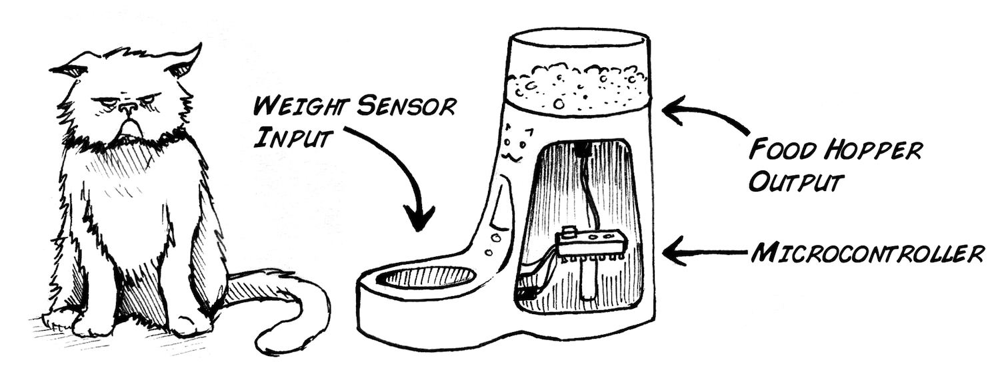](./img/cat_microcontroller2_web.jpg)

Now that we've fed the cat, let's get back to business with the [Muscle
SpikerShield](https://backyardbrains.com/products/muscleSpikershieldBundle).
The SpikerShield allows you to record your muscle's electrical activity and
send it into the arduino. It's important to note here that our EMG signal
begins as an analog (continuously varying). The analog signal is what you hear
and see on the Spike Recorder App when you're recording your EMG. In order to
use that signal in our Arduino code, we convert the analog signal into a
digital signal, breaking it up into a series of discrete numbers, making it
easier to understand the signal and plug it into our code.

[ 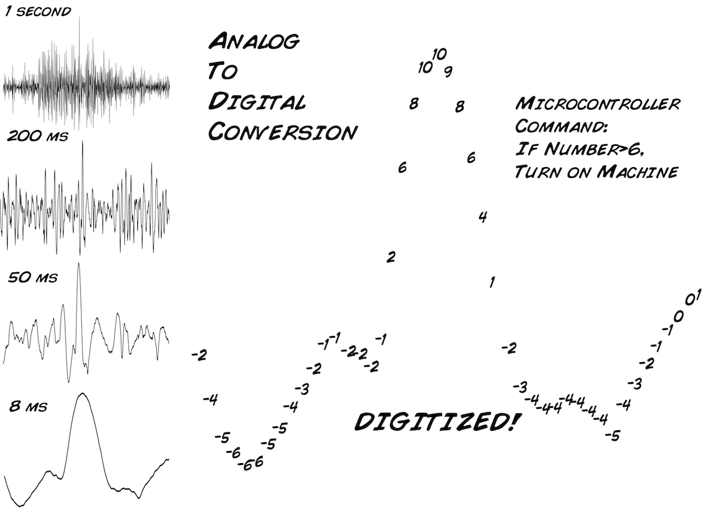](./img/Final_AD_conversion_web.jpg)

So, to recap, the SpikerShield allows you to record your muscle's electrical
activity and send it into the arduino, which can then analyze this information
and use it as an input to control Human-Machine Interfaces! Your muscles can
now control neuroprosthetics (like a robot arm), video games, or even, as
we're about to see... LEDs!

[
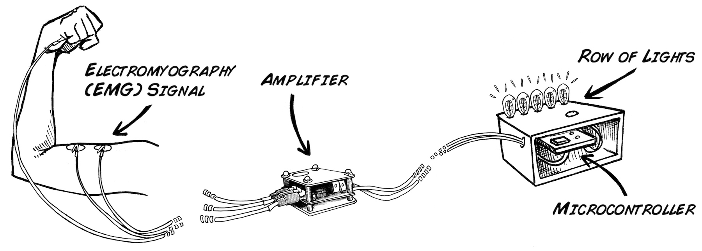](./img/light2_microcontroller_web.jpg)

#### Downloads

> This experiment assumes you have a basic understanding of how to use the
> Arduino Platform and you know how to upload code to your board. If you are
> new to arduino, or need a refresher, check out [Getting Started with Arduino on Windows](https://arduino.cc/en/guide/windows#.UyIUTYW3t4x) or [Getting Started with Arduino on Mac OS X ](https://arduino.cc/en/guide/macOSX#.UyIU2IW3t4w). Note_ If you bought our

> [Muscle SpikerShield Bundle](https://backyardbrains.com/products/emgspikershieldbundle), the
> Human-Human-Interface and Claw Combined code is already uploaded.
>
> [Arduino Software](https://arduino.cc/en/main/software#.Uxd6XYWhZMk)

>
> This lab has you begin with different code, allowing you to see the
> digitized signal in the serial monitor. Then, at the end of the lab, you
> will switch back to the original, pre-loaded code. Download our
> Arduino(.ino) Sketch for this Experiment
>
>
> [led_strip2014_highergain.ino](./files/led_strip2014_highergain.zip)

#### Print Materials

> If you're looking for a PDF to print and scribble on, or a google doc to
> edit, [check out this repository of print resources
> here!](https://drive.google.com/drive/folders/1bE1B0DvsGNauhyj-z8YjzuBXmFYivfkR?usp=sharing)

### Procedure

1. Let's get started! If you purchased the SpikerShield Bundle, everything is ready to go out of the box! But, for the sake of learning, let's say you're starting from scratch. This experiment will guide you through setting up and programming the arduino. 

[ 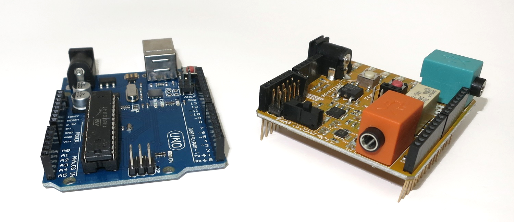](./img/SpikerShieldImg1.jpg)

  2. First, mate the Muscle SpikerShield on top of the Arduino, aligning all the pins on the shield to the female headers on the Arduino. In this experiment we are using the first Analog input (A0), so be sure to jumper the input select to 1. **Note_** your Arduino can run on an external USB power source or the included battery leash once your code has been uploaded, but you need to use your computer to upload your code and to view the serial monitor. Plug it in to your computer now! 

[ 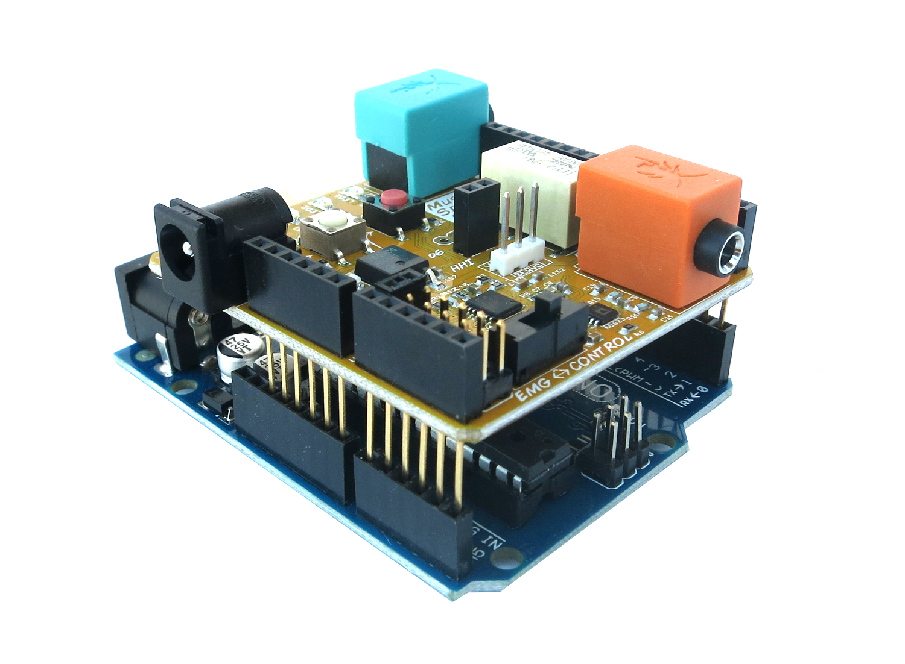](./img/SpikerShieldImg2.jpg)

  3. Download our [led_strip2014_highergain.ino](./files/led_strip2014_highergain.ino.zip) sketch (also mentioned above) and upload it to your arduino. 

[ 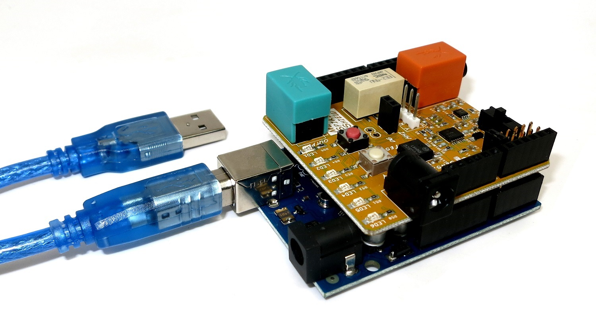](./img/SpikerShieldImg3.jpg)

  4. Then connect the orange electrode cable wire from the Muscle SpikerShield to some electrodes on your arms. Hook the two red clips onto your arm and place the black one on the back of your wrist. You can also plug in a speaker to hear your muscle activity alongside the visual outputs! 

[ 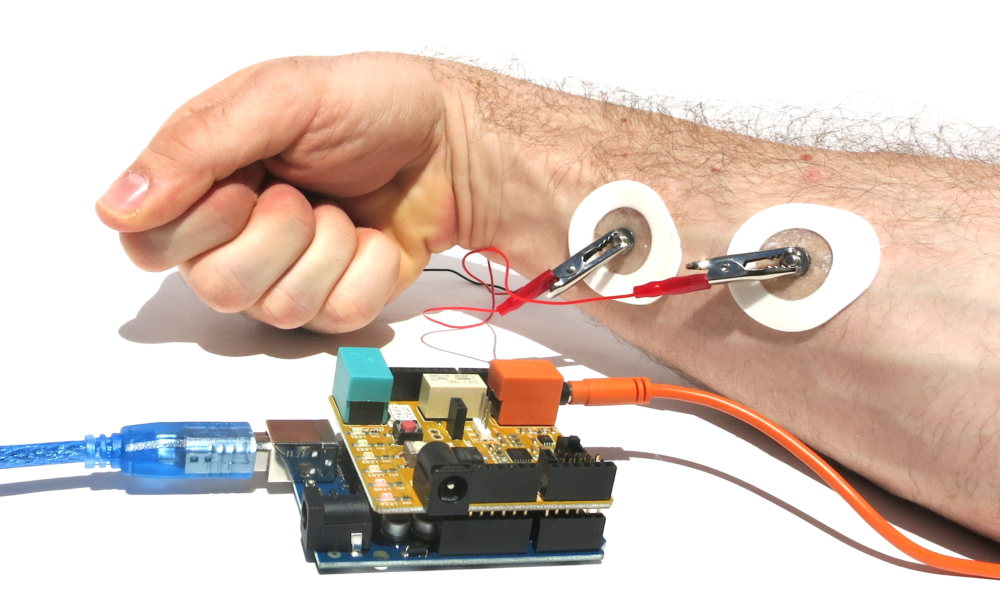](./img/SpikerShieldImg9.jpg)

  5. Open the Arduino serial monitor from the IDE to check the values. The values on the left are our digitized inputs. The values on the right are the number of LEDs which will light up at that signal strength! If you get larger values when you flex your muscles, and values near zero when you don't, then everything is working ok! If not, make sure all cables are connected correctly and nothing is loose. You may find connecting a portable speaker to the Muscle SpikerShield to be helpful so you can hear your muscle activity as well. 

[ 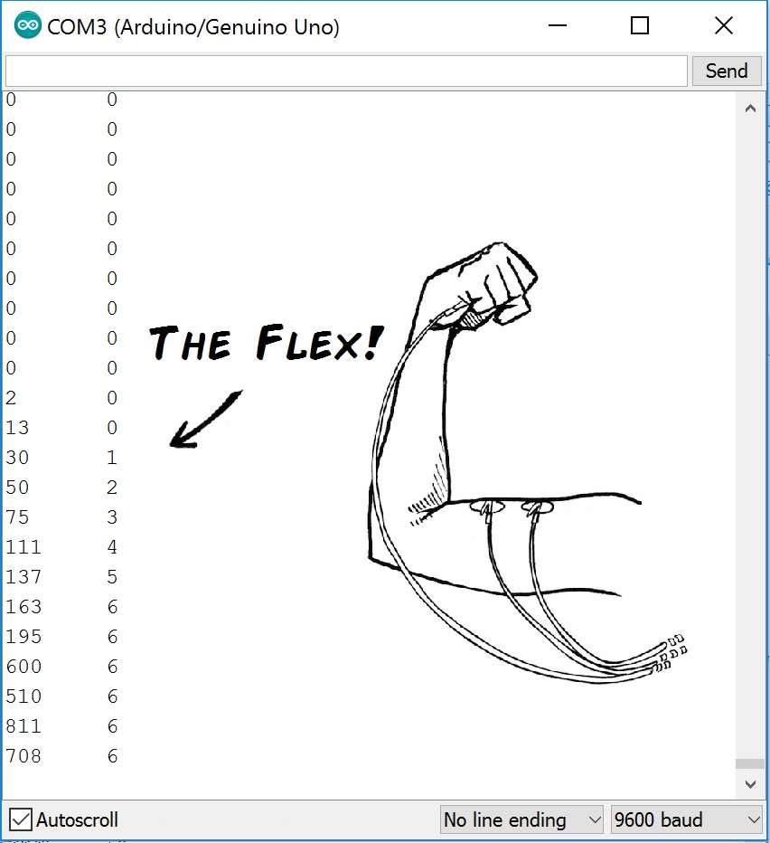](./img/SpikerShieldImg6.jpg)

  6. If you didn't notice already, you're controlling the LEDs on the SpikerShield with your muscles! You should see the LEDs light up according to how hard you flex! If you feel the LEDs don't light up proportionately to your arm strength, you can adjust the sensitivity with the white button on the shield. You can also tweak the MAX constant from 4 to another value until the represented value is proportional to your strength. If the electrodes light up really easily, increase this value - if you are having a hard time making all the electrodes light up, lower it! 
    
    
    #define NUM_LED 6  //sets the maximum numbers of LEDs

**#define MAX 150     //maximum posible reading. TWEAK THIS VALUE!!**

int reading[10];
    int finalReading;
    

  7. Your SpikerShield can also run on an external USB battery or our included 9v Battery Leash. Be sure you're plugging the battery into the barrel jack on the Arduino and not the SpikerShield. The barrel jack on the shield is to supply power to our next experiment... the Claw! 

[ 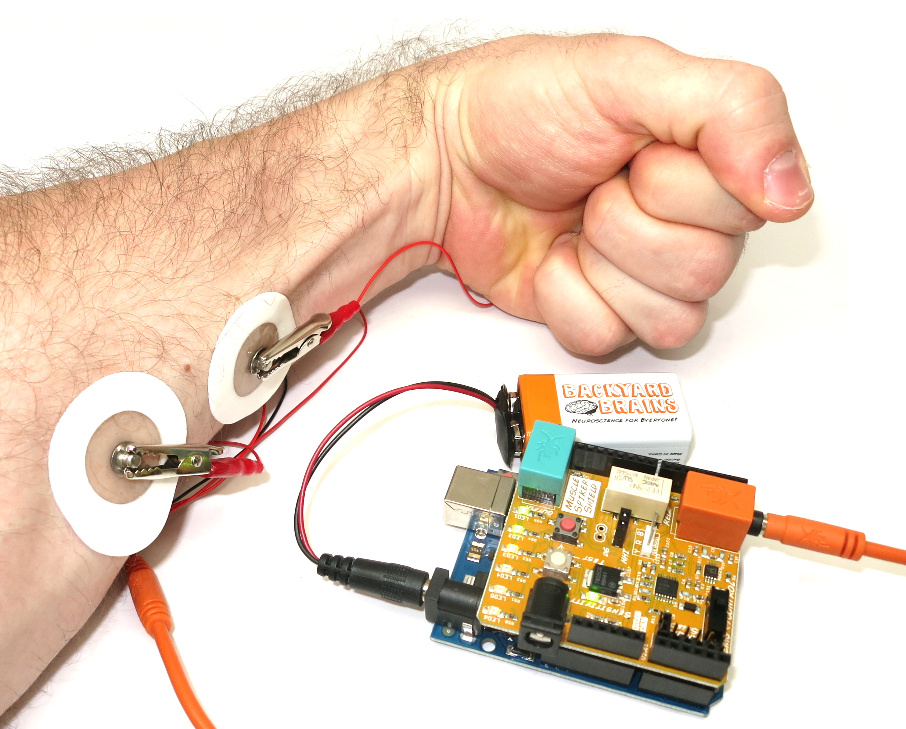](./img/SpikerShieldImg8.jpg)

  8. Finally, if your SpikerShield came as part of a kit (Such as the HHI or Claw Bundle), then you will want to upload code onto it which will allow the Claw and the Human-to-Human-Interface to run. [Default Code.](https://raw.githubusercontent.com/BackyardBrains/Muscle-SpikerShield/master/V2_61/Muscle-SpikerShield/Muscle-
SpikerShield.ino)

### Other Experiments

Now that you've got the basics covered, check out some of our other Human-
Machine-Interface experiments!

[ 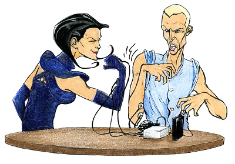 Advanced Neuro-Prosthetics_ Take Someone's
Free Will ](humanhumaninterface)

[ 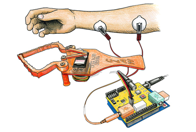 Controlling a Robotic Gripper with
Your Muscles ](MuscleSpikerShield_GripperHand)

This is just the first step into your new world of EMG Arduino design. Happy
hacking! [Let us know](mailto:info@backyardbrains.com) what you connect your
EMG signals to! Let your creative mind flow and invent.

## Science Fair Project Ideas

* There are lots of potential devices you can interface with using the Muscle SpikerShield-what are some devices that you think would be interesting to control? Can you set up a gripper or a motor so that their strength/speed correspond to how much you're flexing? Can you get this to turn on something that delivers more force than you can?
* The LEDs provide a way of showing if your muscle contraction has surpassed a certain threshold. How long can someone keep the last red LED on? How does the number of lights on correspond to the signal shown on the Spike Recorder App? Are different muscles more or less able to get all the LEDs on?
* Most of what we've discussed so far are analog devices-basic motors, grippers, LEDs. As a more advanced project, can you interface and control any digital programs or devices? Can you get it to work with any other apps?