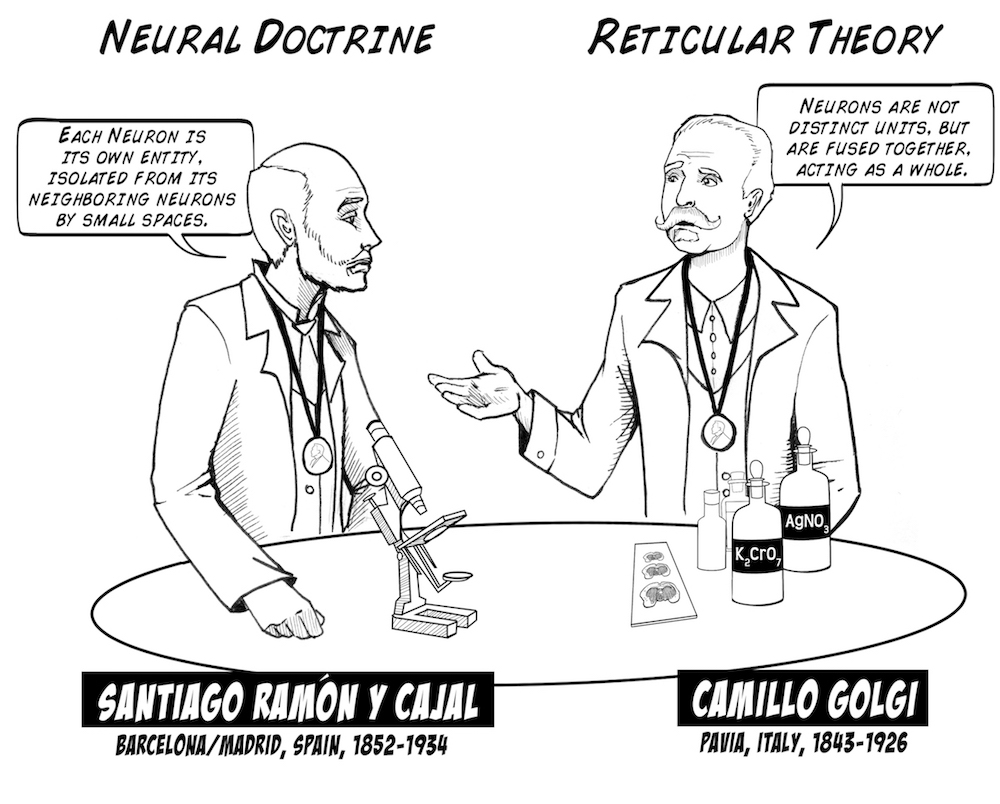
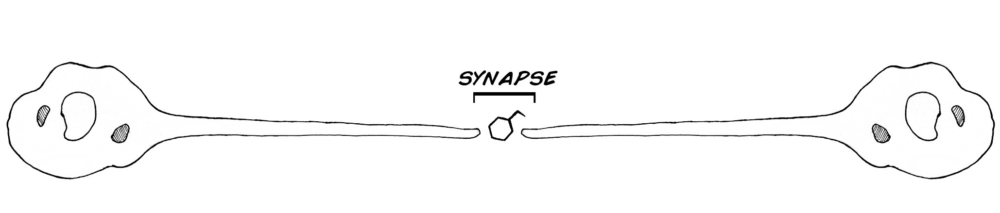
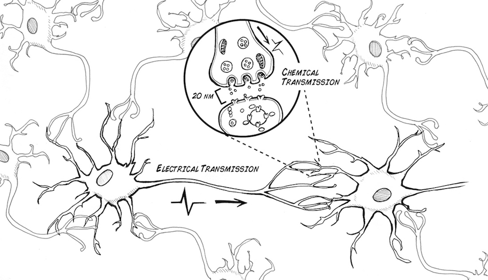
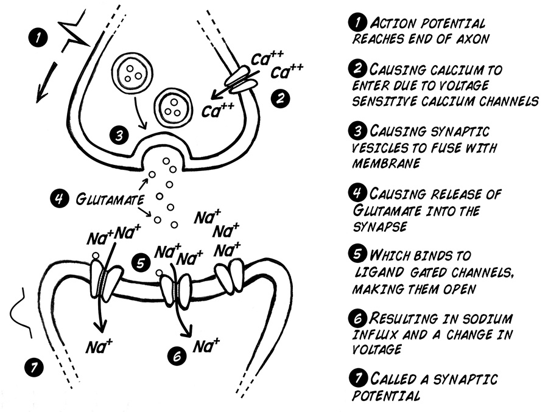
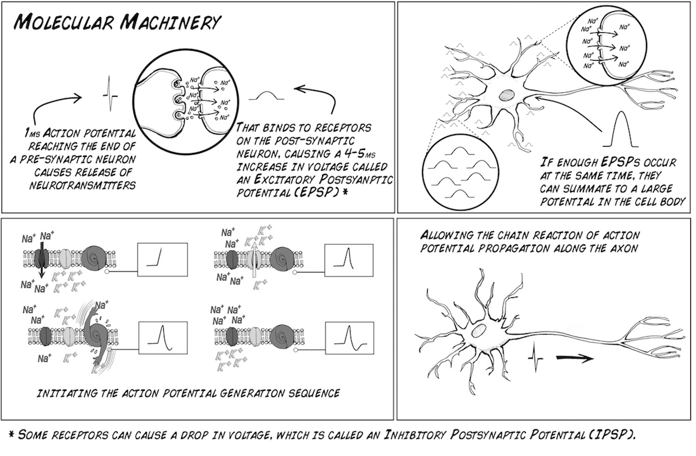
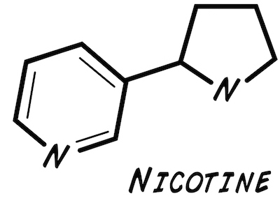
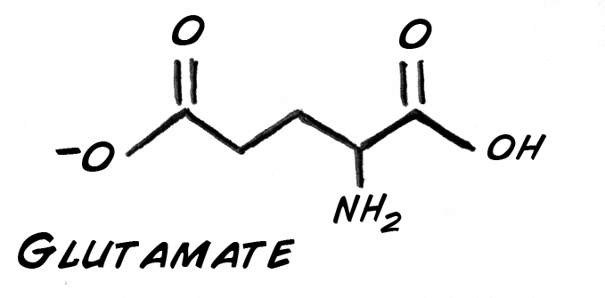
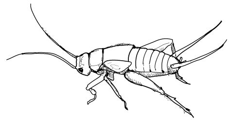
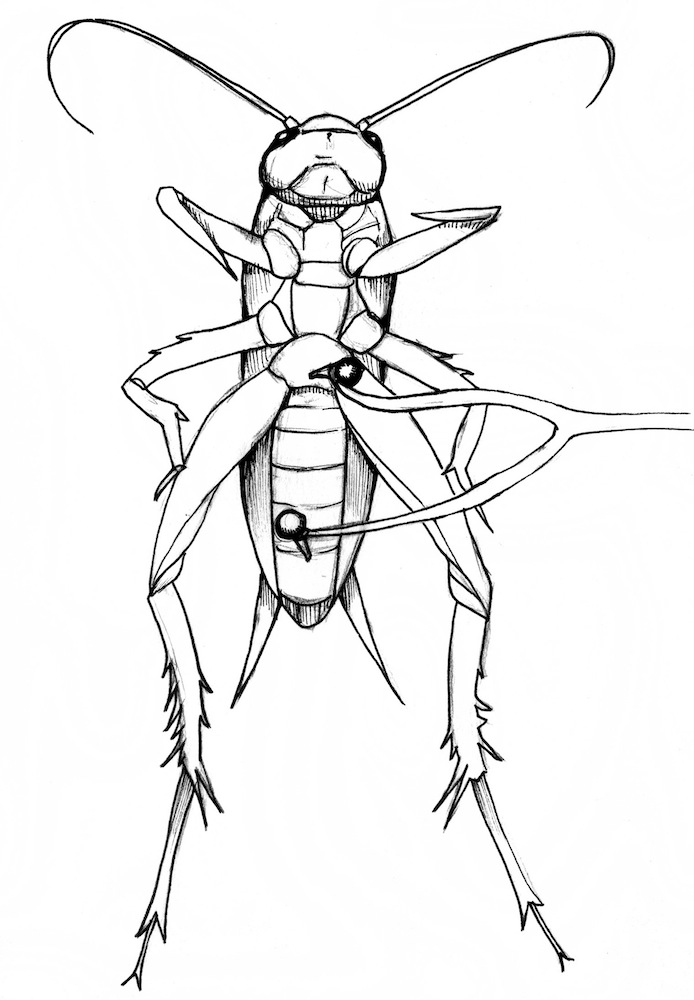

It's 2 AM, your linear algebra final is in 6 hours, and you gulp down another
espresso. You start thinking: "I wonder how this espresso and other drugs
actually work?" We are here to lead you through an interesting experiment
where you will use drugs, such as glutamate and nicotine, to change the firing
rate of the cricket cerci system's neurons.

**Time**  45 Minutes

**Difficulty**  Advanced

#### What will you learn?

In this experiment you will learn how different drugs and chemical agents
affect the nervous system using the cricket cercal system. You will also learn
how to create a few different chemical solutions.

##### Prerequisite Labs

* [SpikerBox](./ratecoding.md) - You should become familiar with how to use your SpikerBox.

##### Equipment

* [SpikerBox](https://backyardbrains.com/products/spikerbox)
* [Cable: Laptop](https://backyardbrains.com/products/laptopcable) [Phone](https://backyardbrains.com/products/smartphonecable)

## Background

We have been studying "spikes" in the last couple experiments, and we will
continue to do so here, but now we are also going to study the synapse! Recall
[our first experiment](https://backyardbrains.com/experiments/spikerbox),
where we explained that neurons communicate with a combination of electricity
and chemicals, and that each neuron is distinct (the "Neuron Doctrine" of
Santiago Ramón y Cajal).

Consider two neurons:

Once a spike reaches the end the first neuron, it can cause the neuron to
release "neurotransmitters" across the small distance between the two neurons
called the "synapse." These neurotransmitters bind to receptors on the second
neuron, which then cause the second neuron to begin firing spikes (or stop
firing spikes, but let's keep it simple for now). These receptors are very
sensitive to electrical activity and certain chemicals. In fact, the very
sensitivity of these receptors is how neurons, and ultimately you, learn!

And a more realistic view of the synapse.

What occurs in the synapse..

And how it affects the next neuron.

In this experiment we will test the effect of neuroactive compounds on central
nervous system neurons. Obtaining drugs that affect neurons can be quite
difficult, as they are often very dangerous (like the Batrachotoxins of poison
dart frogs or the tetrodotoxins of Fugu Puffer Fish, both of which block
sodium channels) or are drugs of abuse (like cocaine, which allows dopamine to
stay in synapses longer than normal). But, we have access to two types of
drugs we can use on our insects.

##### Nicotine and Monosodium glutamate!

Nicotine comes from the tobacco plant. Tobacco evolved nicotine to prevent
insects from eating its leaves. Nicotine is a powerful acetylcholine receptor
agonist; it amplifies the effect of acetylcholine binding to its receptors in
synapses, causing a neuron to fire more (due to increased sodium ion influx).

Whereas nicotine is a drug that acts on receptors that neurotransmitters bind
to, Monosodium glutamate itself is a neurotransmitter. Once dissolved in
water, it turns into positively charged sodium ions and negatively charged
glutamate ions. Glutamate is normally part of the metabolic pathway of
glycolysis (breakdown of sugar) and is readily available from the foods you
eat.

In fact, over 80% of the synapses in your brain use glutamate as its
excitatory neurotransmitter. In insects, is it excitatory as well? Let's find
out!

## Procedure

To create your nicotine solution, take a cigarette or small cigar, remove all
the shredded tobacco leaves, and place them in a small container (a clear pill
bottle, for example). Fill the container with water, put the cap on, shake up
the mixture, and allow it to sit for a couple days to extract the nicotine.
Over time the solution should turn yellowish-brown. If you are in high school
ask your teacher or parent to help you prepare this solution. Alternatively,
you can also directly purchase 40mg/mL Nicotine Solution from Amazon for about
$12.

To create your glutamate solution, you need to find some monosodium glutamate!
You can often find it at your friendly neighborhood Asian import grocery
store. A pound should cost a couple dollars. Fill up a clear pill bottle about
a quarter full of the MSG salt crystals, fill the remainder of the bottle with
water, and shake thoroughly to dissolve the MSG. Note that not all of the MSG
will dissolve, as you are making a saturated solution. Do some online research
or ask your teacher to find out what a saturated solution is.

For reasons we haven't figured out (or really worked hard enough on yet), the
cockroach leg preparation does not lend itself well to neuropharmacology
experiments. Maybe you can prove us wrong, but for now, we are going to switch
to a new species, the cricket cercal system!

Crickets are readily available for [local pet
stores](http://www.petco.com/product/12680/Live-Crickets.aspx) as feeder
insects for lizards and frogs; they are a $1/dozen. Place your crickets on ice
when you are ready to do an experiment. Take your two needles from your
electrode and place them along the central axis of the insect, like the figure
below:

Wait about 2-4 minutes for the neurons to "warm up" and then blow gently on
the rear of the insect. You should see the cerci move from the pressure of
your air puff. The cerci are sensing organs on the rear of the cricket that
are sensitive to wind vibration. You should also hear an increase in the
spiking activity on your SpikerBox. Note that these spikes are not as loud as
the spikes you are used to hearing with the cockroach leg prep, but if you are
lucky you should hear them.

Now take a small syringe (you can also buy this at local pharmacy over the
counter) and inject a tiny bit of each solution into the cricket near one of
the electrodes. What do you notice with the two different solutions. Can you
explain any peculiar effects you hear with regards to spiking rate?

## About Anuradha Rao

This experiment is dedicated to Anuradha Rao, a neuroscientist who studied
pharmacology and enjoyed educational outreach. Her memorial fund generously
allowed Backyard Brains to present experiments and prototypes at the 2010
Society for Neuroscience Conference in San Diego, CA.

## Science Fair Project Ideas

* What are some other easily acquired substances that you think would have an effect? What effect(s) do they have? 
  * Try altering the concentration and amount of substances you inject-how does this change things, if at all? 
  * Why do the neurons need to "warm up" even if we are injecting things that should cause them to spike? 
  * Does the location of the injection change anything? Why or why not? 
  * Why don't we have such immediate and dramatic responses as the cricket did when we we ingest these substances? 
