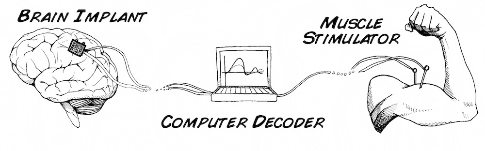
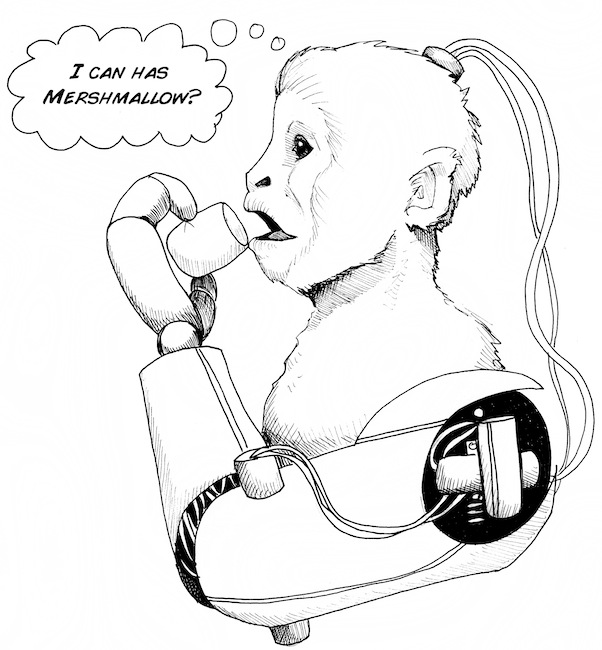
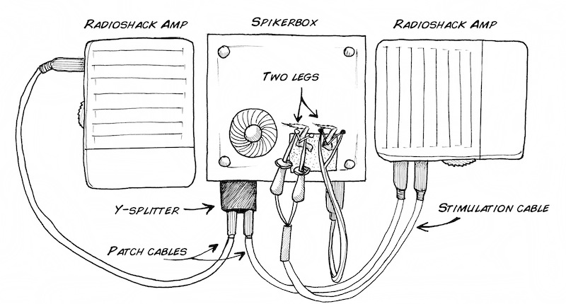

# Experiment:NeuroProsthetics

Ever wondered if you could connect the neural output of one cockroach leg into
another leg? Neural Engineering 101 now in session.

**Time:**  45 Minutes

**Difficulty:**   Intermediate

#### What will you learn?

In this lab you will learn about neuroprosthetics, a very new discipline
combining neuroscience, engineering, robotics, and physics.

##### Prerequisite Labs

  * [SpikerBox](spikerbox) \- You should become familiar with how to use your SpikerBox

##### Equipment

* [SpikerBox](https://backyardbrains.com/products/spikerbox)

* [2 Patch Cables](https://backyardbrains.com/products/laptopcable)

* [Stimulation Cable](https://backyardbrains.com/products/stimulationcable)

* [Extra Electrode](https://backyardbrains.com/products/recordingelectrode)

* [Cockroach](https://backyardbrains.com/products/cockroaches)

## Background

One of the exciting developments of the first decade of the 21st century has
been improvements in neuroprosthetics! But, you may ask_ "what are
neuroprosthetics?" A neuroprosthetic is a device that replaces the function of
a damaged body part and interfaces with the nervous system. For example, Luke
Skywalker in "The Empire Strikes Back" had a robotic hand installed after
[Darth Vadar cut it off](https://www.youtube.com/watch?v=C-DeI3ohVbY). And
since Luke Skywalker could control his robotic hand by simply thinking about
it, his robotic hand no doubt interfaced with the surviving nerves in his arm.

In a continuing mystery to science, neurons in the mammalian brain and spinal
cord do not regrow (unless you count a small population of neurons in the
memory (hippocampus) and smell (olfactory) parts of the brain).

Thus, given current technology, in order to fix brains and spinal cords,
sometimes engineers and doctors try to bypass the site of injury through
electronic and computer means. For example, if someone breaks their spinal
cord above a certain point, they are confined to a wheelchair. But, the
muscles in their legs are still alive, and the brain can still make commands
like "I want to move my leg." The message, however, cannot travel from the
brain to the leg muscles because the spinal cord is damaged.

Enter neuroprosthetics! Somehow, if you could "read out" the command signal
from the brain, and use it to stimulate muscles or a robotic limb, you'd have
a neuroprosthetic! In fact, a research group in Pittsburgh has used this
technique to train a monkey implanted with electrodes in his brain to control
a robotic arm to feed itself!

We will demonstrate basic principles of neuroprosthetics using two natural
cockroach legs.

## Video

## Procedures

In addition to the equipment above, you should buy a
[Y-splitter](https://www.radioshack.com/product/index.jsp?productId=2103422)
and two
[Speakers](https://www.radioshack.com/product/index.jsp?productId=2062620) from
your nearby RadioShack. To begin, put a cockroach on ice water, and then cut
off two of its rear legs. Return the cockroach to its house, but consider the
cockroach now retired from scientific service. You don't want to cut off
anymore than two legs, and the cockroach can still get around pretty well with
only four legs. Place the two cockroach legs on the cork of your SpikerBox,
and hook up one leg to the SpikerBox in the standard way as in experiment one.
Now_

  1. Plug the Y-splitter into the SpikerBox. 
  2. Plug the two patch cables into the Y-splitter. 
  3. Plug the two RadioShack Amplifier/Speakers into the other ends of the two patch cables. One Amplifier/Speaker is for simultaneously listening to the spikes while doing your experiment, and the other Amplifier/Speaker is for stimulating the muscles of the second leg (the SpikerBox alone does not generate enough voltage to stimulate the leg; that's why we have to go through a secondary amplifier). 
  4. Plug the Stimulation Cable into one of the amplifiers. 
  5. Place two needles into the second cockroach leg, and hook up the stimulation cable to these two needles. 
  6. Turn on one of the amplifier/speakers to hear the spikes, and then turn on the second amplifier (the "stimulating" amplifier). The stimulating leg will move briefly due to capacitative discharge when the amplifier is turned on. Slowly turn up the volume on the stimulating amplifier until the leg starts twitching. Then, turn the volume down below this point. You are bringing the leg just "below threshold" when you do this. 
  7. Now, begin brushing the leg that is hooked up to the SpikerBox. What do you see? Do you notice any different effects on the stimulated leg based on different spike rates? 

We thank the high school students of [Clarkston Math, Science, and Technology Academy](https://www.clarkston.k12.mi.us/education/components/scrapbook/default.php?sectionid=1119)
for suggesting we design an experiment demonstrating neuroprosthetics. We'd
also love to say we were the first to pull off this preparation, but quite
serendipitously and unknown to us, our friends [Mohsen Omrani](https://www.queensu.ca/sgs/forstudents/stories/students-perspective/momrani.html) and [Ethan Heming](https://limb.biomed.queensu.ca/lab_members/lab_members.htm) at Queens
perspective/momrani.html) and [Ethan Heming](https://limb.biomed.queensu.ca/lab_members/lab_members.htm) at Queens
University in Kinston, Ontario first successfully demo'd the preparation a
full three hours before we tried it out, on the same day [May 25th, 2011]!

##### Happy experiments! Let us know what you find!

## 2013 Update

Instead of using the cockroach leg as the input signal to drive another
cockroach leg, you can try a human electromyogram (EMG) as the input signal,
using our [EMG SpikerBox](https://backyardbrains.com/products/emgspikerboxkit). In this
setup, the EMG SpikerBox has enough voltage to directly connect to the
cockroach leg -- you do not need to secondary RadioShack amp (as above).
Simply plug the stimulation cable into the EMG SpikerBox, and you are ready to
go!

## Science Fair Project Ideas

* For when you're hooked up to the leg_ If you flex and hold, which seems to fatigue faster-your muscle or the leg? Why is that? Do some muscles work better than others for getting a response from the leg?