# Experiment:Debunking the P-value with Statistics

Many of our experiments here at Backyard Brains will have you collecting data.
You may be wondering, "well what can I do with all of this data?" Welcome to
the wonderful world of Statistics. In this lesson we show you how to formulate
a hypothesis and what to do with the data after you have collected it. You can
follow along and collect new data during this experiment, use data you have
already collected, or follow along with the data we use. The choice is yours.

**Time:**  2-3 Hours

**Difficulty:**   Intermediate

#### What will you learn?

You will learn how to formulate a hypothesis. After you have some data you
will learn how to analyze it using fundamental statistical procedures and
tests. You will then see if your results support your null or alternative
hypothesis.

##### Prerequisite Labs

You should have data ready from previous experiments. If not, go back to one
of the experiments listed below and collect some data, or follow along using
our data set for left and right hand reaction times.

  * [Reaction Time](./reactiontime)
  * [Comparing Nerve Speed](./comparingNerveSpeed)

##### Equipment

* None

## Background

In the past three cognitive experiments, you have recorded data and run
experiments. The purpose of collecting data is not just for observation, but
also for inference (meaning, to draw a conclusion and learn about the
population you are studying). Observations are easy. Some people have blue
eyes and others have green. Drawing inferences about a population though can
be very difficult. It requires thoughtful data collection and elegant
analysis. For example, how do you determine the average height of a man? You
wouldn't solely go to an NBA basketball team nor a Kentucky Derby Horse Jockey
convention would you?

[ 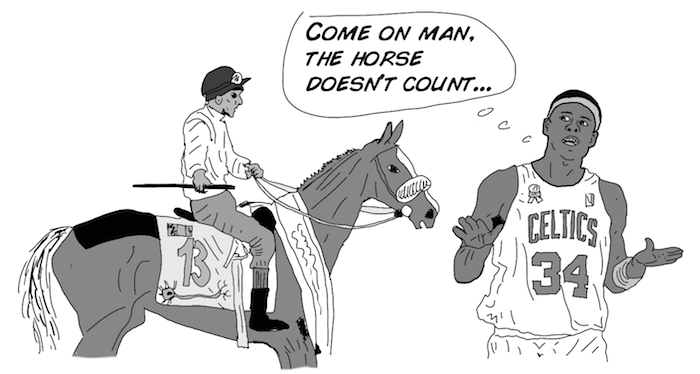](.img/BYB_exp4_pic1.png)

Going further and using inferences to show how two populations are different
can be even more challenging. Is it possible to prove that on average men are
taller than women? Many variables could throw you off from making a valid
conclusion. Collecting average female height data solely from the WNBA and
male height solely from the Kentucky Derby jockeys would result in a
population bias as well as a small sample size. Finally, was data self-
reported, or was it professionally measured?

[ 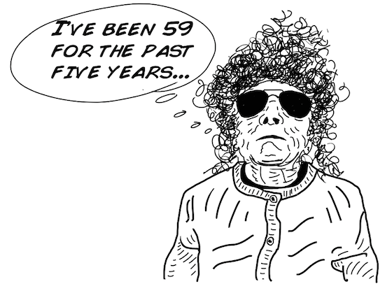](.img/BYB_exp4_pic2.png)

As you can imagine, collecting good data and analyzing it is hard work. The
good news is that becoming a statistician is a lucrative profession.
Governments, Wall Street, corporations, labs, and even some individuals all
need good statisticians, and they are usually willing to pay good wages.

[ 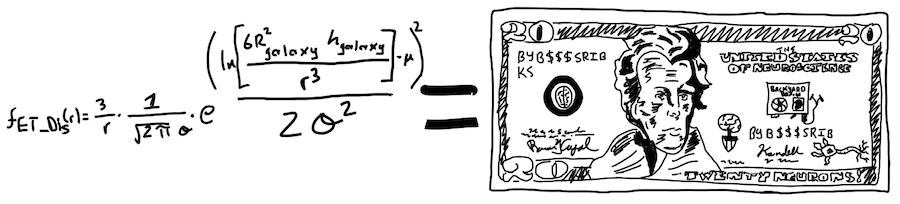](.img/BYB_exp4_pic3.png)

In this lesson we will do some basic statistical analysis. Before we do this
though, you must go out and collect data. Luckily, if you have already
completed one or all of the last three cognitive experiments, you will have
some data to work with. We hope you did best to control your methods and be
consistent! You are welcome to follow along with your own data sets, or
collect new ones. If you have a small sample size though (less than 7 subjects
for any of the past 3 experiments), you should collect more data.

## The Hypothesis

Before we begin to collect data, we are going to form some hypotheses.

* Our first hypothesis will be_ right-handed people have a faster reaction time with their right hand than their left hand. 

[ 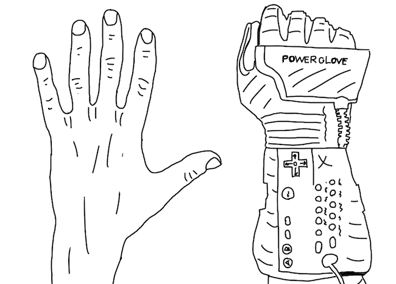](.img/BYB_exp4_pic4.png)

* Our second hypothesis will be_ left-handed people, since they are special, are faster than right-handed people. 

[ 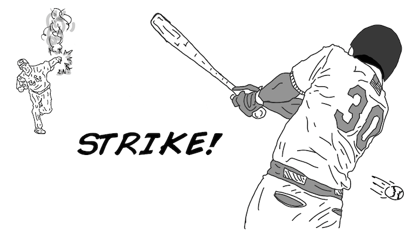](.img/BYB_exp4_pic5.png)

## The Raw Data, Graphs & Distributions

Below is a data set we collected from performing Cognitive Experiment #3
Reaction Time. Here we show the reaction times for both left and right hands
for the visual cue. We gathered 20 college age volunteers, 10 left-handed and
10 right-handed. Reaction time is displayed in seconds.

[ 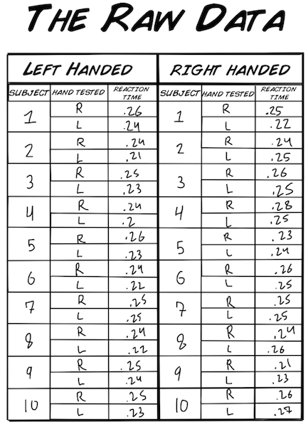](.img/BYB_exp4_pic6.png)

Now that we have the raw data written down, we can begin to look over the
results. There appear to be no "strange" values, so our data set is probably
good. For example, if one of our values were a .78, we would probably throw
this value out and not use it. Sound fishy? Sure does, but there is math to
it, which can read more about [outliers](https://en.wikipedia.org/wiki/Outlier)
here.

Next, we want to organize the data specifically for both our hypothesis_

#### Hypothesis 1_ Right handed people are faster with their right, dominant,
hand.

[ 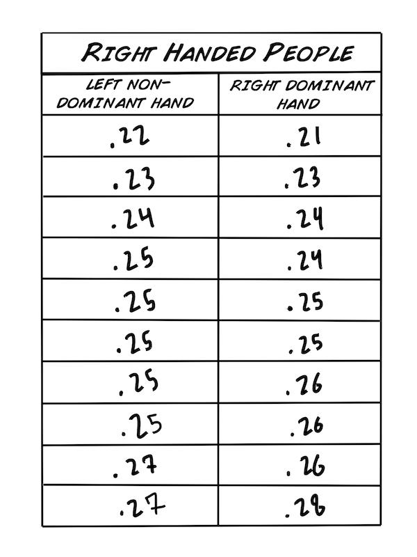](.img/BYB_exp4_pic7.png)

#### Hypothesis 2_ Left-handed people are faster than right-handed people are.

[ 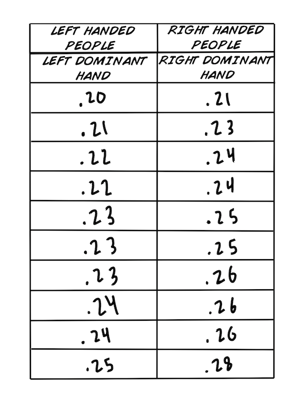](.img/BYB_exp4_pic8.png)

We formatted the values in ascending order as well, because it makes the data
easier to work with and look at. Before we go into statistical tests, we
should calculate some basic values.

* The minimum is the lowest value. 
* The maximum is the highest value. 
* The mode is the value occurring most frequently. 
* The average, or mean, is the sum of individual scores divided by the total number of individuals. For example, if you have the list (1,2,3) the mean would be (1+2+3)/3 = 2). The mathematical symbol for mean is_ μ (lower case Greek symbol for Mu) 
* The median is the middle value in an ordered data set. If we have an odd number of data values than the median is the middle number. For example, in (1,2,3) the median would be 2. If we have an even amount of data values, there will be two middle values, and the median will the mean of the middle two. For example, in (1, 2, 3, 4) the two middle numbers are 2 and 3. Thus the median would be (2 + 3)/2 = 2.5. 

First we want to find these values for the data in our first hypothesis.

[ 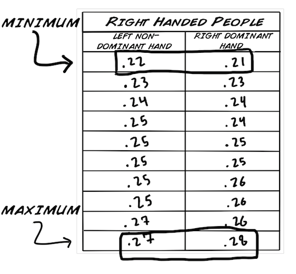](.img/BYB_exp4_pic9_minmax.png)

[ 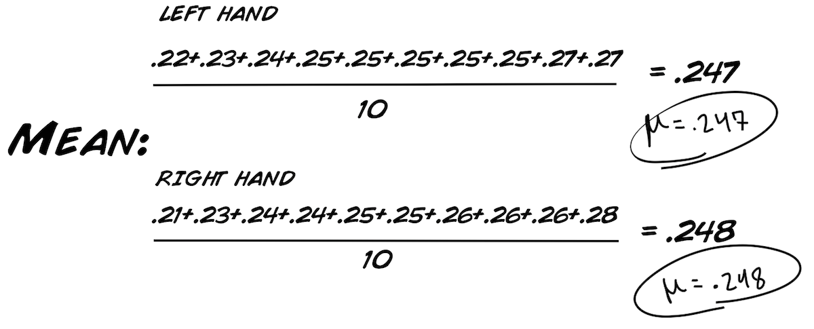](.img/BYB_exp4_pic9_mean.png)

[ 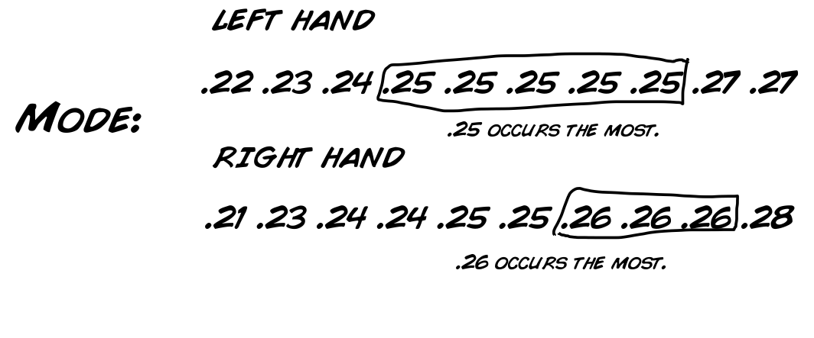](.img/BYB_exp4_pic9_mode.png)

[ 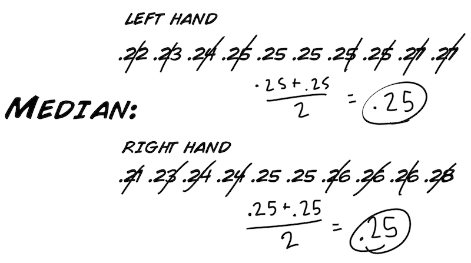](.img/BYB_exp4_pic9_median.png)

* And another one_ Standard Deviations! The standard deviation is a measure of the variation in the data. The higher the standard deviation value, the further "spread" the data are from the mean. The mathematical symbol used for the standard deviation is_ σ (lower case Greek symbol for Sigma). How do we calculate it? See below... 

[ 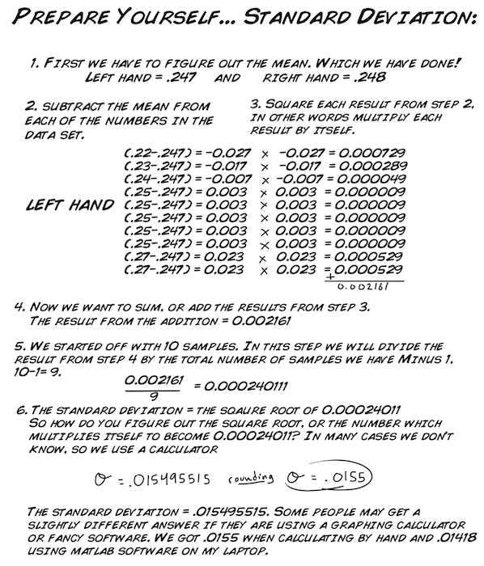](.img/BYB_exp4_pic9_sigma.png)

These are interesting results.

* If you look at the means, there is not much of a difference. We can infer that a majority of the data in both sets centers on_ .247 and .248. 
* The minimum and maximum values for both sets are fairly the same as well. This means that right handers' fastest and slowest reaction time was nearly the same. 
* The standard deviation is slightly different for both sets. The standard deviation for the right, dominant, hand is a little bit larger (.193 seconds) vs the left hand (0.0155 seconds). This shows that the data spreads slightly further from the mean for the right, dominant hand than for the left hand. Or, the right hand is more "variable." 

We solved these values for the first hypothesis data set, and you can
calculate for the second data set.

Now, if we want to make any sort of inference on the population of right
handed and left handed people and their reaction times, we must graph our data
and run statistical tests. We will now learn about probability distributions
before diving into statistical testing.

[ 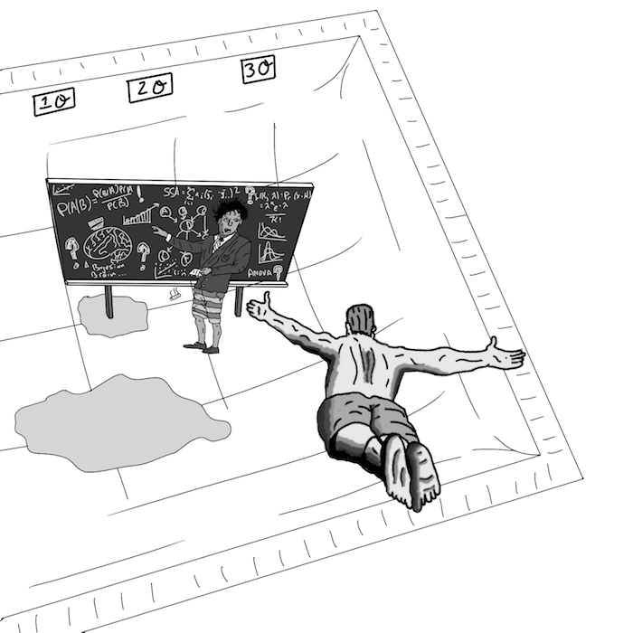](.img/BYB_exp4_pic14.png)

First, the data is graphed in the form of a "histogram". Density or (number of
occurrences) is the y-axis. The x-axis is the range of values recorded from
the experiment. The curve along the graph is the "normal distribution curve",
which is a _type of probability distribution_. What is a probability
distribution? It is an equation or a table of values that connects the
recorded outcomes (in our case, reaction time) with its probability of
occurrence. Here are the histograms for right-handed people. You can make you
own histograms for left-handed people using Excel or any other type of
graphing program. Ask your teacher or neighborhood scientist for help if you
do not know how to do this.

[ 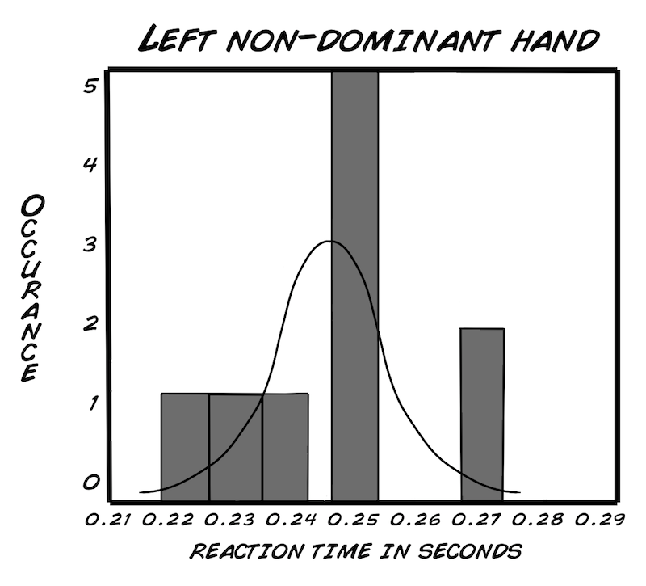](.img/BYB_exp4_pic11_lefthand.png)

[ 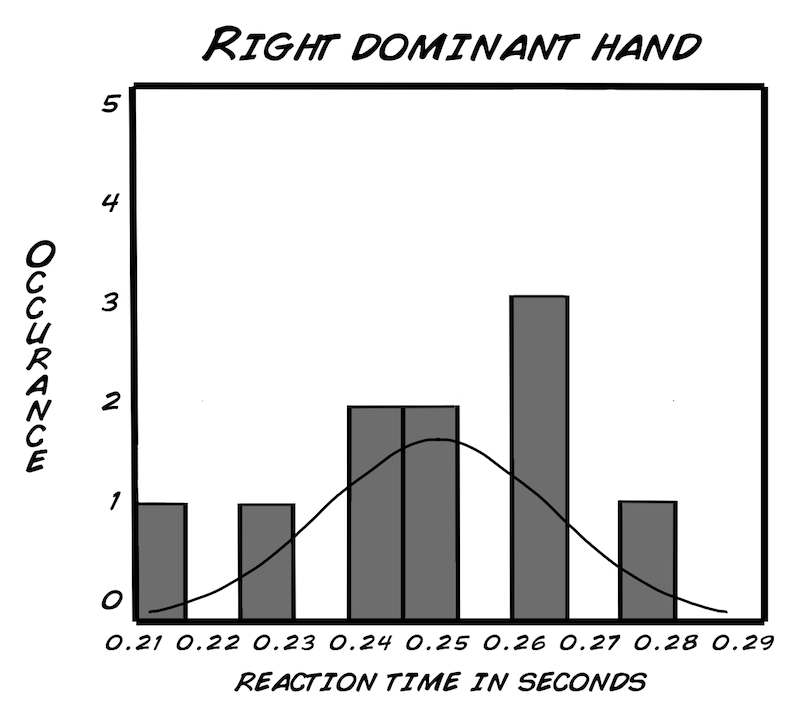](.img/BYB_exp4_pic11_righthand.png)

There are many probability distribution curves in this world, but we use the
"normal" distribution, because it is the most common and probably indicative
of human reaction time. What does it mean to be normally distributed? It's a
mathematic model of "normal" spread. Here is the equation_

[ 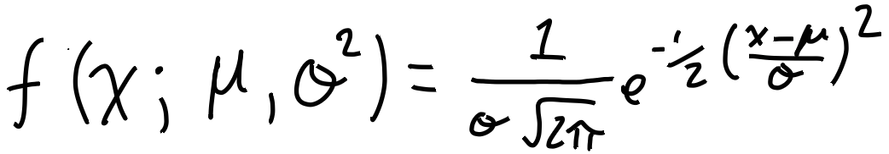](.img/BYB_exp4_pic13.png)

Don't worry if you don't understand it, but scientists have found that human's
heights, IQ, weight and so on are all normally distributed, so we make the
assumption that reaction times are normally distributed as well. We can look
at an example_ human height (combining men and women)

The distribution of heights is what makes the data "normal." Height centers
about a single mean and has a symmetrical distribution as you move away from
the mean. In a normal distribution_

* Approximately 68% of people fall within one standard deviation from the mean (between 5'2' and 5'11' tall) 
* Approximately 95% of people fall within two standard deviations from the mean (between 4'11 and 6'2 tall'). 
* Approximately 99.7% of people fall within three standard deviations mean (between 4'8 and 6'5 tall'). 

[ 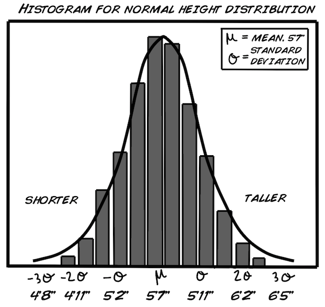](.img/BYB_exp4_pic12.png)

You might be thinking, "Our graphs do not look normally distributed at all!"
This is partially true, because we have such a small sample size. If we took
many more samples (perhaps 100), we expect we would eventually see a normal
distribution curve in our reaction time data like the one above for human
height.

Now how do we test if the two data groups (right handed subject's left hands
vs. their right hands) are different? We will be performing a T-test, or
"Student's T-test." The famous Dr. Student was a real statistician, but
"Student" was not his real name. The test's name is due to the unusual
circumstances from where it originated. William Gosset, a chemist working in
Ireland for the Guinness Beer Company, conceived the test in 1908 as a means
of quality control for the brewery's ingredients. He wanted to publish his
statistical test in a science journal, but Guinness would not allow him to use
his real name as they considered the analysis a trade secret. Nevertheless,
they did allow him to publish under a pen name. What Guinness did not know was
that the scientific community knew Gosset's pen name, Student, anyway! Now we
have better beer and better statistics.

[ 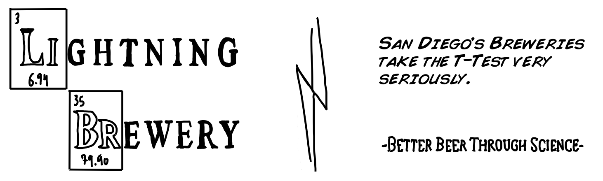](.img/BYB_exp4_piclightningbrew.png)

The T-test is powerful, because it allows us to make inferences from a small
sample size about the whole population. We will show you how to do a T-test
for the first hypothesis, but it will be up to you to perform the T-test for
the second hypothesis.

## The T-test and Analysis

Before we can begin to crunch some numbers, we must clearly define our null
and alternative hypothesis. You may be asking why we need two hypotheses for a
statistical test. In formal statistics, we always compare two hypotheses, the
null and alternative.

* The null hypotheses_ There is no difference in reaction times between left and right hands.
* The alternative hypothesis_ Rights hands have a faster mean reaction time than left hands.

Now, we need to decide if we want to complete a one or two-tailed t-test. For
this test, we will be using the one-tail. This is because we are only
concerned with testing if the right hand is faster than the left hand, NOT if
it is either "faster" OR "slower". Stated differently, if we did not care
which sample was faster, and we just wanted to see if the two samples did not
have the same mean, we would use a two-tailed test.

[ 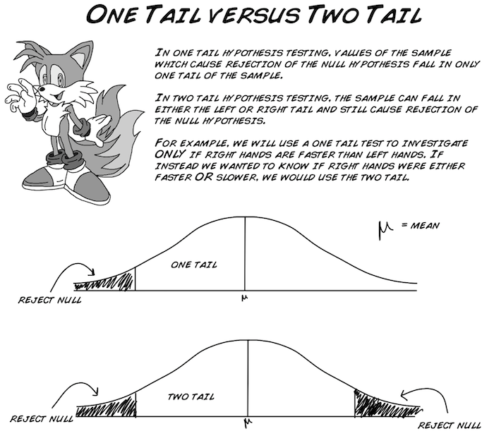](.img/BYB_exp4_pictails.png)

Lastly, we need to set the "alpha value" which can be viewed as a "threshold
for acceptance." Common values are .05, .01, and .001. With an alpha value of
.05, there is a 95% chance your results are correct. With a value of .01,
there is a 99% chance your results are correct, and so on. . . You can never
have an alpha value of zero, because you can never be 100% confident of
anything in statistics (this is not a joke).

The alpha value is more commonly called a "p-value". With a t-test, you
calculate a "t-statistic", and compare it with a known "t-value" on a look-up
table associated with the p-value you set. If your "t-statistic" is greater
than the "t-value" you look up, then you can reject the null hypothesis and
state that right hands are faster than left hands! Confusing? Don't worry, we
will go over this process again below, it's difficult for everyone learning
it.

Now, let's gather all the data we have on our two samples. If you recall, from
the "Raw Data, Graphs & Distributions" section above, we found the following_
min, max, mode, mean, standard deviation, and Median. For the t-test, we need
the mean, standard deviation, and a couple more numbers, which we will
calculate below.

#### Step 1_ Find the "pooled variance", or Sp^2.

[ 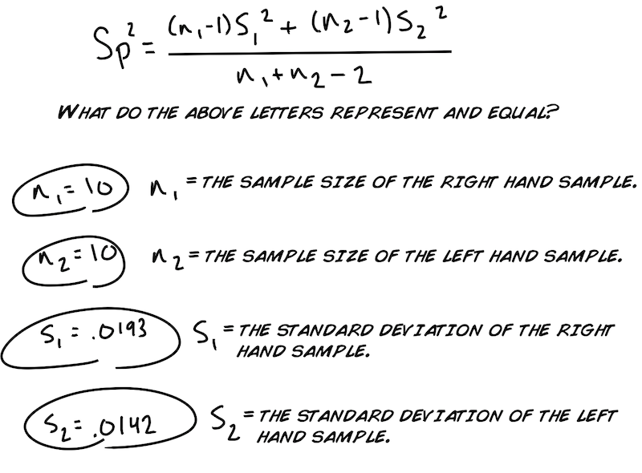](.img/BYB_exp4_pic15_ttest1.png)

* Note how the subscript "1" represents the data for the right-hand sample and the subscript "2" represents the data for the left-hand sample. This annotation [replicaimitation](https://www.replicaimitation.com/blog/) will stay consistent during our calculations. 

Next let's substitute the letters in the equation above with our numerical
values.

[ 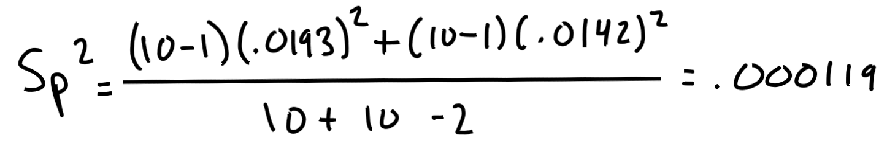](.img/BYB_exp4_pic15_ttest2.png)

#### Step 2_ Calculate your t-statistic.

Now that we have pooled variance, Sp^2= .000119, we use it to calculate the
t-statistic_

[https://backyardbrains.com](https://backyardbrains.com/products/css/index.html)

[ 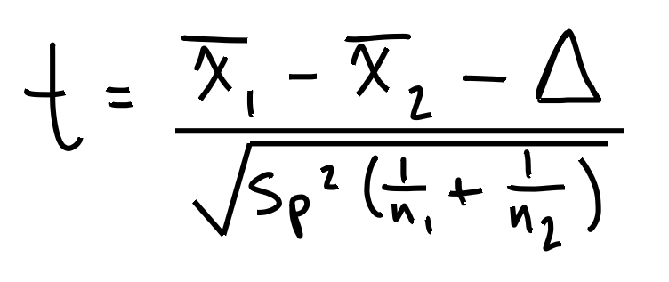](.img/BYB_exp4_pic15_ttest3.png)

Again, what do these letters and symbols mean? We know_ Sp^2, n1, and n2. But
what about the rest?

[ 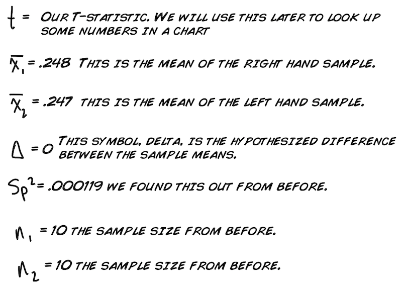](.img/BYB_exp4_pic15_ttest4.png)

Note, delta, is equal to zero. Why would the hypothesized difference between
sample means be zero? HINT_ Refer back to the Null hypothesis.

We are now ready to substitute! Plug in all the numerical values.

[ 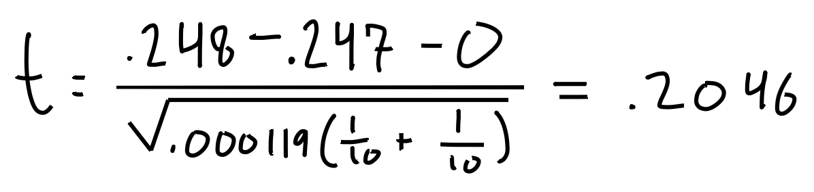](.img/BYB_exp4_pic15_ttest5.png)

Our t-statistic, t, is .2046

#### Step 3_ Compare your t-statistic against the t-value chart

We compare our t-statistic against the standard t-value chart, and you can
look it up in the back of a statistics textbook or here_ [t-value
chart](https://www.stattools.net/tTest_Tab.php). For this we also need our
"degrees of freedom", our df, which is the number of independent pieces of
information that are FREE to vary.

[ 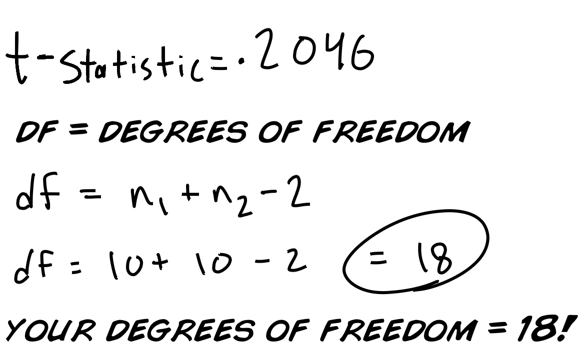](.img/BYB_exp4_pic15_ttest6.png)

One way to think about it is with sports. Let's say you are the coach and your
team consists of 11 players and the game you are playing has 11 positions. You
assign the best player to each respective position. How many choices do you
have to make? _Not 11, but 10 choices_. Once you assign player 10, by default
your last player fills the eleventh position. Thus, you had 10 choices, or 10
degrees of freedom.

Go to your t-value chart and identify the row with a df of 18. You may be
asking how the heck this large table of seemingly random numbers was
generated. That's a good question, and it is answered best by integral
calculus for the "probability distribution" we spoke about above and which you
will learn about when you major in Statistics in college...

[ 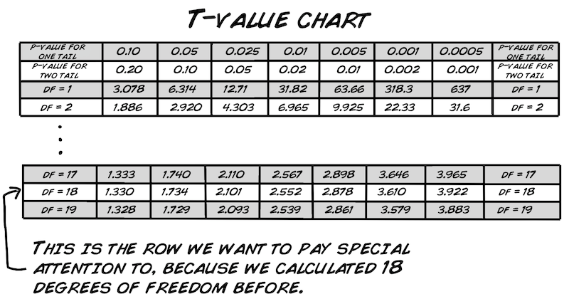](.img/BYB_exp4_pic15_ttest7.png)

Look up your p-value, which we decided would be 0.05 using a one-tail test.
Match this up with the df=18, and you get a t-value of 1.734. As our
calculated t-value, 0.2046, is LESS than 1.734, we CANNOT reject the null
hypothesis. What if we use a less stringent p-value, say 0.10?

[ 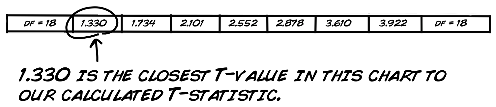](.img/BYB_exp4_pic15_ttest8.png)

At a p-value of 0.10, or 90% confidence, our t-statistic of 0.2046 is still
less than the value of 1.330, so we still can't reject our null hypothesis,
and ...

We cannot state that right hands are faster then left hands in right handed
people.

So, we found no evidence that you are faster with your right hand over your
left hand if you are right-handed. Now let's take a look at our second
hypothesis_

##### Are left-handed people faster with their left hand than right-handed
people are with their right hand?

By "let's" we really mean "you." Now it's your turn, and you can run a T-test
and calculate the values yourself, but we will give you the answer. You should
have calculated a t-statistic of 2.7187, which at a p-value of 0.05 and
degrees of freedom = 18, is greater than the t-value of 1.734! So, at 95%
confidence, we can state_

##### Left-handed people are faster than right-handed people are.

Cool! Now that we have some results, let's discuss them. This is the part of
science that leads to more questions. If left-handed people have faster
reaction times, perhaps they are smarter too! Maybe we can run some IQ tests!
Maybe we can measure the diameter of their nerves somehow, and see if they
have faster conduction velocity!

Note that the first hypothesis, in which we didn't find any difference between
the left and right hand in right-handed people, is more difficult to discuss.
Perhaps there is a difference, but we did not have enough sample size to
detect it (this is called a type II error, or "false negative"). In science,
it is much harder to prove an "absence of something" than a "presence of
something". Alternatively, as alien hunters like to say_ "absence of evidence
does not mean evidence of absence."

[ 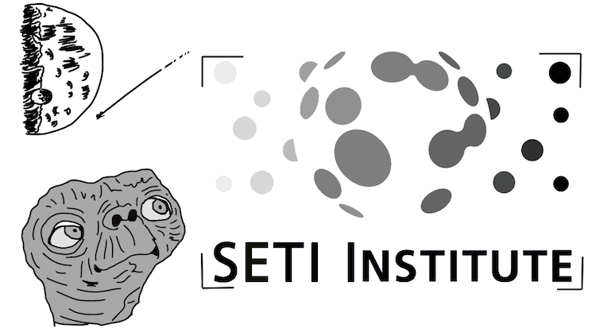](.img/BYB_exp4_pic16.png)

## Questions to Consider

  1. In our experimental group we used volunteers instead of a random sampling for 10 subjects. How does seeking random subjects differ from asking for volunteers to step forward? Does this bias the data at all? Does this choice in data acquisition strengthen, weaken, or have no affect on our final inference? 
  2. Do you ever think a study is done? What does the 95% confidence (alpha value =0.05) mean for extracting the "truth"? 
  3. Do you notice anything strange about the distribution graphs from our collected data? 
  4. We only compared right-handed people's reaction time with respect to their right and left hand. What would you expect to see with left-handed people regarding their left and right hands? You can do that analysis yourself! 
