## Experiment:Exploring Rates of Fatigue

---
id: "experiment__exploring_rates_of_fatigue"
title: "Experiment: Exploring Rates of Fatigue"
slug: "/retired/experiments/rateoffatigue"
---

Now that you've learned a bit about [how your muscles
fatigue](fatigue), let's quantify it to
further your learning in a competitive way!

**Time:**  30 Minutes

**Difficulty:**   Intermediate

#### What will you learn?

In this experiment, you will learn about and compare the rate of muscle
fatigue between different people and muscle groups. You will also learn how to
make a mathematical model of fatigue.

##### Prerequisite Labs

* [EMGs during Muscle Fatigue](fatigue) - You should read our first fatigue experiment to learn about how to use the Muscle SpikerBox and muscle physiology.

##### Equipment

* [Muscle SpikerBox](https://backyardbrains.com/products/muscleSpikerboxBundle)

## Background

From our [previous experiments](fatigue) we learned a bit
about why muscles fatigue and how to view this process in real time using the
Muscle SpikerBox. That was the beginning. Now we will explore variation in
_the rate_ in which people's muscles fatigue and model it. Any good scientist
should learn how to quantify their experiments, and that's what we do here.
Age, gender, body-type, and lifestyle all play important roles in how your
body's muscles have developed and, subsequently, how much effort they can
exert before fatiguing.

Before diving into the experiment, let's learn a bit more about different
kinds of muscle fatigue that you may encounter in life and science!

#### Central Fatigue

You can think of Central Fatigue as "mental" fatigue, also called CNS-fatigue
(Central Nervous System). This type of fatigue is associated primarily with a
reduction in neural drive or motivation. Giving up on a movement could be a
protective measure that the body employs to avoid sustaining any damage that
could occur if you continued that sustained intensity. Central fatigue is
something that can be largely "trained away," and it affects novice athletes
who are performing activities they do not have a lot of experience with.
Distance running is an example of how central fatigue can differentiate a
novice from a professional_ a novice, who is not used to exertion for an
extended period of time, is going to have a very difficult time running any
significant distance. Without previous training, the novice will likely stop
well before their muscles would have given out. Have you ever thought to
yourself, "I could probably run much further, but I just don't waaannnnaaa?"
An olympic distance runner, however, does not meet that same "mental" block
and will continue to run through the discomfort.

[
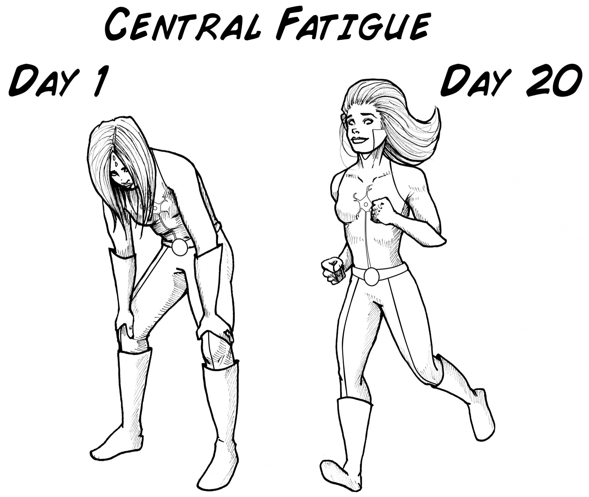](./img/Central_Fatigue_web.jpg)

#### Peripheral Fatigue

This is the most purely muscle physiology variation of fatigue. Peripheral
fatigue occurs when you simply cannot supply enough energy to the muscles to
keep them active. If you remember back to the [previous
experiment](fatigue) where we learned
about "orderly recruitment," a motor unit experiencing fatigue is replaced by
a new motor unit. Eventually there are no fresh motor units available, and
this is peripheral fatigue. When examining an electromyogram (EMG) recording
of this fatigue, it is common to see a decreasing trend in EMG amplitude, but
with bursts of renewed intensity at points within the recording. These are the
moments when other motor units are jumping in to attempt to maintain the same
amount of intensity. This fatigue is what you most commonly experience when
you're pumping iron at the gym, loading logs onto your truck, or other short
bursts of intense exercise.

[
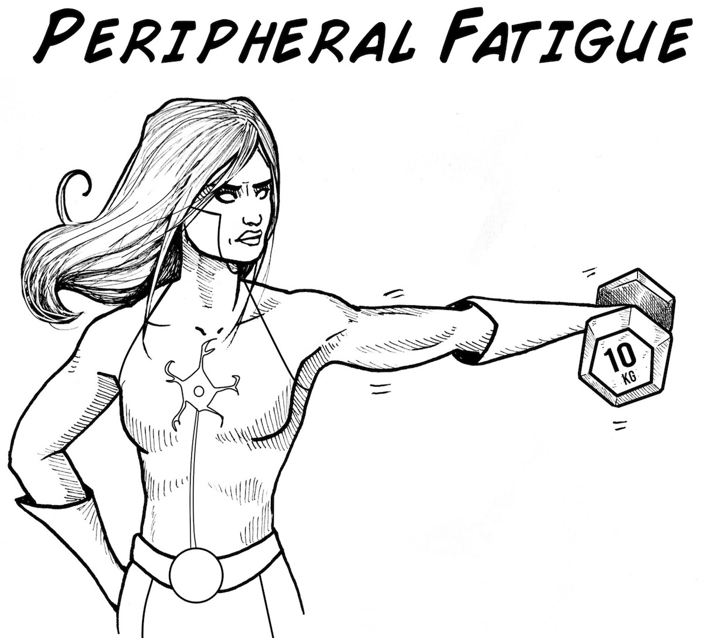](./img/Peripheral_Fatigue_web.jpg)

#### Neuromuscular Fatigue

Also called nervous fatigue, this is a much less frequently observed fatigue
that is a result of nerves being unable to fire enough to maintain a muscular
movement. If a nerve cannot maintain a high intensity spiking signal,
secreting neurotransmitters constantly, it experiences "synaptic fatigue,"
where the nerve is no longer able to stimulate the muscle fibers it
innervates. With exercise, this is only an issue at extreme levels of muscular
activation and intensity. Similarly to Central Fatigue, Neuromuscular Fatigue
can be addressed with adequate training over time. What makes this fatigue
different is that it can also be a symptom of disease.

[
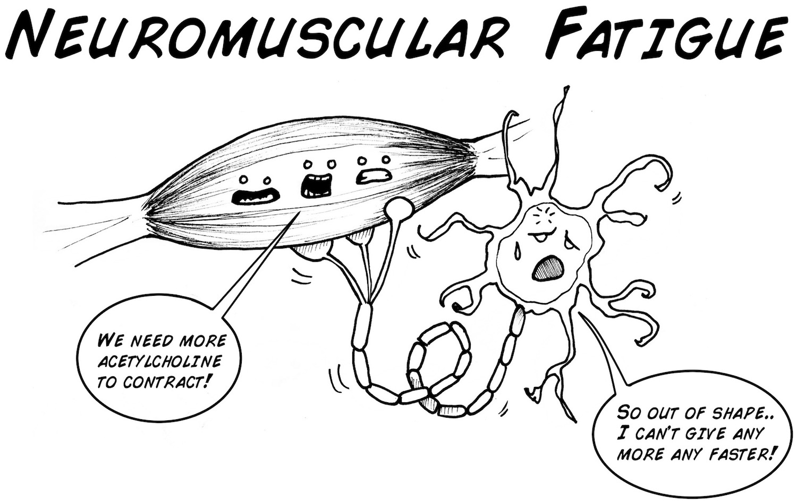](./img/NeuroMuscular_Fatigue_web.jpg)

## Data being Measured

In this experiment we will be observing primarily peripheral and a bit of
central fatigue, but we will not likely be observing neuromuscular fatigue.
Take notes during your experiments and try to figure out what kind of fatigue
you are witnessing!

#### The Slope, The Y-Intercept, the Trend Line, and the Rate of Fatigue

Trend lines are used to investigate relationships between variables. By
solving an equation for slope, we can build a trend line, which will give us a
"model" of our muscular fatigue over time. But what are we measuring? What is
our x-axis, what is our y-axis? HWe will get there, hold on.

Since we are interested in fatigue, which can be thought of as muscular
performance over _time_ , we will have the x-axis be precisely that -- time.
And our y-axis? Why, it will be the amplitude of our EMG! which is a good
corollary for the amount of force we are generating. But, we are going to do
an operation on the amplitude of the signal. Instead of using strict
amplitude, we will use the RMS (root mean squared) which is a conversion of
the amplitude. We will then measure the RMS over time.

#### Root Mean Square (RMS)

Let's take a quick look at RMS before we go any further, just so we understand
what we're working with. RMS is not a measure of _peak_ signal strength,
rather it is a measure of _general_ signal strength, which is calculated by
squaring the signal, taking an average of the sum of squares, and then taking
the square root. Seems mathematically excessive and unnecessary, so why do
scientists even do this?

First, it's important to remember that our signal has positive and negative
values, like this_

[ 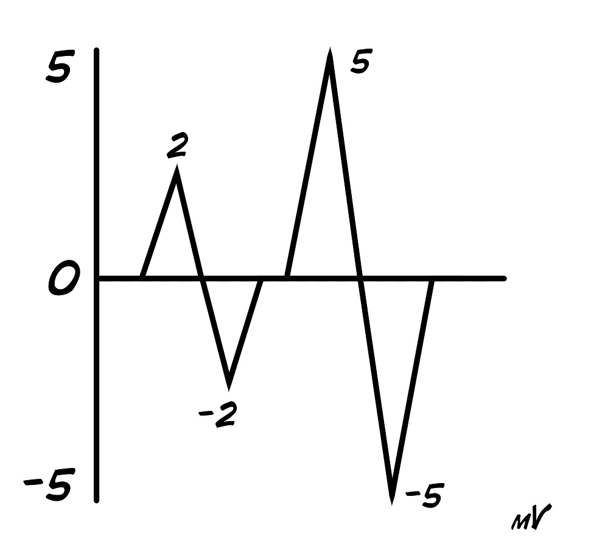](https://backyardbrains.com/experiments/img/RMS1.jpg)

So if we were to try to take an average of this signal, we wouldn't end up
with much...

[ 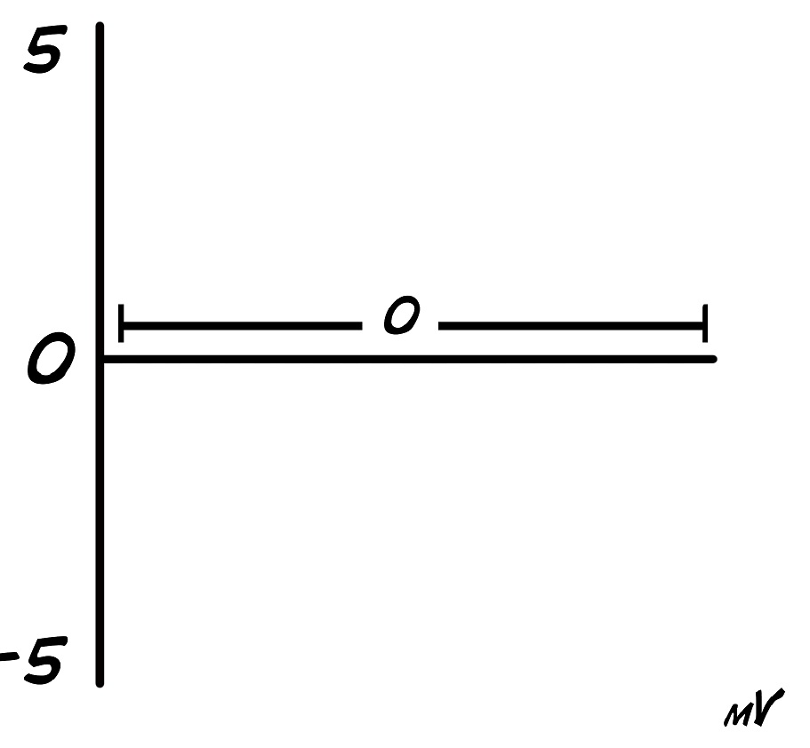](https://backyardbrains.com/experiments/img/RMS2.jpg)

Remember from math class, how can you get rid of a negative? By squaring it!
So let's try that with our signal_

[ 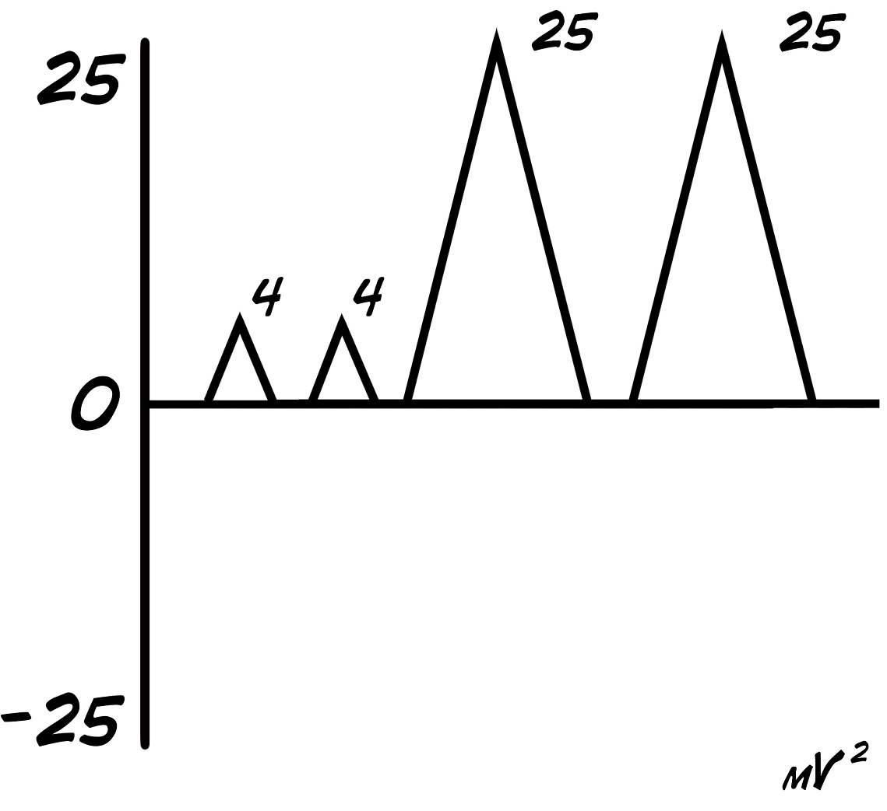](https://backyardbrains.com/experiments/img/RMS3.jpg)

That covers the square, but what about Root and Mean? Root and mean go hand in
hand together here. Now we take the "sum of the squares" of the signal and
divide it by the number of samples we took to get our mean (or average) value.
Then you take the square root of your mean value to come up with the RMS!

[ 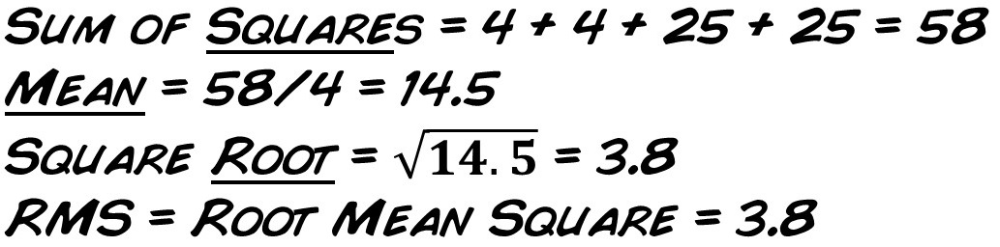](https://backyardbrains.com/experiments/img/RMS4.jpg)

### But What to Test?

The first step of our experiment will be choosing your independent variable.
For this experiment, you may be interested in comparing young versus old
subjects, boys versus girls, or maybe you want to compare people who have a
high-weight max bench press versus a low-weight max. For our example, we will
be measuring the difference between three men and three women, all within a
few years of the same age.

#### Downloads

> Before you begin, make sure you have the [Backyard Brains Spike
> Recorder](https://backyardbrains.com/products/spikerecorder) installed on
> your computer/smartphone/tablet. The Backyard Brains Spike Recorder program
> allows you to visualize and save the data on your computer when doing
> experiments. We have also built a simple lab handout to help you tabulate
> your data.
>
> [Spike Recorder Computer
> Software](https://backyardbrains.com/products/spikerecorder)
>
> [Class
> Handout](./files/Fatigue_HandOut.pdf)

## Video

## Experimental Procedure

Before you hook up a subject you have a couple of decisions to make_ What
muscle are you going to record from and what kind of activity are you going to
have the subject perform? We prefer "isometric" contractions, where you are
contracting but the body is not moving. Our favorites are the bicep lift
(which uses the ...[biceps](https://en.wikipedia.org/wiki/Biceps)), the
deltoid lift (which uses the ...deltoid), and the lateral row (which uses the
[latissimus dorsi](https://en.wikipedia.org/wiki/Latissimus_dorsi_muscle)).
The lateral row may require a visit to your school gymnasium, which is a good
excuse to get your pump on after you do your experiments. Decide which muscles
you want to record from and apply the muscle electrodes in the usual manner.

[
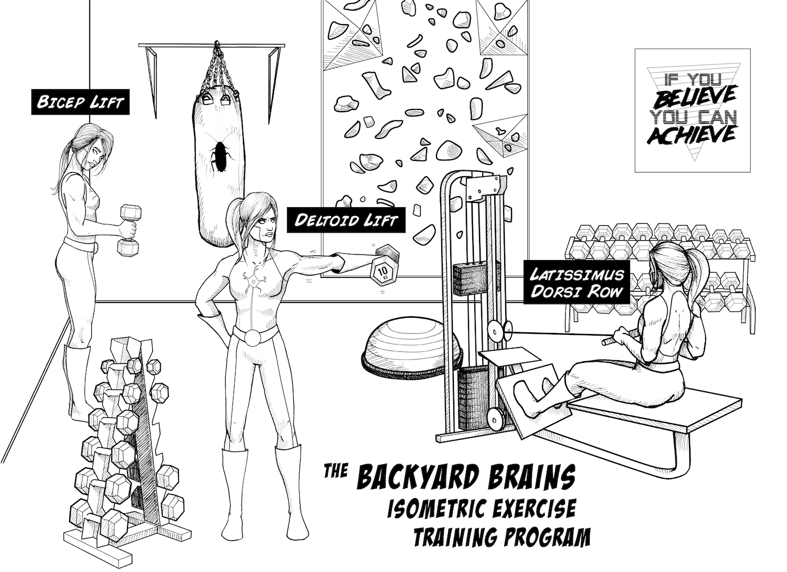](https://backyardbrains.com/experiments/img/groupexercise_web.jpg)

  1. First, connect your subject to the Muscle SpikerBox and your Muscle Spikerbox to 1) your computer using a USB or laptop cable or 2) to smartphone/tablet using the green smartphone cable. Begin by testing your signal_ have your subject flex a few times and watch your display to see the spikes. 
  2. Next, we want to adjust the gain. Turn the wheel on your Muscle SpikerBox all the way up, then have your subject flex as hard as they can. If the signal is clipping, like this_ 

[
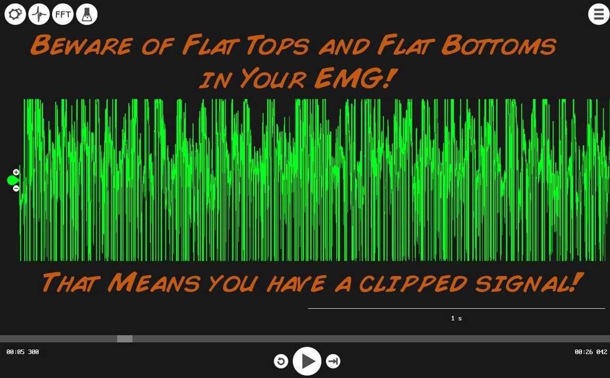](https://backyardbrains.com/experiments/img/Clipped_Signal.jpg)

  3. Turn down the "volume" wheel (gain of the signal) until you can see the tops and bottoms of all the spikes. Once you can, have your subject relax a couple of minutes. Note, this is only an issue if you have our normal [Muscle SpikerBox](https://backyardbrains.com/products/muscleSpikerboxBundle). If you have our new [Muscle SpikerBox Pro](https://backyardbrains.com/products/musclespikerboxpro), you do not have to worry about gain clipping, the circuit won't let you! 
  4. Choose a weight load that the subject is comfortable maintaining between 15-120 seconds before load fatigue is too high. Instruct the subject to keep the muscle active for as long as they can, even as they feel themselves getting "weaker." 
  5. When the subject can no longer maintain the weight, stop the recording. Your recording may look something like this_ 

[
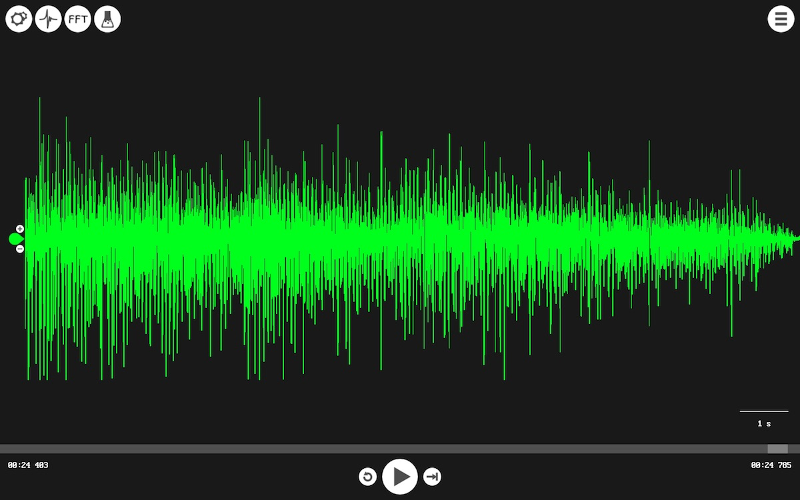](https://backyardbrains.com/experiments/img/MuscleFatigueExample.jpg)

  6. Write down the length of time the subject was contracting as shown by the EMG, and save the recording with identifiable notation, such as "Muscle Fatigue - Woman 1 - total time 118s." 

Perform this with as many subjects as you can. The more values, the more
compelling the results! If you are in a classroom, get everyone involved!
_Quick Note__ Do not change the gain while you are doing a recording, as this
will affect your RMS values and the measurement of fatigue rates.

### Aggregating the Data

Our first step in interpreting our data is to turn our recordings into
something quantifiable.

  1. Open up your first recording, zoom all the way out; we're going to be measuring the RMS from the first and last five seconds of the recording_ 
  2. With your right mouse button (or double tap on tablet), click and drag from the beginning of the signal until you have selected a five second sample. Look at the RMS value displayed on the screen and write it down. 
  3. Now repeat for the last five seconds of the signal, just before the subject relaxed. Write down the RMS value. 

[
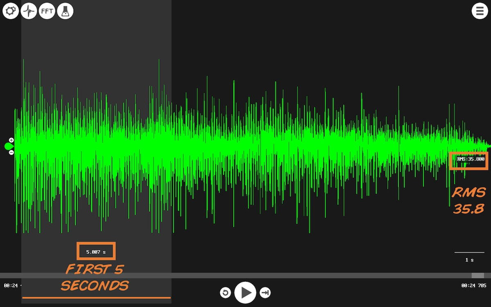](https://backyardbrains.com/experiments/img/First_Five_Seconds.jpg)

[
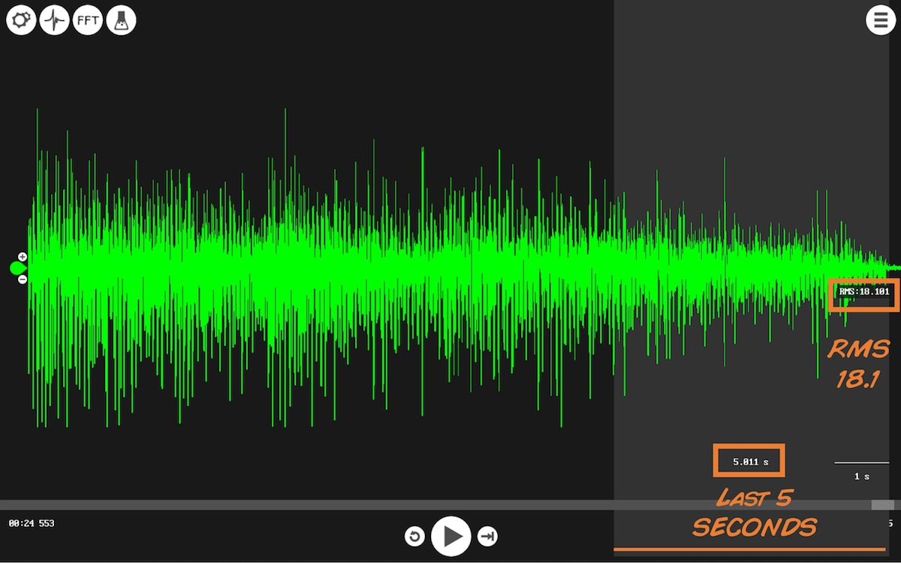](https://backyardbrains.com/experiments/img/Last_Five_Seconds.jpg)

For each recording you thus have three measurements 1) total time in seconds -
Total Time(s), 2) RMS of the first five seconds - RMS Begin, and 3) RMS of the
last five seconds - RMS End. Repeat the process until you have collected the
data for all your subjects.

### Interpreting the Data

**First, note_ Depending on which muscle you choose to record from, the
magnitude of your RMS value may vary! Larger muscles produce more activity,
generating a higher RMS. Let our values guide you, but don't be confused if
you follow the steps carefully and end up with different values than we do.**

Now that we've got our values, let's chart them out to make them easier to
manage.

[
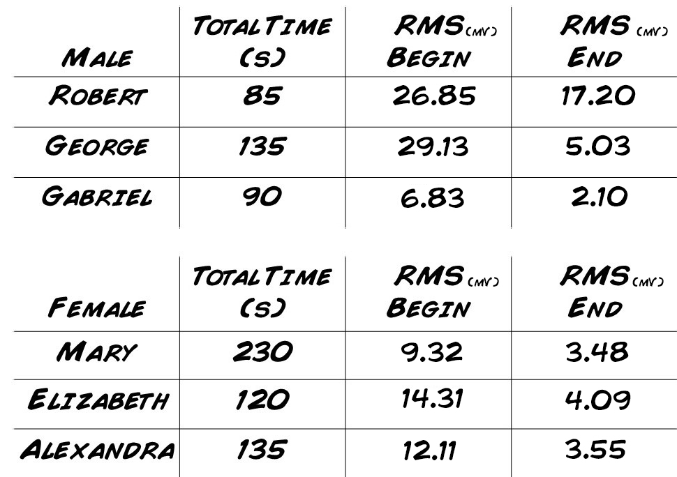](https://backyardbrains.com/experiments/img/mfchartfill.jpg)

Now, we have a couple of calculations to make using our values...

#### Equation for a Line (and our trend line!)_

[
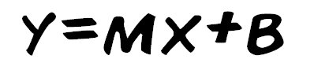](https://backyardbrains.com/experiments/img/mfline.png)

This is the formula for our trend line, where "m"" is equal to our slope (rate
of fatigue), and where "b" represents where the line would intersect with the
y-axis.

#### Slope_

[
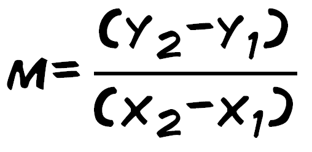](https://backyardbrains.com/experiments/img/mfslope.png)

"m" is the slope of our trend line that we're calculating for the fatigue
signal.

Now let us consider the case of Robert. His initial RMS value was 26.85 and
decreased to 17.20 over 85 seconds. Time is our x variable and RMS is our y
variable. We can solve for the rate of fatigue by plugging into the formula
for the slope above. Since our experiment started at time = 0, 0 will be the
second x variable.

[
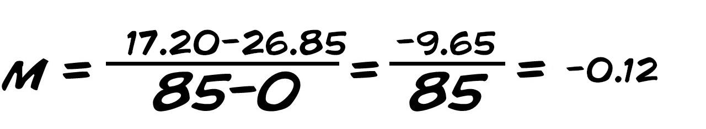](https://backyardbrains.com/experiments/img/Robert_Slope.jpg)

This is Robert's **rate of fatigue** and what we are principally concerned
with.

We can go full circle here and practice calculating the trend line, or line of
best fit. In our case it is easy, as we already know the b (y-intercept)
value, since have we have the RMS value for time = 0.

[
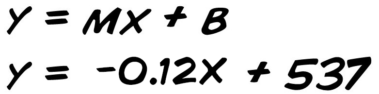](https://backyardbrains.com/experiments/img/Robert_equation.jpg)

This formula represents the trend line for the first test subject's EMG signal
during the fatigue test.

Now calculate the slope, or rate of fatigue, for all your subjects. What will
the data reveal?

[
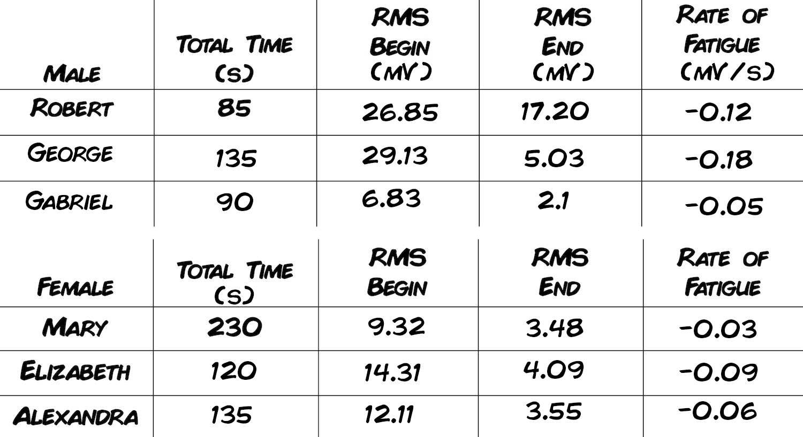](https://backyardbrains.com/experiments/img/Rate_Of_Fatigue.jpg)

### Discussion

Let's try to understand our results. Calculating the average rates of fatigue,
the women had an average rate -0.06 mV/s, and the men came in at -0.11 mV/s.
Our preliminary data thus suggests that women may have better muscle
endurance, fatiguing at a slower rate! Why would they be better at maintaining
their strength over a longer period of time? Are they stronger? not
necessarily, endurance isn't really about strength. Are they tougher?
Certainly. Are they just flat out better in terms of muscular endurance?
Maybe! Lots of research has been done into looking at this difference
([example](https://www.ncbi.nlm.nih.gov/pubmed/10643144)), and it has been
found (by us too!) that women's endurance is often greater than men's. Where
can we see this in a non-scientific setting though? Women's impressive
endurance gives them an edge in rock climbing - this is a sport where it is
common to see women in direct competition with men. Research is also being
done into [women's endurance
running](https://faculty.washington.edu/crowther/Misc/RBC/gender.shtml) and it
looks like men and women are on equal footing there as well!

### Your Turn!

Use this example to guide your own experiments! Think about different
variables you can test. You could also compare different muscles from the same
body; investigate whether people's arms or legs have different rates of
fatigue, or just compare left and right arms. You can compare people at a
neutral state, and then at a tired or excited state. What can you come up
with? If you design an experiment and come up with some cool results, email us
at [hello@backyardbrains.com](mailto:hello@backyardbrains.com)!

and, with your permission, we'll share it on our website! You can contribute
to the world's scientific knowledge!

### Questions to Consider

1. What can the slope of the trend line teach you about muscle fatigue? 
  2. Think of examples where you encounter muscle fatigue in your daily life. Does it ever serve as a beneficial function? 
  3. If you start hitting the gym, pumping iron, and getting fitter, what will happen to your rate of fatigue?