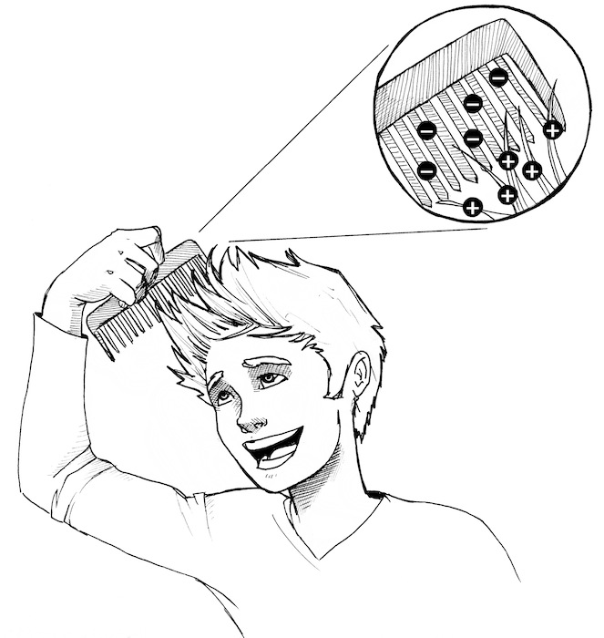
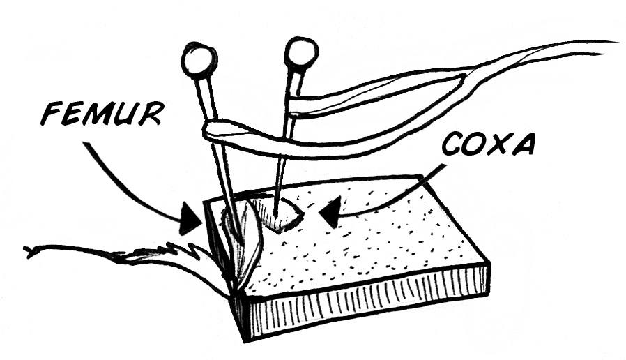
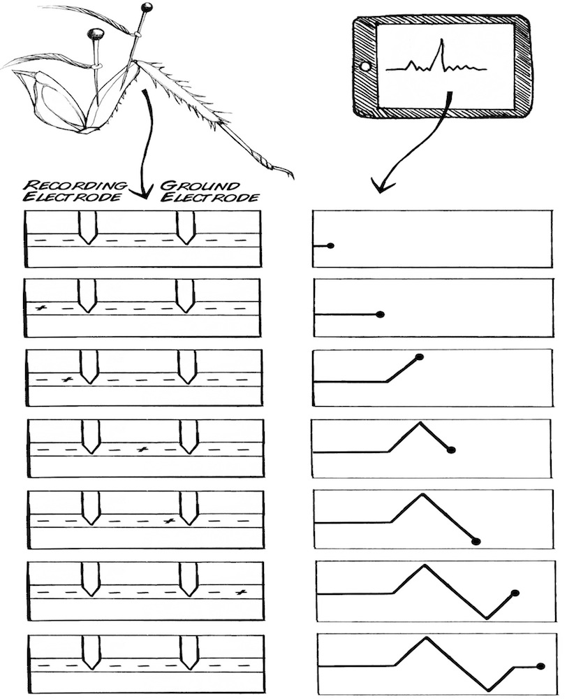
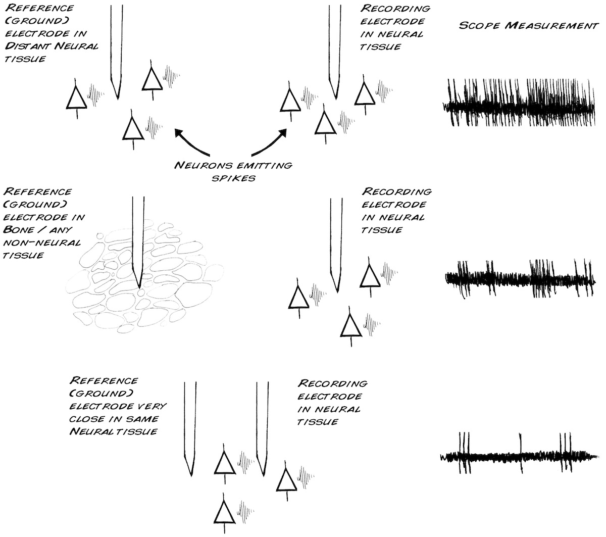
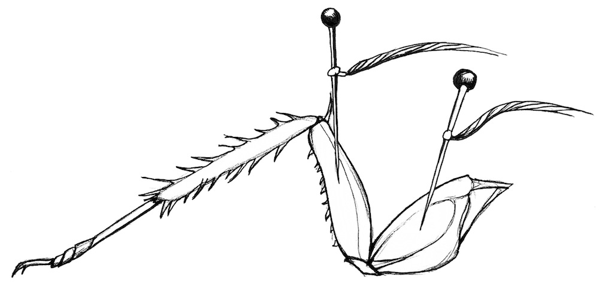
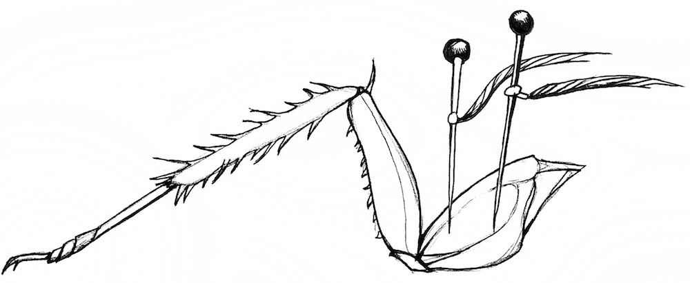

# Experiment: Referencing your Spikes

You might have asked: why do we need more than one electrode? Can't we simply
take a measurement with one electrode and get a reading to hear and see
spikes? In this experiment, we will help to explain why you need a reference
electrode.

**Time**  20 Minutes

**Difficulty**  Advanced

#### What will you learn?

You will learn what volts are, and what people mean when they ask: "What's the
voltage?" You will also learn what a reference electrode is and why we need
one to measure neural activity when using the SpikerBox.

##### Prerequisite Labs

  * [SpikerBox](spikerbox) - You should become familiar with how to use your SpikerBox

##### Equipment

* [SpikerBox](https://backyardbrains.com/products/spikerbox)
* [Cable: Laptop](https://backyardbrains.com/products/laptopcable)
* [Cable: Phone](https://backyardbrains.com/products/smartphonecable)
* [Cockroaches](https://backyardbrains.com/products/cockroaches)

## Background

In order to understand this experiment, one must first have an understanding
of volts (or voltage). Voltage is a measure of the electrical difference
between two points.

For example, you have ever combed your hair on a dry day and noticed your hair
begin to "float" towards your comb? This is because you have caused an
electrical difference between your comb and your hair.

When you comb your hair, the plastic comb "strips" electrons from your hair,
making a difference in charge, or "voltage," between your hair and the comb.
As a result, the separation in charge curiously makes your hair attracted to
the comb, while also making individual hair strands repel each other.

This difference in charge also means you can never just measure the voltage at
a single point. Any voltage value that you see will always be a relative
value, or, a value at one point (comb) as defined with respect to the value at
another point (hair). As another example, the nine volt battery which powers
your SpikerBox has a "nine volt" difference in voltage between the '+' and the
'-' ends.

Because voltage is a measure of the difference between two points, your
SpikeBox electrode cable has two needles instead of one; we are measuring the
voltage between the two electrode pins. In an ideal world, your two electrodes
have distinct identities, a "recording" electrode that captures the signal of
interest (spikes) and is hopefully near nerves, and a "ground" electrode that
ideally is in a part of the organism that has little electrical signal
present.

Why? Because you need a difference between the two electrodes to see your
spikes. Spikes (action potentials) are exceedingly small, on the order of
microvolts to millivolts, and must thus be amplified by devices like your
Spikerbox in order to be detected. Let's consider what happens when a spike
travels down a nerve, and we have our recording and ground electrodes on
opposite ends of the nerve. In the figure below, the spike is represented as a
'+' on a surface of all '-' within the nerve.

As the recording electrode encounters the spike, the result is an upward slash
on our voltage-measuring scope. Then, when the spike is in between both the
recording electrode and the ground electrode, there is no difference between
what each electrode "sees", and we measure a zero. As the spike then travels
past the ground electrode, the recording electrode now seems negative with
respect to ground, and there is a downward slash on the scope. Then, when the
spike travels further down the nerve away from the ground electrode, the
voltage reading returns to normal.

Now consider a thought experiment where we encounter a strange, alternative
world where action potentials travel infinitely fast down a nerve. Imagine we
try to record spikes from this nerve with the same electrode configuration as
above. If an action potential happens, and we are measuring the voltage
difference between the recording electrode and ground electrode, what do we
expect to see?

Since both the recording electrode and the ground will be at the same
electrical potential due to the infinitely fast action potential, we would
measure a zero value...which would leave us to hypothesize that this animal
does not have action potentials, and thus uses some new, unknown to science,
method of neural communication! This would be great for our careers if we were
correct, but unfortunately our conclusions would not be true. Our electrode
placement simply did not allow us to "see" the action potential.

Thus, since a voltage measurement is a measurement of the difference between
your recording and ground electrodes, you need to think carefully about where
you place your electrodes when recording neural signals. For example, consider
the following three conditions:

In the top condition (electrodes far away, but both in neural tissue), you are
recording a "very crowded" mix of spikes from six neurons (as you would see
the three neurons near the ground electrode and the three neurons near the
recording electrode). In the middle condition (ground electrode in bone,
recording electrode in neural tissue), your recording would be less "crowded",
as the ground electrode is in bone where no neurons are present. You would
only see spikes from the three neurons near the recording electrode. Now
consider the bottom condition. Notice there are two neurons exactly in between
the recording and the ground electrode. Both electrodes would see the exact
same signal from these two neurons; therefore you would not be able to observe
the middle neurons. You would, however, be able to record from the neuron on
the right side that is closer to the recording electrode. In this recording,
you would get a very clean view from only 1 neuron, something we
neuroscientists love. And why? We shall return to that later.

But for now, in this experiment, we will examine various configurations of
recording electrodes and ground electrodes.

## Procedure

Note: for this experiment we refer to "ground" and "recording" electrodes but
you can arbitrarily decide which of your electrodes you will call a recording
electrode and which one you will call a ground.

#### Materials

For this experiment you will need:

  1. A standard SpikerBox with cockroach leg prep 
  2. If you want to record your data, a patch cable or smart phone cable 

That's it!

#### Steps

  1. Set up your computer/mobile device for recording and prepare a cockroach leg as [previously learned](http://www.backyardbrains.com/experiments/spikerbox). 
  2. Put your recording electrode in the femur, and your ground (reference) electrode in the coxa as shown below. 

  3. Blow on the leg of your cockroach. Make note of whether the response is a broad "whoosh" of neural activity, or whether it is an individual spike train. 
  4. Carefully touch the barbs on the leg with a toothpick. Make note of whether the response is a "whoosh" or an individual spike train 
  5. Now move your ground electrode into the femur along with the recording electrode, as shown below. 

  6. Repeat steps 3-4 as above. 
  7. Finally, move both your ground and recording electrode into the coxa, as shown below. 

What do you notice? Can you provide an explanation for the difference? Here is
a [classic cockroach leg neuroanatomy
paper](http://www.backyardbrains.com/files/Nijenhuis_Dresden1954_cockroach_neuroanatomy.pdf)
from 1954 that can help.

## Discussion Questions

    1. What is voltage? When voltage is reported, is it an absolute number or is it a differential value? 
    2. In this experiment, you learned about what happens when you move your ground and recording electrodes to a new location. What do you think would happen if you simply reversed your 'ground' and 'recording' electrodes in the first configuration, moving the 'ground' to the femur and the 'recording electrode' to the coxa? 
    3. With one electrode in both the coxa and the femur, there is generally a lot of "background activity." How does that change when you put both electrodes into the femur? vs. both electrodes in the coxa?

## Video

Note: You can also do this experiment on crickets if you do not have access to
cockroaches. You can usually buy crickets at local pet stores. See video:
