## Experiment: Wirelessly Control a Cyborg Cockroach

Are you a teacher or parent that wants to teach a student about advanced
neurotechnologies? You are in luck! After 3 long years of R&D, the RoboRoach
is now ready for its grand release! We are excited to announce the world's
first commercially available cyborg! With our RoboRoach you can briefly
wirelessly control the left/right movement of a cockroach by microstimulation
of the antenna nerves. The RoboRoach is a great way to learn about neural
microstimulation, learning, and electronics!

**Time**  1.5 - 2 hours

**Difficulty**  Adult Supervision

#### What will you learn?

You will learn about the anatomy and nervous system of a cockroach. You will
also learn the proper surgery and husbandry techniques for experiments on
insects. After the surgery, you will then use your RoboRoach circuit to
briefly influence the cockroaches movements by microstimulation and you will
observe the subsequent adaptation of the cockroach in response to the
microstimulation.

##### Prerequisite Labs

* [SpikerBox](spikerbox) - You should become familiar with how to use a SpikerBox

##### Equipment

* [RoboRoach](https://backyardbrains.com/products/roboroach)
* [RoboRoach Surgery Kit](https://backyardbrains.com/products/roboroachSurgeryKit)
* [Cockroaches](https://backyardbrains.com/products/cockroaches)

## Background

_This experiment is appropriate for college students. Also, high schoolstudents with adult supervision._

The [RoboRoach](https://backyardbrains.com/products/roboroach) is an
educational DIY cockroach cyborg kit. It includes one PCB (printed circuit
board), a.k.a. “the backpack”, which carries the Bluetooth Low Energy wireless
receiver/transmitter (so you can communicate to it via a smartphone), a few
indicator LEDs (light-emitting diodes), and other circuit components
(resistors and capacitors). A small coin cell battery is also provided to
power the PCB’s components. Last but not least, the kit includes 3 sets of
electrodes to implant three adult cockroaches. One end of each electrode set
is a connector to plug in the RoboRoach backpack and the other end is a 0.003”
silver wire (smaller than the thickness of your hair) that serves as the
conductive electrical element that interfaces with the sensory nerves of the
cockroach. There are 3 electrodes in each set; one for the left antenna, one
for the right antenna and one for the ground. Since electricity needs a closed
circuit to flow, the ground wire is necessary to provide a return pathway for
the electrical stimulation current. The ground can go anywhere in the
cockroaches body, but we use the dorsal side of the thorax, near the flight
muscles (these cockroaches can’t fly), as a ground location of minimal damage
to the insect.

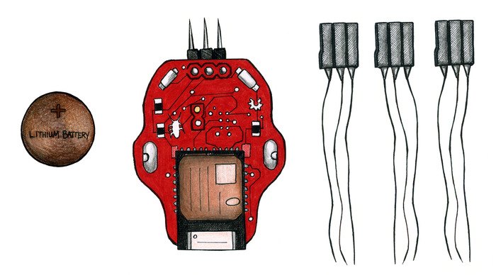

The word “cyborg” is an abbreviation of “cybernetic organism” and is defined
as a living organic being that has abiotic artificial parts. Coined in the
1960s by neuroscientist Manfred Clynes, it described the idea of a cyborg as a
"new frontier" that would be “a bridge...between mind and matter."(1) Since
then the rapid rate of technological growth has brought on all different types
and definitions of cyborgs. Direct neural interfaces like the ones you will
learn about with the RoboRoach experiment, have been being developed since the
early 1970s (2). This type of brain-computer interface, or BCI for short, has
been researched, developed, and utilized by scientists and doctors to learn
about our nervous systems and to help treat people who’ve lost critical
biological functions such as their sight, hearing and motion with
neuroprosthetics. Take for example the cochlear implant, which has been used
to return hearing to over 220,000(3) people worldwide.

By the way, we’re not the only ones who are creating cyborg invertebrates to
learn about the electrophysiology and assist in the development of
neurotechnologies. Starting in the late 90’s, two groups of researchers
(University of Tokyo(4) and the University of Michigan(5)) achieved
rudimentary control of cockroach turning. The American work was funded by
DARPA with the ultimate goal to have “hybrid robots” that would be able to do
disaster relief monitoring and reconnaissance, on the premise that insects are
more power efficient than tiny robots. The work was published in some small
trade journals, received some press, but went largely unnoticed.

More recently, a group at Cornell University(6) was able to identify different
signals to control the wings of a moth and scientists at University of
Arizona(7) have built a robot that is controlled by the nervous system of a
moth [[watch video](http://www.youtube.com/watch?v=dSCLBG9KeX4)]. Research at
Berkeley(8) has resulted in the control of the flight of a giant beetle
[[watch video](http://www.youtube.com/watch?v=hFguLwUT5lg)] and researchers at
North Carolina State University(9) are also experimenting with
microstimulation of cockroach sensory nerves to develop a “Kinetic-base System
for Autonomous Control of Terrestrial Insect Biobots” [[watch video](http://www.youtube.com/watch?v=jhuyDuV-ERQ)].

#### Wow! ...but why cockroaches?

Backyard Brains’ favorite invertebrate for the RoboRoach is of the kingdom
Animalia, phylum Anthropoda, class Insecta, order Blattodea, family
Blaberidae, genus Blaberus, and species Discoidalis. Since it’s full
biological classification is quite a mouth full we will call them Discoid
cockroaches. We found Discoids to be the best for the RoboRoach for several
reasons. First of all, they are readily available in the U.S. because people
breed them as feeder insects for pet reptiles and amphibians. Also, they are
easy to take care of and handle (they are much slower than the cockroaches
native to the U.S.). Last but not least, they are large enough to carry the
RoboRoach backpack.

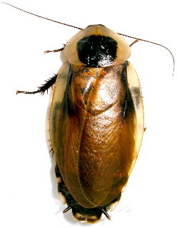 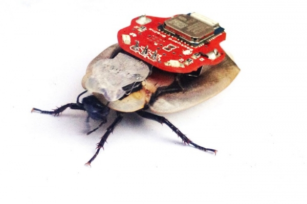

The stunning adult B. Discoidalis specimen, au naturel (left) and as a
RoboRoach (right).

Cockroaches have neurons similar to ours, but they have much fewer numbers of
them. Cockroaches have about 1 million neurons, while we have 100 billion!
This allows us humans to have cool human talents like speaking/understanding
languages and designing neural stimulation circuits. A cockroach also has a
decentralized nervous system, with ganglia (small brains) running down its
body. However, a cockroach does have a “bigger” ganglion in its head, which
can be considered a brain. Even though our nervous systems are very different
from a roach’s, the structure and function of our individual neurons is quite
similar and this allows us to learn about our brains by studying theirs.

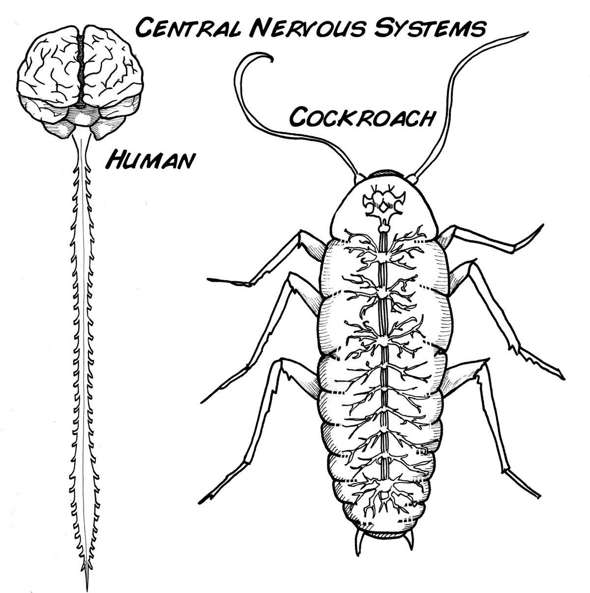

Unless you name is Gregor Samsa, your central nervous system looks like the
one on the left.

#### But how does it

work[?!](https://backyardbrains.com/files/ButHowDoesItWorkQ.wma)

Cockroaches have two antennae on their anterior end. These antennae assist to
guide the cockroaches through the world by sensing touch (as small as moving
air) and smell. These tiny “hair-like” sensors are connected directly to
neurons that communicate messages to the cockroach brain.

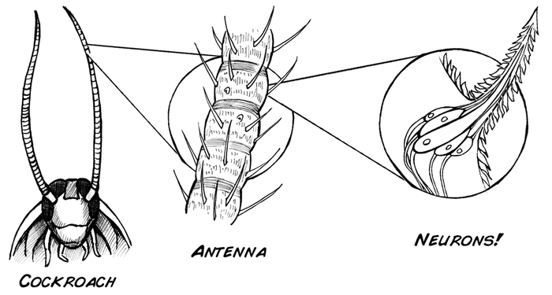

The neurons communicate just like ours by sending information down their
neural pathways in the form of electrical activity called action potentials,
or as we neuroscientists call them, “spikes”.

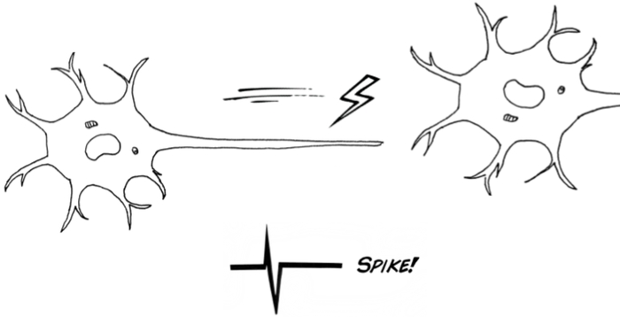

They also have two cerci located on their posterior end. These are sensors
similar to the antenna and also have specialized wind and vibro-auditory
sensory receptors that send “spikes” to the cockroach ganglia, which has been
honed by evolution, to very quickly initiate escape responses if they sense
approaching stimuli. This enables cockroaches to have very fast behavioral
responses and why cockroaches can dart away so quickly just when you open the
door.

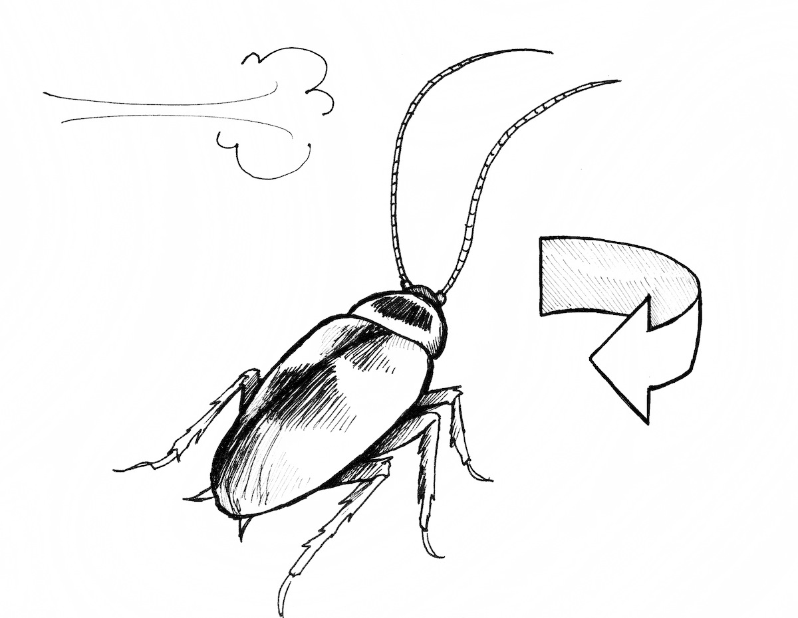

By implanting the tips of your tiny electrodes into the roach’s antennae, you
create a neural interface. Since the electrode wire is electrically
conductive, you can then send an electrical signal similar to the one that the
roach’s antennas’ sensory neurons naturally create. The result: the neurons in
the antennae will be stimulated to fire neuronal messages (spikes!).

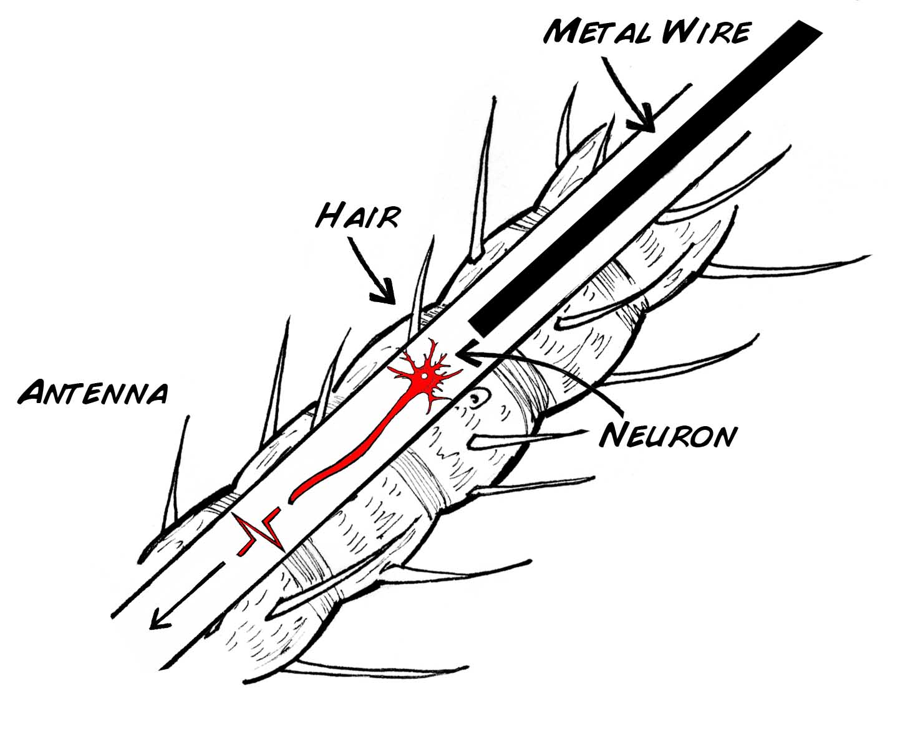

These “spikes” will then travel to the roach’s ganglia and stimulate the
natural sensio-motor reactions. This is how you can control your cockroach’s
movement. Basically stated: if we stimulate the neurons on the right antenna,
the cockroach will react by turning left. If we stimulate the neurons on the
left antenna, the cockroach will turn right.

The science of neural interfaces you will be studying today is very similar to
the cutting edge neural engineering going on in hospitals and universities
around the world. For example, you can try stimulating at 55 Hz, which is
roughly the same stimulation that neural engineers use when stimulating the
subthalamic nucleus as a treatment for Parkinson’s disease.

  
  

#### Print Materials

> If you're looking for a PDF to print and scribble on, or a google doc to
> edit, [check out this repository of print resources here!](https://drive.google.com/drive/folders/1bE1B0DvsGNauhyj-z8YjzuBXmFYivfkR?usp=sharing)

## Preparation for the RoboRoach Surgery

Are you ready to try your hand as a cockroach brain surgeon and make your very
own temporary cyborg?

The surgery itself takes about 30-45 minutes. An important aspect for a good
scientific surgery is proper preparation, thorough documentation, and
consideration of the well-being of the animal.. So, considering both set-up
and cleanup time, plan for at least an hour for the full operation. Anyone can
do the RoboRoach surgery, but like everything in life, it takes practice and
patience to master! That’s why your kit comes with 3 sets of electrode arrays,
enough for you to prepare 3 RoboRoaches to learn and improve from repeating
the experiment. Additional RoboRoach electrodes are available through our
[online store](https://backyardbrains.com/products/) or you can take the DIY
route and [build your own electrodes](https://backyardbrains.com/diy/roboroachelectrodes). We recommend
that you carefully read through this guided experiment entirely before you
start the surgery to prepare your human brain as well!

Also, we’d like to remind you that the RoboRoach is an educational tool to be
used with cockroaches to learn about neural interfaces. Please respect and
abide by your presiding government’s laws and regulations when it comes to
animal research. If you have ethical concerns or questions, please refer to
our [ethics guideline and discussion](https://backyardbrains.com/about/ethics)
.

#### What you'll need:

* The "RoboRoach Surgery Procedure" (below). This is also available as a(n):
    1. Downloadable [PDF](https://backyardbrains.com/files/RoboRoachExperiment-NeuralInterfaceSurgery.pdf).
    2. Instructional [video](https://www.youtube.com/watch?v=EsrorUT_Svc).
  * A printed ["RoboRoach Surgery Worksheet"](https://backyardbrains.com/files/RoboRoach Surgery Worksheet.pdf)
  * Your brain, some patience, and a deft hand
  * Approximately 1 hour of your time
  * [“RoboRoach Surgery Kit”](https://backyardbrains.com/products/roboRoachSurgeryKit)
    1. 150 grit sandpaper 
    2. Loctite Super Glue Gel Control (note: we’ve found this stuff works the best, other super glues may not substitute) 
    3. Cotton swabs
    4. Silly putty
    5. Small-diameter needle
    6. Toothpicks
    7. Dissection scissors
    8. Tweezers or forceps
    9. Magnifying glass (or upgrade and impress your friends with a [RoachScope](https://backyardbrains.com/products/smartscope))
    10. Low-temp hot glue gun & glue cylinders
    11. Popsicle stick
    12. Small amount of flour
  * Cup of ice water (you’ll want enough ice to keep the water very cold but enough water to be able to submerge the roach). Ice water is always 32 degrees fahrenheit, so long as there is still ice in the water.
  * Paper towels
  * Clock with minutes hand
  * Work lamp, don’t try this in the dark!
  * 1 RoboRoach electrode array
  * ...and of course: 1 large, healthy adult Discoid cockroach. **IMPORTANT** : Adults can be identified by a black dot on the pronotum (the exoskeleton "hood" over their head) and the presence of wings. They will no longer molt. Therefore, affixing a connector to its head permanently is fine. NOTE: if you glue an electrode connector to a juvenile cockroach (no wings), it will not be able to split its exoskeleton when molting and will die. Do not do this surgery on juvenile cockroaches. 

  
  

## Procedure

#### [Step 1](http://youtu.be/EsrorUT_Svc?t=3m54s): Prepare your workspace.

Choose your cockroach. Document!

Lay out all the necessary supplies and tools listed above. Plug in your hot
glue gun and if it has a temperature setting, set it to low. Fill in the
initial information on your Surgery Setup Record, page 1 of the [RoboRoach
Surgery Worksheet](https://backyardbrains.com/files/RoboRoach
Surgery Worksheet.pdf).

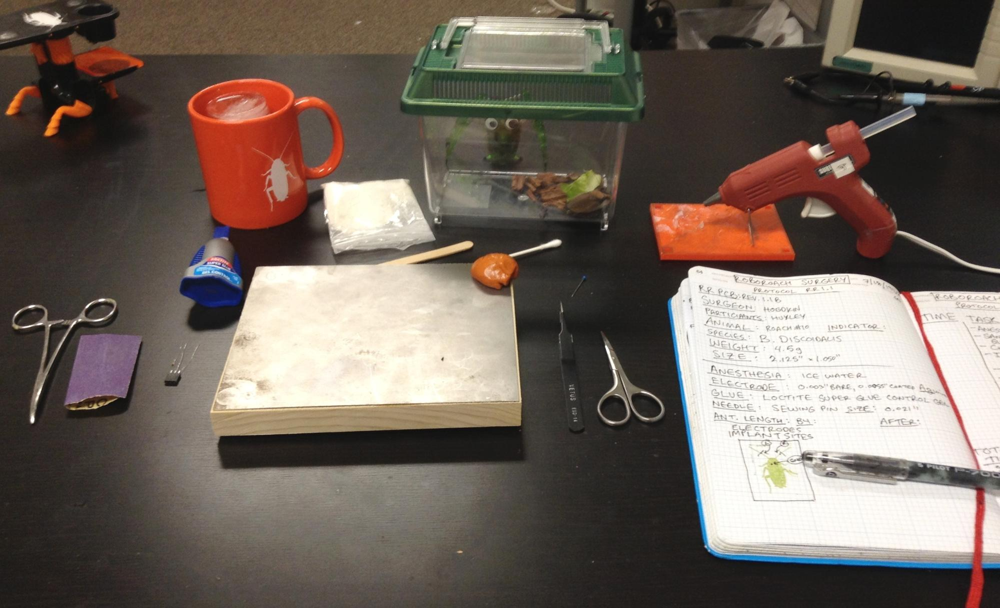

#### [Step 2](http://youtu.be/EsrorUT_Svc?t=5m2s): Attaching the electrode

array to the roach

2.1) Anesthetize your cockroach by submerging it in the ice water. Note the
start time on your Surgery Worksheet - Procedure Record. From now on, for ease
of reading we will not include a reminder at every step to update your
worksheet but you should promise to be a good scientist and document your
experiment!

Since the roach is a cold-blooded animal (ectothermic, not producing its own
heat through metabolism), reduction in temperature results in reduction of
nervous & metabolic function effectively “anesthetizing” the insect(10). It
typically takes 2-5 minutes for a cockroach to “go to sleep”, just watch for
the roach to stop moving and reacting to stimuli like a touch on its leg.

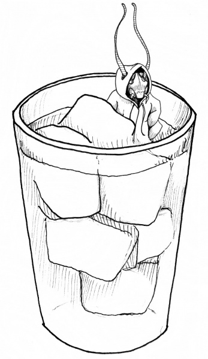

2.2) Once fully anesthetized, carefully remove the roach from ice water with
forceps and place the cockroach on your table. With sandpaper, lightly sand
the center of the pronotum to roughen the waxy chitin. Be careful not to push
too hard when sanding, you don’t want to hurt the roach! Hemostat forceps come
in handy here to grasp the pronotum (their exoskeleton “hood”). This is
similar to sanding your fingernails -- it’s a hard substance without nerves.

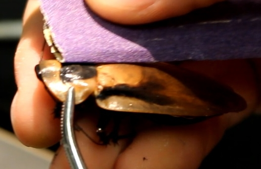

Sand until the pronotum feels “slightly rough” to the touch. This will allow
the super glue to stick securely.

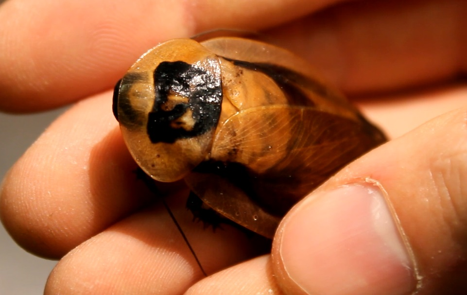

2.3) Wipe the pronotum with wet towel to remove debris from sanding, then
fully dry with paper towel. Put a dab of superglue on the sanded area. Be sure
not to touch the glue with your fingers, you want it to stick to the roach,
not to you!

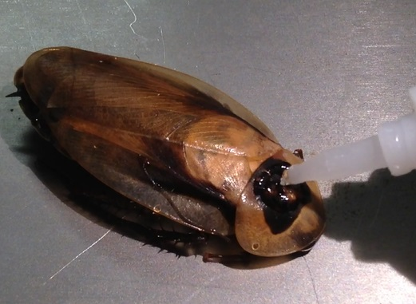

2.4) Carefully place the black connector on the glue with the electrodes
facing the anterior direction (towards the antennae). Be sure to orient it
squarely with the body, the pins should be parallel to the length of the body.
The connection should be strong in 1-2 minutes.

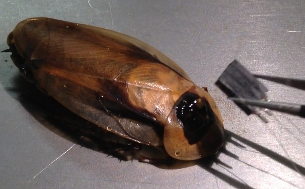 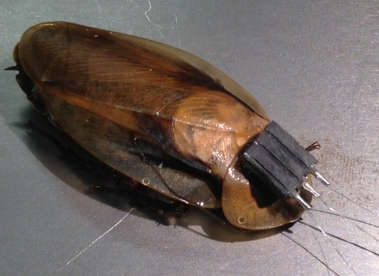

2.5) Place the roach back into the ice for 1-2 minutes to ensure it is
continually anesthetize (or until no response to stimuli is observed).

  
  

#### [Step 3](http://youtu.be/EsrorUT_Svc?t=7m13s): Implanting “Ground”

electrode in Thorax

3.1) Take the cockroach out of water, place on table belly down, and carefully
splay one wing to the side. Use silly putty to hold the wing down and
stabilize the roach. Use a cotton swab to dry thorax and then lightly sand
(because this is a glue step) the thorax.

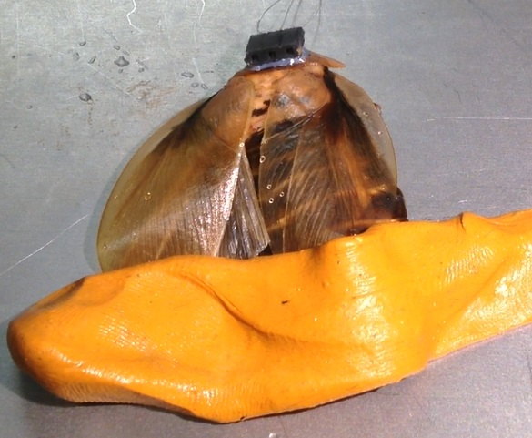

3.2) Use your needle and lightly poke a small hole on in the exoskeleton of
the thorax of the cockroach just behind the head. Avoid the center line as
that is where the esophagus is located.

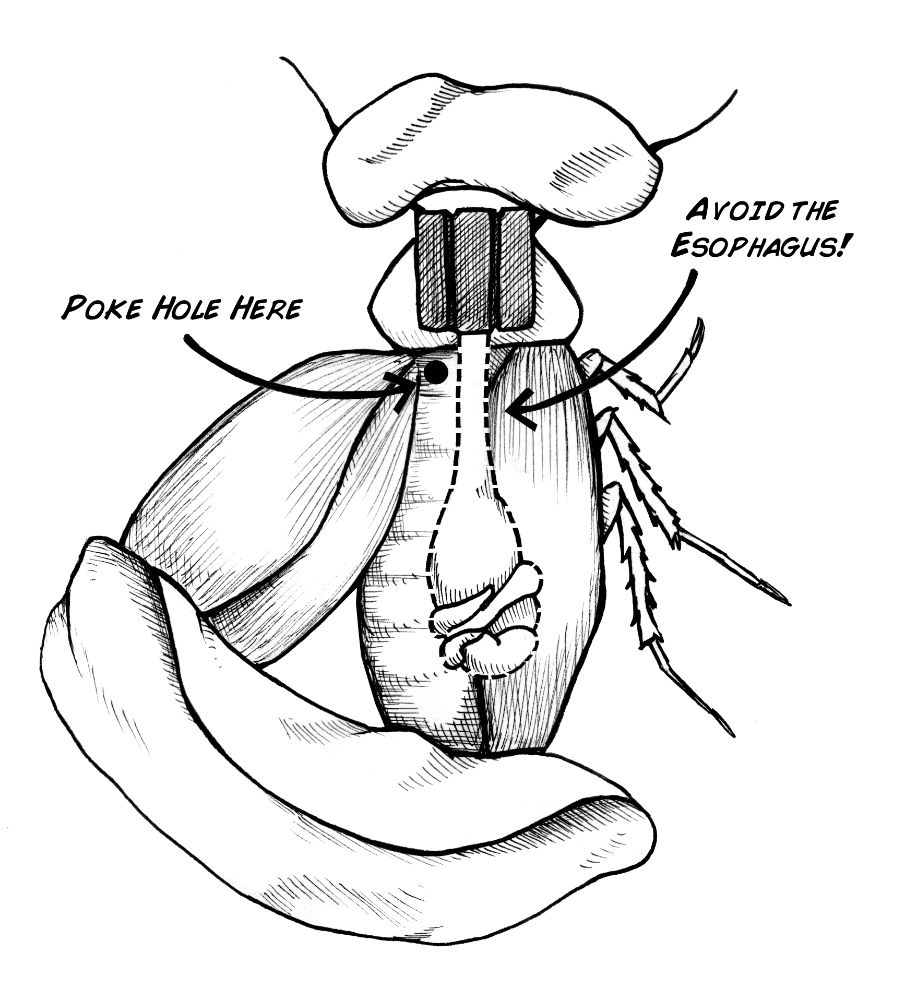

The flight muscles on the sides can tolerate a small poke (this species of
cockroach cannot fly anyway, so it does not use these muscles much). Use a
careful amount of force, enough to penetrate the hard chitin exoskeleton but
not too much that you push the pin in too deep. A helpful tip, sometimes you
can find a small marking on the roach’s exoskeleton (the back of the cockroach
has 5-8 small black “freckles” you can use as references for insertion
points). Make the hole here and it will be easier to locate when implanting
the electrode.

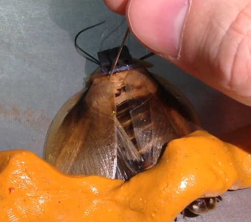

3.3) With fine forceps (or tweezers) carefully insert the center electrode 1mm
(0.039”) into the hole you just made. It helps to straighten the tip of the
electrode as much as possible before inserting.

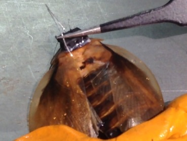

3.4) Using a toothpick apply a small bead of the super glue to the electrode
just above where it enters the tissue.

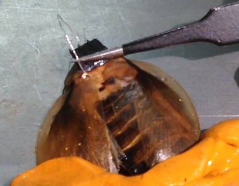

Then using forceps, carefully “park” the electrode 1-3 mm (0.039” - 0.118”)
into the insertion hole. The goal is for the superglue to enter the body,
because when it comes in contact with the internal saline, it will polymerize
quickly and securely. Super glue (cyanoacrylate) was actually used in the
Vietnam War as quick battlefield solution to closing wounds of soldiers.

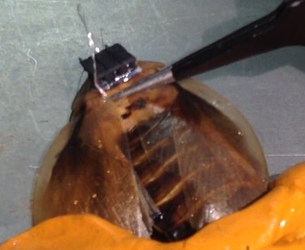

If you need to secure it further, add an extra small bead of super glue above
the insertion point, then replace the wing to it’s resting place. After the
glue has set, a light tug can test if the ground electrode is secure.

3.5) Place cockroach back in ice bath for 1-2 minutes to maintain
anesthetization.

#### [Step 4](http://youtu.be/EsrorUT_Svc?t=8m51s): Implanting right antenna

electrode

4.1) Take the cockroach out of the ice water and lay it dorsal side down (turn
it on its back). Then use forceps to carefully splay the antenna out and cut
the cockroach right antennae to ~1/8 – ¼ inch (~3 - 6 mm).

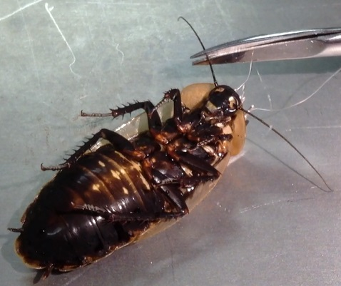

4.2) Taking the right electrode, “park” the electrode 1 mm (0.039”) inside the
right antenna (not all the way in).

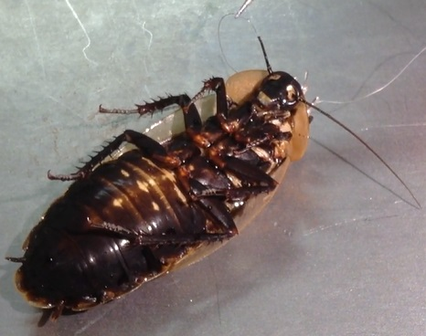

Like you did earlier, dab a bead of super glue just above where the electrode
is in the antenna (parked).

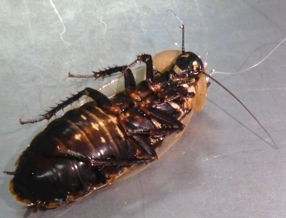

4.3) Then use forceps to park the electrode such that the super glue bead
partially enters into the antenna, ~2 - 4 mm (0.078” - 0.157”). If needed, add
a bit more super glue at the top after the wire is inserted, but avoid excess
glue. The super glue should polymerize immediately once it is inserted into
the antenna. The point is to get super glue just inside the inner ring of the
antenna; otherwise it will fall out easily. Don’t touch glue with fingers
because it will stick to you!

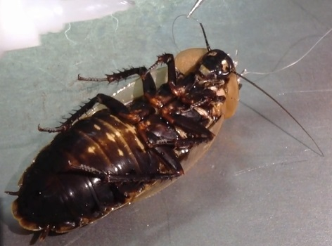

4.4) Place cockroach back into ice bath for 1-2 minutes to maintain
anesthetization.

#### [Step 5](http://youtu.be/EsrorUT_Svc?t=9m55s): Implanting left antenna

electrode

Repeat Step 4, but replace “right” with “left”.

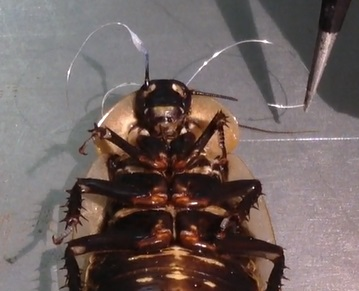

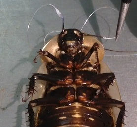

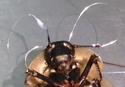

#### [Step 6](http://youtu.be/EsrorUT_Svc?t=10m48s): Tidying up the slack in

the wire

6.1) It is important that the “wire slack” be cleaned up. Using your fingers
and forceps, carefully organize (fold back) the wire slack on top of the
connector. Try to ensure as little slack wire exists between antenna and
connector. Cockroach legs are very strong and can pull electrodes out if they
get a firm hold or get it snagged. Also ensure “exposed” parts of silver wire
are not touching.

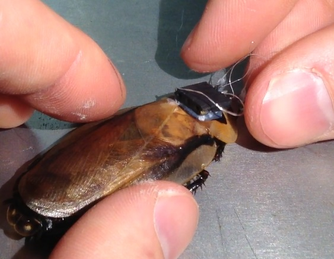

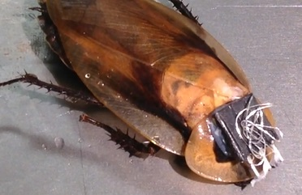

6.2) Prepare the end of a small flat surface such as a popsicle stick (you can
also use a small ruler or back end of your forceps) by wetting it and then
dipping it in flour.

6.3) To hold excess wire in place, use a hot glue gun and place a dab of hot
glue on top of the wires.

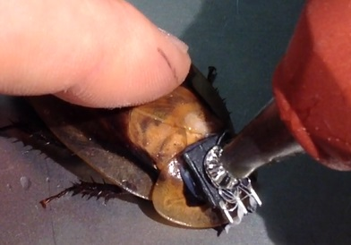

6.4) Quickly after applying the hot glue, use your “floured” flat edge and
smush down hot glue. The purpose of the flour is to prevent the hot glue from
sticking to your smushing tool.

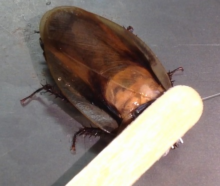

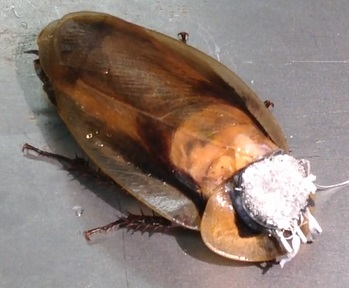

Make sure the wires are all tidy on the header, sometimes adding a bit of
extra super glue to secure loose portions of the wires must be done.

#### [Step 7](http://youtu.be/EsrorUT_Svc?t=11m58s): Surgery is complete!

Clean-up time

7.1) Put roach back in its terrarium and provide food and water. Recovery can
take up to 2-4 hours. When preparing for demonstrations we typically do the
surgery the night before, to allow the cockroach a full night to recover. The
cockroach will be ready for the experiment by the following morning.

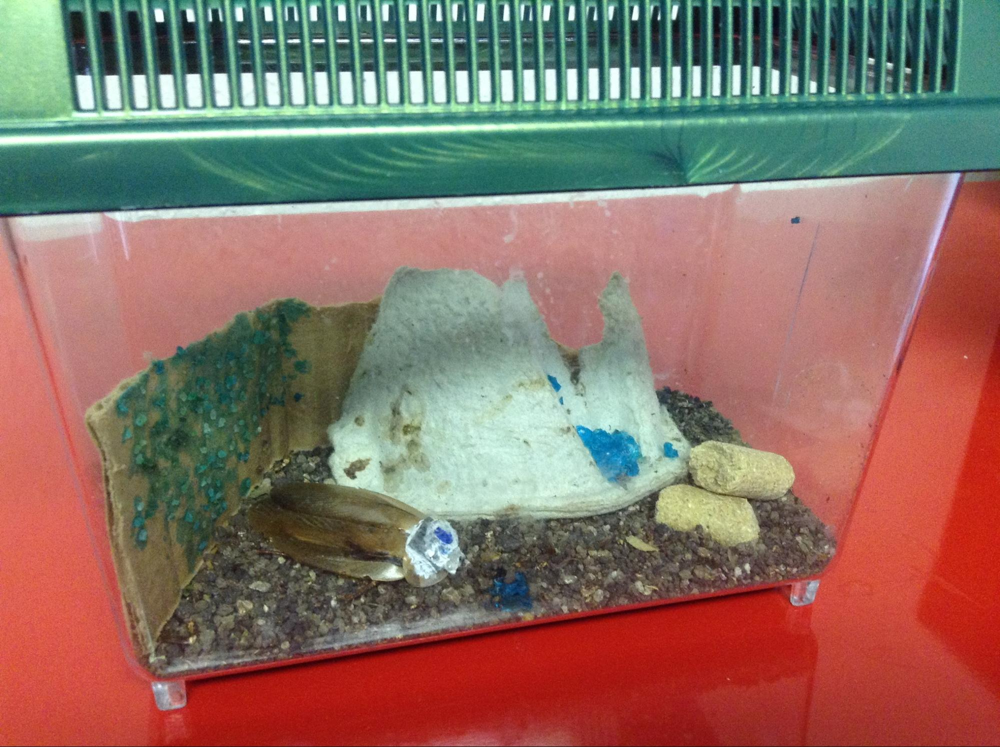

7.2) Put your tools away and discard of soiled materials. Don’t drink the
water! Clean your surgery table and tools. Always remember to wash your hands!

7.3) Fill out the Post-Op Review Record, page 3 of the [RoboRoach Surgery
Worksheet](https://backyardbrains.com/files/RoboRoach Surgery
Worksheet.pdf).

#### [Step 8](http://youtu.be/EsrorUT_Svc?t=12m34s): Testing your RoboRoach

To test the microstimulation of the antennae, first plug the male connector of
the RoboRoach PCB into the female connector on the roach’s head. If you
haven’t already, you can download the app directly without the App Store,
[here](https://backyardbrains.com/products/files/RoboRoach-v1.0.apk). If you
have any questions, please email [hello@backyardbrains.com](mailto:hello@backyardbrains.com?subject=RoboRoach
app)). Next, press the small black button on the left edge of the PCB, this
will wake up the microcontroller so that you can connect with it using the app
from your Bluetooth Smart compatible device. Using the default stimulation
settings, swipe either left or right on the screen and watch for any
behavioral responses. If the cockroach turns towards the direction that you
swiped, your surgery was successful. Good job! Your RoboRoach is ready for the
next experiment. If there is no observable behavioral response, review you
surgery record, learn from the experience and try again when you are ready.
Don’t get discouraged, failure has a bright side. It provides opportunities to
improve and is an important result when utilizing the scientific method.
Albert Einstein (or perhaps it was Thomas A. Edison) said it best, “I have not
failed, I have just found 10000 ways that don't work.”

  

## Experiment, Learn & Share

##### Check out the other RoboRoach Experiments!

* Learn how to [make your own RoboRoach electrodes.](https://backyardbrains.com/diy/roboroachelectrodes)

##### Share your Surgery Experiment experience with us.

* Send us your results and Surgery Worksheet to [info@backyardbrains.com](mailto:info@backyardbrains.com?subject=RoboRoach Results)
  * Tell us any tricks and/or tips you found helpful.
  * Let us know if you have any trouble, we are more than happy to help!

##### Show and share your new neuroscience knowledge with your friends and

family!

## Tips & Tricks

* Keep a dry piece of paper towel handy and separate from the one you use to dry off the roach after removing from the ice bath. 
    * Keep your glue hole clean so you can be precise with the superglue.
  

## Failures & Fixes

##### Failure: GND electrode came loose

* Fix: Verify that your roach is still anesthetized. Trim the tip of the wire to remove any glue or crumpled portion. Next take a lighter to the tip to burn off ~1-2mm of the insulation (will take a steady hand and careful eye). Then with your scissor trim off the bead of silver that forms on the tip of the electrode. Now, poke another hole, preferably away (opposite side of thorax) from the failed insertion point and redo step 3. 

##### Failure: Antenna electrode came out

* Fix: Verify that your roach is still anesthetized. Trim the tip of the wire to remove any glue or crumpled portion. Next take a lighter to the tip to burn off ~1-2mm of the insulation (will take a steady hand and careful eye). Then with your scissor trim off the tiny bead of silver that forms on the tip of the electrode. Now, trim off any glue on the antenna and try again.

##### Failure: Connector broke loose from pronotum

* Fix: If the wires haven’t been damaged, a dab of super glue can fix this, otherwise, you will have to start over. To prevent this from happening next time, make sure the connector is sanded and cleaned of dust or water so the glue sticks well.

##### Failure: Hot glue broke loose from the top of connector

* Fix: If the wires haven’t been damaged, a dab of super glue can fix this, otherwise, you will have to start over. To prevent this from happening, make sure the connector is sanded so the glue sticks. Also, be sure to clean and dry the top of the connector before applying the glue. Additionally, since hot glue dries quickly, pack it down with the popsicle stick (with flour on the end) immediately after applying the glue.

##### Failure: Cockroach moves slightly during procedure

* Fix: Add more ice to your ice bath and allow the cockroach a few more minutes in it for full anesthesia. Also, prepare the tools you need for the next step while the cockroach is in the ice bath so that you can be as quick and efficient as possible on each step. 
  

## FAQs

##### Where do I get more batteries?

[RoboRoach batteries](https://backyardbrains.com/products/roboroachbattery) are available in our online store.

##### Where do I get more electrodes?

[RoboRoach electrodes](https://backyardbrains.com/products/roboroachelectrodes) are
available in our online store. Or [make your own RoboRoach electrodes.](https://backyardbrains.com/diy/roboroachelectrodes).

##### What smartphones are Bluetooth Low Energy Compatible?

Supported iOS Devices: iPhone 4s+, iPod 5th generation+, iPad mini, iPad 4th
Generation+. Supported Android Devices: Motorola Droid Razr M; Nexus 4, 5, 7;
Samsung Galaxy S3+ (many others when BLE is officially released)

##### How do I get the RoboRoach App? Is it free?

It is free to download. Currently it is still in the review process for iOS.
It is now available for Android 4.3+ devices.

##### Where can I get cockroaches?

If you live in the United States, we can send you a sturdy box of a dozen,
healthy discoids, or discoid/cranifer hybrids. Cockroaches are the happiest
when they aren't in a shipping box for a long period of time. Therefore, we
ship cockroaches out on Monday or Tuesday via 2-3 day USPS priority mail. You
can [order cockroaches](https://backyardbrains.com/products/cockroaches)
through our online store.

##### Why?

1 in 5 people will have a neurological disorder in their lifetime (11).
Providing affordable educational tools and experiments such as the RoboRoach
can spread awareness and knowledge of neurological disorders and the current
neurotechnologies. Inspiring and exciting people to learn more about how their
nervous system works and to pursue neuroscience and/or fields in STEM.

##### What can you learn with the RoboRoach?

* Neural control of Behavior: First and foremost you will see in real-time how the brain responds to sensory stimuli.
    * Learning and Memory: After a few minutes the cockroach will stop responding to the RoboRoach microstimulation. Why? The brain learns and adapts. That is what brains are designed to do. You can measure the time to adaptation for various stimulation frequencies.
    * Adaptation and Habituation: After placing the cockroach back in its terrarium, how long does it take for him to respond again? Does he adapt to the stimuli more quickly? 
    * Stimuli Selection: What range of frequencies works for causing neurons to fire? With this tool, you will be able to select the range of stimulation to see what works best for your prep. Is it the same that is used by medical doctors stimulating human neurons? You will find out.
    * Effect of Randomness: With the addition of a new “random” mode to our stimulus patterns you can experiment with nonperiodic stimulations. We, as humans, can adapt easily to periodic noises (the hum a refrigerator can be ignored, for example). So perhaps the reason for adaptation is our stimulus is periodic. Now you can select random mode and see if the RoboRoach adapts as quickly.. or at all!

##### Do cockroaches feel pain?

Scientists are still figuring this one out. Since we don’t know for sure, we
assume that they do and take all precautions to minimize wounding and the
potential for pain. We send small amounts of current to the neurons. This
method is called microstimulation, and is used to make nearby neurons fire
action potentials or "spikes". This is not an electric shock, nor does it
cause pain. We can verify this by the fact that the cockroach can adapt to the
micro stimulation in a few minutes, and ignore it completely, something that
cannot be done with painful stimuli.

##### Can I use the RoboRoach to make my

brother/sister/mom/dad/dog/cat/hamster into a cyborg?

No. In the US there are rules, regulations and protocols for neural
microstimulation on vertebrates(12). The control of the roach's trajectory of
movement works because the nerves in the antennae are being stimulated. The
antennae are directly involved in navigation, and the interface to the antenna
is much easier and simpler than navigational systems in other animals.

##### What are the specifications of the RoboRoach?

* Total Weight: Less than 4.5g 
    * Stimulation Frequencies: 1Hz-150Hz 
    * Stimulation Pulse Widths: 1ms-500ms (Max pulse width is dependent on the Frequency) 
    * Stimulation Gain: 0 to 100%
    * Stimulation Duration: 10ms to 1000ms.
    * Communication Protocol: Bluetooth Smart (Low Energy)
    * Electrode: 0.003" bare, 0.0055" insulated, Silver wire
    * Battery: 16mm 1632 Coin Cell Battery 
    * Use Time: 12 hours per battery

## Science Fair Project Ideas

* What's the impact of increasing or decreasing the stimulation gain on the cockroach's behavior? On how quickly or slowly it adapts to the stimulus? Try changing some of the other variables around, like the frequency, pulse width, and duration, and see what effect those have as well. 
    * Why do you think the cockroach stops responding when it does? How do you think you could increase that time? 
    * How many days does it take for roaches to stop responding altogether? What do you think causes or affects that? 
    * Why does the cockroach have this behavior? What are some experiments you could run to show that the behavior we induce is the same as the natural one? 
    * Are there other behaviors you think you could induce, perhaps with different placement of the electrodes? 

### References

1. D. S. Halacy, Cyborg: Evolution of the Superman (New York: Harper and Row Publishers, 1965), 7.
    2. Vidal, JJ (1973). "Toward direct brain-computer communication". Annual review of biophysics and bioengineering 2: 157–80.doi:10.1146/annurev.bb.02.060173.001105.PMID 4583653.
    3. NIH Publication No. 11-4798 (1 March 2011). "Cochlear Implants". National Institute on Deafness and Other Communication Disorders.
    4. R. Holzer and I. Shimoyama, “Locomotion Control of a Bio-Robotic System via Electric Stimulation,” IROS’97, 1997 
    5. T.E. Moore, S.E. Crary, D.E. Koditschek, and T.A. Conklin, “Directed Locomotion in Cockroaches: ‘Biobots’,” Acta Entomologica Slovenica, vol.6, no.2, 71-78 December 1998
    6. A. Bozkurt, A. Lal, and R. Gilmour, “Aerial and terrestrial locomotion control of life assisted insect biobots,” in 31st Annual International Conference of the IEEE EMBS, September 2009
    7. Tsang W. M., Stone A. L., Aldworth Z. N., Otten D., Akinwande A. I., Daniel T. L., Hildebrand J. G., Levine R., Voldman J. (2010b). “Remote control of a cyborg moth using carbon nanotube-enhanced flexible neuroprosthetic probe,” in Proceedings of IEEE International Conference on Micro Electro Mechanical System (MEMS 2010), Hong Kong. 
    8. Sato H., Peeri Y., Baghoomian E., Berry C. W., Maharbiz M. M. (2009a). “Radio-controlled cyborg beetles: a radio-frequency system for insect neural flight control,” in Proceedings of IEEE International Conference on Micro Electro Mechanical System (MEMS 2009), Sorrento, 216–219.10.1109/MEMSYS.2009.4805357
    9. A. Bozkurt, E. Whitmire, T. Latif, (2013) “Kinect-based System for Automated Control of Terrestrial Insect Biobots”. 35th Annual International Conference of the IEEE Engineering in Medicine and Biology Society.
    10. Wigglesworth, V.B. 1980. Do insects feel pain. Antenna 4, 8-9.
    11. World Health Organization (2006) Neurological disorders: public health challenges. World Health Press. (http://www.who.int/mental_health/neurology/neurodiso/en/)
    12. National Institute of Health, Office of Laboratory Animal Welfare. (http://grants.nih.gov/grants/olaw/olaw.htm)

