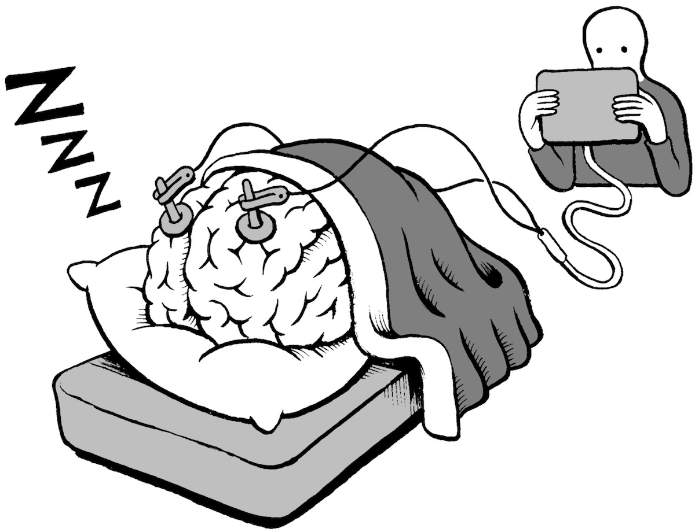
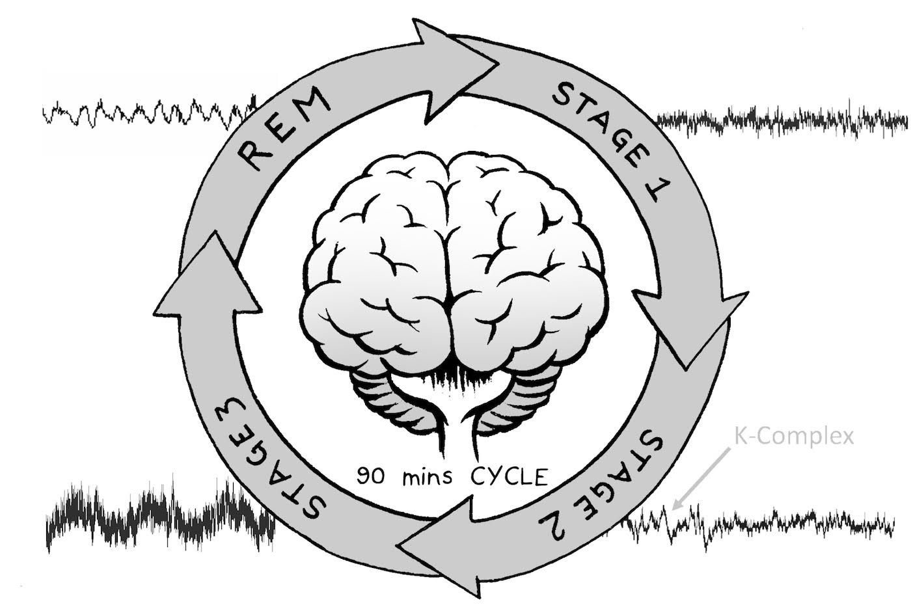
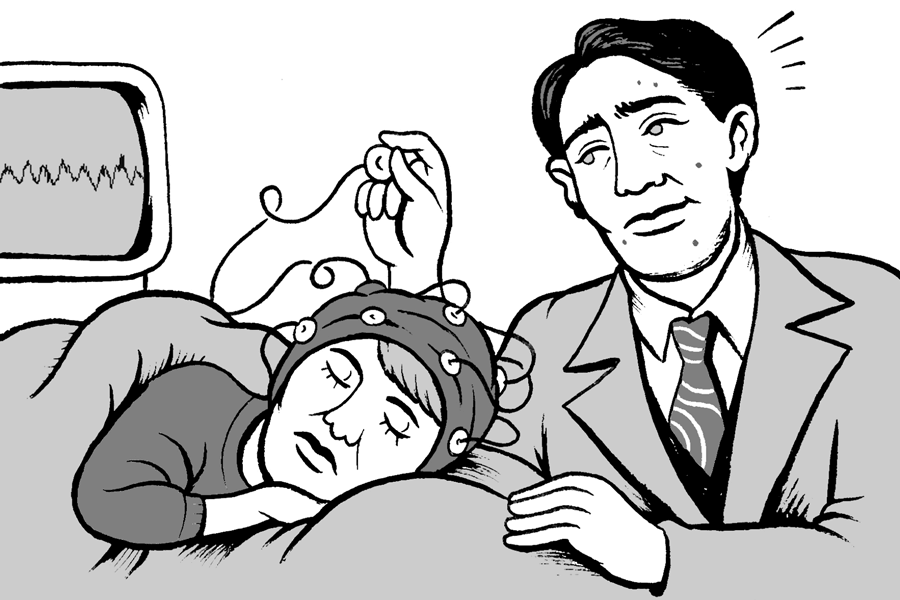
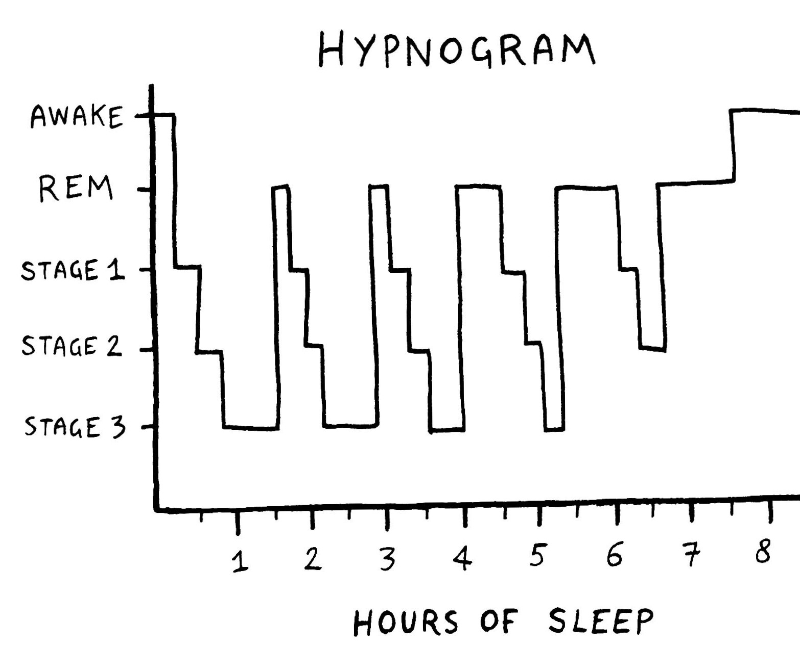
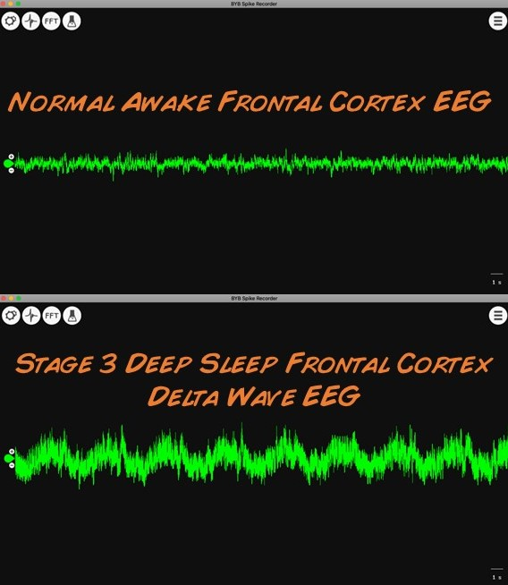
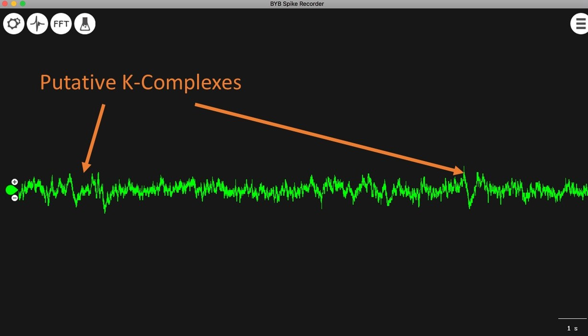
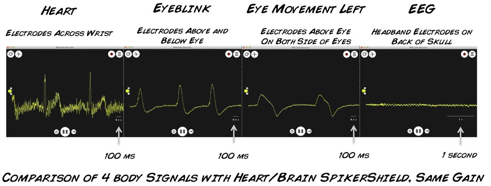

"To sleep, perchance to dream." W. Shakespeare. Poets and Scientists have long
wondered and written about this strange phenomenon that plays such a profound
role in our lives and our health. Here we will learn some contemporary
theories about why we sleep, and we will record the large electrical waves
that occur in the frontal cortex of your brain while you are in slumber. This
experiment was prepared by Joud Mar'i, an undergrad from Mount Holyoke
College, during our Summer Fellowship Program.

**Time:**  1 hours

**Difficulty:**   Advanced

#### What will you learn?

With this experiment, you will learn the modes your brain enters when you are
sleeping and how to identify the various electrical waves that occur. Also you
take a nap!

##### Prerequisite Labs

* [EEG](eeg) - You should have an understanding of how to use the Heart & Brain SpikerBox to record the alpha waves of your visual cortex before moving on to this more challenging experiment of recording the EEG during different stages of sleep.

##### Equipment

* [Heart & Brain SpikerBox](https://backyardbrains.com/products/heartAndBrainSpikerBox)

## Background

Why do we sleep? This is the million dollar question that scientists have been
trying to answer for centuries. Think of hunger. When we are hungry, we eat,
and this ensures our body gets the nutrients it needs. And, when we are tired,
we sleep, and this ensures.... well exactly what? Why do we sleep in the first
place?

Various theories exist, formulated by examining sleep cycle patterns and the
effects of sleep deprivation on humans and animals. Let's take a look at four
of them!

**Protection Theory** _ Sleep keeps us alive. Many animals are inactive at
night for survival, ensuring they are protected from their predators at times
of vulnerability in darkness (seeking shelter, being quiet). For example,
chickens fly into the trees at night to "roost" when it is dark. Of course, a
counter-argument presents itself_ many big cats are most active at night,
sleeping during the day because their prey is inactive at night and easier to
catch. And someone is certainly in a very vulnerable state when they are
sleeping...

**Energy Conservation Theory** _ Sleep conserves energy. Competition for food
and energy resources is part of natural selection, and sleep provides a period
where demand on energy is low. During sleep, energy metabolism, body
temperature, and caloric demand all decrease. Animals like bears and squirrels
go into a more profound sleep during winter - hibernation.

**Body Repair Theory** _ Sleep is a time for rejuvenation and repair. Without
sleep, our body loses immune functions and dies in a few weeks. When we sleep,
muscle growth, tissue repair, protein synthesis, and growth hormone release
are some of the processes that occur.

**Strengthen Learning Theory** _ Sleep promotes learning and brain development
by strengthening organization and structure of the brain in children (and
adults). Infants typically need 13-14 hours of sleep, and deprivation affects
performance and learning as they grow into adulthood. When we sleep, we
strengthen the neuronal connections that form our memories, and different
memory types get shaped at different sleep stages characterized by the certain
architecture of brainwaves.

And when you sleep, you brain oscillates between 4 sleep cycles_ Stage 1,
Stage 2, Stage 3, and REM. Let's talk a little bit about these sleep stages
and their electrical brain signatures before diving into the experiment.

When you begin to fall asleep, there is a stage called "pre-sleep" where there
is a reduction in physiological activity. Your consciousness of the
environment, cortical activity, and internal thoughts are at very low levels
but still occurring. During this epoch, you are awake but relaxed with your
eyes closed. Alpha waves of around 8-13 Hz dominate. These are the same [alpha rhythms](https://backyardbrains.com/experiments/eeg) we recorded previously.
When we eventually fall asleep, sleep is then classified into the four stages
mentioned above. This sleep scoring was first described in detail in [a 1957 paper](./files/Dement-Kleitman-1957-first-sleep-scoring.pdf) by graduate student
[William “Bill” Dement](https://en.wikipedia.org/wiki/William_C._Dement) and
his advisor, noted sleep researcher [Nathaniel Kleitman](https://en.wikipedia.org/wiki/Nathaniel_Kleitman), at the University of Chicago.

**N1 (Stage 1) sleep_**

This is the lightest stage of sleep, also referred to as sleep onset. It is
characterized by slow eye movements lasting a few seconds, and the replacement
of the 8-13 Hz alpha waves with theta waves of 3-7 Hz. People woken from this
stage may claim they weren't even sleeping.

**N2 (Stage 2) sleep_**

In this stage, there are very few eye movements, and the EEG is dominated by
sleep spindles and K complexes. Sleep spindles are a series of distinct waves
in the 12-14 Hz range. K complexes are brief large amplitude "swings" of the
potential.

**N3 sleep (Stage 3) or slow-wave sleep_**

This is the deepest stage of sleep, also referred to as slow-wave sleep (SWS),
in which the brain becomes the least responsive to external stimuli and is the
hardest to be awoken from. N3 sleep is marked by slow wave "delta activity," a
very high amplitude signal at 0.5-3 Hz. It is easy to spot, and, outside
epilepsy (a disease condition), is the strongest synchronous activity the
brain produces. Sleep spindles and K-complexes from Stage 2 can still be
present during Stage 3.

**REM - Rapid Eye Movement - Late Sleep_**

REM, of course, is when your eyes are in rapid movement under your eyelids,
and you are vividly dreaming. REM sleep is the part of sleep with the most
intense and diverse brain activity, and the most intriguing part of "sleeping"
for people. You may be surprised to know that REM wasn't even formally
discovered until the mid 20th century. In 1950 British physicist Robert Lawson
noticed while on a long train ride that people's eyes were twitching (under
their eyelids) while they were sleeping, and that this eye twitching would
abruptly stop and restart some point later. Being an observant and curious
scientist, he wrote down and published his notes in a [short letter in Nature](./files/Lawson-first-REM-1950.pdf) (productive train ride).

The aforementioned University of Chicago sleep researcher Nathaniel Kleitman
read this Nature letter and assigned its verification to his graduate student
[Eugene Aserinsky](https://en.wikipedia.org/wiki/Eugene_Aserinsky). Eugene
then recorded the EEG of REM on his 8 year old son Armond Aserinsky, and
[published it in Science in 1953](./files/Aserinsky-first-REM-EEG-1953.pdf). Yes, though humans have been dreaming since they have existed,
and REM is where dreams occur, such a connection was not known until 1953. An
REM EEG often looks like an "awake" EEG, composed of various high frequency,
low amplitude components.

This whole cycle from stage 1 to REM typically lasts 90 minutes and repeats.
As the cycle renews along the night, the time spent in delta tends to decrease
and the time spent in REM tends to increase (which is perhaps why, when you
have a good night's rest, you tend to have dreams you remember upon waking).

Now, we know it can be a dull experience reading endless descriptions of EEGs
without explaining what they mechanistically mean for brain health and
function, so let's do some experiments in the frontal cortex to visualize
these stages. We will be best able to see delta waves of stage III sleep as
well as K-complexes. REM will occur with eye movements, causing EOG
((electrooculography) artifact in your EEG activity. Now invite a friend for
nap time or take one yourself! Time for experiments!

#### Downloads

> Before you begin, make sure you have the [Backyard Brains Spike
> Recorder](https://backyardbrains.com/products/spikerecorder) program
> installed on your computer or your smartphone/tablet. The Backyard Brains
> Spike Recorder program allows you to visualize and save the data on your
> computer when doing experiments.
>
> [Spike Recorder Software for Displaying and Saving Data on
> Computer](https://backyardbrains.com/products/spikerecorder)
>
> [Primer on Optimizing your EEG
> Signal](https://backyardbrains.com/products/files/EEG_Troubleshooting_Guide.pdf)
>
> [Primer on Frequency Analysis in EEG
> Signals](https://backyardbrains.com/products/files/Extracting_Frequency_Bands_EEG.pdf)

## Tutorial Video of Experiment

## Procedure

In this "EEG and sleep" experiment, we are going to monitor our frontal cortex
electrical signals as we take a nap. A 90 minute experimental session would be
ideal to try to record all four stages (1, 2, 3, and REM). You can also record
your own brain overnight but we find that the cables snap off due to body
movement after a couple hours. You can still collect some good data though.

  1. Place the headband on your forehead with a ground patch electrode behind your ear. The smooth side of the metal electrodes in the headband should be in contact with your scalp on your forehead (see video above). 
  2. Place some electrode gel between the headband electrodes and your skin. 
  3. Now it's time to connect your electrodes! Your orange muscle electrode cable has two red alligator clips and a black alligator clip. Clip the two red alligator clips onto the rim of metal on the front on the headband--which red is in which location does not matter. The black ground clips on the adhesive patch electrode behind your ear. 
  4. Plug your orange electrode cable in the orange port on your Heart and Brain SpikerBox. 
  5. Plug one end of the micro USB cable into the Heart and Brain SpikerBox and the other end into the computer. Or, alternatively, plug your green smartphone cable (the end that says "SpikerBox" goes into your SpikerBox, and the end that says "smartphone" goes into your phone or tablet). 
  6. Turn on your Heart and Brain SpikerBox 
  7. Open the SpikeRecorder software. On your computer, click on the USB icon at the top left of your screen (it will appear when the SpikerBox is turned on). On the Smartphone/Tablet, the EEG should appear in a matter of seconds (to use the analog input of your smartphone, we FM modulate the signal). Spike Recorder on your tablet or smartphone will recognize the FM modulation within about 8 seconds and decode your EEG. In the drop-down method on the upper left part of the screen, select "brain to have the appropriate digital filters selected. Again, since your EEG signal, modulating between 1-80 Hz, is right in the sweet spot for power line noise (50 Hz or 60 Hz), you will have to be very vigilant of noise in this experiment. Have your laptop, tablet, or smartphone and SpikerBox far from any electrical outlets like fluorescent lights. Also have your laptop/smartphone/tablet running on battery power alone. If the signal seems excessively noisy and unstable, add more conductive gel between the headband electrodes and your scalp. Use the video above as a guide. 
  8. Click on the FFT button. 
  9. Have your subject (or you) lay down comfortably on a couch, and your equipment on a table nearby. 
  10. Start recording the subject's (or your) EEG signal. Tell the subject to relax and try not to move his face while you are attempting to record EEGs - muscle movements can also be picked up, which causes interference with your EEG reading. Be patient, you will get real brain activity, but EEG is a challenge that takes vigilance to separate real brain signal from electrical noise or muscle electrical signal. 
  11. Now it is time for the nap. 90 minutes is ideal, and remember to press the "record" button. 

**Notes for Sleep Staging/Scoring in Real Time_**

The time spent in each cycle varies through the sleep cycle. In our idealized
[hypnogram](https://en.wikipedia.org/wiki/Hypnogram) below, you can see more
REM occurs as the night draws on and less time occurs in deep sleep. In our 90
minute nap though, we will probably spend more time in deep sleep though. See
for yourself!

  12. The easiest way to visually score the EEG you have recorded is to zoom out the max distance possible in SpikeRecorder, where the whole screen displays 40 seconds. The easiest signal to observe are the delta waves, would should appear in the middle to the end of your recording. They should be immediately obvious as a stage III signal. 

  13. The second signal you can (sort of) easily spot at the K-Complexes, which are amplitude "swings." Some examples are below. 

  14. Sleep spindles and K-Complexes might/usually are present during slow wave sleep. Major Body Movements are the opposite_ they should not/rarely are present in deep sleep. Their presence is a good indication that the subject has still not reached stage N3 of NREM sleep. Stay tuned as we continually improve our signal analysis tools! 

## Discussion / Further Work

1. The documented record of most days without sleep was made by high school student [Randy Gardner](https://en.wikipedia.org/wiki/Randy_Gardner_\(record_holder\)) when he went for 11 days without sleep in San Diego in 1964. But this is a dangerous record to try to break, so don't try it (and Guinness no longer keeps track). 
  2. You may have noticed the EEG during is much stronger and more obvious in the delta waves of sleep than during awake EEG. Why do you think that is? 
  3. Ever wondered how coffee works? We feel tired after being awake for a while, as the build-up of adenosine produced by neurons in our brain indicates the need for us to sleep. Caffeine blocks the adenosine receptors in your brain. 
  4. We have found that our EEG headband works best for naps, but doesn’t stay situated correctly overnight. Most overnight sleep involves body movement that shifts the headband and and releases the electrode connection. Perhaps you could design a better way to keep the headband in place during the night with hair clips and a modification of the electrodes. 
  5. Finally, EEG is wonderful to measure, but novices may find the low signal strength surprising (and perhaps disappointing). EEG is one of the weaker electrophysiological signals, and it is important to remain still (don't move any muscle of the head) and reduce noise as much as possible. See figure below that illustrates the EEG signal strength compared to other signals we can measure with the Heart and Brain SpikerBox. 

## Science Fair Project Ideas

* You can notice REM sleep in your dog. When, during sleep, your dog's eyes and mouth are twitching, with an occasional twitch of a leg, your dog is in REM sleep. This of course leaves any curious mind to wonder what it is that dogs even dream about. Maybe you can repeat Robert Lawson's famous train ride experiment and simply observe your dog when it begins sleeping and write down the time and duration when its eyes start twitching versus not twitching. One of our colleagues, Ivonne Beltran, sent us a video of her dog in obvious REM sleep. 

  * Is there a way to calculate how much energy you save while sleeping? There are movement trackers like the [Fitbit](https://www.fitbit.com/cl/home), [Apple Watch](https://www.apple.com/lae/watch/), and Misfit. You may be able to also "back of the envelope" calculate it using some physics. 
  * Which hypothesis on why we sleep do you find the most compelling from above (Protection, Energy Conservation, Body Repair, and Strengthen Learning)? Why? Can you design an experiment testing your reasons? 

## References

* [Sleepy Head - Narcolepsy , Neuroscience, and the Search for a Good Night](https://www.amazon.com/Sleepyhead-Narcolepsy-Neuroscience-Search-Night-ebook/dp/B074V4TQ9R) by Henry Nicholls. A new book released in 2018 that goes over the state of the art in sleep research. Many of our historial references on the discovery of REM came from this book. 
  * [National Institutes of Health Guide to Healthy Sleep](https://www.nhlbi.nih.gov/files/docs/public/sleep/healthy_sleep.pdf)
  * Society for Neuroscience [Brain Facts](https://www.brainfacts.org/thinking-sensing-and-behaving/sleep)
  * [Smithsonian Magazine article](https://www.smithsonianmag.com/science-nature/the-stubborn-scientist-who-unraveled-a-mystery-of-the-night-91514538/
) on the work done by Nathaniel Kleitman, Eugene Aserinsky, and William Dement
and the origins of the sleep science field.

#### Downloads (old)

If you have the old heart and brain SpikerShield, you can do this experiment
as well - our legacy downloads are below.

Before you begin, make sure you have the [Backyard Brains Spike
Recorder](https://backyardbrains.com/products/spikerecorder) and
[Arduino](https://arduino.cc/en/main/software#.Uxd6XYWhZMk) Programs installed

on your computer. The Arduino "Sketch" is what you install on your Arduino
circuit board using the Arduino laptop software (your board comes preinstalled
if you bought the Arduino from us), and Backyard Brains Spike Recorder program
allows you to visualize and save the data on your computer when doing
experiments. We [made a video](https://www.youtube.com/watch?v=L23Aeo6WXjA)
for you to explain this!

[Spike Recorder Software for Displaying and Saving Data on
Computer](https://backyardbrains.com/products/spikerecorder)

[Arduino Sketch for Sending Data to
Computer](./files/SpikeRecorderArduino.zip)
