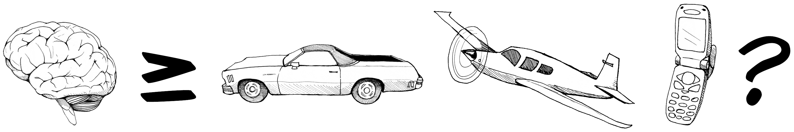
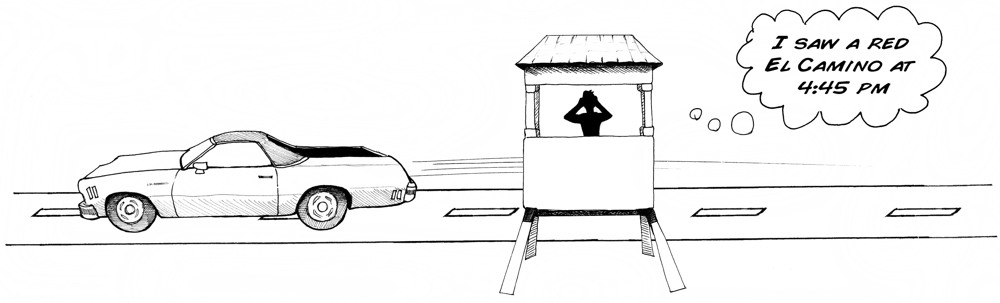
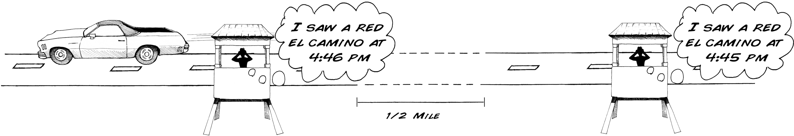
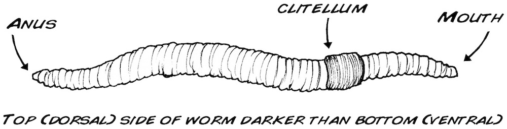
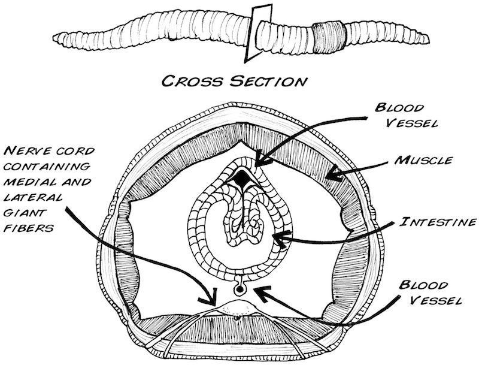
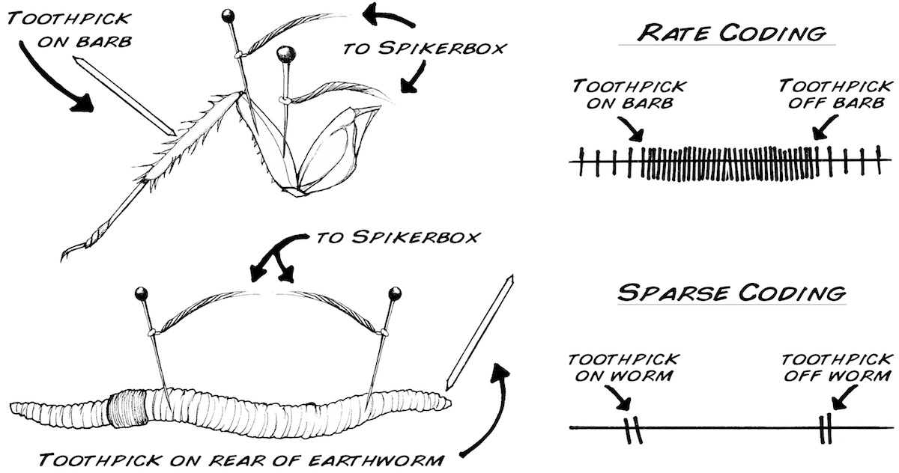
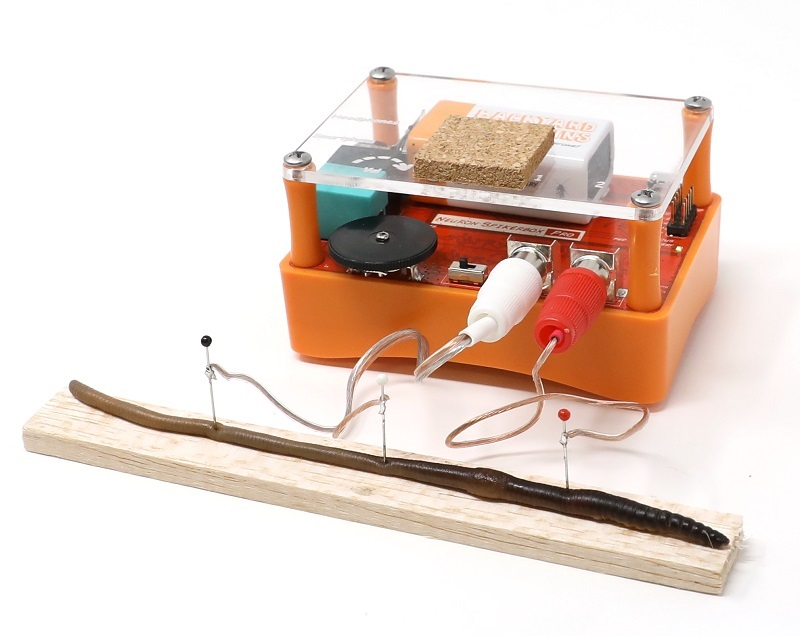
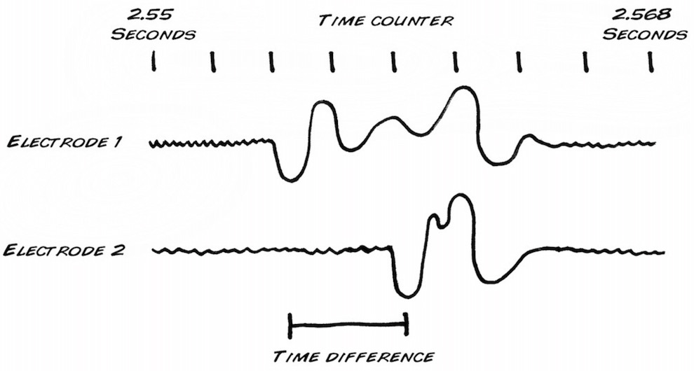
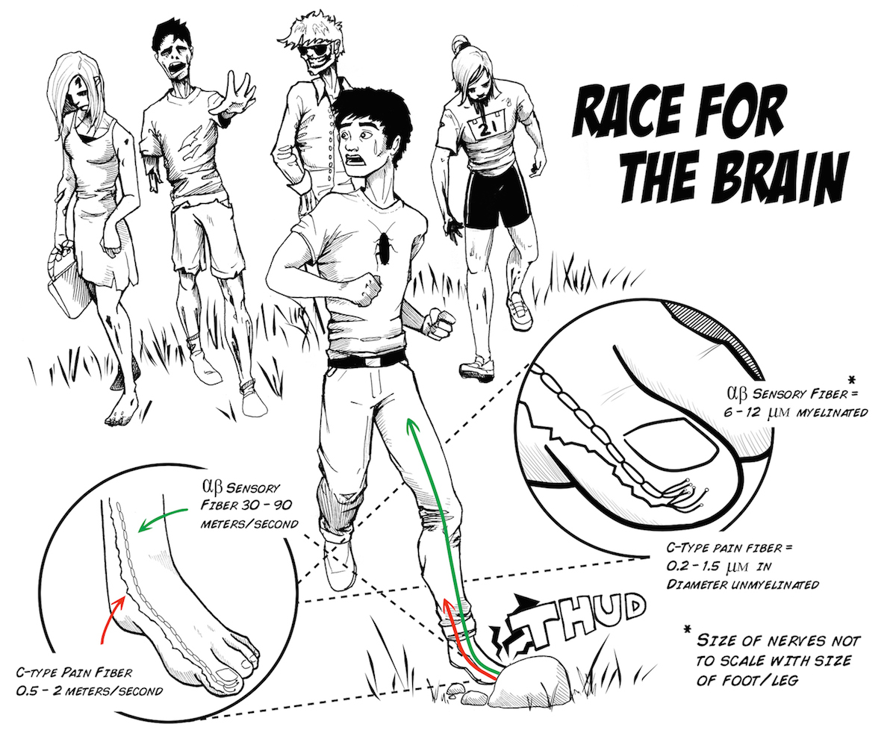

You have probably spent some time wondering just how fast those spikes that
you have been studying are? Now you can find out with our Neuron SpikerBox Pro
and an earthworm!

**Time**  1 Hour

**Difficulty**  Advanced

#### What will you learn?

In this lab you will learn how to use the Neuron SpikerBox Pro by measuring
the conduction velocity of a spike using an earthworm. You will also learn
about "Sparse Coding," a different neural code than the "rate coding" we have
been previously studying.

##### Prerequisite Labs

This is an advanced lab, and we recommend you go first through several of the
beginner and intermediate labs:

  * [Neuron SpikerBox](ratecoding)
  * [Referencing your Spikes](referencing.md)
  * [Faraday Cage](faraday)

##### Equipment

* [Neuron SpikerBox Pro](https://backyardbrains.com/products/neuronspikerboxpro)
* [Faraday Cage](https://backyardbrains.com/products/faradaycage)

## Background

_Note: This experiment was peer-reviewed and published by the American
Physiological Society in the journal "Advances in Physiology Education" -[Read the paper intrepid scientists!](http://advan.physiology.org/content/38/1/62)_

Up to this point, we have been studying spikes emitted from crickets and
cockroaches, mostly by monitoring the "spike rate" and "spike presence" in
response to certain stimuli or conditions. We now will study "spike speed."

You probably think the nervous system is pretty fast. You seem to hear the
spikes immediately when you touch the leg of the cockroach or blow on the
cerci of the crickets. But is it instantaneous? Of course not! Not even light,
the fastest signal in the universe, travels instantaneously. But how fast is a
nervous system? Is it faster than a car, faster than a plane, or faster than a
cell phone? And how can we measure it?

In all previous experiments, we've only recorded our neurons using one channel
(meaning we used only one recording electrode and one ground). To measure
speed (velocity) though, you need to measure both time (when a spike occurred)
and distance (how far a spike has traveled down a nerve).

Take the analogy of a car on a highway. If you were looking out of a small
observation hut by the road, you could tell what whether you saw a car, what
kind of car it was, and the time that you saw it.

Similarly, with your SpikerBox, you can tell if you saw a spike, perhaps what
kind of neuron generated that spike, and the spike time, but you can't tell
how fast the spike was traveling down the nerve.

Let's go back to the car on the highway. Suppose you had a friend 1/2 mile
down the road in a similar hut: Later, you two could compare notes to
determine the speed of the car.

1 minute = 0.016 hours. Dividing 1/2 mile by 0.016 hours, you calculate a
speed of 31.25 mph. Thus, we can measure the speed with two observers, and
that's why we hereby announce the "[Neuron SpikerBox Pro](http://www.backyardbrains.com/products/NeuronSpikerBoxPro)" to measure
two points along a nerve as a spike travels down it.

So, why don't we take our SpikerBox with our two electrodes and ground, put it
in the cockroach, and measure the spike output of the two channels? You will
notice immediately that there are a lot of spikes happening on both channels,
in fact, way too many to keep track of it all.

Let's go back to our analog of the road. Imagine a very busy, fast moving
street with many similar looking cars, say, Lakeshore Drive in Chicago, and
you and your friend can only set up observation huts very close to each other.

You can see the problem, There are a lot of spikes occurring in the cockroach
leg, and identifying unique ones with two observers is very tricky. The femur
of the cockroach leg has 2 nerves inside, and inside each nerve is about
100-200 neurons, all firing many spikes. We are also limited by how far we can
place our electrodes from each other in the cockroach leg, as the leg is only
about 8 mm long.

Ideally, given our limited tools, we'd want to measure spikes on a longer
nerve, a nerve with only 1-3 large axons in it, and axons that do not fire
many spikes.

Is there any creature in the animal kingdom that meets these qualifications?
Yes! and it is probably right now under your feet and in your backyard.

We have been studying arthropods (insects), but we now move to a new class of
invertebrate: annelids! Or more commonly, worms! Enter our newest preparation:
the common earthworm, _Lumbricus terrestris_. It's a simpler animal than what
we've studied before, and the earthworm contains three large axons that run
its length, the "medial giant" fiber and the two "lateral giant" fibers. The
medial giant fiber transmits information about the front of the worm (the part
closest to the clitellum), and the lateral giant fibers transmit information
from the skin cells of the posterior end of the worm ([Kladt et. al 2010](./files/kladt_2010_earthworm.pdf)).

In addition to the earthworm's long length, which allows us to place our
recording electrodes far apart, the earthworm also exhibits what is known as

What is sparse coding? Let's turn back to our cockroach and the "rate coding"
you have previously studied. In rate-coding, the intensity of a stimulus is
encoded by the rate of spikes. If the cockroach leg used a sparse coding
scheme, the leg nerves would only fire 1-2 times when you touched the barb
with a toothpick, and 1-2 times more when you removed the toothpick.

This sparse coding scheme is what we will see in the earthworm experiment
below, and we will exploit it to measure the conduction velocity (or speed) or
the spikes.

#### Downloads

> [Spike Recorder Software](https://backyardbrains.com/products/spikerecorder)
>
> [Experiment in Editable Word .docx Format](./files/Experiment-Conduction-Velocity.docx)

##### Materials Required

1. [Neuron SpikerBox Pro](http://www.backyardbrains.com/products/NeuronSpikerboxPro)
  2. Earthworm 
  3. [A Faraday Cage](http://www.backyardbrains.com/products/faradaycage)
  4. Laptop with USB input 
  5. Ruler 
  6. Balsa Wood or styrofoam for Worm 
  7. [Alcohol](http://en.wikipedia.org/wiki/Ethanol) or [Seltzer Water](http://en.wikipedia.org/wiki/Carbonated_water)
  8. 2 small plastic tubs, one filled with water, the other filled with the alcohol/seltzer water anesthetic 

## Procedure

1. Go to your nearest pet store, sporting goods store, or gas station and purchase a box of earthworms (they are typically used to feed lizards, turtles, and fish. Fishermen use them as bait). They should be around $3-$4 for 12 worms. The Earthworm box should stay in the refrigerator (not the freezer) when not being used. The worms can last approximately 1-2 months. 
    2. Prepare a 10% ethanol solution. The easiest way to do this is to use vodka (which is normally 80 proof, or 40% ethanol). Since Vodka is not much more than watered down pure ethanol, dilute it further to 1 part vodka, 3 parts water. For example, we mix 10 milliliters of alcohol with 30 milliliters of tap water. Ask your teacher to prepare this for you. **Note:** You can also use sugar-free carbonated water (also called club soda or sparkling water) as an anesthetic if ethanol is not available. The CO2 in the water serves as an anesthetic agent. 
    3. Place a healthy earthworm in the alcohol alcohol mixture and wait one to two minutes, or until the worm stops moving completely. Do not wait too long; as with human anesthesia, the delicate balance between too little anesthesia and too much is tricky. Too little anesthesia, the earthworm will move around during the experiment, and the resulting muscle electrical activity (electromyogram) will drown out the small neural electrical signals you are interested in. Too much anesthesia and the nerves will not fire. We've found 1-2 minutes is a good range. 
    4. Place the Earthworm on a piece of balsa wood or thick cork, and put your three electrodes of your two-channel SpikerBox in the posterior end of the worm (see picture above). 
    5. Place a Faraday Cage around the Earthworm, and clip the Faraday cage to the ground of either channel 1 or channel 2 of your SpikerBox. 
    6. Plug the electrodes into your Neuron SpikerBox Pro and the USB cable into your PC. 
    7. Open our [SpikeRecorder](https://backyardbrains.com/products/spikerecorder) software, and click on the USB symbol to pair with the Neuron SpikerBox Pro. 
    8. Press the record button on your Spike Recorder software, and, using a plastic or glass probe, tap the posterior end of the worm. You should hear the evoked spikes caused by the tap. Interestingly, the neurons in the earthworm are myelinated (covered in insulating fat), and you will notice the spikes are much quieter than you are used to [Hartline & Coleman 2007](./files/Hartline_Colman_2007_MyelinReview.pdf). Many nerve diseases, such as Multiple sclerosis, are caused by a degeneration of this fatty covering. 
    9. Make 3-4 taps, separated by about 3-4 seconds each. 
    10. Measure the time delay between the two channels by clicking at the beginning of one spike, then dragging to the start of the next. In the corner of the screen, you should see the amount of time you have selected. 
    11. Using a ruler with divisions in the mm range, measure the distance between the electrode one and electrode two. 
    12. Divide the distance by the time. Viola! You have just measured conduction velocity. 
    13. Remove the electrodes from the worm, dip the worm briefly in water to remoisturize it, and return the worm to its styrofoam container. It can tolerate the needle placement and be used for another experiment another day, or you can return it to the environment where you found if you live in wet climates where Earthworms can be harvested in your backyard.

Now start exploring. For example, does this measurement change from spike to
spike? Does it change from earthworm to earthworm? Are smaller earthworms
faster or slower than large earthworms? Is this speed sensitive to depth of
anesthesia? These are all questions we would like to know, and you do too! Let
us know what new discoveries you make. To help you learn how to identify
Earthworm Spikes, here is an example [Earthworm Recoding](./files/recordings/Earthworm_Double_Recording.mp3)
you can analyze.

## Next Steps

Have you ever wondered, when you stub your toe, how you manage to feel the
impact almost instantaneously, but the throbbing pain takes about 1-2 seconds
to reach your consciousness? This is because these two signals (touch vs.
damage/pain) travel via two different fiber systems that have very different
speeds. Below is a teaser as to why - want to dive deeper? Proceed to the next
experiment: - [Comparing Speeds of Two Different Fibers.](comparingNerveSpeed)

## Troubleshooting

1. If your earthworm is not healthy (not moving around in the soil and not resisting/squirming when you try to pick it up), you will not get good recordings. 

## Science Fair Project Ideas

* Why are we using alcohol to anesthetize the earthworm instead of ice water? 
* What happens if you reverse the ground and recording electrode 1? 
* What happens if you touch the anterior part of the worm (the mouth). 
* What are some advantages and disadvantages of sparse coding vs rate coding?

