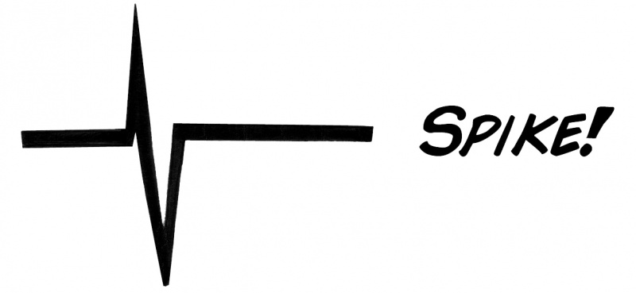
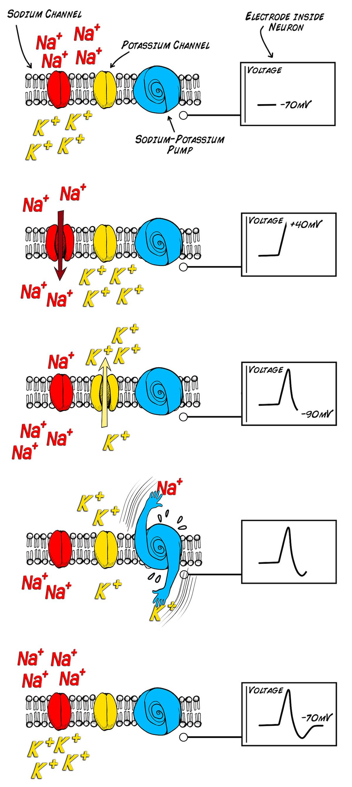
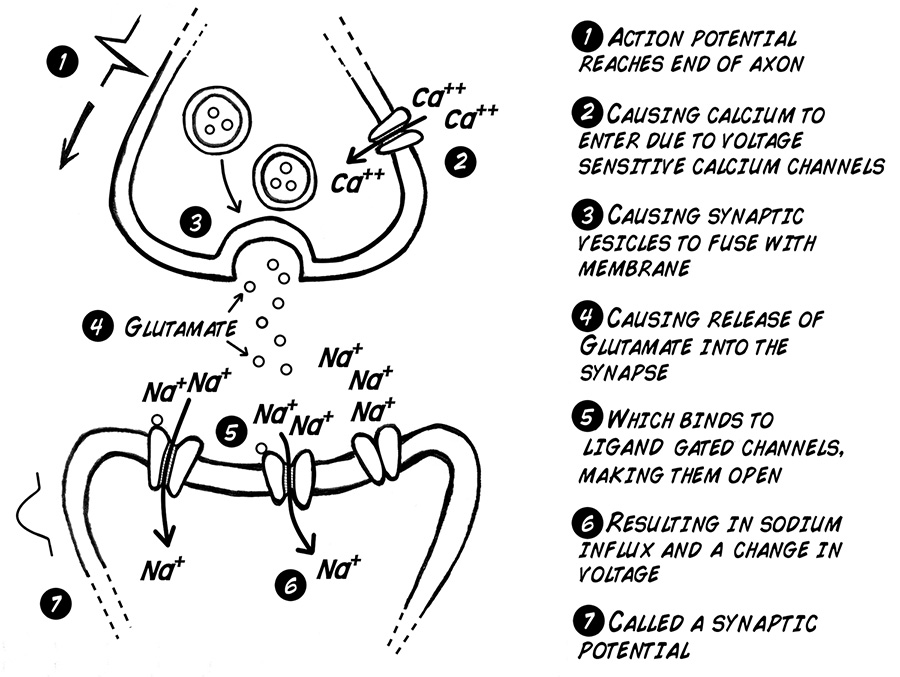
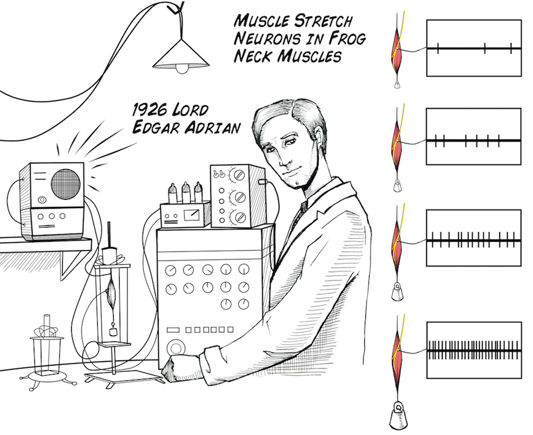
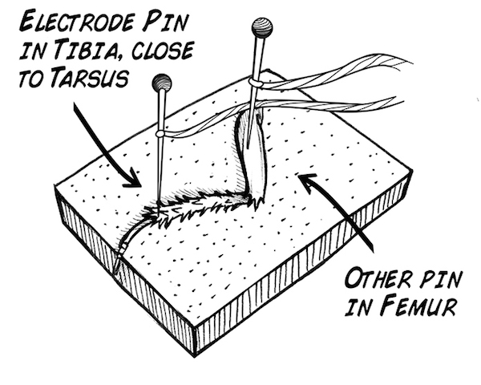
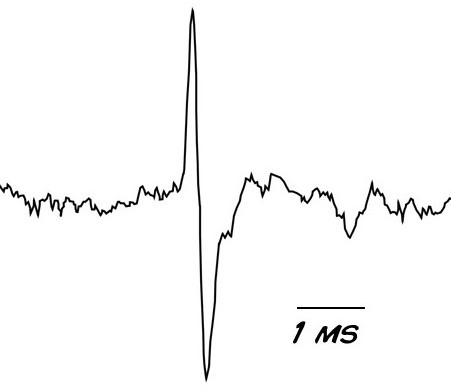

## Experiment: Record and Manipulate Live Neurons!

---
id: "record_and_manipulate_live_neurons!"
title: "Record and Manipulate Live Neurons!"
slug: "/retired/experiments/spikerbox"
---

Did you just get a SpikerBox, and are wondering how to use it? In this lesson,
you will listen to action potentials and view "spikes" in real time. This is
an excellent starting point for your SpikerBox as well as a great nervous
system lab for students as young as middle school! See live action potentials
in an engaging lab activity!

**Time**  30 Minutes

**Difficulty**  Beginner

#### What will you learn?

This is THE experiment to get you started with neuron spikes! By the end of
this experiment, you will understand what neurons are, how they communicate,
the principle of rate coding, and how to record spikes using a SpikerBox!

##### Prerequisite Labs

* [Caring for Cockroaches](https://backyardbrains.com/products/cockroaches) - If you are new to insect husbandry, the bottom of our cockroach product page has tips for maintaining a healthy colony.

##### Equipment

* [Neuron SpikerBox](https://backyardbrains.com/products/neuronspikerboxpro)
* [Cockroaches](https://backyardbrains.com/products/cockroaches)

## Introduction

Your brain uses a combination of chemicals and electricity to operate. Brain
cells (neurons) communicate with each other to control your body. A brain with
only 1 neuron is not a brain.

A brain is a network (friendship) of neurons. Your brain has and uses around
eighty billion neurons! But how do all of these neurons talk to each other?
One of the first ways cells used to network was chemical communication.

Bacteria use this method. It works well, but is limited by diffusion. For
example, when you release an odor on one side of the room, how long does it
take for someone on the edge of the room to smell it? There should be a faster
way. One way is to bring cells closer together through stretching.

But there is still a problem. The signal still needs to travel a long way
through the cell. Is there a way to make this faster? What is very fast and
important today?

Electricity! Notice how fast the lights in your house turn on when you flick
the switch. Neurons use electricity as well; electrical pulses travel down the
neurons. This pulse is called the:

We at Backyard Brains have dedicated our lives to studying spikes (also known
as action potentials), and you can too! What shall we use to study neurons?
380 million years of evolution bring you the cockroach. That's even older than
dinosaurs! We will use the Discoid cockroach (_Blaberus discoidalis_), or
false death's head. They live in the Amazon rainforest of South America under
the bark of rotting trees.

Like most multicellular animals [(beyond creatures like sea
sponges)](https://backyardbrains.com/experiments/Life_Animal_Neuron_Theory),
cockroaches' bodies are filled with nerves (which are bundles of neurons) to
control movement & sensation. As said above, neurons use a combination of
electrical and chemical signaling to function.

How does the neuron generate the electrical impulse? It is due to both a
chemical and electrical difference across the inside and outside of the neural
membrane.

The movement of sodium and potassium across the neural membrane causes the
momentary change in voltage called the action potential or "spike".

What happens when the spike reaches the end of the axon? It causes the release
of neurotransmitter across the synapse, which can change the electrical
properties of the next neuron, making it more or less likely to fire a spike
of its own.

Wow that's a lot of theory! And a lot of Nobel Prizes gained in the process!
Now it's time to be students of action. We will try to measure spikes, using
the very reliable cockroach leg preparation (don't worry, the cockroach leg
[can grow
back](http://journals.plos.org/plosone/article?id=10.1371/journal.pone.0146778)).
You will be an electrophysiologist!

On the cockroach, each thorn on each leg is innervated by a neuron:

Touching the thorns causes the neurons to fire spikes. With more force applied
to the thorn, even more spikes occur. This relationship of spikes to stimulus
strength is called "**rate coding** " and was first discovered in 1926 by Lord
Edgar Adrian in England at the University of Cambridge (we will learn more
about him [later](https://backyardbrains.com/experiments/eeg)).

This "rate coding" is simply measuring the number of these spikes that occur
during a set period of time. Even though it is simple, however, rate coding
can be used to answer complex questions about how neurons respond to stimuli.
Now we will remake this discovery and do the experiment.

Now let's see this spike for real!

#### Downloads

> Before you begin, make sure you have the [Backyard Brains Spike Recorder](https://backyardbrains.com/products/spikerecorder) installed on
> your computer/smartphone/tablet. The Backyard Brains Spike Recorder program
> allows you to visualize and save the data on your computer when doing
> experiments. We have also built a simple lab handout to help you tabulate
> your data. You can also download the illustrations in the experiment in a
> powerpoint file.
>
> [Spike Recorder Computer Software](https://backyardbrains.com/products/spikerecorder)
>
> [Class Handout](./files/Firing_Rate_Corkroach_Leg.pdf)

## Tutorial Video of Experiment

#### Print Materials

> If you're looking for a PDF to print and scribble on, or a google doc to
> edit, [check out this repository of print resources here!](https://drive.google.com/drive/folders/1bE1B0DvsGNauhyj-z8YjzuBXmFYivfkR?usp=sharing)

## Procedures

1. Take a cockroach and put it in a jar of ice water. Wait a few minutes until it stops moving. 

  2. Remove the cockroach from the ice water, and with a tug on the femur, pull off one of its legs. Don't worry, the leg is designed to break easily at this joint (like the tail of a lizard) and [will grow back to full size within 125 days](http://journals.plos.org/plosone/article?id=10.1371/journal.pone.0146778). Note: we used to say "cut the leg" but have since found pulling the leg makes the cockroach regenerate the leg faster. You can make the decision in your classroom which technique to use, but we advise pulling instead of cutting.

  3. Return the cockroach to its house. It'll be fine, the leg will grow back if the cockroach is not a full grown adult yet (adults have wings, nymphs don't).
  4. Place the leg on the cork of your SpikerBox. 

  5. And put the two electrodes in: 

  6. Turn your SpikerBox on! Now touch the thorns on the leg with a plastic probe or a toothpick. If you hear a popcorn sound in response to the thorn manipulation, congratulations, you have just heard your first neurons' spiking! Now let's see what the electrical discharge looks like. Plug your smartphone cable from the [Neuron SpikerBox](https://backyardbrains.com/products/spikerboxBundle) into your smartphone/tablet, or if you have a [Neuron SpikerBox Pro](https://backyardbrains.com/products/neuronspikerboxpro), you have the option to also use the USB port on your computer. Open up the [SpikeRecorder app](https://backyardbrains.com/products/spikerecorder) on your mobile device or computer. If using a laptop, click on the USB icon that appears in the upper left screen. If using a smartphone/tablet, the SpikerBox will connect automatically with the smartphone cable. You should then see: 

  7. Zoom in, or select the threshold view mode, and you will see an individual spike is all its glory: 

This is due to sodium and potassium ion channels opening and closing in the
neurons, causing this rapid change in voltage we call the spike.

  8. Now let's do some quantificative work! 

### Method 1: Manual Probing with Toothpick

1. Using our downloadable form above as a guide, draw a picture of the cockroach leg. 
  2. With a toothpick or plastic probe (coffee stirrers work great), begin touching different thorns of the leg. You should notice touching some thorns causes a more robust response than other barbs, specifically, that moving the barbs near the tibia-tarsus joint cause much more robust spiking activity than that caused by manipulating the thorns near the femur-tibia joint. 
  3. But, let's quantity it. Press the Record Button on Spike Recorder. Tap the number "1" to signify we are on the first part of the experiment. Touch a highly responsive thorn for a second, release, wait two seconds, then touch the barb again. Do this so you have a total of 10 "touches." 
  4. Now tap the number "2" on your keyboard, and begin touching a less responsive thorn with the same procedure (1 second on, 2 seconds off, repeat for a total of 10 times, and stop the recording. 
  5. Now, you will have to [spike sort](http://www.scholarpedia.org/article/Spike_sorting). Spike sorting is a way of letting your computer know what is real neural signal and what is noise in a recording. It is best to use the video above as a guide to understand how to do this using our spike recorder software. Measure the firing rate in 1 second segments, where you measure the firing before you touched the barb and while you touched the barb, in both the low responsive and high responsive conditions. 
  6. Now that have the firing rate data, using the teacher handout as a guide, we can calculate the average firing rates for when we touched the more responsive and less responsive thorns versus the spontaneous rates. If you want to dive down into hypothesis testing, you can also calculate standard deviation. You can even try to run a [t-test](https://backyardbrains.com/experiments/p-value). 
  7. What is the main difference you observed? 

### Method 2: Controlled Air Pressure Delivery

We can also do a more controlled experiment to see how different strengths of
stimulation affect the cockroach leg. You will use the compressed air on your
lab bench in your school to stimulate the cockroach leg for this experiment.

> ### Note: No Compressed Air? No Problem!

>
> If you don't have compressed air in your laboratory, home, classroom,
> backyard, or wherever you choose to study neuroscience, there are still
> plenty of ways to do this experiment. Here are some that have worked for us:
>
>   * Use a drinking straw and blow on the cockroach leg from different
> heights. You can tape straws at different heights to a ruler, to standardize
> the heights. Be sure to remind students to blow consistently during each
> trial.
>   * You can purchase compressed air in an aerosol canister at an office
> supply store. Compressed air is often sold in the computer section because
> it is used to clean [replica watches](https://www.replicaimitation.com)
> keyboards and computer components. As with the drinking straw method, you
> can hold the compressed air canister at different heights to achieve
> different strengths of stimulation (you could try using a yard or meter
> stick and measuring at different distances).
>

  1. Start a recording, and wait 10 seconds. 
  2. Now, touch the keyboard key "1" and stimulate the leg by turning on the compressed air at the lowest pressure (5 psi). Use the hose to direct the compressed air at the cockroach leg. Stimulate it for at least 5 seconds. 
  3. Touch keyboard key "2", raise the air pressure to 10 psi, and repeat. 
  4. Touch keyboard key "3", raise the air pressure to 15 psi, and repeat as again 
  5. Touch keyboard key "4", raise the air pressure to 20 psi, and again... 
  6. Repeat for a few more increases in air pressure, stop the recording, and do the spike firing rate analysis as done above. 

So what did you find? Think about your results. Did anything about the
experiment surprise you? If so, can you explain why? Anything with a nervous
system uses rate coding, including us! Think about all the ways your body uses
rate coding, for example, think about the difference between a shallow and
hard poke in the arm!  

Consider ways you could expand the experiment. Maybe you could compare
multiple cockroach legs and come up with some average standards, compare a
cockroach leg to a grasshopper leg, experiment with electrode placement, or
introduce chemical treatments to the cockroach legs! The world is yours,now go
out and experiment!

Note: You can also do this experiment on crickets if you do not have access to
cockroaches. You can usually buy crickets at local pet stores. See video:

## Notes

We have some sample recording files of [cockroach leg nerves](./files/recordings/CockroachSpikes.mp3) and the [cricket cercal system nerves](./files/recordings/Cricket_Cerci.mp3) you can use to familiarize yourself with what a "normal" recording looks like.

## Science Fair Project Ideas

* What causes the spikes that you saw? Specifically, what is occurring when the spike is positive? What is occurring when the spike is negative? Keep in mind you are doing extracellular recordings, which record the change in voltage in the area just outside the cell membrane. 
* Why do you think some leg barbs are more sensitive to stimulation with the toothpick than others? 
* Why does lowering the temperature of the cockroach make it stop moving? What are other ways you could anesthetize it? 
* Based upon your initial results, are you primarily listening to spikes coming from motor neurons (neurons that tell muscles to contract) or from sensory neurons (neurons that send information from the periphery into the brain). Why? 
