Use the Muscle SpikerShield Pro to control up to six independent outputs. In
this case, it will be musical tones. Time to generate music by moving your
body. Your dancing makes the melody and the beat.

**Time:**  1 hour

**Difficulty:**   Advanced

#### What will you learn?

You will learn how to use the SpikerShield Pro to read the action potentials
of multiple muscles and use that information to generate multiple outputs
(tones) and compose music.

##### Prerequisite Labs

* [ Muscle SpikerShield ](muscleSpikerShield.md) - You should be familiar with the Muscle SpikerShield and how it generally works. 
  * [ Music with Muscles ](music) - This previous experiment introduces you to basic music theory and control with our simpler one-channel device. 

##### Equipment

* [ Muscle SpikerShieldPro](https://backyardbrains.com/products/MuscleSpikerShieldPro) 
* [Music-Interface Cable](https://backyardbrains.com/products/musicinterfacecable)

## Background

Have you ever seen an orchestra director, like [Leonard Bernstein](https://www.youtube.com/watch?v=422-yb8TXj8), twisting, jumping and
moving their arms almost as if they conjure music through the movement of
their body? If you want to recreate this magic without the need of an
orchestra and any musical training, you can use the Muscle SpikerShield Pro.
With up to six channels hooked up to six muscles you can individually control
a total of six musical notes - perhaps not an orchestra, but it is certainly a
start! A bag pipe gets along just fine with [only nine
notes](https://en.wikipedia.org/wiki/Great_Highland_bagpipe).

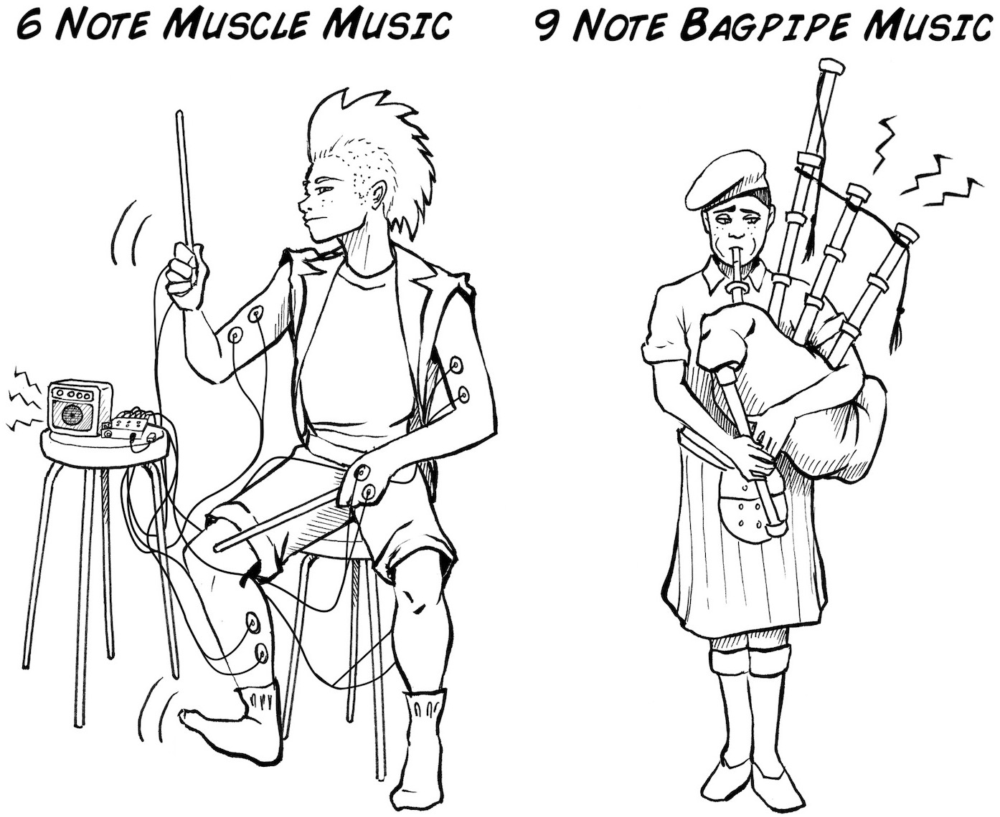

This new instrument works by associating every channel on the SpikerShield Pro
with a musical note. For example, connecting your forearm to the first channel
will cause the Arduino to play the note corresponding to that channel when the
forearm is flexed. This is a process similar to playing a key on a piano (but
with our 6 note muscle instrument versus a piano's 88 keys).

Like any [good synthesizer](https://en.wikipedia.org/wiki/Minimoog), our
synthesizer is programmable, that is, you can change which notes and
frequencies are associated with various channels. We have programmed [Mary Had
a Little Lamb](https://en.wikipedia.org/wiki/Mary_Had_a_Little_Lamb), [Frère
Jacques](https://en.wikipedia.org/wiki/Fr%C3%A8re_Jacques), the major
pentatonic scale, the minor [blues
scale](https://en.wikipedia.org/wiki/Blues_scale), the famous opening bass
from Ray Charles’ What’d I Say, and the first four bars of [Imperial
March](https://www.youtube.com/watch?v=hNv5sPu0C1E?) from Star Wars. The
preset change system allows for more musical versatility, since you can switch
from high pitch sweet nursery rhymes to low frequency dance and march music.

Which particular note the Arduino outputs depends on which preset it is
currently in, which are the sets of notes linked to the channels. For example,
when the board is in the Mary had a Little Lamb preset, triggering the first
channel will play an E4, the second channel a D4, the third a C4 and the
fourth a G4. Looking below at how this maps on a full 88 key piano may make
the concept more intuitive.

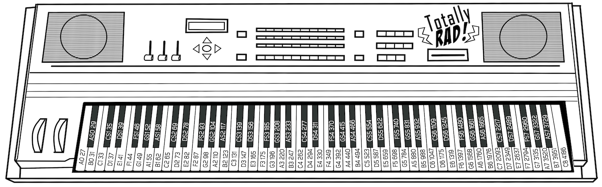

To achieve this, the code reads all the analog pins and sets the values in a
six-element array, then maps those values from a range of 0 to 300. If the
latter value, which has been mapped, surpasses a certain threshold, the
Arduino plays the note corresponding to the channel the signal came from. The
duration of said note is proportional to the strength of the spike. You can
use the white potentiometer knobs on the Music SpikerShield to alter the
sensitivity, or gain, to increase the signal strength from each muscle.

You might have noticed that the code allows only one note to be played at a
time. This is not an error, but rather a limitation of the tone generating
function and hardware. However, this same constraint serves as an introduction
to certain musical styles, traditions and techniques. Again, bagpipes.

Now let's play the music! An interesting aspect of this instrument is that you
have to practice your muscle coordination to get the tone sequences right. The
music is not driving your body. Your body is driving the music! In addition,
the white button is a "pitch change,"" a sort of "[whammy
bar](https://en.wikipedia.org/wiki/Vibrato_systems_for_guitar) that doubles
the frequency of the tone." The red button shifts through the preset tone
scales.

## Tutorial Video of Experiment

#### Downloads

> This experiment assumes you have a basic understanding of how to use the
> Arduino Platform and you know how to upload code to your board. If you are
> new to arduino, or need a refresher, check out [Getting Started with Arduino
> on Windows](https://arduino.cc/en/guide/windows#.UyIUTYW3t4x) or [Getting

> Started with Arduino on Mac OS X
> ](https://arduino.cc/en/guide/macOSX#.UyIU2IW3t4w).

>
> [Arduino Software](https://arduino.cc/en/main/software#.Uxd6XYWhZMk)

>
> You can download the muscle keyboard sketch here. Check out the comments for
> some insight into how it works!
>
> [Simple Serial Reader for Testing](files/SpikerShield_Pro_Serial_Read.zip)
>
> [Keyboard Sketch for Making Music](files/MuscleKeyboard.zip)

### Procedure

1. Your set up is easy_ Plug your orange recording cables in (color coded by channel) and then plug in a battery to power up your Muscle SpikerShield Pro. 

  
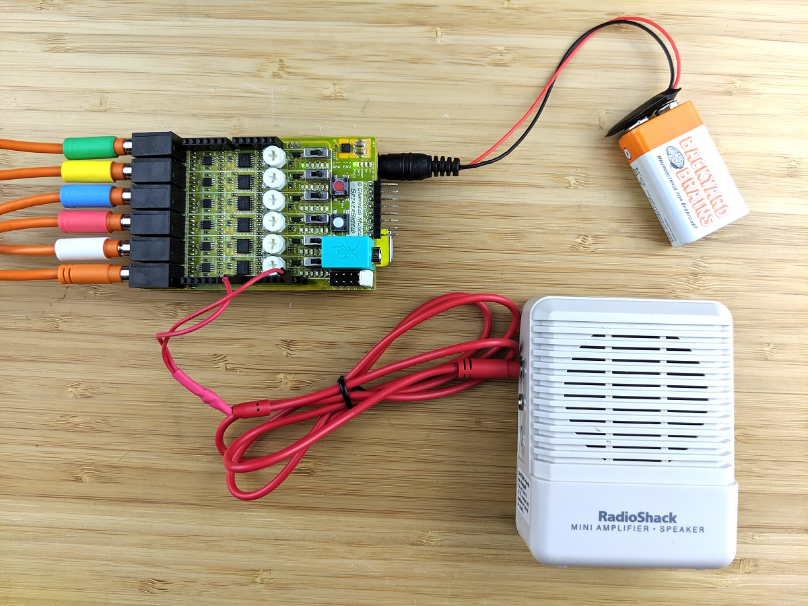

  2. Take your [Music-Interface Cable](https://backyardbrains.com/products/musicinterfacecable) and attach one pin out to digital pin 8 and another one to ground, then plug your cable into a speaker. 

  
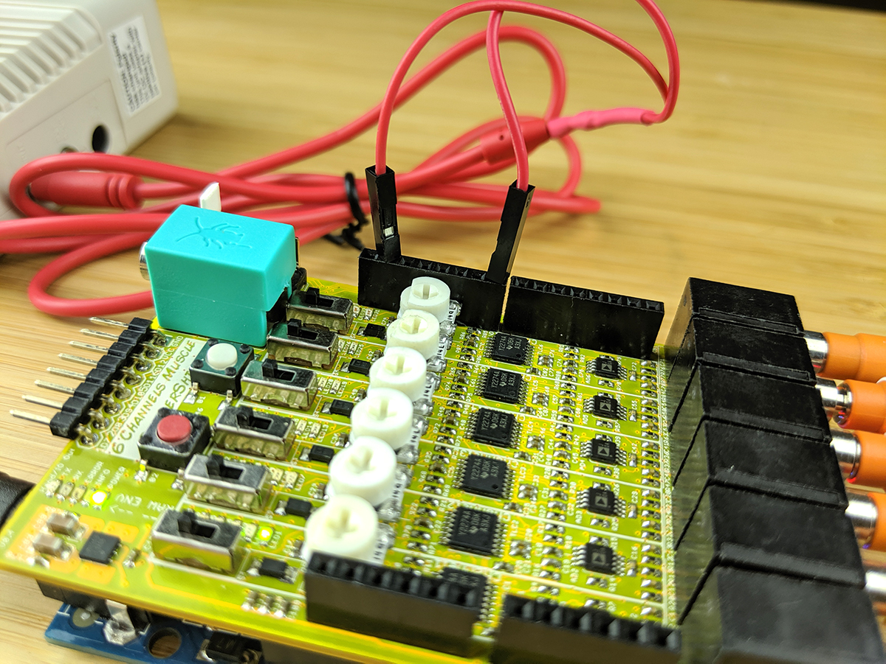

  

  3. We recommend testing your hardware by outputting a simple sound using the tone function. 
    
    ```cpp
    //Run this code to make sure your sound setup is working 
    void setup() {
    pinMode(8, OUTPUT);
    }
    
    void loop() {
    tone(8, 1000, 1000); //1000Hz is roughly the sound that an EKG makes when someone flatlines. 
    delay(1200); //You should hear that sound going on and off
    }
    ```      

  4. After that you can upload the muscle keyboard code to the board and place the electrodes on the muscles of your choice. However, be mindful of where you place the electrodes, since using two muscles that are close to each other can make the signal of one to interfere with the other. How you set up the electrodes will vary depending on the song or scale you are playing. For example, when we played the bass for "What’d I Say" by Ray Charles we only needed three channels and the pitch change button, so we used the electrodes on our calfs, my palm and my bicep, leaving my right free hand to use the pitch shift alteration (white button). 
  
  5. Next, for variation, you can switched between the sequences by changing the red button. 
  
  6. The first musical sequence is for Mary had a Little Lamb and is below. E4 is muscle channel 1, D4 is muscle channel 2, C4 is muscle channel 3, and G4 is muscle channel 4. Channels 5 and 6 are not coded for notes, as the first part of Mary had a Little Lamb only has four notes. 

  
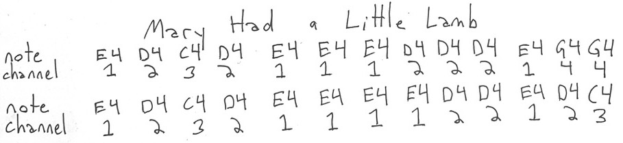

  7. The second musical sequence is for Frère Jacques and is below. On the code channel 1 is G4, channel 2 is A4, channel 3 is B4, channel 4 is C5, channel 5 is D5, and channel 6 is E5. We cheat a little bit on the last part as we need 7 notes to make the song but we pull it off with 6 (the circled notes are where we cheated). 

  
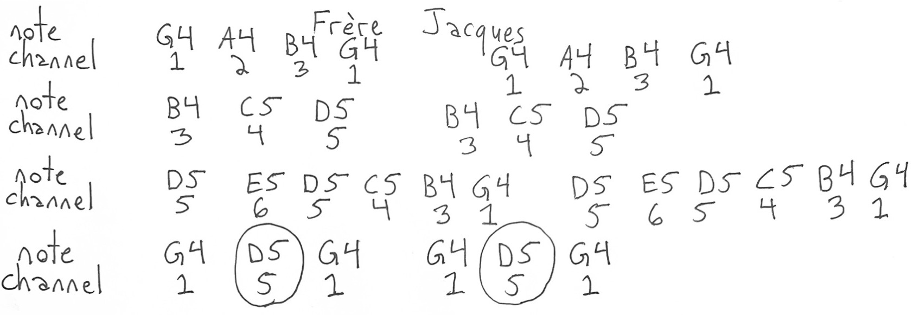

  

  8. The third musical sequence is for the pentatonic scale and is below. The first channel is C5, the second channel is D5, the third channel is E5, the fourth channel is G5, and the fifth channel is A5. You can play around with the scale to make a melody. Note that you can double the notes by pressing the white buttons (which doubles the pitch). 

  
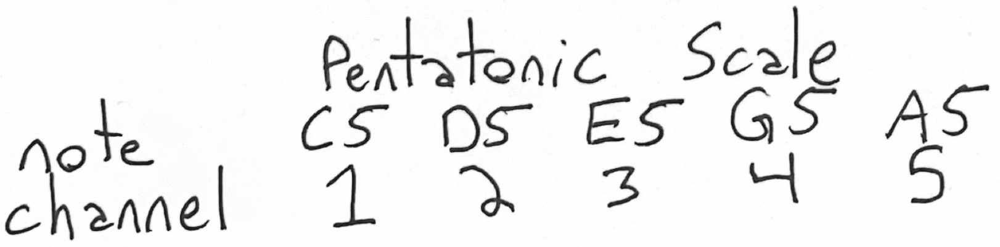

  

  9. The fourth musical sequence is for the minor blues scale and is below. The first channel is C3, the second channel is D3 sharp (DS3), the third channel is F3, the fourth channel is F3 sharp (FS3), the fifth channel is G3, and the 6th channel is A3 sharp (AS3). Again, you can play around and double the pitches with the white button. 

  
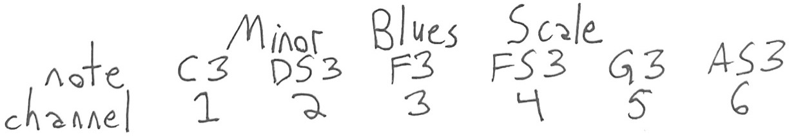

  

  10. The fifth sequence is for Ray Charles "What'd I say." Below we only have three notes, as they just double. E1 is the first channel, A1 is the second channel, and B3 is the third channel. You can double the pitches by touching the white button to get E2, A2, and B2. That is what the + symbol means. 

  
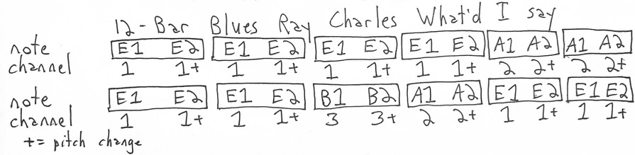

  

  11. The sixth and final sequence is for the Star Wars Imperial March. The first channel is G4, the second channel is E4, the third channel is B4, the fourth channel is D5, the fifth channel is E5, and the 6th channel is FS4. 

  
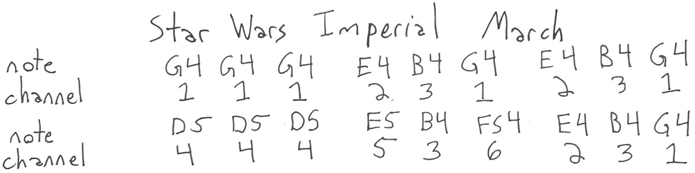

  

  12. Now it is time to place the electrodes. Try putting pairs on both your hands near your thumbs, and then on your biceps, and on your calves. The ground can be placed on the back of my hand. 

  
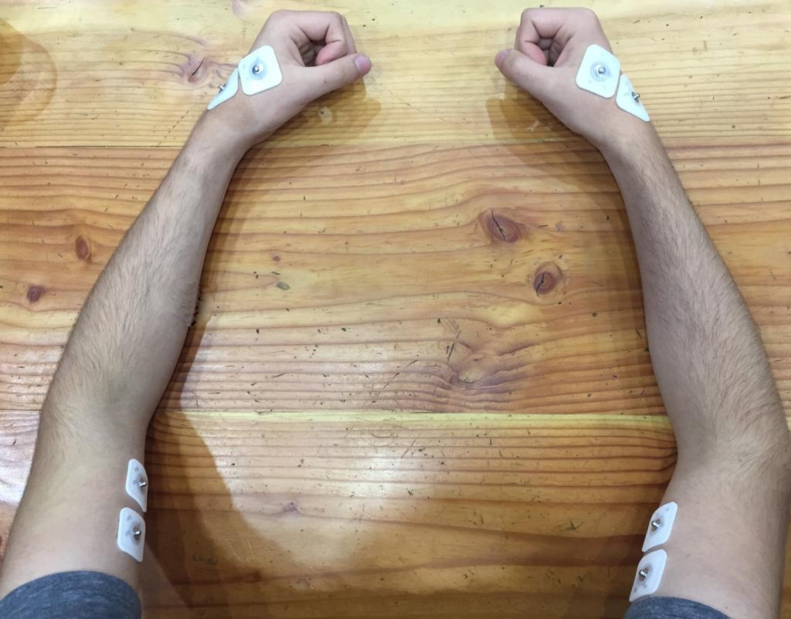

  

  
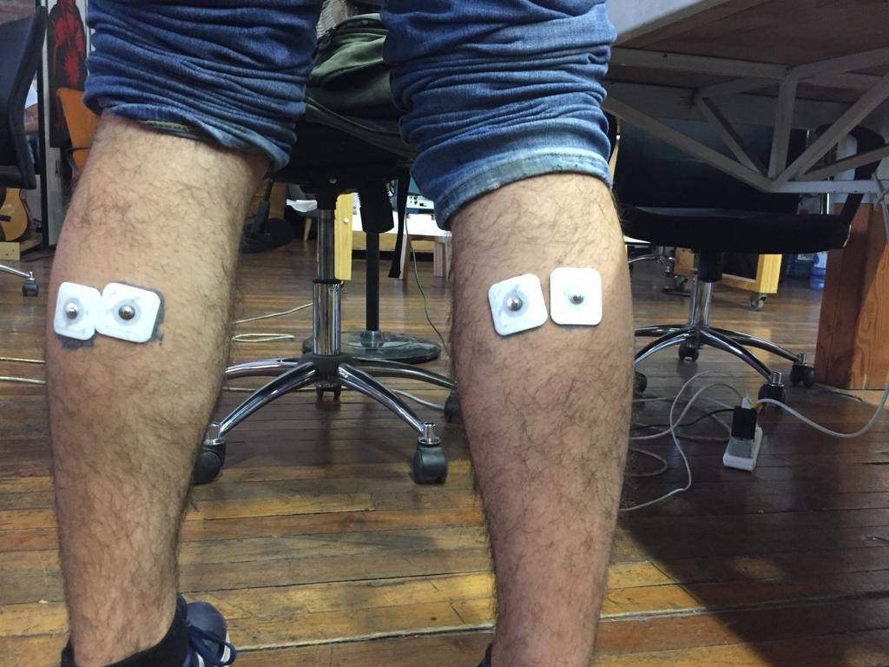

  13. Hook up the electrode cables to the electrodes (using video above as reference), and now it is time to dive in and make your body a musical instrument. Below is the code we wrote. 
    
    ```cpp
    #include "reference.h"

#define NUM_OUT 6

#define NUM_SONG 6 //Current number of songs

int readings[6];
    int musclePin[6] = {A0, A1, A2, A3, A4, A5};
    int maxINPUT = 800;
    
    int button1 = 0; //Red Button in the board. Used to shuffle through different songs
    int button2 = 0; //White button in the board. Used to increase the pitch of the notes
    
    int notesMHLL[] = {NOTE_E4, NOTE_D4, NOTE_C4, NOTE_G4, 0, 0}; //musical notes for Mary had a Little Lamb
    int notesFJ[] = {NOTE_G4, NOTE_A4, NOTE_B4, NOTE_C5, NOTE_D5, NOTE_E5}; //musical notes for Frère Jacques
    int notesMajorPentatonic[] = {NOTE_C5, NOTE_D5, NOTE_E5, NOTE_G5, NOTE_A5, 0}; //musical notes for a pentatonic scale
    int notesMinorBlues[] = {NOTE_C3, NOTE_DS3, NOTE_F3, NOTE_FS3, NOTE_G3, NOTE_AS3}; //musical notes for a minor blues scale
    int notesRayBass[] = {NOTE_E1, NOTE_A1, NOTE_B1, 0, 0, 0}; //notes for the first part of the bass in Ray Charles' "What'd I say"
    int notesImperialMarch[] = {NOTE_G4, NOTE_E4, NOTE_B4, NOTE_D5, NOTE_E5, NOTE_FS4}; // notes for the Imperial March
    
    
    float distort = 2;
    
    void setup() {
      Serial.begin(9600);
      for (int i = 0; i < NUM_OUT; i++) {
        pinMode(8, OUTPUT);
      }
      digitalWrite(13, HIGH); //Turns all the LEDs in the lower part of the board (under the quarter-inch jacks)
    }
    
    void loop() {
    
      int biggestVal = 0;
      int index = 0;
    
      int song[6]; //array set to be equal to one of the other note arrays (MHLL, FJ, Pentatonic). Song can be swtiched using the red button
    
      if (digitalRead(5) == HIGH) {
        delay(200);
        button1++;
      }
    
      switch (button1 % NUM_SONG) { //checks what set of notes to use
        case 0_
          Serial.print("//MHLL// ");
          for (int i = 0; i < NUM_OUT; i++) {
            song[i] = notesMHLL[i];
            distort = 2;
          }
          break;
        case 1_
          Serial.print("//FJ// ");
          for (int i = 0; i < NUM_OUT; i++) {
            song[i] = notesFJ[i];
            distort = 2;
          }
          break;
        case 2_
          Serial.print("//PENT.// ");
          for (int i = 0; i < NUM_OUT; i++) {
            song[i] = notesMajorPentatonic[i];
            distort = 2;
          }
          break;
        case 3_
          Serial.print("//BLUE// ");
          for (int i = 0; i < NUM_OUT; i++) {
            song[i] = notesMinorBlues[i];
            distort = 2;
          }
          break;
        case 4_
          Serial.print("//RAY//");
          for(int i = 0; i < NUM_OUT; i++){
            song[i] = notesRayBass[i];
            distort = 1.3348;
          }
          break;
        case 5_
          Serial.print("//DUNDUNDUN//");
          for(int i = 0; i < NUM_OUT; i++){
            song[i] = notesImperialMarch[i];
            distort = 0.5;
          }
          break;
      }
    
      button2 = digitalRead(6);
      if (button2 == HIGH) {
        //checks if button2 is clicked. If it is, increases the frequency of all the notes
    
        Serial.print("***HIGHPITCH*** ");
        for (int i = 0; i < NUM_OUT; i++) {
          song[i] = distort * song[i];
        }
      }
    
      for (int i = 0; i < NUM_OUT; i++) {
        //First finds the value for a specific channel and outputs that raw value to the monitor. Then chacks is that value is the largest so far.
    
        readings[i] = analogRead(musclePin[i]);
    
        Serial.print("Channel ");
        Serial.print(readings[i]);
        Serial.print(" ");
    
        readings[i] = constrain(readings[i], 0, maxINPUT);
        readings[i] = map(readings[i], 0, maxINPUT, 0, 200);
    
        if (biggestVal < readings[i]) {
          biggestVal = readings[i];
          index = i;
        }
      }
    
      Serial.println();
    
      if (biggestVal > 30) {
        //Checks if the largest reading is bigger than the threshold
        tone(8, song[index], biggestVal);
    
      }
      else {
        //Otherwise plays no sound. This helps eliminate noise from small fluctuations
        tone(8, 0, 10);
      }
    ```

  14. The reference code that I point to in the code is a library of all 88 keys on a piano that you can select to map to different outputs on the Muscle SpikerShield Pro. 
    
    ```cpp
    //This is it, all 88 keys of a piano, from lowest to highest. The S stands for Sharp
    
    #define NOTE_A0  27

#define NOTE_AS0  29

#define NOTE_B0  31

#define NOTE_C1  33

#define NOTE_CS1 35

#define NOTE_D1  37

#define NOTE_DS1 39

#define NOTE_E1  41

#define NOTE_F1  44

#define NOTE_FS1 46

#define NOTE_G1  49

#define NOTE_GS1 52

#define NOTE_A1  55

#define NOTE_AS1 58

#define NOTE_B1  62

#define NOTE_C2  65

#define NOTE_CS2 69

#define NOTE_D2  73

#define NOTE_DS2 78

#define NOTE_E2  82

#define NOTE_F2  87

#define NOTE_FS2 93

#define NOTE_G2  98

#define NOTE_GS2 104

#define NOTE_A2  110

#define NOTE_AS2 117

#define NOTE_B2  123

#define NOTE_C3  131

#define NOTE_CS3 139

#define NOTE_D3  147

#define NOTE_DS3 156

#define NOTE_E3  165

#define NOTE_F3  175

#define NOTE_FS3 185

#define NOTE_G3  196

#define NOTE_GS3 208

#define NOTE_A3  220

#define NOTE_AS3 233

#define NOTE_B3  247

#define NOTE_C4  262

#define NOTE_CS4 277

#define NOTE_D4  294

#define NOTE_DS4 311

#define NOTE_E4  330

#define NOTE_F4  349

#define NOTE_FS4 370

#define NOTE_G4  392

#define NOTE_GS4 415

#define NOTE_A4  440

#define NOTE_AS4 466

#define NOTE_B4  494

#define NOTE_C5  523

#define NOTE_CS5 554

#define NOTE_D5  587

#define NOTE_DS5 622

#define NOTE_E5  659

#define NOTE_F5  698

#define NOTE_FS5 740

#define NOTE_G5  784

#define NOTE_GS5 831

#define NOTE_A5  880

#define NOTE_AS5 932

#define NOTE_B5  988

#define NOTE_C6  1047

#define NOTE_CS6 1109

#define NOTE_D6  1175

#define NOTE_DS6 1245

#define NOTE_E6  1319

#define NOTE_F6  1397

#define NOTE_FS6 1480

#define NOTE_G6  1568

#define NOTE_GS6 1661

#define NOTE_A6  1760

#define NOTE_AS6 1865

#define NOTE_B6  1976

#define NOTE_C7  2093

#define NOTE_CS7 2217

#define NOTE_D7  2349

#define NOTE_DS7 2489

#define NOTE_E7  2637

#define NOTE_F7  2794

#define NOTE_FS7 2960

#define NOTE_G7  3136

#define NOTE_GS7 3322

#define NOTE_A7  3520

#define NOTE_AS7 3729

#define NOTE_B7  3951

#define NOTE_C8  4186 

```

### Troubleshooting

1. Since we have six wires going to different muscles, we have to be careful about the organization of the wires to make sure we have a full range of movement. See video above. 
  2. If you are not causing a tone to activate, you can look at the serial monitor to see the values your muscle contracting is causing, and change the gain by increasing it (clockwise) or decreasing it (counter-clockwise) on the corresponding white knobs on the SpikerShield Pro board. 

### Discussion

1. While generating pure tones one at a time still allows for interesting music, it would be great to be to play chords but contracting multiple muscles at the same time. The Arduino Uno cannot do this, but perhaps more powerful Arduino boards can. 
  2. It has not escaped our notice that it would be more interesting to connect the Muscle Spikershield Pro to a drum machine or Roland synthesizer to generate more complex sounds and loops. We are investigating how to do this. 
  3. While we programmed our preferred scales into the Arduino, you are free and encouraged to modify the program. 
  4. While we stated above that we only have six tones, if you use the white pitch doubling button on the SpikerShield Pro, you actually have a total of 12 tones. Take that bag pipes! 
  5. A wireless version, where someone could freely dance and generate music, would certainly be compelling. What do you think are the technical challenges for achieving this? 
  6. You can create a version of the [Simon Game](https://en.wikipedia.org/wiki/Simon_\(game\)), where every time a particular LED lights up, you have to flex a specific muscle. This is interesting because you could measure reaction times that also involve the ability to memorize a sequence. We leave you with a very basic "[untested in anyway code](./files/BYB_Simon.zip)" that Cristian and I did on the last day of our internship. It compiles without errors, but the LED code needs to be updated to work with the SpikerShield Pro. 
  7. Have you developed a Muscle Spikerbox Pro application? Let [let us know!](mailto:tim@backyardbrains.com)
