## Background: Transistor Theory

Ahh yes, the transistor. We all owe you so much. The transistor is the reason
why your cell phone fits inside your pocket and why your SpikerBox can measure
spikes from neurons.

**Time:**  45 Minutes

**Difficulty:**   Advanced

#### What will you learn?

In this lesson you will learn what a transistor is and how it works. It is a
complicated, lovely mix of physics and chemistry, but with patience you can
learn the principles behind the transistor. In the [next
lab](./transistorDesign) you will use
this theory to build your very own junior SpikerBox on a solderless
breadboard.

##### Prerequisite Labs

* [SpikerBox](spikerbox) - A familiarity with spikes will make this theory writeup more meaningful

##### Equipment

* [Your Brain](https://en.wikipedia.org/wiki/Brain)

## Background

Modern computing and electronics are built upon the transistor, making it in
our opinion the most important invention of the 20th century. Transistors are
used as switches (devices telling signals where to go) or amplifiers (devices
transforming "small" signals into bigger ones), and these two functions are
what make your favorite mobile phones possible.

[ 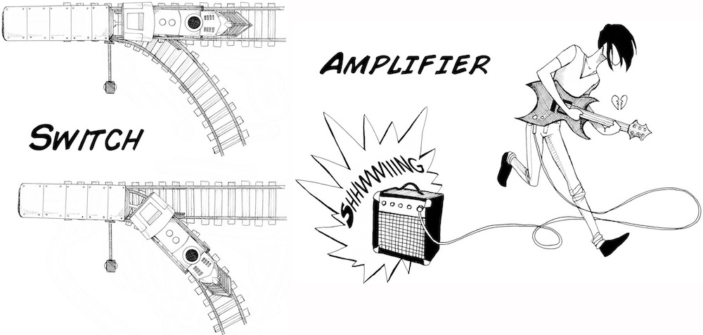](./img/Amptraincombo_smaller.jpeg)

Transistors can be mass produced at very low costs, and transistors are the
reason that computers keep getting smaller yet more powerful every day. There
are more than 60 million transistors built every year for every man, woman and
child on earth. Transistors are the key to our modern world. So, if they are
so wonderful, then how do they work?

##### p-n junctions and doping

In order to understand how transistors work, you first must understand the
concept of the p-n junction. The p-n junction shares some similarities with
the neural lipid bi-layer (cellular membrane) that we learned about in
Experiment 3. Recall, the lipid bi-layer is the barrier between the inside and
outside of the cell, and it is characterized by a buildup of charged ions on
both sides of the barrier. The charged ions generate a difference in electric
potential that ultimately allows action potentials. Similarly, a p-n junction
is the border between two materials with different charges on them. Instead of
ions, the charges in a p-n junction are controlled by the presence (-) or
absence (+) of electrons.

Electrons have a negative charge, and the motion of these charges through
conductive material is the basis of electricity. In some materials (named
semiconductors) we can manipulate how many electrons are present through a
process called doping, which means introducing impurities into extremely pure
semiconductors. Get out your periodic tables, because this process is only
possible due to the chemical properties of certain elements.

[ 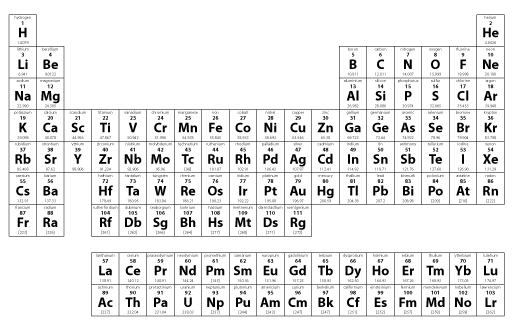](./img/Periodic_table.png)

Semiconductors come from what was known as Group IV of the periodic table,
which includes carbon, silicon and germanium. Science fiction has often
referenced these elements, because their properties make them such a key
aspect of both biological and machine-based systems. Each Group IV element has
four electrons in its outer energy level, but it can ultimately hold up to
eight electrons. This is key, because these Group IV elements can then form
four-way covalent bonds in a crystal lattice so that each atom's outer energy
level is stable.

[ 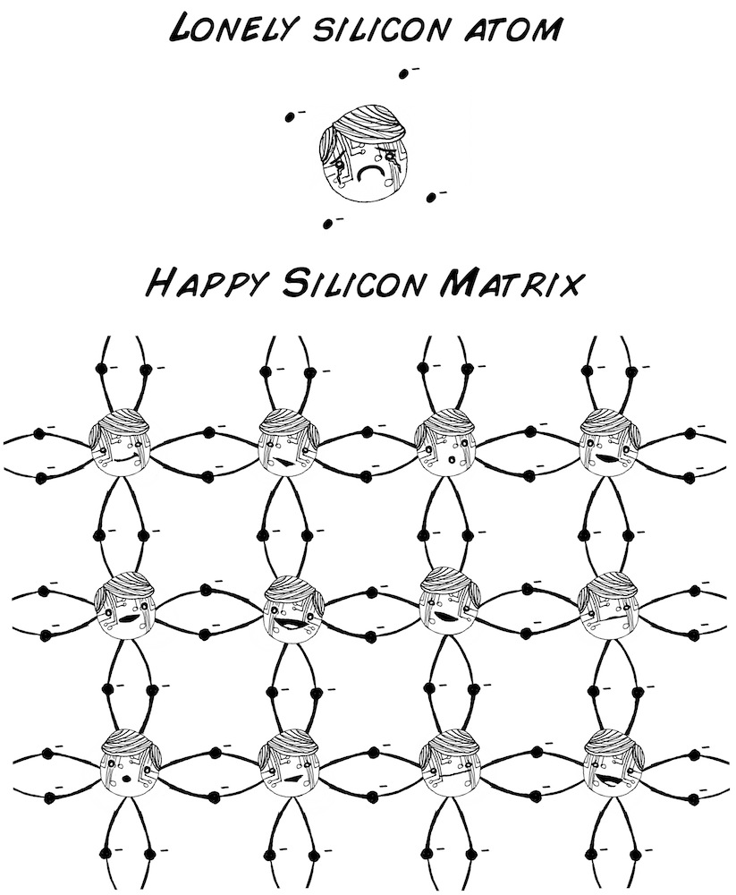](./img/Figure3_Silicon.jpeg)

Group III elements (such as boron or gallium) have three electrons in their
outer-most electronic shell, while Group V elements (such as phosphorus or
arsenic) have five electrons in their outer-most electronic shell. Elements
from both of these groups can also form covalent bonds with electrons.

[
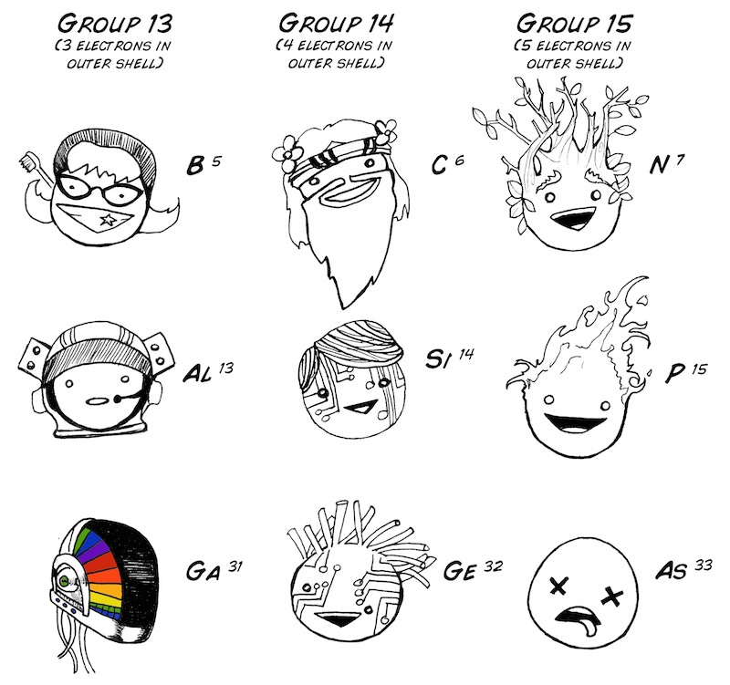](./img/Figure4_GroupIII_IV_V_atoms.jpeg)

If you take a block of a pure Group IV element like silicon and zap it with
some Group III atoms like boron, the boron will attempt to fit into the
lattice. However, since the boron only has three electrons in the outer shell,
one of the four silicon neighbors in the lattice will be short one electron in
the covalent bond. Thus, the bond will have a net positive charge (absence of
electron), which can attract and accept an electron from a neighboring bond.
Group III atoms are known as acceptors.

Doping a semiconductor with acceptors will generate an excess of these
absences-of-electrons (known as holes), which results in the appearance of a
surplus of "positive" charges in the material, leading to this material being
called "positively-doped" or "p-doped".

As you might conversely expect, when Group V elements like phosphorus that
have five electrons are added to silicon, this forms bonds with an excess of
electrons. Group V atoms are thus known as "donors". Doping a semiconductor
with donors will generate a large concentration of negatively charged
electrons, making the material "negatively doped" or "n-doped".

Both p-doped and n-doped semiconductors are relatively electrically conductive
on their own, but what happens when you put a block of p-doped semiconductor
next to a block of n-doped semiconductor? The electrons in the n-doped
material are attracted to the positively charged p-doped substance, and the
excess electrons and positive charges meet in the middle at the junction
between the two blocks. When the electrons and holes meet, they cancel each
other out and form a layer that is depleted of charges, or a depletion layer.
Like the neural bi-layer, the resultant electrical potential properties of the
p-n junction allow many functions.

[
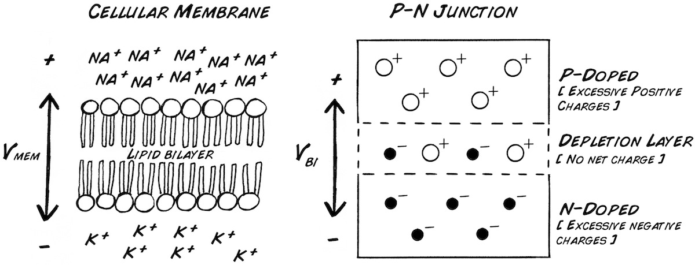](./img/Figure7_Partdeux_vs_CellMembrane.jpeg)

The depletion layer, due to the lack of free charges, is non-conductive
without an applied external voltage. If the p-doped side of the p-n junction
is connected to the positive voltage and the n-doped side with the negative
voltage of a battery, this results in a lessening of the electric potential
barrier and allows electrons to cross the p-n junction, which results in
electric current flow. This process is called forward bias. If, on the other
hand, the p-type semiconductor is connected with the negative voltage and the
n-type with the positive voltage, the electrons and positive charges (holes)
are pulled further away from the depletion region, which results in a larger
electric potential barrier that behaves as an insulator. This is called
reverse bias.

[
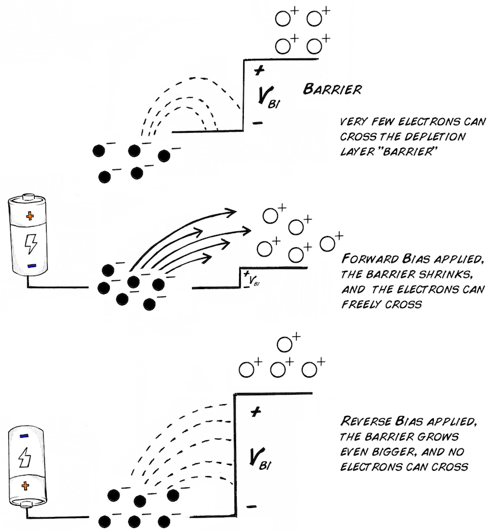](./img/Figure8_electron_jumping2.jpeg)

Thus, p-n junctions are therefore commonly used as diodes, which are devices
that allow electricity to flow in one direction but not in the opposite
direction. Importantly, diodes only allow one-way current through if a certain
voltage is reached, or "forward voltage."

[ 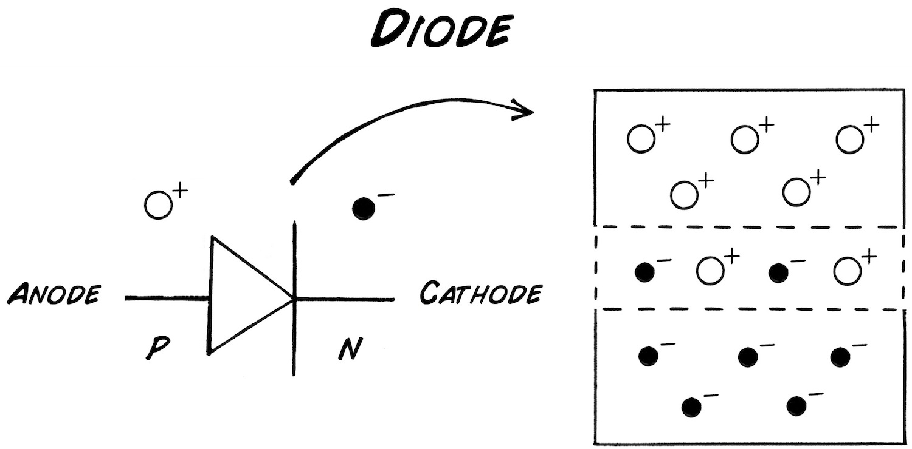](./img/Diode.jpeg)

[ 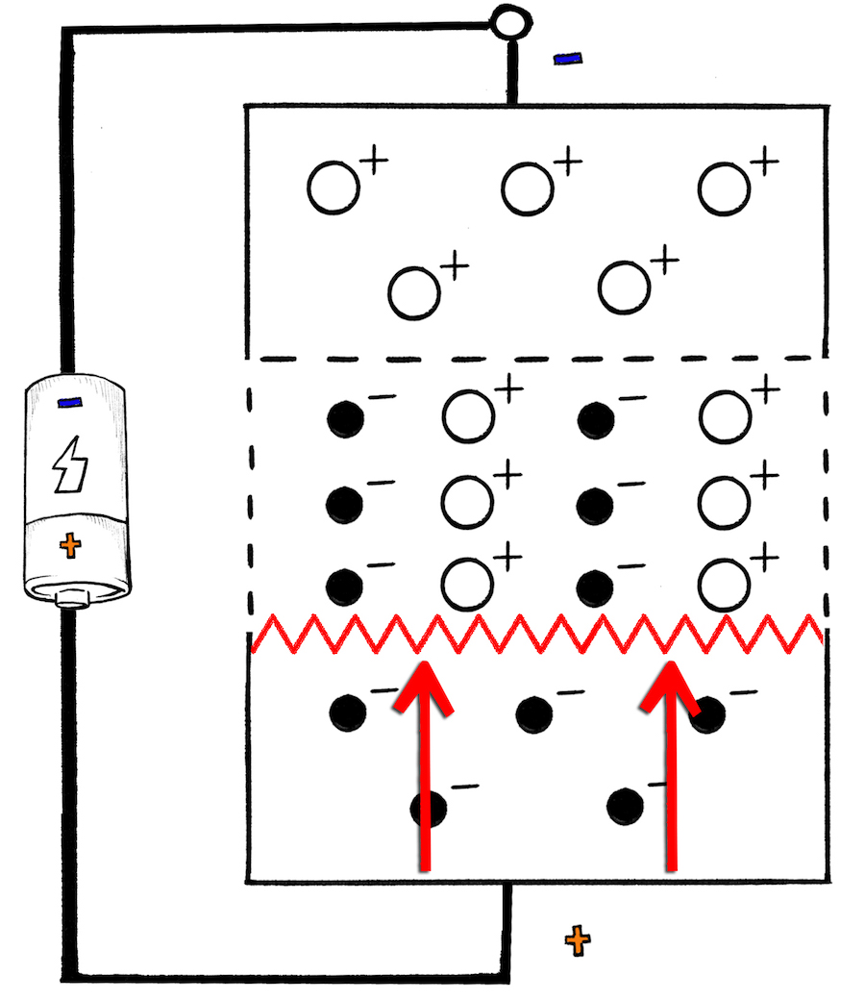](./img/Diode_wrong_web.jpg)

[ 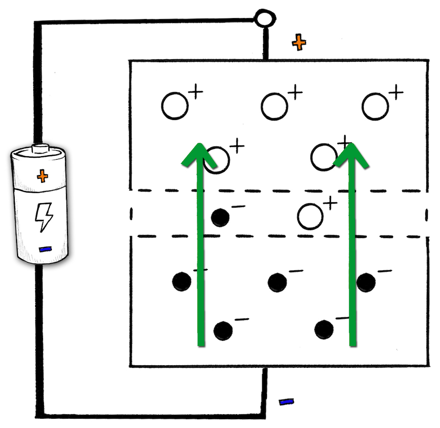](./img/Diode_Correct_web.jpg)

Some diodes release light with the current passes, hence the name "Light
Emitting Diode" or "LED."

[ 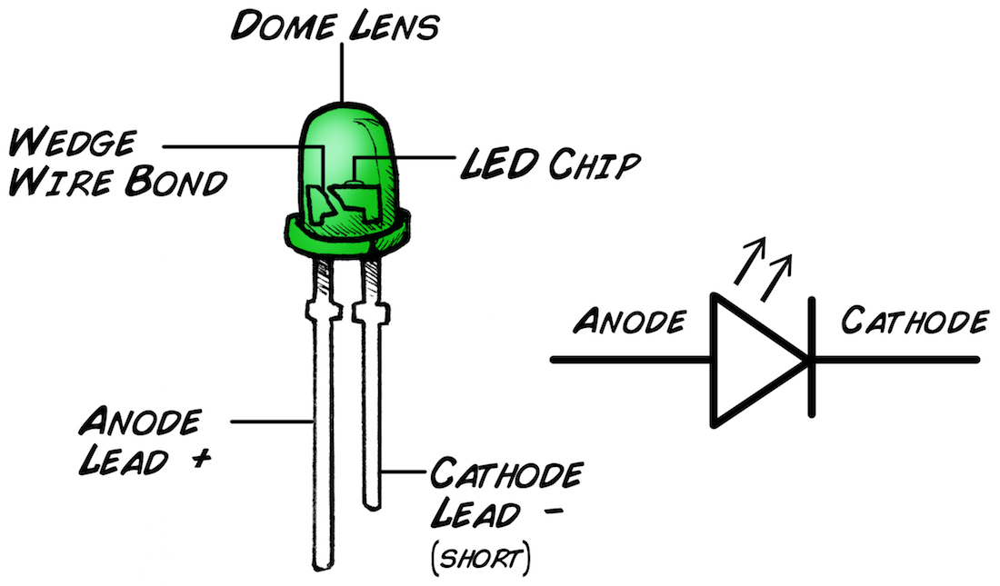](./img/LEDdiagramcolor_web.jpg)

##### Transistor Theory

Now that we understand how p-n junctions and diodes work, what would happen if
you made a "sandwich" with one block of p-doped material placed between two
blocks of n-doped material?

[ 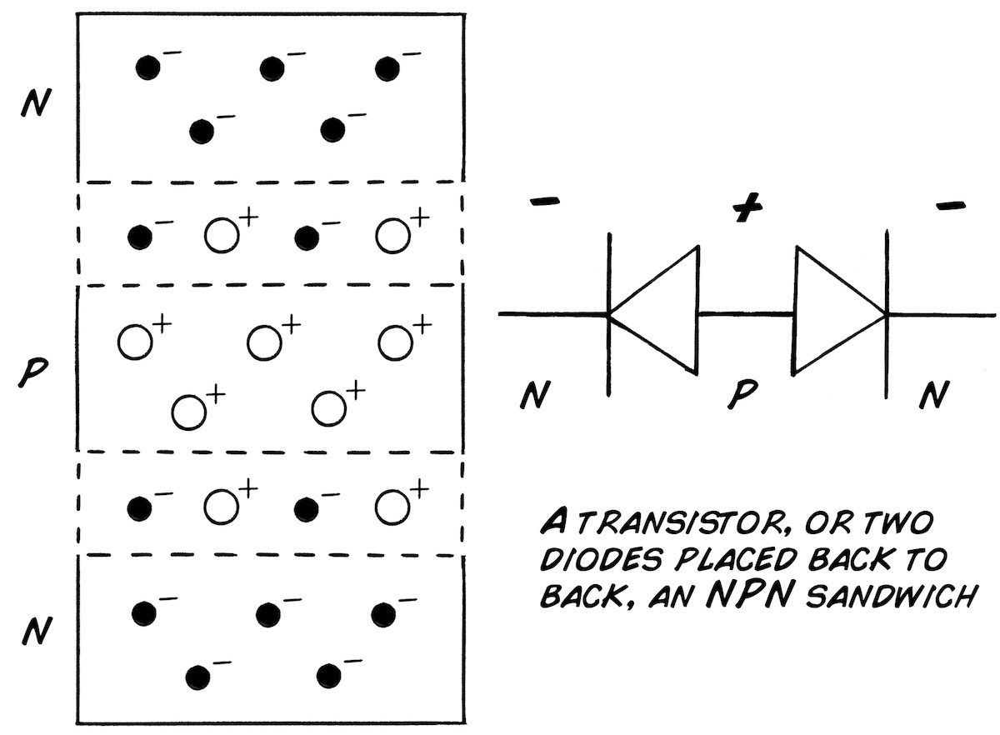](./img/Figure10_NPN1.jpeg)

We now have a device with one "n-p" junction and one "p-n" junction that acts
like two diodes* placed back to back. What would happen if you applied a large
voltage across the whole sandwich?

[ 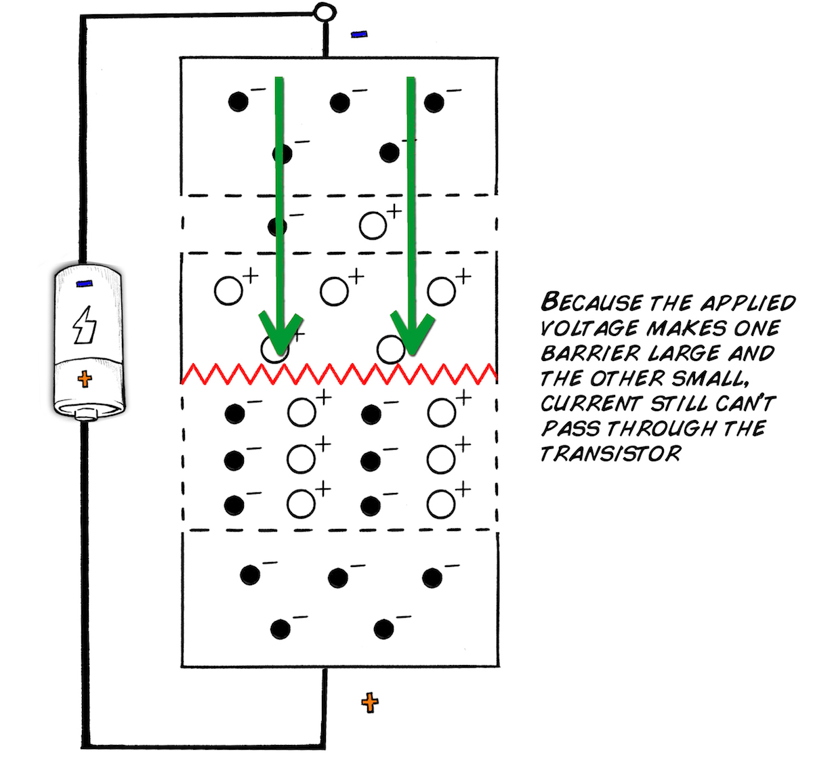](./img/fig9TransistorFlip_web.jpg)

We didn't generate any current flow! What if we reversed the battery?

With the diodes back-to-back*, the applied voltage, no matter what direction
it is in, will always reverse-bias one of the diodes and prevent current flow.
But...hold on ... what if we add a smaller voltage to the terminal of the
p-block? What then?

[ 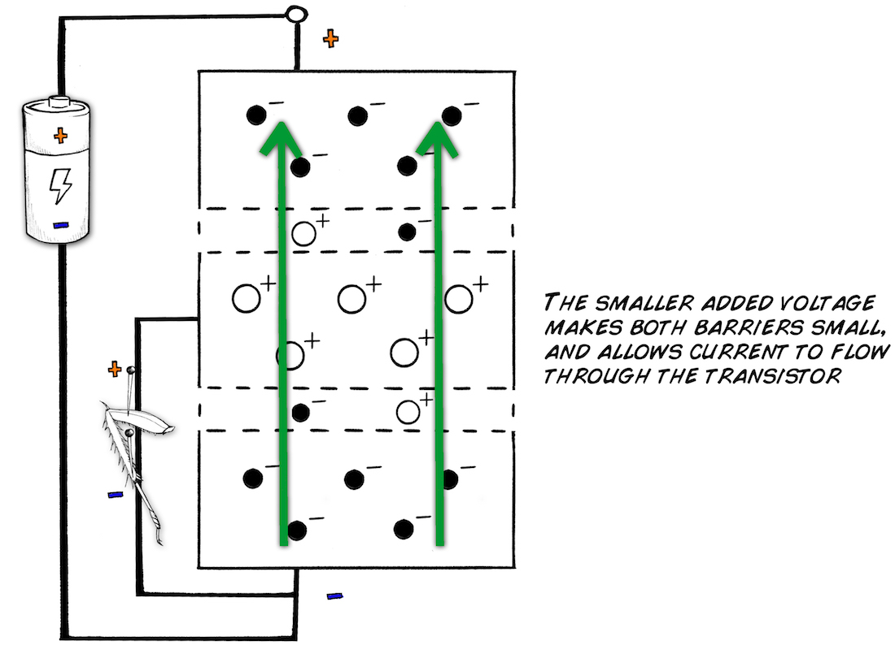](./img/fig11NEW2withLeg_web.jpg)

The top n-p junction, which is reverse biased by the main battery voltage,
prevents any current flow. But, forward-biasing the lower p-n junction with
the smaller voltage causes a huge number of electrons to shoot into the
p-block. This has the effect of lowering the current flow barriers in both
depletion layers, and we get an exponential increase in electrons that can
travel through the transistor. We've got current!

The "bipolar junction transistor" is the real-world component of this
sandwich. There are two varieties, the "PNP" and the "NPN," but we will focus
on the more common NPN configuration. In an NPN transistor, the three
terminals are named the emitter (first N-block), the base (P-block), and the
collector (second N-block).

[ 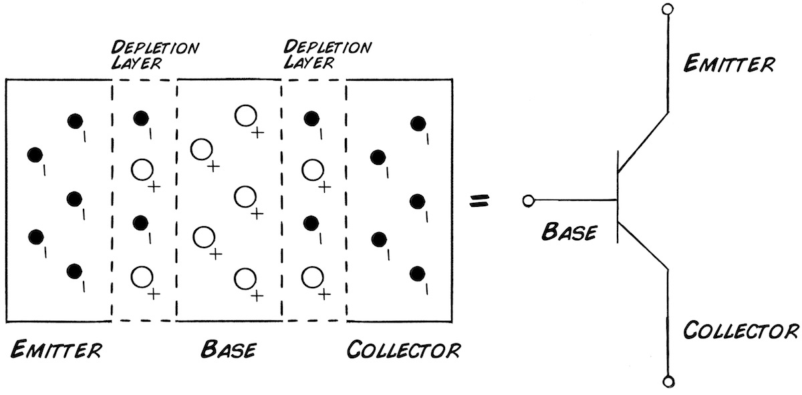](./img/Figure12_NPN_to_BJT.jpeg)

Now we know how a transistor works, but why is its function important to our
mission to learn about neural action potentials? A neural action potential has
an extremely small voltage that needs to be amplified to be observed. If we
set up our NPN transistor so that our little neural signal goes into the
P-block (the base) and our large voltage (battery) going across the two
n-blocks (collector and emitter), we have an amplifier! If we then monitor the
current between the collector and emitter, we should a see a signal that looks
just like our action potential ...but a lot bigger!

Building a circuit to do this is slightly more complicated than simply hooking
up a neural signal, a transistor, and a battery, and we will go through this
in the following write-up. But....If we build the circuit correctly, we should
be able to amplify that tiny action potential signal enough that we can hear
it through a simple speaker. And the world of neurons is ours to study.

[ 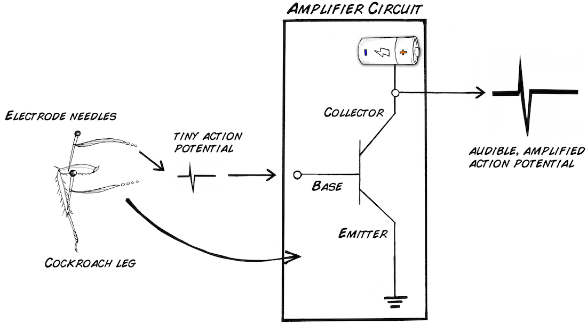](./img/fig12ampNewLeg_web.jpg)

Now on to [part
II](./transistorDesign) and building
your circuit...

*Note_ Unfortunately, you can't simply buy two RadioShack diodes and place them back-to-back with solder to make a transistor. The effects described above happen at the crystal lattice level. 

## Discussion Questions

1. Why are the Group IV elements called "semi"-conductors? Do they conduct at all times? If not, what must be done to them to make them conduct? 
  2. What happens when Group III atoms are added into a block of Group IV material? What about when Group V atoms are added to Group IV instead? What do you think would happen if you just mixed Group III and Group V atoms? Do you think the resultant mix would be conductive? 
  3. In our [temperature experiment](./temperature) we learned about the electro-chemical interactions that occur at the cellular membrane. How is a p-n junction similar to the lipid bilayer of a cell? How is it different? 
  4. How do diodes relate to transistors?
