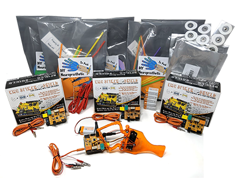
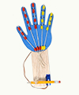
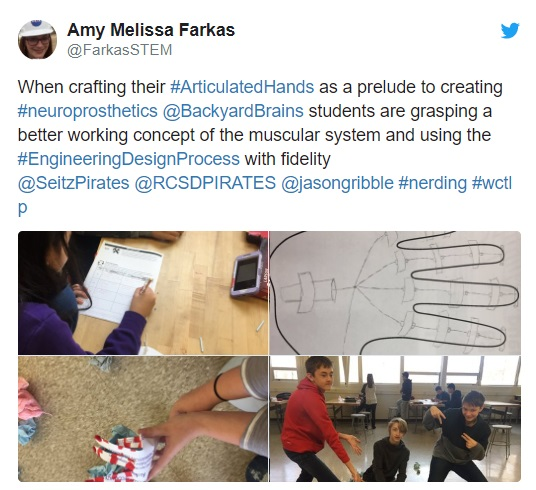
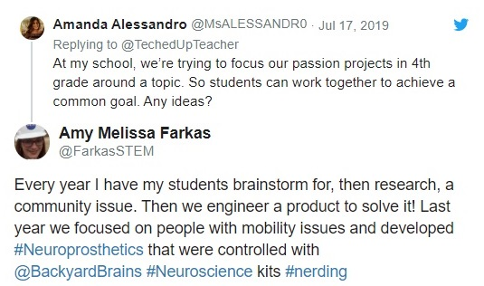

## Brain-Machine Interface Classroom Bundle

#### $999.99

### A Starter Bundle to Bring Brain-Machine Interfaces to your Classroom!

Brain-Machine Interfaces are devices that, you guessed it, help your brain
interface directly with machines in the world around you! By recording from
the electrical activity of your nervous system, you can transform those neural
signals into instructions for programs and robotics.

### Teaching Tech that Helps

For a great example of Brain-Machine Interfaces (like the DIY Neuroprosthetic
Kits) impacting students in an educational and social way, check out [this
example ](https://blog.backyardbrains.com/2019/09/8th-grade-classroom-
showcase-students-develop-neuroprosthetics-designed-to-assist-senior-citizens-
win-state-wide-awards/)from a Middle School classroom in Riverview, MI.

### Kit Contents:

  * 6x [DIY Neuroprosthetic Kit (5-pack)](./DIYHand)
  * 3x [Muscle SpikerShield Bundle](./MuscleSpikerShieldBundle)
  * 3x 9v Batteries with Leash 
  * 1x [Claw Bundle](./ClawBundle)
  * 4x [Music-Interface Cable](./musicinterfacecable)
  * 2x [Large Muscle Electrodes](./emglargeelectrodes)

This is a classroom bundle, and will save you $100 over buying our [DIY
Neuroprosthetic 5-Packs](DIYHand) individually. The bundle has the hardware to
support up to 30 students, each building their own Neuroprosthetic "Cyborg
Hands." It also supports four lab stations for other Brain-Machine Interface
labs, like the "Muscle Music" labs. And of course, students can also create
their own projects and inventions!

### More Than 30 Students?

We also offer individual [DIY Neuroprosthetic Kits](./DIYHand) in packs of five.
Ordering a few of these 'refill packs' will make sure you have enough for all
of your students.

### What About Next Semester?

This bundle is designed to give you everything you need to bring BMI
experiments like the DIY Neuroprosthetic and Muscle Music labs to your
students. After the DIY Neuroprosthetic experience, students will keep their
personally-crafted cyborg hands. The classroom, of course, will keep the more
expensive Muscle SpikerShields, Claw kit, and cables. This way, for the next
class you want to share the experience with, you only need to order the refill
packs and not the whole classroom bundle.

