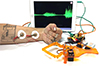
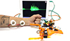
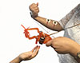
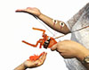

## The Claw

 

 

  * [__Default Arduino Code for Muscle-Based Claw Control](https://raw.githubusercontent.com/BackyardBrains/SpikerShield/master/Muscle/Arduino%20Code/Gripper/MuscleSpikerShieldWithGripper_V1_0.ino)
  * [__Test Code that loops Claw between Open and Closed](https://raw.githubusercontent.com/BackyardBrains/SpikerShield/master/Muscle/Arduino%20Code/Gripper/MuscleSpikerShield_GripperLoop.ino)
  * [__PCB Schematics SMD (v2.61)](./files/EMGSpikerShield.SMD.V2.61.pdf)
  * [__Controlling the Claw](../Experiments/MuscleSpikerShield_GripperHand)

Jealous of the cyborgs you see in the movies? Wish your brain could send
signals to robotics devices? Your days of yearning are over. Now you can
control a Robotic Claw with your own Brain Machine Interface! Experience the
future of robotics with Backyard Brain's "The Claw," your very own DIY
neuroprosthetic. The Claw is a motorized gripper that makes it possible for
YOU to be the innovator of human interfaces! Paired with a pre-loaded Arduino
microcontroller, the Claw responds to the EMG signals of your muscles: Make a
grip with your fist, and the Claw's appendages close. Relax, and the Claw
relaxes!

### Product Details

The bundle includes everything you need to start understanding the field of
neuroprosthetics. With the help of our Muscle SpikerShield, we've added great
additions such as preloaded code to maximize the potential of your
experiments! First, stick skin electrodes on the muscles that exhibit
contraction and relaxation. Then, connect the Claw to the Muscle Spikeshield
and then your setup is complete! You can adjust EMG sensitivity readings to on
the Muscle SpikerShield to accommodate all types of muscles.

### The Claw Interface in Action!

### Kit Contains

  * 1x Motor operated Roach Claw
  * 1x RoachClaw Specialized-Muscle SpikerShield that mates with Arduino
  * 1x Arduino with preloaded Code 
  * 1x Orange Muscle Electrode Cable with 3 alligator clips (Red,Red,Black) 
  * 50x Large Muscle Electrode stickers
  * 2x 9v Battery 

