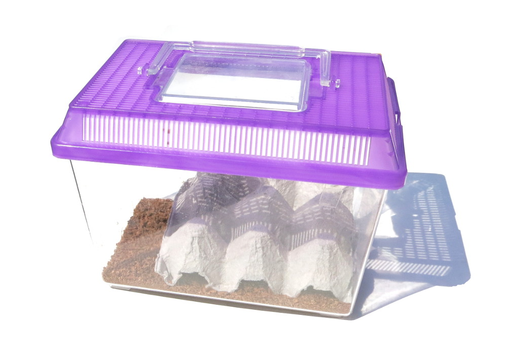

## Cockroach Care Kit

#### $25.00

Pet ownership is a responsibility that builds character and confidence! And
what better pet to own then your very own cockroach? If you've decided to take
the plunge and dive into the world of cockroach husbandry, you might need some
help supplying your colony and keeping your cockroaches alive. There are a
number of options available to you when it comes to storage, food, and water.
In this pre-assembled kit, you have everything you need to keep your colony
maintained!

The kit comes in a wide terrarium which will give your cockroaches plenty of
room to roam, eat, and breed! You'll receive enough substrate (dirt) to cover
the bottom of your terrarium in a thin layer. This, along with the included
cardboard egg crate, will give your cockroaches plenty of material to burrow
into, hide under, and cling to. For sustenance, we've included a bags of dry
food and water crystals. Make sure to stock your terrarium's pantry with about
a spoonful of food every few days, or if you see it running low; the same goes
for your water crystals. [**Note: Cockroaches are sold
separately!**](cockroaches)

### Kit Contents:

  * Medium Terrarium with Lid
  * Egg Crate, cut to size 
  * Invertebrate-Safe Substrate
  * Bag of Cockroach Food
  * Bag of Water Crystals (reusable)

### Technique

  1. Fill the bottom of your terrarium with the thin layer of substrate included. 
  2. Strategically place pieces of egg crate for maximum cockroach enjoyment. Leave space on the side to easily access and replace the food and water dishes. 
  3. Food: Place a small spoonful of food into the terrarium. You can find a small dish, put the food in one of the egg crate dimples, or just layer it on top of the substrate. Keep an eye on the food and replenish it when it runs out (expect once a week or so) 
  4. Water: Get approximately a gallon sized storage container (tupperware works well!) and empty your bag of crystals into the container. Fill the container almost to the top with water. Put a lid on it and then wait a day and you should find the water has been transformed into watery gel crystals! Fill your other dish with these water saturated crystals and place it into the terrarium as well. To replenish water, either rehydrate the crystals in the dish, or add new hydrated crystals from your container. Check on the water at least every other day. Hydration is king when it comes to cockroach care. 
  5. Introduce your cockroaches to their new home! 

Winter Cockroach Care Tips

In extremely cold weather, we sometimes get comments about how cockroaches are
arriving seemingly dead. Remember that cockroaches are ectothermic, or "cold-
blooded", and they cannot control their body heat. If they are cold, their
little bodies start shutting down systems and going into a hibernation-like
state. This is why we use ice-water for anesthesia during our cockroach
experiments: it forces their systems to temporarily shut down. Read on for a
simple guide to bringing at least some of your cockroaches back to life.

First, put them into a container that absorbs heat easily. Cardboard takes a
while to warm up, but an animal terrarium with plastic or glass warms up
quickly when placed on a hot surface. Next, you need something that gives off
heat. Space heaters, radiators, or furnaces work well, as long as you can
safely set the container directly next to or on the heat. You want the
glass/plastic warm so the roaches warm up faster.

Place the container next to the heater, keeping the heat at a steady rate if
possible. Keep a close eye on them, checking on them every five minutes for a
minimum of three hours. If you see any roaches moving, put them in a secondary
"recovery" container away from the heat. You do not want to risk overheating
their systems. Movements may be subtle: anything as simple as a twitching
antennae, throbbing abdomen, or slight leg movement could all be signs of them
waking up. The roaches will want food, so put food in the "recovery"
container, along with water gel.

If all goes well, you will have revived all of your patients, but be aware
this is not a miracle cure. Too much cold can kill these roaches. There is a
chance they could be fully dead on arrival, or will wake up but be too ill to
fully recover and will not survive long. Best of luck on your revival
attempts!

**Important:** If you live in a cold climate and have indoor heating, you have
to be careful of the low humidity in your home. This will reduce the vitality
of the cockroaches. For instance, if you notice your cockroaches dying while
trying to molt, it's because of the low humidity. We often tape a piece of wet
sponge to the side of our cockroach cages in the winter months.

