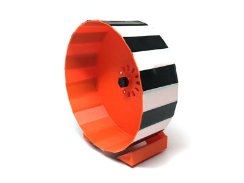

## RoachWheel

  

---

### Availability

**Due to production demands, please allow up to two weeks for delivery.**

---

### Description

The RoachWheel is a great companion for your cockroach colony—both scientific
and fun! It can help make your classroom pets more entertaining. After all,
**a cockroach doesn’t get more adorable** than when running on a wheel!

In the near future, the wheel will also support an “activity tracker” add-on.
When paired with an Arduino, you can monitor the activity cycle of your
cockroach colony or even an individual cockroach’s circadian rhythms. The
additional sensor attachment and experiment write-up on circadian rhythms are
coming soon.

---

### Video

<iframe width="560" height="315" 
  src="https://www.youtube.com/embed/Dhq6hZhzFq8" 
  frameborder="0" allowfullscreen>
</iframe>

---

### Includes

- **Wheel and Stand**
- **Detachable Containment Shield**

---

### Technical Specs

- **Wheel**: ~5" diameter × 2.75" deep  
- **Stand**: ~5.5" tall  
- **Color**: Orange  
- 360° of rotational power

---

### Additional Documents

- [Turbo Wheel Training Montage](https://www.youtube.com/watch?v=Dhq6hZhzFq8&feature=youtu.be)

---

### Related Experiments

- [Coming Soon](#)
