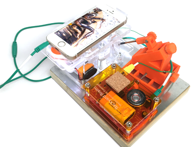
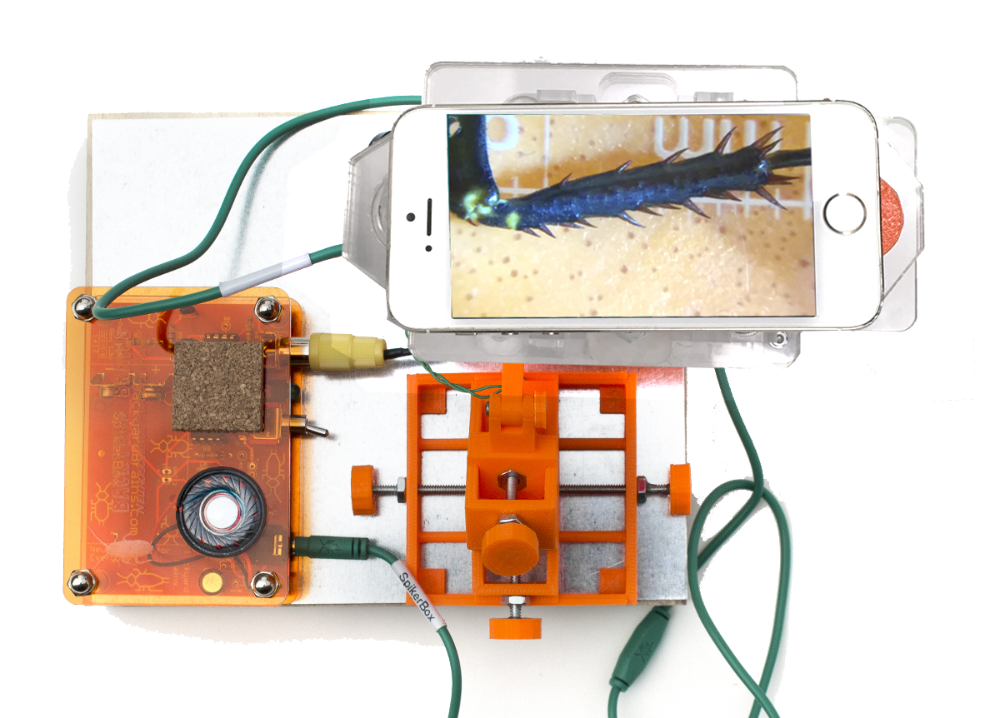
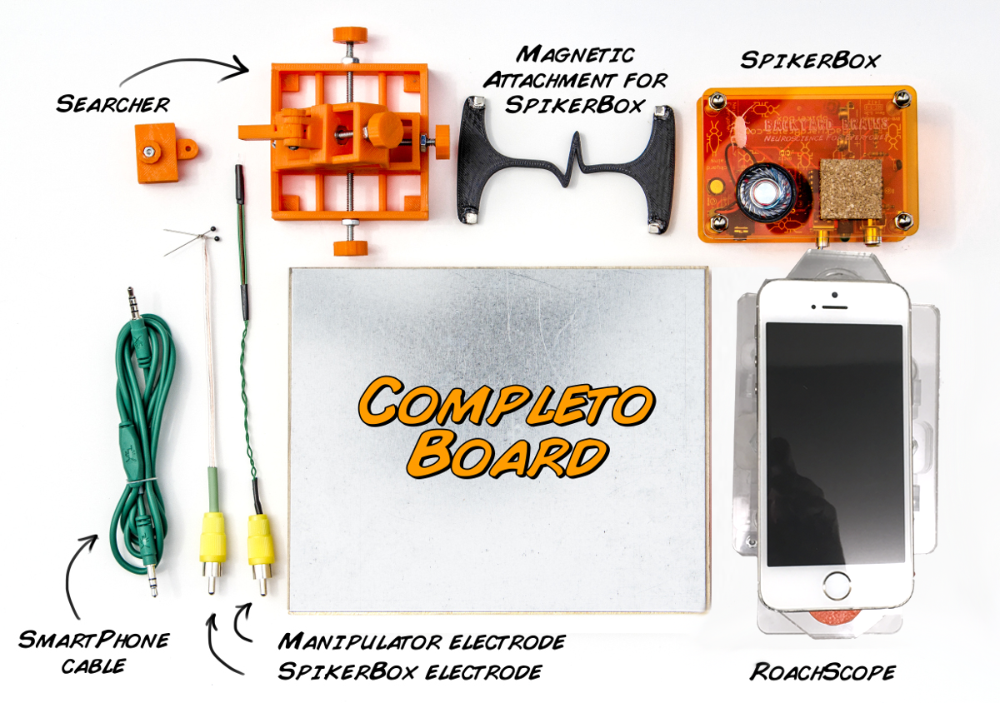

## The Completo

---

### Description

You’ve seen the many and varied experiments you can do with our tools, but maybe you’re the kind of person who craves more advanced capabilities. Lucky you—Backyard Brains has the product to complete your dreams: **The Completo**, a fully portable advanced electrophysiology rig!

This complete kit is perfect for students, budding researchers, educators, and kids wanting to safely experiment with neuroscience. It’s also a great gift for that special scientist in your life—a gift that says, _“You Completo me.”_

---

### Product Details

The Completo comes with advanced tools for precise electrode placement and a **magnetic surface** to keep it all stable. Combined, these tools let you run a wide range of sophisticated neuroscience experiments.

Here are just a few of the **additional experiments** you can run with the Completo:

- Record muscle potentials from fruit flies  
- Carefully position electrodes on earthworm nerves  
- Measure [adaptation rates](../experiments/somatotopy.md) in cockroach sensory neurons  
- Record from the amazing grasshopper visual system, as shown below:

<iframe 
  src="https://player.vimeo.com/video/79930415" 
  width="500" height="281" frameborder="0" 
  allow="autoplay; fullscreen" 
  allowfullscreen>
</iframe>

[DIY Neuroscience: Grasshopper Vision](https://vimeo.com/79930415) from [HarvardX Neuroscience](https://vimeo.com/mcb80x) on [Vimeo](https://vimeo.com).

This experiment uses all the components of the Completo, letting you examine the relationship between sensory stimulation and behavioral responses.

The Scope has rare-earth magnets built into its base to stay firmly attached to metal tables—we provide one for you, but any magnetic surface works. 

> **Why is it called “The Completo”?** It’s our homage to a [famous Chilean hot dog](http://en.wikipedia.org/wiki/Completo).

---

### Video of Completo in Action!

> **Note**: This video shows an older version of the Completo with a non–laser-cut RoachScope.

<iframe 
  width="100%" height="350" 
  src="https://www.youtube.com/embed/jphY4DnzGmU" 
  frameborder="0" allowfullscreen></iframe>

---

### Kit Contents

- 1× Magnetic Adaptor for securing components to Completo Table
- 1× **Poplar Wood Steel Magnetic Table**
- 0× Smartphone (_not_ included; works with any smartphone that has a camera)

---

### Documents & Downloads

- [Smartphone Cable Schematics](./files/smartphonecable.v.0.1a.pdf)

---

### Related Experiments

- [Getting Started with Spikes](../Experiments/spikerbox.md)
- [Rate Coding](../Experiments/ratecoding.md)
- [Effect of Temperature on Neurons](../Experiments/temperature.md)
- [Neural Adaptation](../Experiments/somatotopy.md)
- [Referencing your Spikes](../Experiments/referencing.md)
- [Effect of Nicotine and MSG on Neurons](../Experiments/neuropharmacology.md)
- [Neuroprosthetics](../Experiments/neuroprosthetics.md)
- [Oxygen and Spiking](../Experiments/oxygen.md)
