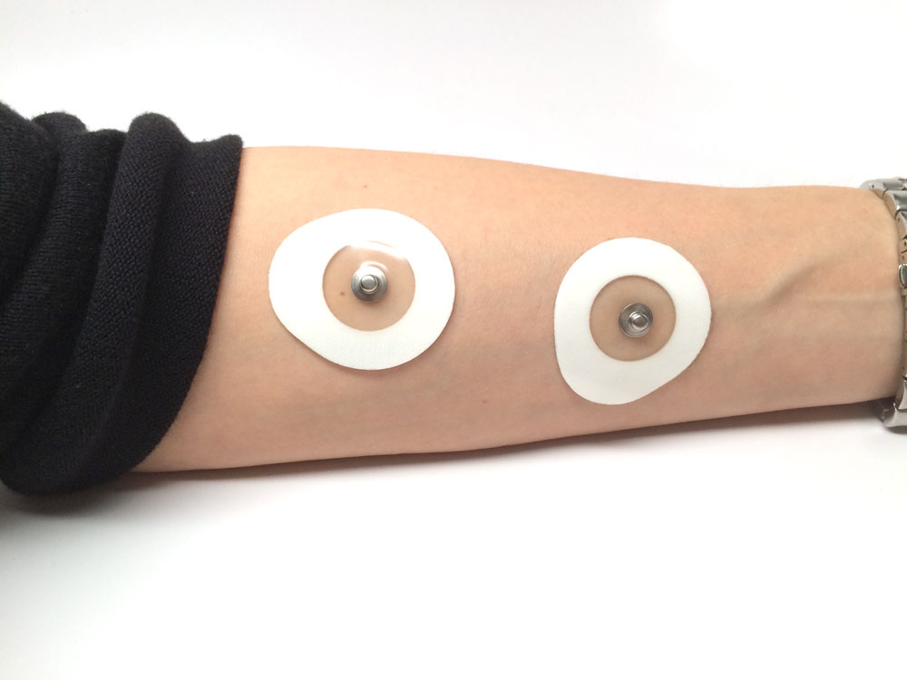
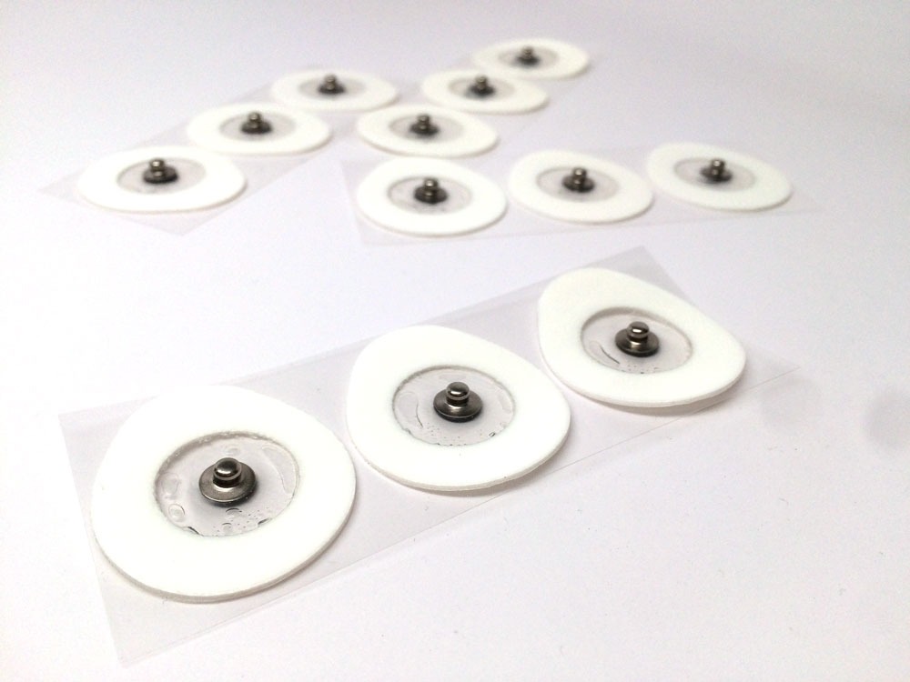

## Large Muscle Electrodes

  * [Getting Started with Electromyograms (EMGs)](../Experiments/muscleSpikerBox.md)
  * [Muscle Contraction and Fatigue](../Experiments/fatigue.md)

When we run neuroscience demo events, we burn through our Large Muscle EMG
pads while recording bicep EMGs. You probably do too! You can now order EMG
patch electrodes from us in bulk. **Note: 1 unit in the Qty box = 100
electrode patches.**

### Product Details

These are the same patch electrodes that ship with our Muscle SpikerBoxes,
SpikerShields, and our Heart and Brain Kits. Nothing fancy, we are just the
middleman on this one.

### Technical Specs

  * Diameter: 35.35 mm 
  * Built-in Electrode Conductive Gel 
  * Nonreusable 

