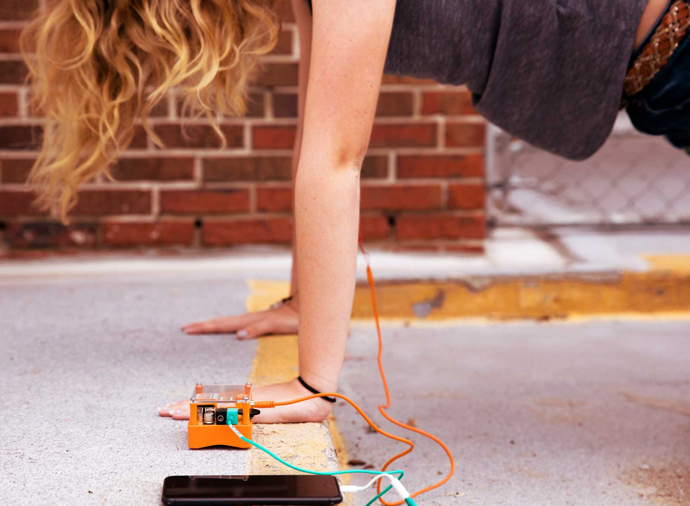

## Muscle SpikerBox Pro

#### $249.99

Reveal and record the electrical activity hidden within your muscles! This
easy-to-use kit allows you to record EMG signals, giving you the power to
perform human physiology experiments!

As part of our Pro line, this kit is easy to use for beginners, but powerful
enough to record publication-ready results! This kit can turn any home or
classroom into a Ph.D. lab!

Order your kit today and begin performing your own experiments!

#### Precision Data

Record publication-quality signals and events.

#### 2 Channels

Record from multiple muscles at once.

#### Smartphone & PC

View on your Phone, Analyze on your PC.

#### It’s Loud

Whole classrooms can hear your demonstrations!

## Product Details

  * __ Experiments
  * __ Bundle Contents
  * __ Downloads

#### See how it works

  1. What are [agonist and antagonist muscle](https://backyardbrains.com/experiments/musclespikerboxpro) pairs?
  2. How does your[ Patellar Reflex](https://backyardbrains.com/experiments/Musclekneejerk) compare to your [ Reaction Time](https://backyardbrains.com/experiments/MusclReactionTime)?
  3. Can you find a [single motor](https://backyardbrains.com/experiments/MuscleSingleunit) unit?
  4. How can you learn about[ muscle recruitment](https://backyardbrains.com/experiments/Musclechewing) by eating candy?

  1. 1x Muscle SpikerBox Pro
  2. 2x Orange Electrode Cables
  3. 1x Blue USB Cable
  4. 1x Green Smartphone Cable
  5. 2x Small Muscle Electrode Sticks
  6. 1x Bottle of Electrode Gel
  7. 12x Sticker Electrodes
  8. 1x Battery 

#### Muscle SpikerBox Pro Technical Specifications

**Sampling Rate** | 10k (2ch)  
---|---  
**Frequency Range** | 70-2500hz  
**Max Sound Level** | 104 SPL  
**Muscle Signal SNR** | 30dB  
**Battery Life** | 4hr at Full Volume, 18 hr Recording  
**Output** | USB Micro, Headphones, Smartphone, 2 Analog Out  
**Inputs** | 2x Muscle Cables, 5x Digital Ins or 3x Digital Ins/2x Analog Ins  
**Electrical Safety** | Type BF (Body Floating)  
  
#### Muscle SpikerBox Pro Technical Schematic

[__](./files/Muscle_SpikerBoxProV1.pdf)

#### BYB Spike Recorder App

You can run the BYB Spike Recorder on a variety of platforms. Click links
below to download and install.

[__](./files/SpikeRecorder.Win32.20171103.zip)

#### Windows

[__](https://play.google.com/store/apps/details?id=com.backyardbrains&hl=en)

#### Android

[__](https://itunes.apple.com/us/app/spike-recorder/id972173310?mt=12)

#### iOS

#### Arduino

[__](https://github.com/BackyardBrains/Spike-Recorder)

#### Linux

###

## What's New in Muscle SpikerBox Pro

#### Features

|

#### Regular

|

#### Pro  
  
---|---|---  
**Muscle Recording** | __ 1 Channel | __ 2 Channels  
**Speaker Use** | __ Personal (Quiet) | __ Classroom (4x Louder)  
**iOS Recording** | __ Smartphone Cable (1 ch) | __ Smartphone Cable (1 ch)  
**PC / Android** | __ Smartphone Cable (1 ch) | __ USB (2 ch) / Smartphone Cable (1 ch)  
**Chromebook** | __ Smartphone Cable (1 ch) | __ Smartphone Cable (1 ch)  
**Event Markers / Reaction Timer** | __ N/A | __ Event Markers supported on PC/Mac/Android  
**Reflex Hammer** | __ N/A | __ Reflex Hammer supported on PC/Mac/Android  
**Analog Inputs** | __ N/A | __ 2 inputs for recording lab devices  
  

###

## More from the Lab

##### Flex a 'Cep for Science

Use the Muscle SpikerBox Pro to learn about electrophysiology, or use the kit
to start your own affordable sports science lab!

__

##### Feats of Strength!

Use EMG as a way of measuring strength, muscular endurance, and dexterity!

__

##### Activities for the Whole Class

Everyone in the class can participate in these experiments! Statistically
significant results require a large sample size, after all!

__

##### Portable for Active Experiments

These SpikerBoxes are durable and portable! Throw it in your backpack and take
it out into the field!

__

##### A Sports Science Tool

Experiment like the Pros and learn how sports physicians use EMG recordings to
train stronger athletes!

__

### Join the Neuroscience Revolution

Order your own Muscle SpikerBox Pro and Start Experimenting
