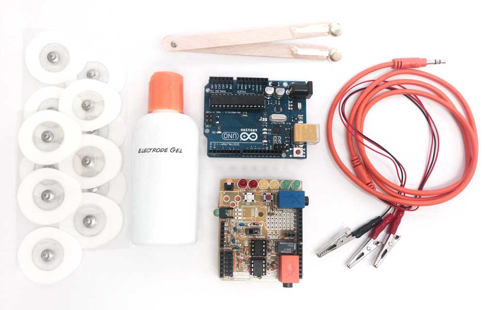
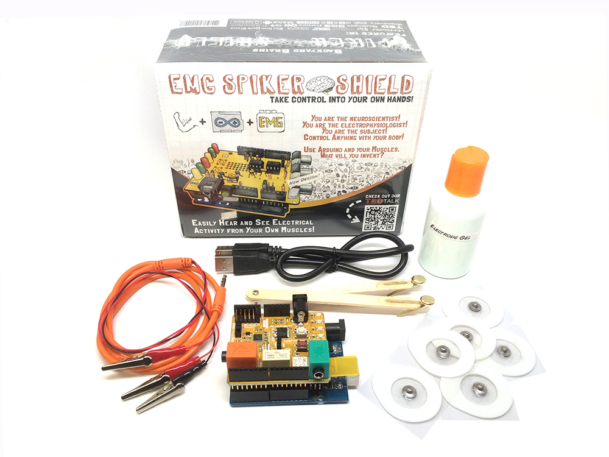

## Muscle SpikerShield Bundle

#### $149.99

### Files

  * [PCB Schematics (v0.1)](./files/EMGSpikerShield.v.0.1a.pdf)
  * [PCB Schematics (v0.2)](./files/EMGSpikerShield.v.0.2a.pdf)
  * [PCB Schematics (v1.1)](./files/EMGSpikerShield.v.1.1.pdf)
  * [PCB Schematics (v1.2)](./files/EMGSpikerShield.v.1.2.pdf)
  * [PCB Schematics (v1.3)](./files/MuscleSpikerShield.v.1.3.pdf)
  * [PCB Schematics (v1.3) update](./files/MuscleSpikerShield.v.1.3.updatedValues.pdf)
  * [PCB Schematics (v1.7)](./files/MuscleSpikerShield.v.1.7.pdf)
  * [PCB Schematics (v2.0)](./files/Muscle_SpikerShieldV2.pdf)
  * [PCB Schematics (v2.1)](./files/Muscle_SpikerShieldV2.1.pdf)
  * [PCB Schematics (v2.6)](./files/Muscle_SpikerShield.SMD.V2.6.pdf)
  * [PCB Schematics SMD (v2.61)](./files/EMGSpikerShield.SMD.V2.61.pdf)
  * [Default Arduino code](https://raw.githubusercontent.com/BackyardBrains/Muscle-SpikerShield/master/V2_61/Muscle-SpikerShield/Muscle-SpikerShield.ino)

### Experiments

  * [Using the Muscle SpikerShield](../Experiments/muscleSpikerShield.md)
  * [Controlling a Light Bar in an LCD](../Experiments/MuscleSpikerShield_LCD.md)
  * [Controlling a Stepper Motor](../Experiments/MuscleSpikerShield_StepperMotor.md)
  * [Controlling a Gripper Hand](../Experiments/MuscleSpikerShield_GripperHand.md)
  * [Human-Human-Interface](../Experiments/humanhumaninterface.md)
  * [Getting Started with Electromyograms (EMGs)](../Experiments/emgratecoding.md)
  * [Muscle Action Potentials](../Experiments/muscleactionpotential.md)
  * [Muscle Contraction and Fatigue](../Experiments/fatigue.md)
  * [Modeling Muscle Fatigue](../Experiments/rateoffatigue.md)

Are you an artist or engineer that has a killer idea for a new interface? With
the Muscle SpikerShield bundle, you have everything you need to start your
developing your own ideas, learn about the exciting field of neuroprosthetics,
or use your muscle activity to create any human-machine interface your
creative mind desires.

### Product Details

This kit includes our fully assembled Muscle SpikerShield, a USB cable, and an
Arduino. The Arduino comes preloaded with code to perform our "Getting
Started" demo where you can control a bank of LEDs with your own muscle
activity. Everything you need right out of the box! Just plug your Muscle
SpikerShield into a USB power source (such as a computer or battery) and you
are ready to go!

This bundle also comes with 2 different types of electrodes! For larger muscle
recordings in your arms and legs, you get the fashionable sticker-patch
electrodes. You also get our very fancy, brass popsicle-stick electrodes,
ideal for use with your smaller muscles, like your eyeblink and finger
muscles.

### See our Muscle SpikerShield in Action!

### Kit Contents:

  * 1x Pre-assembled Muscle SpikerShield 
  * 1x Orange Recording Electrode Cables with Alligator Clips (Red, Red, Black)
  * 1x Arduino MicroController with preloaded code
  * 1x USB cable for powering your Arduino
  * 6x EMG Sticker Patch Electrodes for large muscles
  * 1x Adjustable Wooden Electrode Holder for small muscles
  * 1x Small bottle of Electrode Gel to be used with the small muscle electrode

