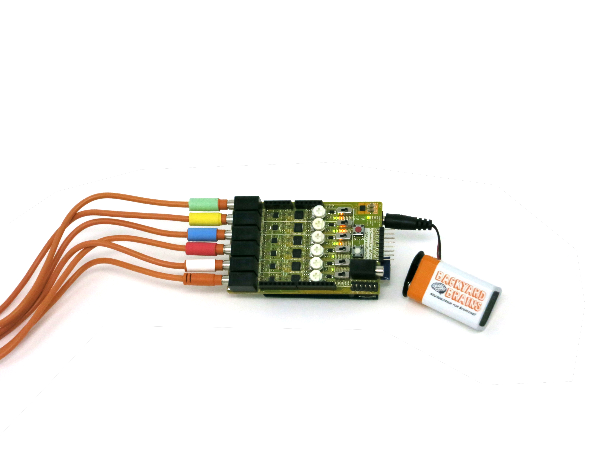
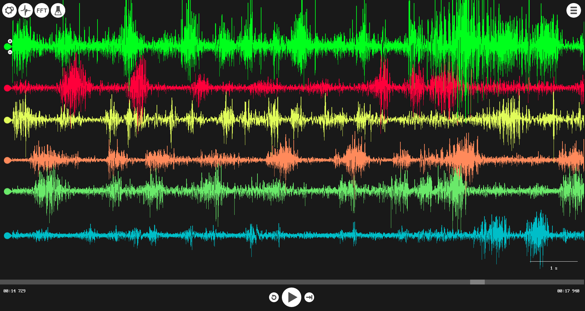
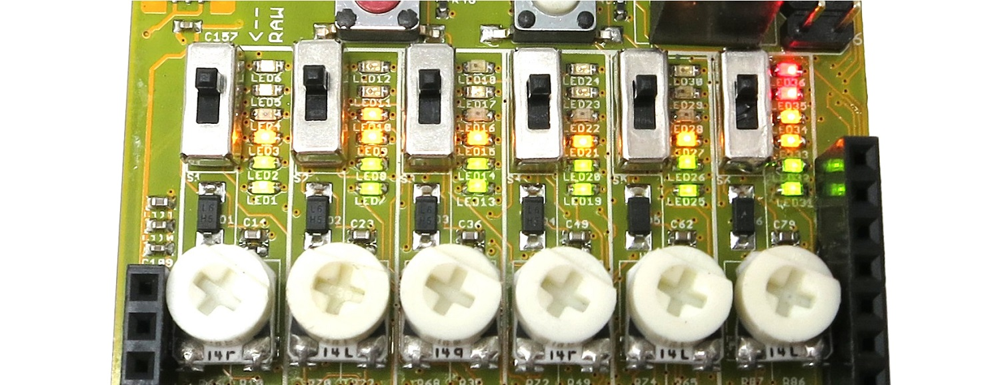
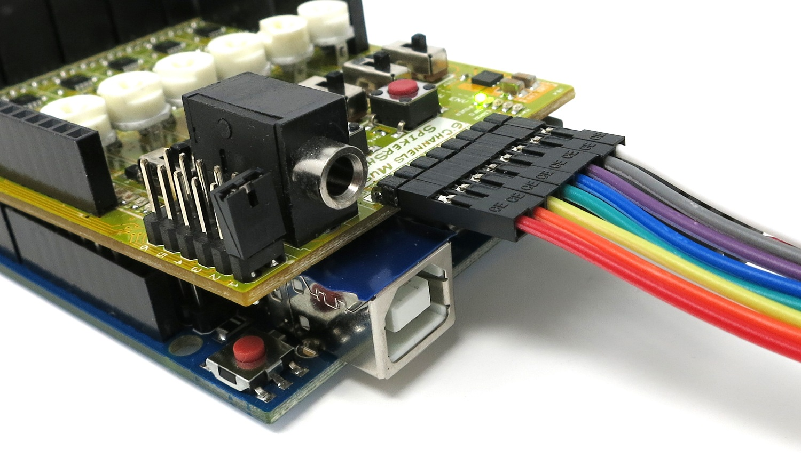

## Muscle SpikerShield Pro

  * [__Schematics v1](./files/Schematics-Muscle-spikerShield-Pro-V1.pdf)
  * [__Muscle SpikerShield Pro Default Uno Code](./files/MuscleSpikerShieldProDefaultCode.zip)
  * [__Muscle SpikerShield Pro Default Leonardo Code](./files/MuscleSpikerShieldProDefaultCode_leonardo.zip)
  * [__Simple Arduino Serial Monitor for Testing](./files/SpikerShield_Pro_Serial_Read.zip)

  * [__The Muscle Keyboard](../Experiments/spikershieldpro)
  * [__The MIDI Muscle Machine](../Experiments/midi)
  * [__Using the Muscle SpikerShield](../Experiments/emgspikershield)
  * [__Controlling a Light Bar in an LCD](../Experiments/MuscleSpikerShield_LCD)
  * [__Controlling a Stepper Motor](../Experiments/MuscleSpikerShield_StepperMotor)
  * [__Controlling a Gripper Hand](../Experiments/MuscleSpikerShield_GripperHand)
  * [__More things with the EMG SpikerShield](../Experiments/EMGSpikerShield_MoreExps)
  * [__Getting Started with Electromyograms (EMGs)](../Experiments/emgspikerbox)
  * [__Muscle Action Potentials](../Experiments/muscleActionPotential)
  * [__Muscle Contraction and Fatigue](../Experiments/fatigue)

The[ Muscle SpikerShield](./muscleSpikershieldBundle)
was a hit, but there was one problem: only one channel! We heard your
sorrowful song, your wailing lament, "We want more channels!" Take your DIY
biohacker projects to the next level with the Muscle SpikerShield Pro, a
Human-Machine Interface device that allows you to record EMG signals from up
to _six_ muscles at a time! Before, you would have had to purchase and stack
six [Muscle SpikerShields](./muscleSpikershieldBundle).
Now, the Muscle SpikerShield Pro offers the same functionality with a much
more manageable profile, and it's cheaper than the six-stack!

You can use the Muscle SpikerShield Pro to perform muscle physiology
experiments investigating the relationships between multiple muscles, use its
six channels as dynamic input controllers for your computer programming and
robotics projects, or just use it as an excuse to change into a muscle shirt
and flex your 'ceps...

### Product Details

**Getting Started:** The Muscle SpikerShield Pro is designed for those who
have experience with Arduinos and our original [Muscle SpikerShield](./muscleSpikershieldBundle)
and are looking to perform advanced neuroscience experiments. It's powerful,
but that doesn't mean it needs to be hard to use! The Muscle SpikerShield Pro
is as easy-to-use as all of our kits. Pair the shield with an Arduino Uno and
connect to your computer via USB. Then, pair your Muscle SpikerShield Pro to
the [Spike Recorder](./spikerecorder) app to
record EMG signals from up to six different muscles. Write your own Arduino
code and take advantage of the envelope and output pins to begin creating
programs or electrical devices you control with your muscles!

The Muscle SpikerShield Pro is ideal for advanced high-schoolers, college
students, researchers, and professionals who want to develop robotics with
human inputs. It is also a great start for those beginning muscle or sports
physiology experiments! With your creativity, what will you invent?

**Features:**

The Muscle SpikerShield Pro's six EMG input channels are independently
controlled. Record in raw or with envelope, adjust channel gains, and use the
LEDs to quickly reference the signal strength. (We lovingly refer to this as
the "Dance Bar!") 

The Muscle SpikerShield Pro also reroutes the six digital I/O pins, VCC, and
ground from the Arduino to output pins on the edge of the board, allowing you
to write code to control external electronics and robotics with your muscles!

If you don't already have an Arduino Uno or Arduino Leonardo, you'll need to
get one. If that's the case, we recommend you purchase and experiment with
[The Muscle SpikerShield](./muscleSpikershieldBundle)
first, which includes an Arduino. Then, you'll be ready for the upgrade.

### Kit Contents:

  * 1x Muscle SpikerShield Pro
  * 1x Smartphone Cable (may only visualize one channel at a time on smartphone devices)
  * 1x Backyard Brains 9v Battery, with a connector and leash
  * 6x Color-coded [Muscle Electrode Cable](./muscleElectrodeCable)
  * 200x [Large Electrode EMG Patches](./emglargeelectrodes)

