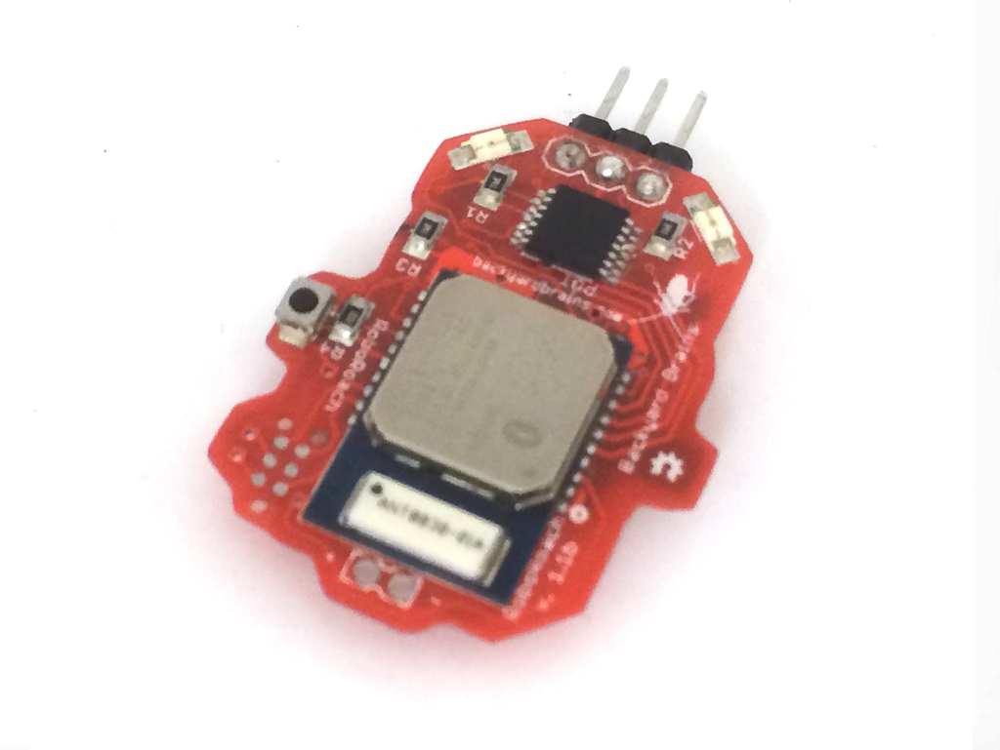
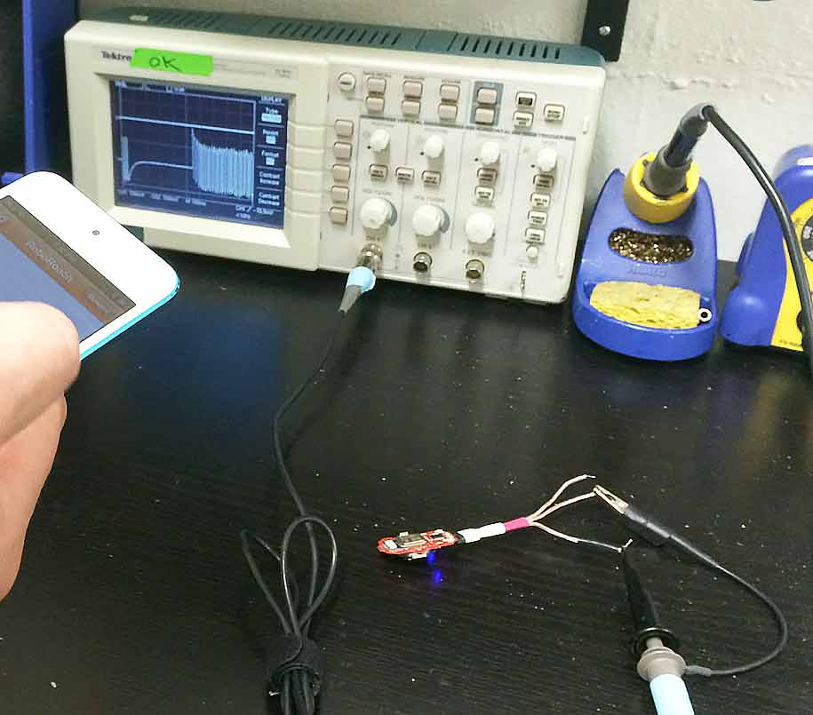

## Remote Signal Generator

 

  * [__Apple iOS App](https://itunes.apple.com/us/app/byb-remote/id792968848?ls=1&mt=8)
  * [ __Android App](./files/RoboRoach.apk)

  * Design your own!

Do you have a project that requires a signal generator? Are you tired of
having to plug in your [Wavetek Function Generator Model
23](http://www.accusrc.com/ccp3324-wavetek-23-12-mhz-synthesized-function-
generator-23-23.htm)? Well... You are in luck! Backyard Brains has your back.
We have a light weight and portable two-channel signal generator for you!
Simply connect to the standard 0.1" header and you will be able to control
square-wave pulses with your smartphone! The Backyard Brains remote signal
generator is a great addition to your electronics workbench!

#### Notice on Smartphone Compatability

Our Remote Control all works on **Android devices** running version 4.3 or
later. You can download the app
[here](https://play.google.com/store/apps/details?id=com.backyardbrains.bybremote&hl=en).
For **Apple devices** , you will need an iPhone 4s or Later. You can visit our
app at the app store [here](https://itunes.apple.com/us/app/byb-
remote/id792968848?ls=1&mt=8).

### Product Details

Our signal generator weighs 4.4 grams with the battery, and each battery will
last over a year!

### Technical Specs

  * 3V Signals
  * 2x independant channels: Channel 1 - Ground - Channel 2
  * Uses a 1632 Battery
  * Frequencies: 1-250 Hz
  * Pulse Widths: 1-25ms
  * Duration: 0-1000ms

