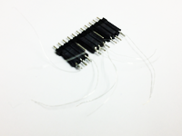

## RoboRoach(beta) Electrodes

 

  * [RoboRoach (beta) Surgery Instructions](http://wiki.backyardbrains.com/RoboRoach_Surgery)

Have you exhausted your RoboRoach(beta) electrodes and want to do more
experiments? Luckily, we have you covered with our set of affordable
replacement electrodes.

### Product Details

One order will ship with a set of three replacement electrodes (to implant 3
additional RoboRoaches)

### Technical Specs

  * 3x Roboroach Electrodes

