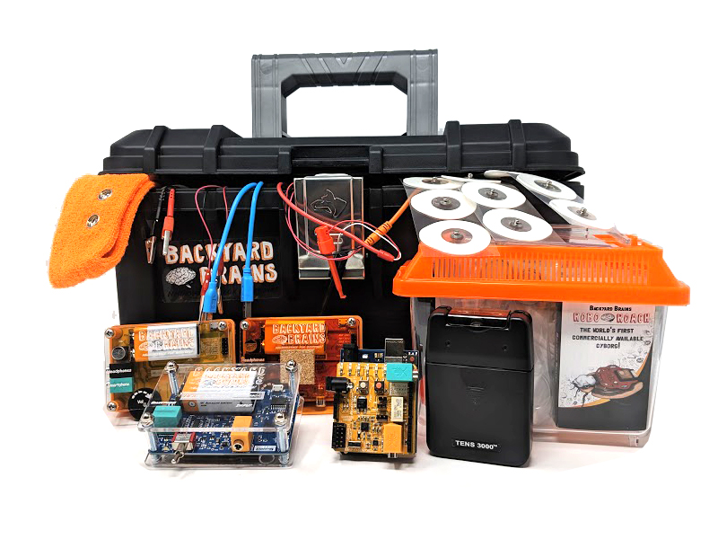
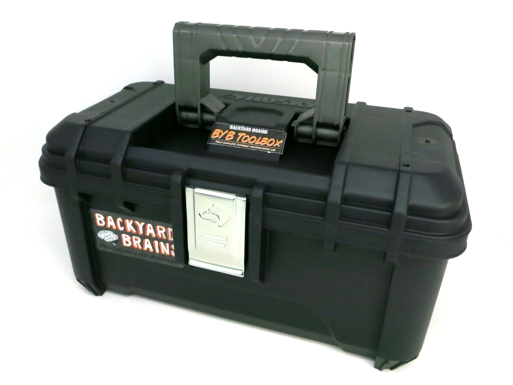

## BYB Toolbox - Your Complete Portable Neuroscience Lab

---

---

### Documents

- [Default Code for LED and HHI](https://backyardbrains.com/experiments/files/led_strip_ino_HHI.zip)

### Experiments

- [Almost Every Experiment We Have](/experiments/)

---

When we show off our products, toolbox in hand, people often remark:  
“Wow… You’ve got a full lab in there!” It’s true, and now, you can too!

This lab contains the same gear that we often use when we demonstrate our products or research remotely. With this, you’ll have a rather sophisticated mobile neuroscience lab.

### Product Details

This toolbox contains many of our core products in one portable box:
A Neuron SpikerBox Pro, a Muscle SpikerBox Pro, a Human-Human Interface, a RoboRoach, and our Heart and Brain SpikerBox. This ships with 100 Patch Electrodes and all the cables you need. Now do some outreach, make some discoveries, and share your results!

#### Kit Contents:

- 1× [Human-Human Interface](hhi)  
- 1× [Muscle SpikerBox Pro](musclespikerboxpro)  
- 1× [Neuron SpikerBox Pro](neuronspikerboxpro)  
- 1× [Heart and Brain SpikerBox](heartandbrainspikerbox)  
- 1× [RoboRoach Bundle](roboroach)  
- 100× [Large Muscle Electrodes](emglargeelectrodes)  
- 1× T.O.O.L.B.O.X (Transport Organized Operationals Lacking Big Ostentatious eXpenses)

---

#### Recent Posts

- [It's The Backyard Brains 10-Year Anniversary!](http://blog.backyardbrains.com/?p=4906)
- [Cincinnati Neuroscience Outreach by BYB Alumna](http://blog.backyardbrains.com/?p=4870)
- [First Place at Science Fair for Student using BYB Gear](http://blog.backyardbrains.com/?p=4861)
