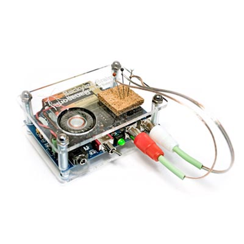
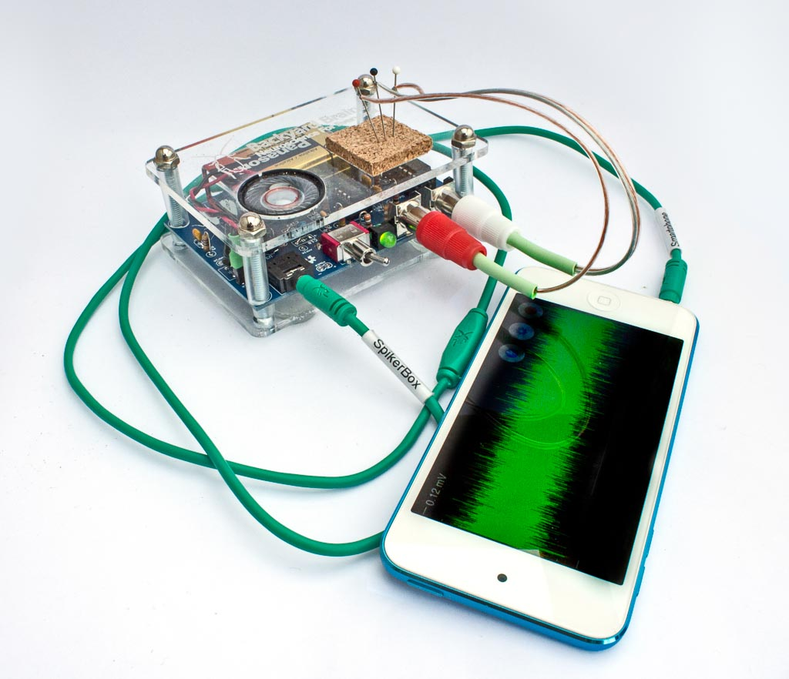
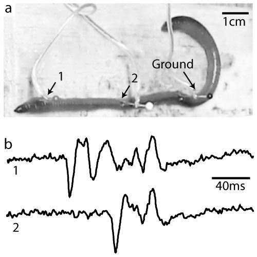
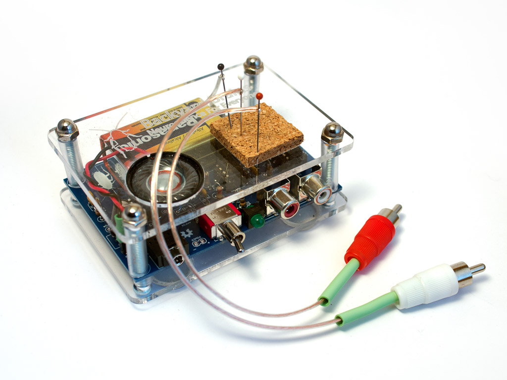

## Neuron 2-Channel SpikerBox

  
  
  

---

### Overview

What can you do with **2 Channels**?
- **Record from multiple neural sources** simultaneously
- **Measure conduction velocity** (e.g. with earthworms!) to learn how fast action potentials travel

This expands on our original SpikerBox design and is just as easy to use. You can connect a laptop cable or a smartphone cable to listen to spikes on an external speaker, or watch them on your smartphone, iPad, or computer.

All our standard single-channel SpikerBox experiments are still possible, but with the 2-Channel SpikerBox, you can **take two measurements** at once.

> **Important**: For 2-channel recordings, you’ll need a laptop with either a  
> [2-channel (stereo) line input](http://en.wiki.backyardbrains.com/Testing_Stereo_Input_on_Your_Computer)  
> or a [usb sound card](https://griffintechnology.com/us/imic).  
> Mobile devices typically only allow one channel.

If you discover something new or develop a new 2-Channel experiment, we’d love to hear about it!

---

### Video: 2-Channel SpikerBox in Action

<iframe width="100%" height="360" src="https://www.youtube.com/embed/uNM06ONoBAY" frameborder="0" allowfullscreen></iframe>

---

### Technical Specs

- **Electrode Inputs**: 1× white (electrode 1 & ground) + 1× red (electrode 2)  
- **Audio Out Port** for external speaker, phone, or laptop  
- **Internal Speaker** to listen directly to spikes  
- **9v Battery** included

---

### Documents & Downloads

- [pcb schematics (v1.0a)](./files/2chanspikerbox.v.1.0a.pdf)
- [sample earthworm recording (.wav.zip)](http://www.backyardbrains.com/experiments/files/earthworm_10%20seconds_mgf_5cm_5_seconds_silence_10%20seconds_lgf_5_cm_electrode_separation.wav.zip)
- [sample spikes library](http://wiki.backyardbrains.com/spikes_library)

---

### Related Experiments

- [getting started with spikes](../Experiments/ratecoding.md)
- [rate coding](../Experiments/ratecoding.md)
- [effect of temperature on neural firing rate](../Experiments/temperature.md)
- [referencing your spikes](../Experiments/referencing.md)
- [effect of nicotine and msg on neurons](../Experiments/neuropharmacology.md)
- [neuroprosthetics](../Experiments/neuroprosthetics.md)
- [oxygen and spiking](../Experiments/oxygen.md)
- [speed of neurons](../Experiments/speed.md)
- [comparing nerve speed](../Experiments/comparingNerveSpeed.md)
- [effect of temperature on neural speed](../Experiments/WormTemperature.md)
- [effect of nerve stretching on neural speed](../Experiments/wormstretch.md)
