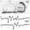

## Neuron 2-Channel SpikerBox

  
  
  

---

### Overview

What can you do with **2 Channels**?
- **Record from multiple neural sources** simultaneously
- **Measure conduction velocity** (e.g. with earthworms!) to learn how fast action potentials travel

This expands on our original [SpikerBox](spikerbox.md) design and is just as easy to use. You can connect a [Laptop Cable](laptopcable.md) or a [Smartphone Cable](smartphonecable.md) to listen to spikes on an external speaker, or watch them on your smartphone, iPad, or computer.

All our standard single-channel SpikerBox experiments are still possible, but with the 2-Channel SpikerBox, you can **take two measurements** at once.

> **Important**: For 2-channel recordings, you’ll need a laptop with either a  
> [2-channel (stereo) line input](http://en.wiki.backyardbrains.com/Testing_Stereo_Input_on_Your_Computer)  
> or a [USB sound card](https://griffintechnology.com/us/imic).  
> Mobile devices typically only allow one channel.

If you discover something new or develop a new 2-Channel experiment, we’d love to hear about it!

---

### Video: 2-Channel SpikerBox in Action

<iframe width="100%" height="360" src="https://www.youtube.com/embed/uNM06ONoBAY" frameborder="0" allowfullscreen></iframe>

---

### Technical Specs

- **Electrode Inputs**: 1× White (electrode 1 & ground) + 1× Red (electrode 2)  
- **Audio Out Port** for external speaker, phone, or laptop  
- **Internal Speaker** to listen directly to spikes  
- **9V Battery** included

---

### Documents & Downloads

- [PCB Schematics (v1.0a)](./files/2chanSpikerBox.v.1.0a.pdf)
- [Sample Earthworm Recording (.wav.zip)](http://www.backyardbrains.com/experiments/files/Earthworm_10%20seconds_MGF_5cm_5_seconds_silence_10%20seconds_LGF_5_cm_electrode_separation.wav.zip)
- [Sample Spikes Library](http://wiki.backyardbrains.com/Spikes_Library)

---

### Related Experiments

- [Getting Started with Spikes](../experiments/spikerbox.md)
- [Rate Coding](../experiments/ratecoding.md)
- [Effect of Temperature on Neural Firing Rate](../experiments/temperature.md)
- [Referencing Your Spikes](../experiments/referencing.md)
- [Effect of Nicotine and MSG on Neurons](../experiments/neuropharmacology.md)
- [Neuroprosthetics](../experiments/neuroprosthetics.md)
- [Oxygen and Spiking](../experiments/oxygen.md)
- [Speed of Neurons](../experiments/speed.md)
- [Comparing Nerve Speed](../experiments/comparingNerveSpeed.md)
- [Effect of Temperature on Neural Speed](../experiments/WormTemperature.md)
- [Effect of Nerve Stretching on Neural Speed](../experiments/wormstretch.md)