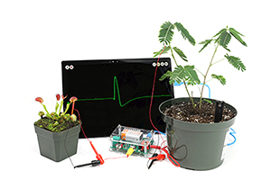

#### Neuroscience for Everyone!

__+1 (855) GET-SPIKES (855-438-7745)

* * *

__[hello@backyardbrains.com](mailto:hello@backyardbrains.com)

* * *

__ items ()

Menu

  * [__Home](/)
  * [Store](https://backyardbrains.com/products/)
  * [Experiments](https://backyardbrains.com/experiments/)
  * [Blog](https://blog.backyardbrains.com)
  * [Press](https://backyardbrains.com/about/press)
  * [Support](https://help.backyardbrains.com/)
  * [Ethics](https://backyardbrains.com/about/ethics)
  * [About](/about/)

  * [ __items ()](/cart/)

105

[Home](https://backyardbrains.com/) __[Products
](https://backyardbrains.com/products/)__Neuron SpikerBox

__

__

__

# The Neuron SpikerBox

Record living neurons, hear what the brain sounds like, and directly record
Action Potentials directly your PC or mobile devices (Apple and Android).
Never before have powerful neuroscience tools been this accessible!

This kit is easy to use for beginners, but powerful enough to record
publication-ready results! This kit can turn any home or classroom into a
Ph.D. lab!

Order your kit today and begin performing your own experiments!

Real Price: ~~$249.99~~

Current Price: $249.99

* * *

QYT

____

[__Buy now](/cart)

__

#### Precision Data

Record publication-quality signals and events.

#### 2 Channels

Record from multiple neurons at once.

#### Smartphone & PC

View on your Phone, Analyze on your PC.

__

#### It’s Loud

Whole classrooms can hear your demonstrations!

## Product Details

  * __ Experiments
  * __ Bundle Contents
  * __ Downloads

  1. How fast are [action potentials?](https://backyardbrains.com/experiments/NeuronSpikerBoxPro)
  2. How do [neurons encode information?](https://backyardbrains.com/experiments/ratecoding)
  3. What is the[ effect of temperature on neurons?](https://backyardbrains.com/experiments/WormTemperature)
  4. Does the [size of the axon](https://backyardbrains.com/experiments/wormstretch) change the speed?

  1. 1x Neuron SpikerBox
  2. 1x 2-Channel Recording Pin Electrodes
  3. 1x USBC Cable
  4. 1x Red Stimulation Cable
  5. 1x Battery

5 4 4 3 2 1

#### Neuron SpikerBox Technical Specifications

**Sampling Rate** | 20k (2ch)  
---|---  
**Frequency Range** | 350-3000hz  
**Max Sound Level** | 104 SPL  
**Neuron Signal SNR** | 30dB  
**Battery Life** | 4hr at Full Volume, 18 hr Recording  
**Output** | USBC, Headphones, 2 Analog Out (expansion port)  
**Inputs** | 2x Neuron Cables, 5x Digital Ins or 3x Digital Ins/2x Analog Ins (expansion port)  
**Electrical Safety** | Type BF (Body Floating)  
  
#### Neuron SpikerBox Technical Schematic

[__](files/Neuron.Spikerbox.Pro.V1.pdf)

#### BYB Spike Recorder App

You can run the BYB Spike Recorder on a variety of platforms. Click links
below to download and install.

[__](https://backyardbrains.com/products/spikerecorder)

#### Windows

[__](https://play.google.com/store/apps/details?id=com.backyardbrains&hl=en)

#### Android

[__](https://itunes.apple.com/us/app/spike-recorder/id972173310?mt=12)

#### iOS

#### Arduino

[__](https://github.com/BackyardBrains/Spike-Recorder)

#### Linux

###

## What's the difference in Neuron SpikerBox Classic vs. Neuron SpikerBox

#### Features

|

#### Neuron SpikerBox Classic

|

#### Neuron SpikerBox  
  
---|---|---  
**Neuron Recording** | __ 1 Channel | __ 2 Channels  
**Speaker Use** | __ Personal (Quiet) | __ Classroom (4x Louder)  
**iOS / iPad Recording** | __ Smartphone Cable (1 ch) | __ USBC (2ch) - Apple Certified  
**PC / Android** | __ USBC (1 ch) | __ USBC (2 ch)  
**Chromebook** | __ Smartphone Cable (1 ch) | __ Smartphone Cable (1 ch)  
**Event Markers** | __ N/A | __ Event Markers supported  
**Analog Inputs** | __ N/A | __ 2 inputs for recording lab devices  
  

###

## More from the Lab

##### Conduction Velocity

With an earthworm, students will learn how fast action potentials travel down
neurons! This simple prep is a great place to get started experimenting!

__

##### Cockroaches!

Students will explore how neurons encode sensory information by performing
rate coding experiments with a cockroach leg!

__

##### Student-Guided Experiments

Get students excited to perform experiments on their prep and see what affects
the neuron's rate of firing!

__

##### USB Connection

Connect via USB to a laptop or computer and your Spike Recorder will
automatically detect the SpikerBox!

__

##### Follow the Rainbow

The expansion port allows endless experimentation... add in additional analog
channels, event markers, oscilloscopes, or breadboard for your own inventions!

__

### Join the Neuroscience Revolution

Order your own Neuron SpikerBox and Start Experimenting

* * *

Real Price: ~~$249.99~~

Current Price: $249.99

QYT

____

[__Buy Now](/cart)

## Related Products

#### Human-Human Interface

#### Muscle SpikerBox Pro

#### Plant SpikerBox

#### Twitter

#### Recent Posts

  * [ It's The Backyard Brains 10-Year Anniversary!](http://blog.backyardbrains.com/?p=4906)
  * [ Cincinnati Neuroscience Outreach by BYB Alumna](http://blog.backyardbrains.com/?p=4870)
  * [ First Place at Science Fair for Student using BYB Gear](http://blog.backyardbrains.com/?p=4861)

#### BYB Information

  * [Spike Counter](/About/SpikeCounter)
  * [Contact](/About/Contact)
  * [FAQ](/About/FAQ)
  * [Our Finances](/About/Finance)
  * [Press](/About/Press)

* * *

Copyright © 2009-2017 [ __Backyard Brains](http://backyardbrains.com) | Protected under the Creative Common License [ __](http://creativecommons.org/licenses/)[____](http://creativecommons.org/licenses/by-sa/3.0/)

 

