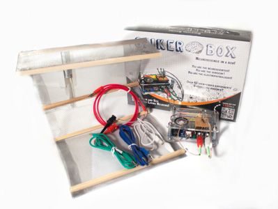
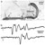
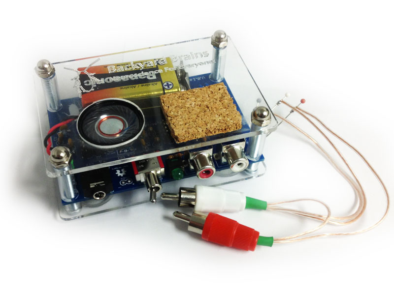
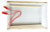
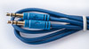
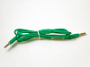

## Neuron 2-Channel SpikerBox Bundle

---

### Description

This is the kit version of our [2-Channel SpikerBox](twochannelspikerbox.md). 
It includes a [Laptop Cable](laptopcable.md) so you can record data on your 
computer and a [Faraday Cage](faradaycage.md) for noise-free recordings. 
These are essential components in our **earthworm conduction velocity** 
experiments.

What can you do with **2 Channels**?  
You can record from multiple neural sources at once, or measure conduction 
velocity using earthworms—**How fast do action potentials travel?**  
Now you can find out!

---

### Product Details

This expanded version of our original [SpikerBox](spikerbox.md) is just as 
easy to use. Connect the included [Laptop Cable](laptopcable.md) or 
[Smartphone Cable](smartphonecable.md) to listen to spikes on an external 
speaker or watch them on your smartphone, iPad, or computer.

You can do all the same experiments the single-channel SpikerBox can do. 
However, the **2-Channel SpikerBox** also lets you measure the same spike 
at **two different points**—perfect for conduction velocity or other 
dual-recording experiments.

> **Note**: For 2-channel recordings on a computer, you’ll need either a 
> [stereo (2-channel) line input](http://en.wiki.backyardbrains.com/Testing_Stereo_Input_on_Your_Computer)  
> or a [USB sound card](https://griffintechnology.com/us/imic).  
> Most mobile devices only support **one channel** input.

If you discover a new approach or experiment for the 2-Channel SpikerBox, 
we’d love to hear about it!

---

### Video: 2-Channel SpikerBox in Action

<iframe width="100%" height="360" 
  src="https://www.youtube.com/embed/uNM06ONoBAY" 
  frameborder="0" allowfullscreen>
</iframe>

---

### Kit Contents

- 1× [2-Channel SpikerBox](twochannelspikerbox.md)
- 1× White (electrode 1 & ground) + 1× Red (electrode 2) Recording Electrode
- 1× [Faraday Cage](faradaycage.md)
- 1× Alligator clip to ground Faraday Cage to [SpikerBox](spikerbox.md)
- 1× [Laptop Cable](laptopcable.md)
- 1× [Stimulation Cable](stimulationcable.md)
- 1× [Smartphone Cable](smartphonecable.md)
- 1× 9-Volt battery
- [Getting Started Guide](./files/2Chan_insert.pdf)

---

### Documents & Downloads

- [PCB Schematics (v1.0a)](./files/2chanSpikerBox.v.1.0a.pdf)
- [Sample Earthworm Recording](http://www.backyardbrains.com/experiments/files/Earthworm_10%20seconds_MGF_5cm_5_seconds_silence_10%20seconds_LGF_5_cm_electrode_separation.wav.zip)
- [Sample Spikes Library](http://wiki.backyardbrains.com/Spikes_Library)

---

### Related Experiments

- [Getting Started with Spikes](../experiments/spikerbox.md)
- [Rate Coding](../experiments/ratecoding.md)
- [Effect of Temperature on Neural Firing Rate](../experiments/temperature.md)
- [Referencing your Spikes](../experiments/referencing.md)
- [Effect of Nicotine and MSG on Neurons](../experiments/neuropharmacology.md)
- [NeuroProsthetics](../experiments/neuroprosthetics.md)
- [Oxygen and Spiking](../experiments/oxygen.md)
- [Speed of Neurons](../experiments/speed.md)
- [Comparing Nerve Speed](../experiments/comparingNerveSpeed.md)
- [Effect of Temperature on Neural Speed](../experiments/WormTemperature.md)
- [Effect of Nerve Stretching on Neural Speed](../experiments/WormStretch.md)