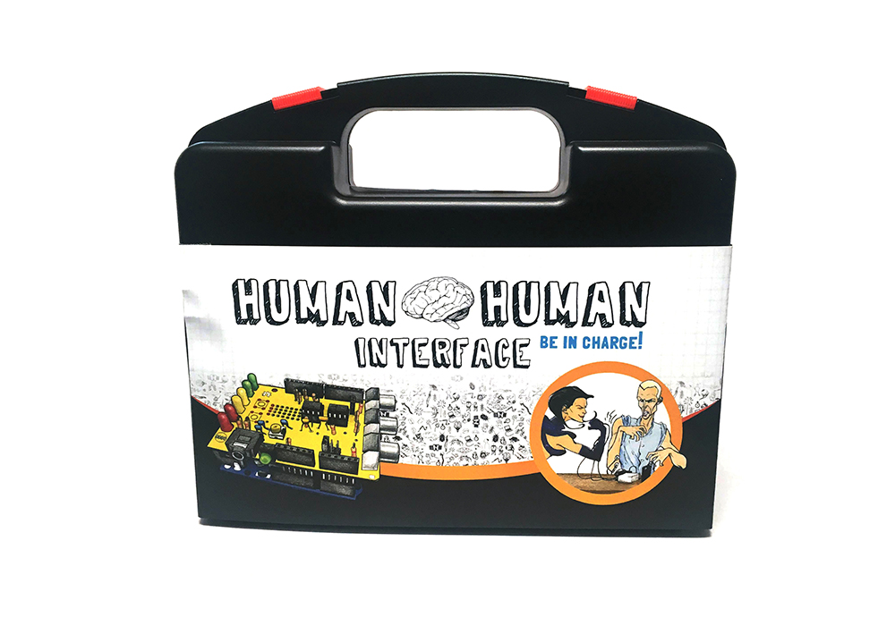

## Human Interface Workshop

  
  
  
  

### Documents

- [PCB Schematics (v1.3)](./files/musclespikershield.v.1.3.updatedvalues.pdf)  
- [Build Instructions (v1.7)](./files/musclespikershield.v.1.7.buildinginstructions.pdf)  
- [PCB Schematics SMD (v2.61)](./files/emgspikershield.smd.v2.61.pdf)  
- [Annotated Photo of Board](./files/musclespikershield1.3_annotatedphoto.pdf)  
- [Default Arduino Code for HHI](https://backyardbrains.com/experiments/files/hhiclawcombined.zip)

### Experiments

- [Human-Human-Interface](../experiments/humanhumaninterface.md)
- [Getting Started with the Muscle SpikerBox](../experiments/musclespikerbox.md)
- [Muscle Action Potentials](../experiments/muscleactionpotential.md)
- [Muscle Contraction and Fatigue](../experiments/fatigue.md)

---

## About the Human Interface Workshop

Have you ever dreamt of controlling the people around you? Family, friends, co-workers, even total strangers? In this workshop, you’ll learn to harness the power of neuroscience and biotechnology using the Backyard Brains Human-Human Interface!

With our electrophysiology setup, you’ll see first-hand how your brain sends an electrical impulse to your arm’s muscles. That muscle-generated electricity is then amplified and delivered into another person’s nervous system to trigger their arm to move! This special pricing includes a **-25% discount!**  
  

---

### The Human Interface Workshop

All participants will have their very own **Muscle SpikerShield Bundle** (an Arduino controller plus our muscle-interface board) to use during the workshop and then take home. The workshop typically runs about two hours, including:

- Informational presentations  
- Guided Arduino programming  
- Live demos  
- Q&A discussion

[**Add My Reservation for the Human Interface Workshop**](/cart)

---

### The Human-to-Human Interface

Each attendee receives their own kit, which includes:

#### **The Controller**  
You’ll connect to our Muscle SpikerShield, which reads the electrical signals from your muscles. An Arduino (pre-loaded with code) then turns those signals into triggers for a TENS stimulation device.

#### **The Controlled**  
Your arm receives gentle electrical pulses that your nerves interpret as a signal to contract. This feels a bit strange at first, but it’s safe and fascinating! Experience what it’s like to lose “free will” in your arm.

Together, these let you run fun and educational neuroscience experiments for students, kids, and adults—seeing real muscle and nerve signals in action.

[**Add My Reservation for the Human Interface Workshop**](/cart)

---

### Workshop Process

1. Sign up and pay for the workshop  
2. Attend Campus Party Brazil (or event location)  
3. We provide all tools and materials on-site  
4. Take over someone else’s free will!
