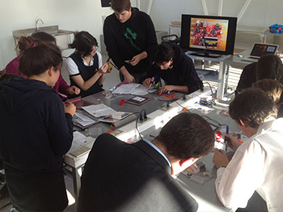
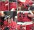
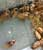
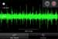

## Make'n'Take Workshop

---

### Documents

  - [Annotated SpikerBox Schematics](./files/SpikerBox.v.1.3c.Annotated.Schematics.pdf)
  - [EMG SpikerBox Schematics](./files/EMGSpikerBox.v.1.0.pdf)
  - [SpikerBox PCB Layout](./files/SpikerBox.v.1.3c.layout.pdf)
  - [Build Instructions](/diy/spikerbox)

### Experiments

  - [Getting Started with Spikes](/experiments/spikerbox)
  - [Rate Coding](/experiments/ratecoding)
  - [Microstimulation of Neurons and Muscles](/experiments/microstimulation)

---

## About the Make'n'Take Workshop

For a small reservation fee (per participant), you can bring neuroscience
to your community! **Share your love of neuroscience** by hosting a
Backyard Brains–sponsored Make'n'Take Workshop. Here’s an overview:

- **Learn Soldering** – Participants assemble their chosen Backyard Brains kit.
- **Explore Neurobiology** – See real neurons fire or real muscle activity.
- **Hands-On Demos** – Show off other BYB experiments (neuron spikes, dancing cockroach legs, muscle spikes, Human-Human-Interface, etc.).
- **Walk Away with a Working Kit** – Participants take home their completed kit, plus the pride of having built it themselves.

### The Workshop Agenda

We often recommend:

| Time        | Activity                                                       |
|-------------|---------------------------------------------------------------|
| 12:00-1:30  | Intro lecture on neuroscience & electronics + live demonstrations |
| 1:30-4:30   | SpikerBox building session (with mini-demos every ~45 min)    |
| 4:30-5:30   | Experiments using newly built SpikerBoxes                     |
| 5:30-6:00   | Wrap-up, discussion, and next steps                           |

### Event Hosting

As a BYB-sponsored workshop host, you’ll:
- Find and schedule the location (maker space, classroom, etc.).
- Handle registration, collect the kit fees from participants, and manage sign-ups.
- Learn (and present) the demos, field questions, troubleshoot soldering, etc.
- Coordinate with BYB for any additional supplies or promotional help.

### Kit Options

Choose one kit for everyone to build, or let participants select from:
- **DIY Invertebrate SpikerBox Kit**
- **DIY EMG SpikerBox Kit**
- **DIY Arduino SpikerShield Kit**

### Ready to Host?

If this sounds like an opportunity for your community, contact us! We’ll help
with promotional materials, provide you with the workshop kit (soldering irons,
demo hardware, etc.), and stay in touch to ensure everything runs smoothly.

---

#### Example Pricing

Quantity | Price per Participant 
---------|-----------------------
1–12     | \$99.99 each  

[**Add Reservation**](/cart)

---

### More Info and Recent News

- [It’s The Backyard Brains 10-Year Anniversary!](http://blog.backyardbrains.com/?p=4906)
- [Cincinnati Neuroscience Outreach by BYB Alumna](http://blog.backyardbrains.com/?p=4870)
- [First Place at Science Fair for Student using BYB Gear](http://blog.backyardbrains.com/?p=4861)

---