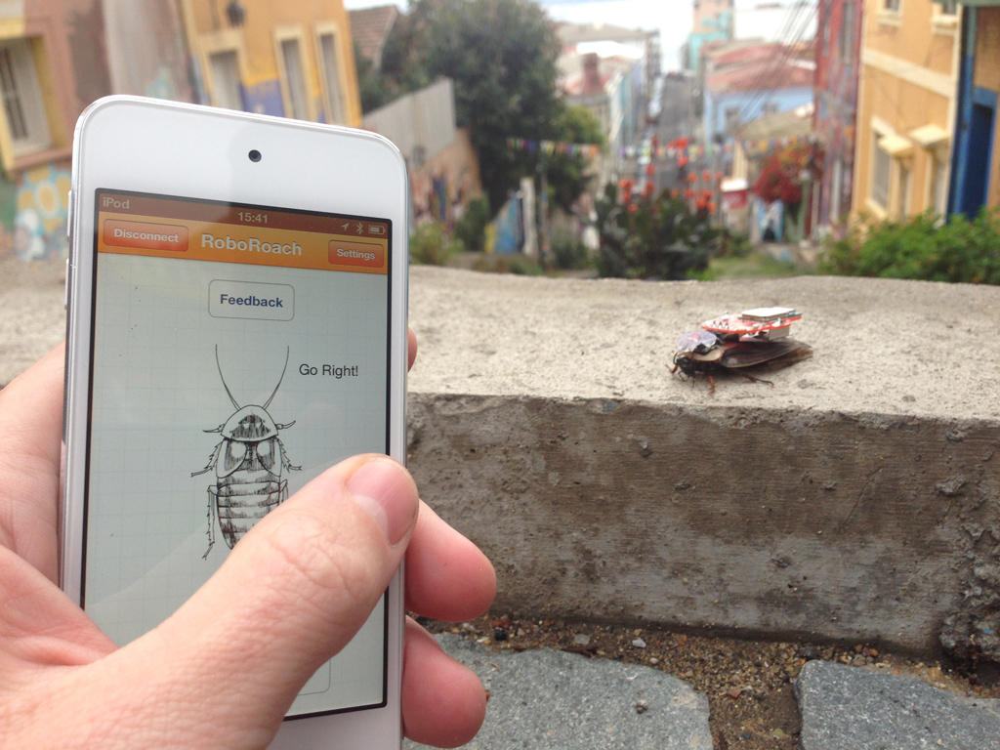
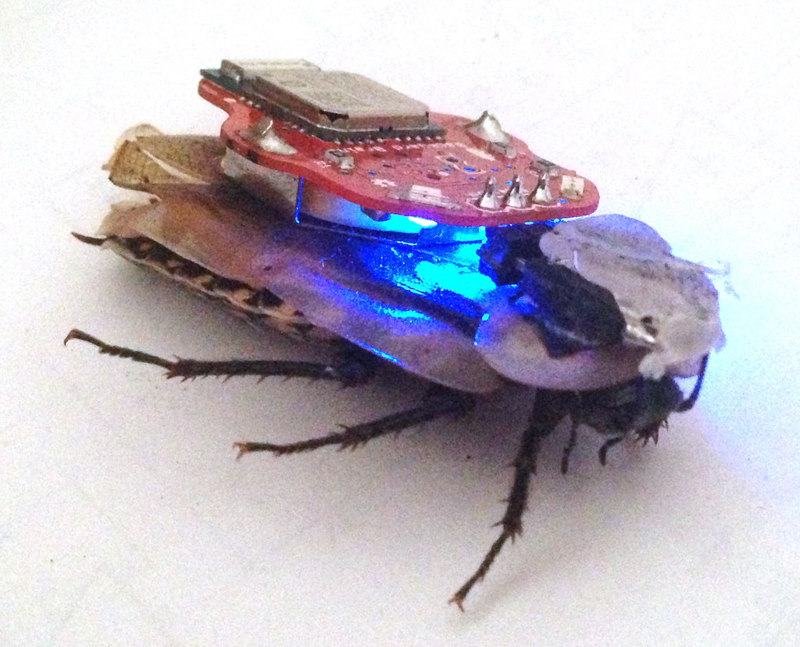
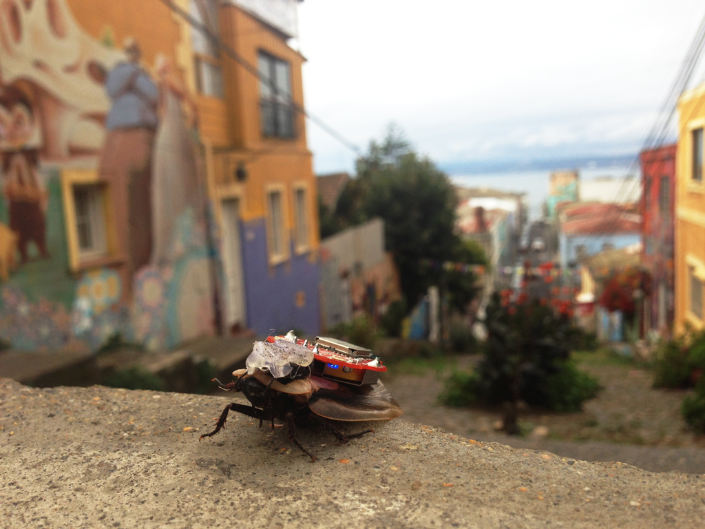
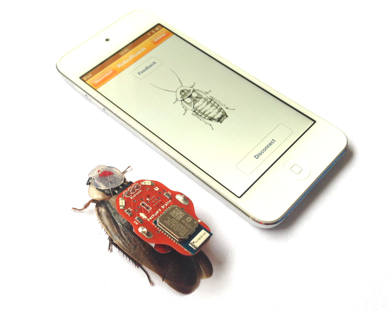
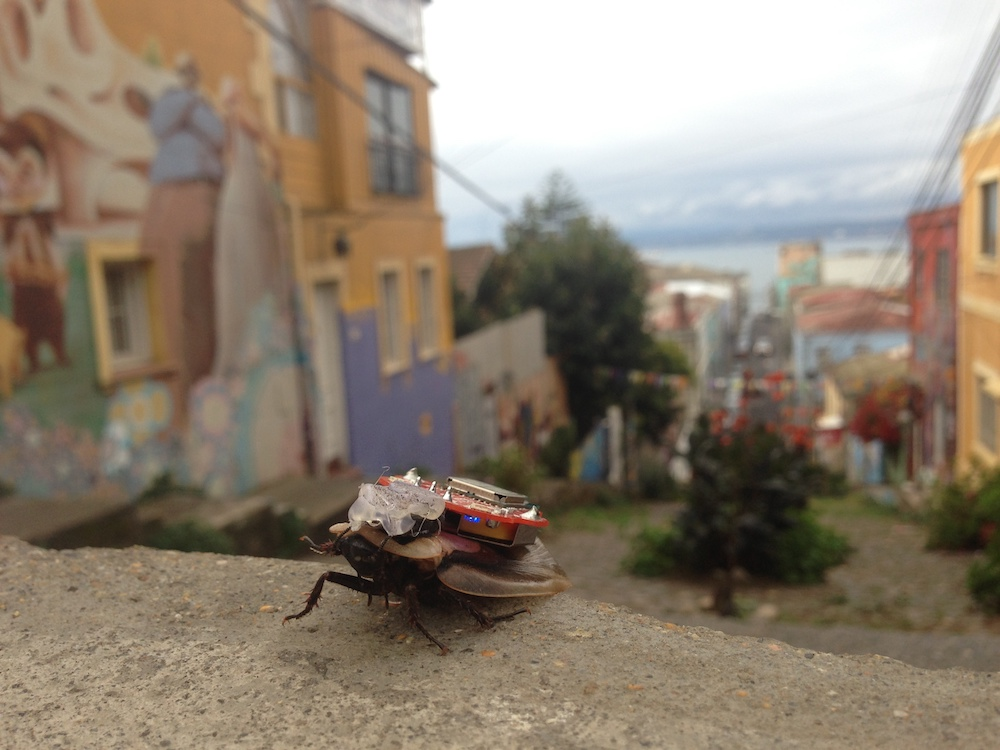

## RoboRoach Workshop

---

### Documents

- [Android App](./files/RoboRoach.apk)

### Experiments

- [Getting Started with the RoboRoach](../Experiments/roboroachsurgery.md)

---

## About the RoboRoach Workshop

Build your own cyborg insect and share your love of neuroscience with friends!
We provide all the tools (and cockroaches) you need to create your very own
cybernetic organism. In this workshop:

- **Learn Microstimulation** – Understand the science behind controlling insect locomotion
- **Perform the Surgery** – Build and install the RoboRoach “backpack”
- **Experiment & Observe** – Explore the concepts of habituation and physiology
- **Take it Home** – You’ll leave with your own fully working RoboRoach kit

### The Workshop Format

A typical workshop lasts about two hours:

1. **Intro Presentation** – Background on microstimulation, RoboRoach project
2. **Live Demo** – Observe a working cyborg roach
3. **Hands-on Surgery** – Participants build their own RoboRoach with guidance
4. **Discussion** – Applications of microstimulation, Q&A, next steps

---

### How It Works

1. Sign up for the workshop
2. Show up at Campus Party (or your event location)
3. We provide all tools and materials
4. Build your own RoboRoach!

### See the RoboRoach in Action

Watch our demos on social media, or check out our TED Talk about the RoboRoach.

