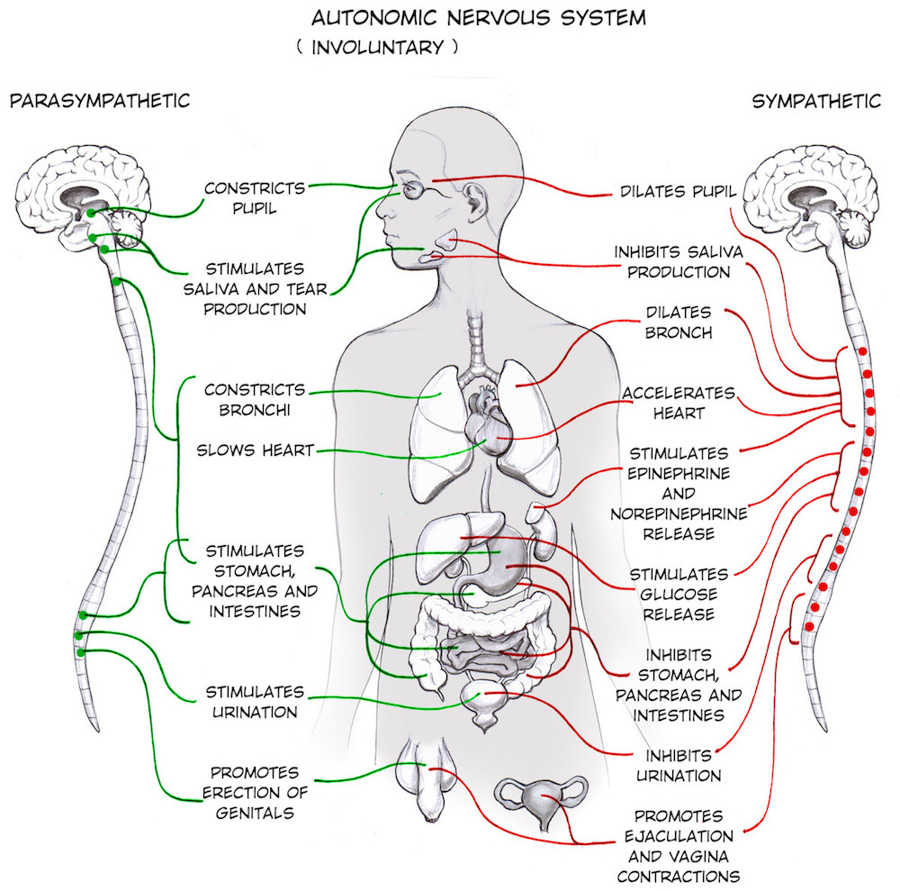
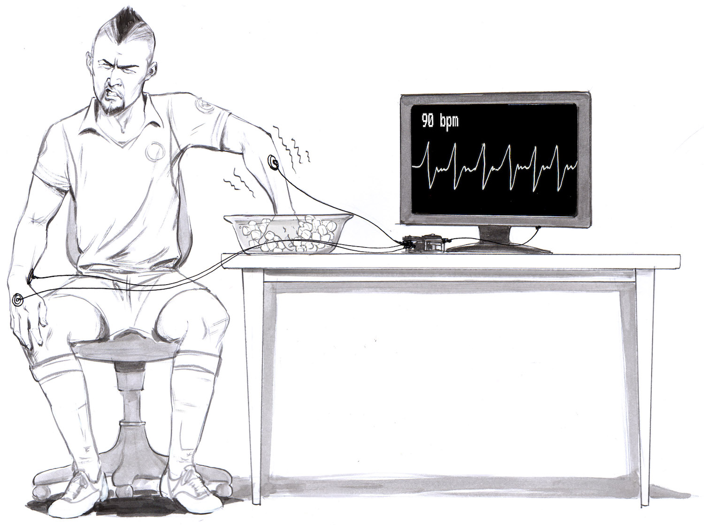
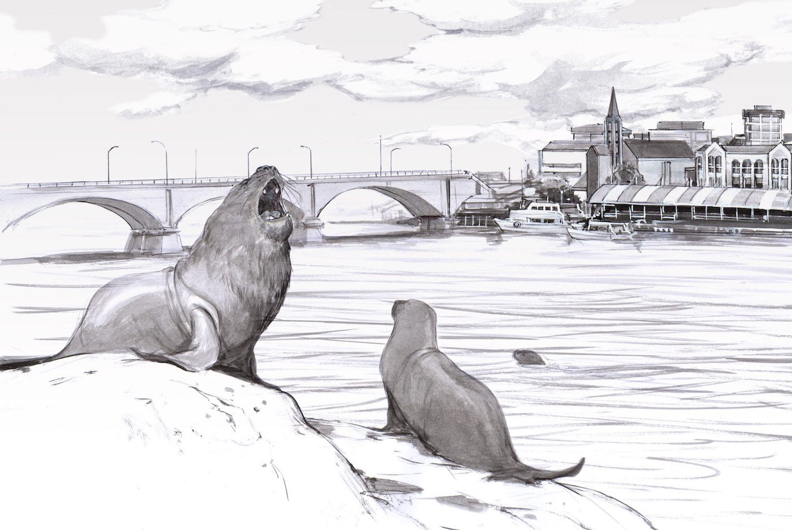

# Experiment:Activate your Sympathetic Nervous System

We will learn about your involuntary nervous system and manipulate it! Welcome
to the autonomic nervous system, its division into the sympathetic and
parasympathetic systems, and how it controls heart rate.

**Time:**  30 minutes

**Difficulty:**   Beginner

#### What will you learn?

Here we will activate your sympathetic nervous system using a famous model
pain stimulus_ dunking your hand in ice water. As you maintain the hand in the
ice water and your hand begins to hurt, your sympathetic nervous system "fight
or flight" response will activate. This causes your heart rate to increase,
which we will measure with our Heart and Brain SpikerShield.

##### Prerequisite Labs

  * [Heart Action Potentials](heartrate) \- You should have a basic understanding of how to use the Heart & Brain SpikerShield to record your heartbeat.

##### Equipment

* [Heart and Brain SpikerShield Bundle](/https://backyardbrains.com/products/heartAndBrainSpikerShieldBundle)
* [Ice Water](https://en.wikipedia.org/wiki/Cold_pressor_test)

## Background

Most of our human physiology experiments have dealt with the voluntary nervous
system ([Neuromuscular Neuroscience](https://backyardbrains.com/experiments/muscleSpikerBox)) or
perception ([Sensory Neuroscience](https://backyardbrains.com/experiments/p300)); but here we will
talk about the "involuntary" part of the nervous system, the **autonomic**
nervous system. The autonomic nervous system controls things we are both aware
and unaware of but generally do not have much control over - digestion,
homeostasis, sweating, blood pressure, heart rate, and many others. It is
traditionally divided into two systems, the sympathetic division (which
activates the coined "[fight or flight](https://en.wikipedia.org/wiki/Fight-or-flight_response)" response) and the parasympathetic division (which
activates the also-coined "[rest and digest](https://en.wikipedia.org/wiki/Parasympathetic_nervous_system)"
response).

We can study the effects of the sympathetic nervous activation by measuring
heart rate. In our previous [heart rate experiment](https://backyardbrains.com/experiments/heartrate) we observed the 
electrical impulses of the heart and the increase in heart rate during
exercise. Let's go a little deeper into heart rate physiology and try to
specifically activate your sympathetic nervous system's "fight or flight"
response. What happens in "fight or flight?" As you can imagine, if faced with
a threat, say, a large shadow moving in the night, the heart rate increases,
sweating begins, respiration increases, digestion is inhibited, the eyes
dilate, and many other things.

Alternatively, the parasympathetic activates the "rest and digest" response,
which performs the opposite of all the things listed above (heart rate
decreases, digestion activates, salivation increases, etc). Many of these
reactions in both the sympathetic and parasympathetic systems are controlled
by hormones, which can be helpful to think of as "neurotransmitters" but that
enter the bloodstream instead of the synaptic cleft to find their targets, and
instead of response times of 1 ms in the brain, hormones have response times
in the scale of seconds to minutes on multiple structures in the body.

For example, when the sympathetic nervous system is activated, the pituitary
gland, which anatomically branches off of the hypothalamus in the brain,
releases Adrenocorticotropic hormone (ACTH) into the bloodstream, increases
cortisol levels, causing various physiological changes including heart rate
increase. Simultaneously, the adrenal gland, a neural ganglion located on the
kidneys, releases norepinephrine and has a similar effect on the heart.

To activate your sympathetic nervous system, we will use the famous "ice
water" stimulus. This [is often used](https://en.wikipedia.org/wiki/Cold_pressor_test) in pain studies as
humans can tolerate it, everyone has experienced cold hands before, it is not
scary and does not result in psychological damage, and is a [a good model stimulus](https://science.sciencemag.org/content/354/6312/564) easy to
replicate in labs around the world. The longer you keep your hand in ice
water, the more painful it becomes, activating your sympathetic nervous
system, which will lead to an increase in heart rate.

Now let's see it for ourselves!

#### Downloads

> Before you begin, make sure you have the [Backyard Brains Spike Recorder](https://backyardbrains.com/products/spikerecorder) installed on
> your computer. The Backyard Brains Spike Recorder program allows you to
> visualize and save the data on your computer when doing experiments. We have
> also built a simple lab handout to help you tabulate your data.
>
> [Spike Recorder Computer Software](https://backyardbrains.com/products/spikerecorder)
>
> [Class Handout](https://backyardbrains.com./files/Heart_Rate_HandOut.pdf)

## Video

#### Print Materials

> If you're looking for a PDF to print and scribble on, or a google doc to
> edit, [check out this repository of print resources
> here!](https://drive.google.com/drive/folders/1bE1B0DvsGNauhyj-z8YjzuBXmFYivfkR?usp=sharing)

## Procedure

**Heart Rate Ice Water Experiment**

* Fill a pasta pot or large bucket 3/4 full with ice. 
* Add cold water. Note that you making ice water, not water with ice in it. The ice water will ensure that the mixture is always in equilibrium at 32° F (0° C). 
* Place [electrode patch stickers](https://backyardbrains.com/products/emglargeelectrodes) on your upper forearms, and one on the back of your hand. 
* Connect the red alligator clips of your orange cable with the electrodes on your upper forearms, and the ground alligator clip to the ground electrode on the back of your hand. 
* Hook up the orange cable to your Heart and Brain SpikerShield, and plug the Heart and Brain SpikerShield into your computer via USB. 
* Set up your SpikeRecorder software to begin recording heart rate. This is done by connecting your Heart and Brain SpikerShield to your computer via USB port, turning on the power line noise notch filter of 60 Hz (USA) or 50 Hz (Europe, South America) depending on the country you live in, and the general band-pass filters from 1-100 Hz. Go into threshold mode, click the heart icon, and move the threshold until your can isolate and calculate the heart rate. 
* Note if the electrocardiogram appears weird (upside down), interchange the two red alligator clips to opposite forearms. 

* Press the record button, write down the heart rate of the friend you are recording from, then... 
* Have your friend place their hand in the ice water, but leaving the upper forearms exposed so that the electrodes are not submerged. 
* Wait until your friend reports that the stimulus becomes painful enough that he or she can "barely tolerate it." 
* Write down their heart rate. 
* Repeat a number of times to get an average (see handout). 
* If you repeat enough observations, you can do [statistical hypothesis testing.](https://backyardbrains.com/experiments/p-value)

**Variant- The Diving Response**

While we are set up for this experiment, we also examine another effect on the
heart rate, called the [diving
reflex](https://en.wikipedia.org/wiki/Diving_reflex). When a seal lion or
other marine mammal dives, its heart rate decreases, and the veins and
arteries in peripheral tissues and limbs contract. This limits blood flow to
organs not related to the dive, reduces oxygen consumption of the heart, and
maintains blood flow to the brain.

But did you know that this response exists in all mammals, including you? When
cold water contacts your face and you hold your breath, we can see the "Diving
Reflex" as a decrease in heart rate. We can do variations to separate out the
effects of water contact on the face versus simply holding your breath.

**Heart Rate Diving Response Experiment**

_Note_ Instructor Supervision is advised when doing this experiment in the
classroom_

* Dump out the ice water in the pot above and replace it with more tolerable cold/cool water. 
* Record the resting heart rate. 
* Have the subject hold their breath and submerge their face under water for as long as the subject is comfortably able to. 
* Observe the heart rate. Does it decline, and then increase when the subject removes his/her head from the tub of water and begins breathing again? 
* Now have the subject use a snorkel. 
* Repeat the experiments, but have the subject hold his/her face under the water but respiring through the snorkel. 
* Does the heart rate change in the same way as when the subject was holding their breath under water? 
* Finally, measure the heart rate, and just ask the subject to hold his breath instead of submerging their face under water. You should notice the heart rate go down and then briefly rise again upon return to normal breathing. Was it more or less dramatic than when the face was submerged underwater?

## Notes

* We thank our exercise and muscle physiology colleague, Associate Professor [Brian L. Tracy](https://www.hes.chhs.colostate.edu/faculty-staff/tracy.aspx) for describing this experiment to us during the Society for Neuroscience 2016 conference. 
* The word "autonomic," meaning involuntary, is related to the word "autonomous," meaning independent. 

## Science Fair Project Ideas

Since these experiments are relatively easy to do quickly, you can rapidly
generate a large data set in your family or school. Are there differences
between athletes and people with normal or low levels of fitness? Are there
differences in age, differences between male and female students, etc. [Happy Statistics!](https://backyardbrains.com/experiments/p-value)

We previously studied the effect of exercise of heart rate. Why would or would
not this stress response caused by ice increase the heart rate through
different physiological mechanisms than exercise?