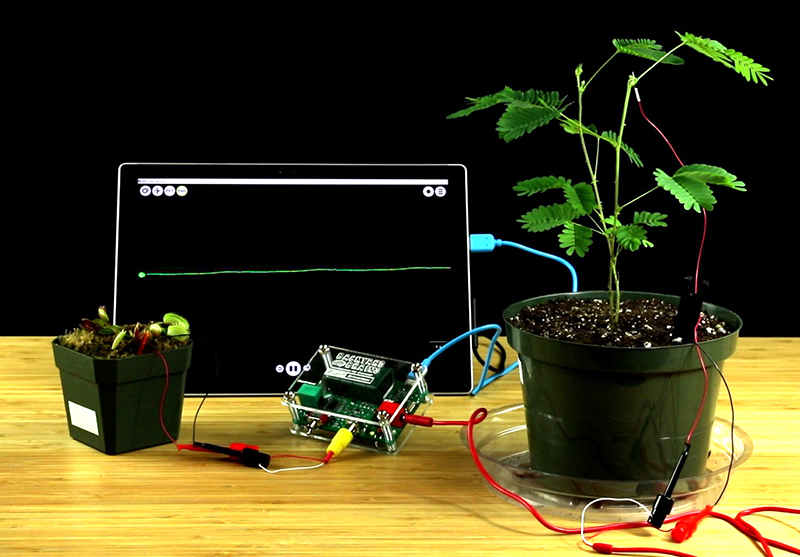
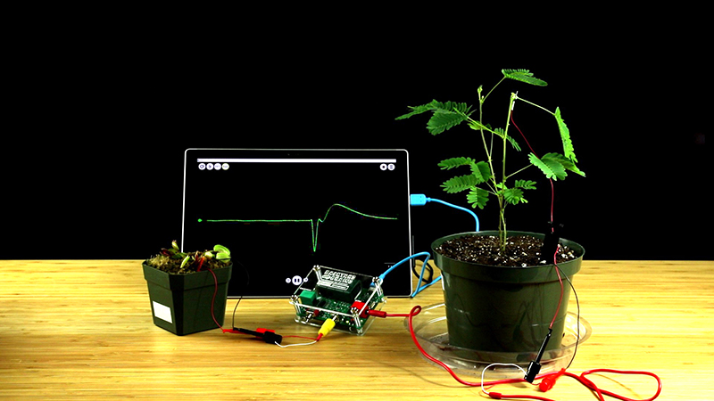

# Experiment: Advanced Plant Electrophysiology: Control the Behavior of One Plant with Another's

Time  1 hour

Difficulty  Intermediate

#### What will you learn?

In this experiment, featured on the [TED Main Stage](https://www.ted.com/talks greg_gage_electrical_experiments_with_plants_that_count_and_communicate?utm_campaign=tedspread--a&utm_medium=referral&utm_source=tedcomshare), you will learn about plant electrophysiology and record the action potential of the Venus fly trap.

##### Prerequisite Labs

  * None

##### Equipment

[Plant SpikerBox](/products/plantspikerbox)

Sensitive Mimosa Plant

Venus Flytrap Plant

* * *

## Background

### Interspecies Plant-Plant-Communicator

The Interspecies Plant-Plant-Communicator is an experiment unlike any other.
Before you begin, we recommend familiarizing yourself with the [Venus
Flytrap](/experiments/plantspikerbox_VenusFlytrap) and [Sensitive
Mimosa](/experiments/plantspikerbox_SensitiveMimosa) experiments. These two
plants exhibit very striking and quick behaviors that begin to blur the lines
between "thinking" and "unthinking" life, and it can be an uncanny experience
when you see the movements of these plants for the first time.

To be clear, all provocations aside, plants don't have brains or neurons.
There is no evidence that they think or feel. They're not worried about how
far up they are on Mazlowe's hierarchy, they don't get stressed out over
elections, and they certainly don't care about baseball. A plant's "movement"
is strictly the result of biologically advantageous evolution. Still, they
share a similarity with us and with other living, "thinking," creatures, which
is fascinating; that is, they harness the power of Action Potentials!

We can see Action Potentials as a universal currency of movement. It is the
signal of stimulation and the birth of behavior. To distil this phenomena down
to a basic biological circuit, we present the Plant-Plant-Communicator, the
experiment wherein, simply, one Action Potential will trigger another, but
more fantastically, the behavior of one plant will control the next!

Much like the Human-Human-Interface, the Plant-Plant-Communicator is startling
to witness, somewhat alien in nature, and provokes questions concerning
neuroscience and electrophysiology. We challenge how younger students
categorize "brained" creatures with this demonstration. We then ask more
advanced learners how they would argue for a strict distinction between plants
and creatures with neurons...

This experiment was designed for our Plant Electrophysiology TED talk which we
gave in early 2017. Check out the TED talk below, then perform the experiment
yourself!

## Video of Experiment

## Procedure

In this experiment, we are going to open up a line of communication between
two plants of different species! We will trigger an Action Potential in a
Venus Flytrap, then send that signal to a Sensitive Mimosa, causing it to
react to the stimulus and drop its branch.

  1. Begin by selecting your Venus Flytrap and Sensitive Mimosa subjects. Try to pick two, healthy, large plants.   

#### Venus Flytrap

  2. Organize your Flytrap cables_ Yellow RCA Jack with electrode clips, one short black wire with grounding pin, one orange stake recording electrode. 
  3. Take the orange electrode stake and plant it firmly into the ground so that the silver electrode wire is touching, or is nearly touching, the side of the Venus Flytrap. 
  4. Apply conductive gel where the electrode meets the plant wall to complete the connection. 
  5. Take the short, black grounding pin with wire and ground the ground in the ground (stick the pin in the dirt...) 

  6. Place your Venus Flytrap near your Plant SpikerBox and plug in the yellow RCA jack electrode. 
  7. Then, take the clips from the RCA jack and attach the red clip to the red wire (the recording electrode on the stake) and the black clip to the black wire (the grounding pin).   

#### Sensitive Mimosa

  8. Organize your Mimosa cables_ Stim Cable (long red cable with clips), one long black wire with grounding pin, one long red wire with silver wire tip. 
  9. Take the black wire grounding pin and stick it in the dirt near the Mimosa's stem. 
  10. Take the red wire with the silver tip and carefully, and tightly, wrap the silver tip once around a large Mimosa branch. Try to wrap it close to the stem. This will probably cause the branch to "fall" as you fumble to wrap the electrode. That's okay, you just have to wait 10-20m for it to reset before performing the experiment. 

  11. Apply a dab of conductive gel where the wrapped electrode meets the plant. 
  12. Plug the red stimulation cable into the Plant SpikerBox and, pay attention here_ Attach the BLACK clip to the RED cable and the RED clip to the BLACK cable. 

  

Sorry, we know it is confusing, we repeat, **attach the red cable's black clip
to the red wire (tied around the stem) and the red clip to the black wire
(pinned into the dirt).** For the experiment to work, we must reverse the
polarity of the connection, so we're actually grounding on the plant and
sending the stimulation signal from the dirt...

  13. Once you've followed these directions, and doubled checked steps 12 and 13, turn on your Plant SpikerBox! 
  14. If you want to record the trigger, plug your Plant SpikerBox into either a smartphone or PC which has the [Backyard Brains SpikeRecorder](https://backyardbrains.com/products/spikerecorder) software installed. 

  15. Look for the red "Enable!" button near the front facing side of the Plant SpikerBox. Press the button and look for the red LED beside it. The LED should begin blinking. The blinking indicates that the experiment is armed and ready to go! 

  16. Finally, carefully stimulate just one of the trigger hairs in the Venus Flytrap and behold! The stimulation cable should carry the Action Potential across from the Venus Flytrap and the Sensitive Mimosa will dramatically react, drooping and appearing to wither up! This is the beauty of the Interspecies Plant-Plant-Communicator! 

  17. If an action potential fires, but it doesn't drop the branch, try swapping out for a fresh battery, moving the ground pin closer to the stem of the Mimosa, or adjusting the silver wire electrode's positioning or the amount of conductive gel on the branch. 

## Discussion

* Do you think you could reverse this circuit? How would you prep it? Try it out! 
* What have you learned about how plants are similar to ourselves? And how are they different? 
* Think about this interface as an electrical circuit, what is actually happening here? 
* Can you think of any other plants which could be integrated into this circuit? Could you create an INTRAspecies plant-plant-communicator? Just remember, the Venus Flytrap requires TWO Action Potentials to close... 
* Could you come up with a way to send a signal to a plant with your muscles?