# Experiment:Bistable Perception

Build the "Phenomenogram"_ a device capable of continuously measuring a
person's perception in [bistability](https://en.wikipedia.org/wiki/Bistability)
experiments.

**Time:**  3 hours

**Difficulty:**   Advanced

#### What will you learn?

With this experiment, you will be introduced to human perception, learn what
bistability is, and how to measure it in real time. You will also gain
familiarity with the popular open source Arduino microcontroller and the
Processing Computer interface.

##### Prerequisite Labs

none

##### Equipment

* [Arduino Proto Kit](https://www.sparkfun.com/products/7914)
* [Arduino Uno](https://www.sparkfun.com/products/11224)
* [An enclosure, knobs, and some audio cables](https://www.radioshack.com)

## Background

_Designed and Written by Ivo Leiva & Fabiola Sánchez, students of neuroscience
at the University of Chile._

_This is a DIY experiment; you build it yourself!_

One of the many fascinating areas in cognitive sciences is the study of human
perception. Human perception can measure tastes, 3D localization of sound,
pattern recognition, and many other things in a rich and old scientific
literature. Thus, in the lab, there are many different instruments to register
the components and changes that comprise human perception, ranging from simple
handwritten paper logs to real-time signal processing computers.

Low cost machines often have severe limitations, common ones being not having
a digital backup of the data for computational analysis, _post facto_ analysis
with no real-time data, low sistematicity, or typically dichotomous options
(Yes/No, A/B) that disregard the graded components underlying perception.

Typical experiments with perception are made using stimuli that have two
distinguishable stable forms. This is called bistability and means that they
can be perceived as either form A or form B over time, neither of them being
the "correct" form of perceiving the stimulus. Two famous bistable stimuli are
the optical illusions of the [Necker
cube](https://en.wikipedia.org/wiki/Necker_cube) and the [Ruben
vase.](https://en.wikipedia.org/wiki/Rubin_vase)

[ 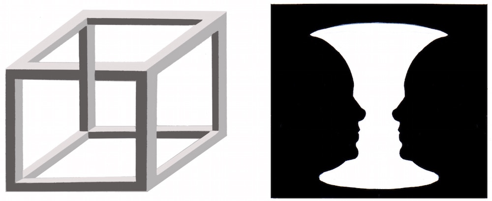](img/Cubo_Vaso_juntos_web.jpg)

Some types of [anagrams](https://en.wikipedia.org/wiki/Anagram), like the
Spanish words for ham (jamón) and nun (monja), when pronounced repeatedly,
result in a change of the perception, one word transforming into the other
one. This process of meaning change about a given stimulus over time is of
high interest in cognitive sciences, psychology, and recently neuroscience.
First, where does this switch in perception occur in the brain (mapping), and
how do the neural networks switch between the two perceptual modes (neural
circuit analysis)?

Therefore, it is for this that we created the Phenomenogram, a device capable
of registering in real-time the perception of subjects during bistability
experiments in a continuous manner.

[ 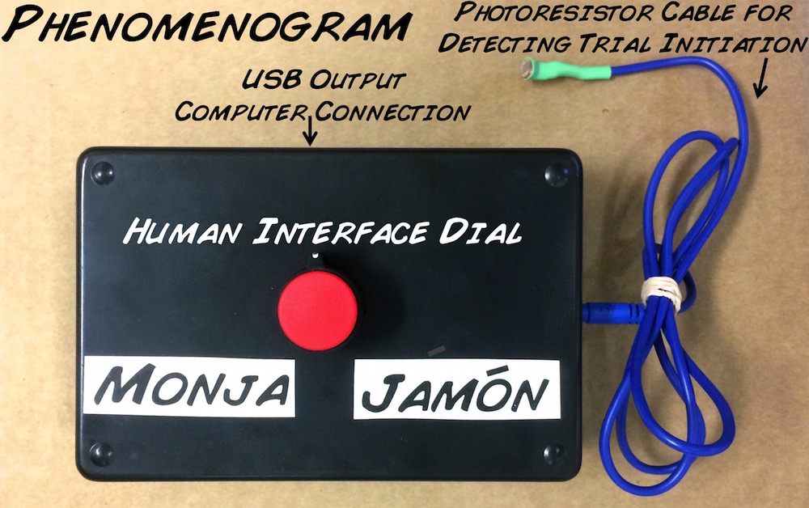](img/Fenomenogram.jpg)

Our device can be analyzed together with brain activity data, such as that of
[EEG](https://backyardbrains.com/experiments/eeg) or
[PET](https://en.wikipedia.org/wiki/Positron_emission_tomography) to identify
network changes during perceptual shifts. What are our improvements over other
designs? -- low cost, portability, open source design, and the ability to
measure graded responses.

#### Downloads

> Before you begin, make sure you have the Arduino and Processing programs
> installed on your laptop. We recommend downloading the most recent version
> of Processing, but we have tested down to version 1.5.1, and our code works.
> The Arduino "Sketch" is what you install on your Arduino circuit board using
> the Arduino laptop software (you only need to do this once), and the
> Processing "Sketch" runs in the Processing Software on your laptop, talking
> to the Arduino Circuit Board to allow you to visualize and save the data on
> your computer when doing experiments.
>
> [Arduino Software](https://arduino.cc/en/main/software#.Uxd6XYWhZMk)
>
> [Processing Software](https://www.processing.org/download/?processing)
>
> Download our Arduino(.ino) and Processing(.pde) sketches
>
> [Arduino Sketch for Sending Data from Phenomenogram to
> Computer](./files/BYB_Arduino_FenomenogramaV2.ino.zip)
>
> [Processing Sketch for Displaying and Saving Data of Phenomenogram on
> Computer](./files/BYB_Processing_Fenomenogram.pde.zip)

## Video

## Materials

The full list of materials is as follows_

  1. 1x [Arduino Uno](https://www.sparkfun.com/products/11224)
  2. 1x Arduino [ProtoShield](https://www.sparkfun.com/products/7914)
  3. 1x linear [Potentiometer](https://www.sparkfun.com/products/9939)
  4. 1x [Knob](https://www.sparkfun.com/products/10002)
  5. 1x [Photodiode](https://www.sparkfun.com/products/9088)
  6. 1x Resister ([10 kΩ](https://www.sparkfun.com/products/8374)) 
  7. 1 x audio headphone [cable](https://www.sparkfun.com/products/8566)
  8. 1 x audio headphone [cable jack](https://www.sparkfun.com/products/11154) (or [RadioShack Alternative](https://www.radioshack.com/3-5mm-2-conductor-panel-mount-phone-jack/2740248.html#.VP5bN4HF_eY)) 
  9. Some [wires](https://www.sparkfun.com/products/11367)
  10. Some [male](https://www.sparkfun.com/products/116) and [female](https://www.sparkfun.com/products/115) pin headers 
  11. Some [heat shrink tubing](https://www.sparkfun.com/products/11379)
  12. 1 [Enclosure](https://www.sparkfun.com/products/11366), dimensions 6 inch (152 mm) by 3 inch (76 mm) by 2 inch (51 mm) or [RadioShack Alternative](https://www.radioshack.com/project-enclosure-6x3x2-/2701805.html#start=9)
  13. Your ToolBox! Of basic mechanical (hand drills, screwdrivers) and electrical tools (soldering supplies) 

## Procedure

In this design, we use the popular microcontroller Arduino with a custom
shield for the human interface combined with a photoresistor cable for
communicating with other devices wirelessly with light.

[ 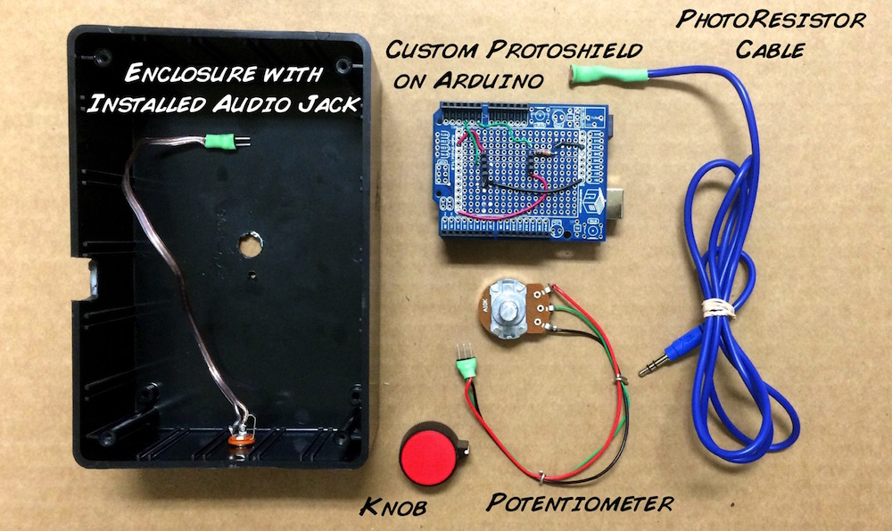](img/WhatYouBuild.jpg)

**The Custom Shield**

  1. First of all, we need to assemble the body of our Phenomenogram Custom Shield. For this, solder all the headers of the Arduino ProtoShield on its Analog and Digital input holes. 

[ 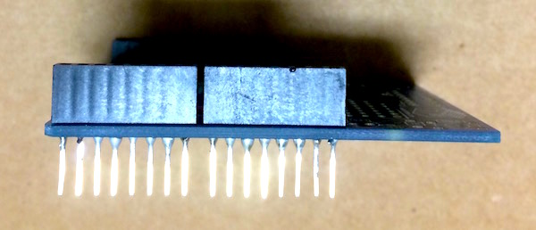](img/Headers_Install2.jpg)

  2. Now, attach in the center proto-area a row of three female headers and another row of two headers somewhere else where you desire. On the three-header, connect, with jumper wires, the left position to 5V, the center position to Analog input A2, and the right header to GND. For the two-header, connect the right position to 5V and the left side to both A0 and a 10kΩ resistor going to GND. 

[ 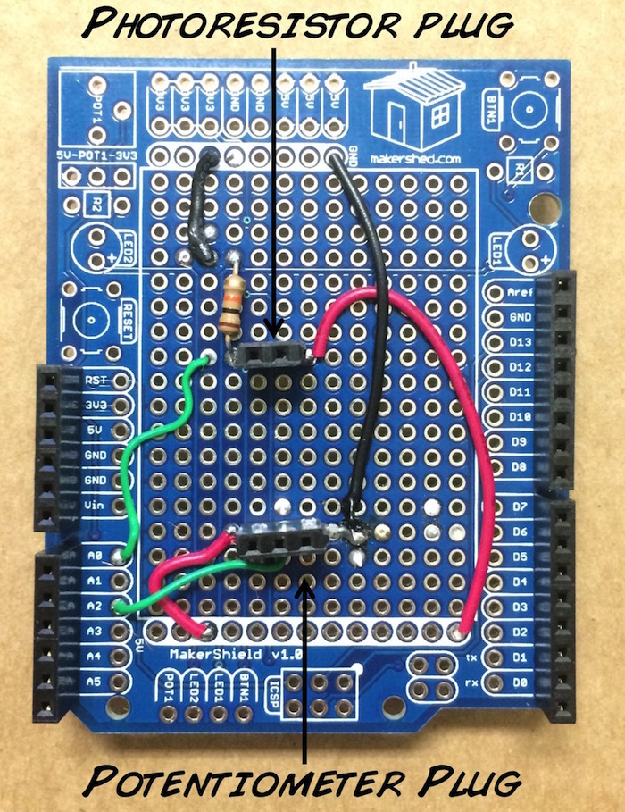](img/Fenomenogram_Circuit2.jpg)

  3. This circuit diagram will be helpful as you build your circuit. 

[ 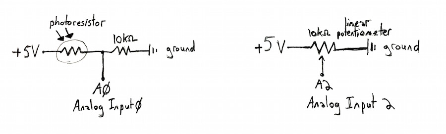](img/Fenomenograma_Diagram.jpg)

  4. That's enough for now. We will attach it on the Arduino Uno later. 

**The Human Interface**

  1. Now the accessories. Since we are going to register the perceptual pass from one stimulus to another, a knob that the human user moves to signal one percept vs. another will be useful. Take a 10kΩ linear potentiometer, and you will see it has three terminals on it. Solder a wire to each of the three terminals. Use different color wire for each connection; this will be a guide for later. 
  2. Now take three pin headers and solder them to the other side of each wire. Cover the joint with some heat shrinking tube to isolate and protect the solder joints. 

[ 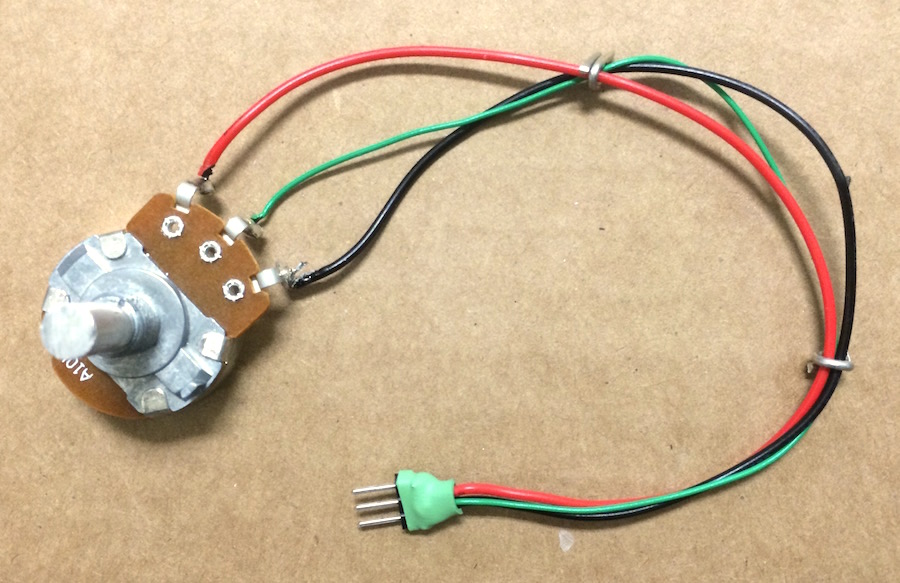](img/Potentiometer.jpg)

  3. This is going to be our human interface, where the human will turn the knob in positions to tell us his/her perception of monja vs jamón by moving the knob. The information will be sent to the computer through the Arduino micro-controller connected to the computer via a USB cable. 

**The Trial Indicator**

  1. Our next task is to find a way that allows us to tell when an experiment began vs. when it ended. This is called an "event marker." These experiments on perception (it can be visual or audio) are run in a dark room with the human focuses on a black-background computer screen, and when a small white appears box in the corner of the screen, this signifies the beginning of a trial. Thus, we used a photoresistor that sends a different value to the Arduino depending on whether a white square (high luminance) or no-square (low luminance) is present. The photoresistor cable is affixed directly in front of the part of the screen where the white square appears.

[ 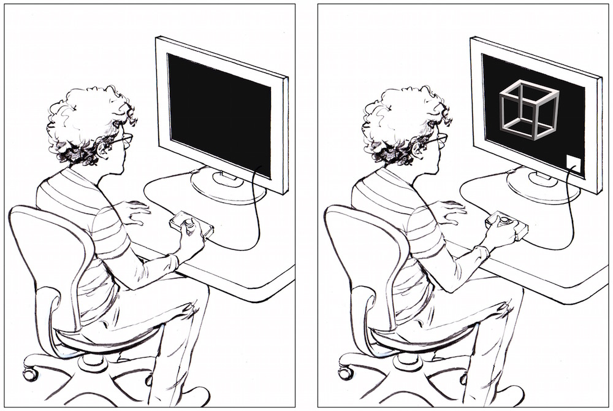](img/PantallaConLuz_Web.jpg)

  2. To build this photoresistor cable, take the audio cable and the photoresistor, cut the audio cable in half and expose the signal (typical red) and ground wire (typically bare wire). Solder each end of the photoresistor to the signal and ground wire of the audio cable (the polarity doesn't matter). Cover the solder joints with some electrical tape and heat shrink tubing to protect the joint. 

[ 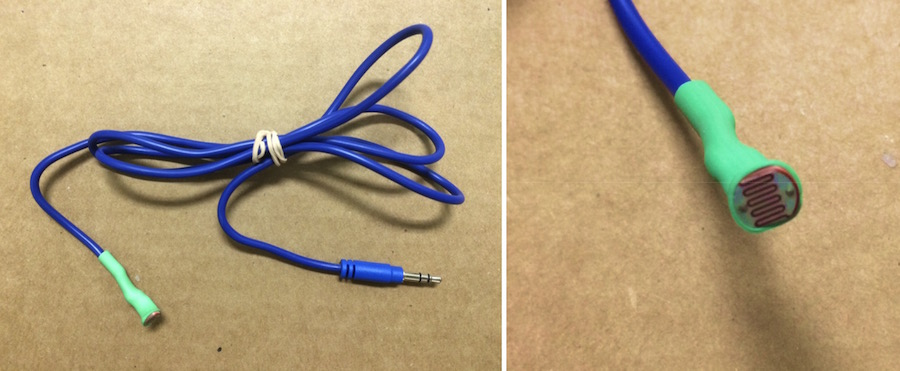](img/PhotoResistor2.jpg)

  3. Now take the phone cable jack and attach two wires to it - one on the signal terminal and the other on the ground terminal. Attach two pin male headers to the other end of the wires and, again, use heat shrink tubing to protect the joints. 

[ 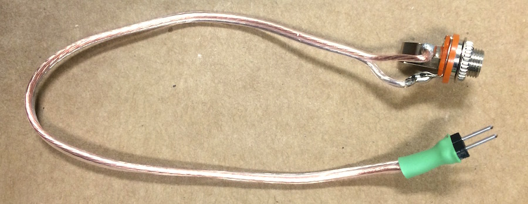](img/AudioJack.jpg)

**The "Cajita" - The whole thing**

  1. The only thing left to do is to put all the parts together. 
  2. Attach the ProtoShield to the Arduino 

[ 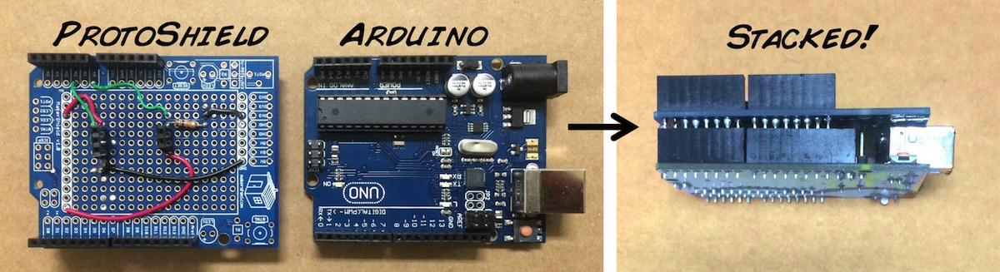](img/AttachTheShield.jpg)

  3. Connect the potentiometer cable to the three-header jack on the Proto-Shield (the orientation is important, use the photo below as a guide). 
  4. Attach the photoresistor cable jack to the two-header jack on the Proto-Shield (the orientation is NOT important here, unlike the potentiometer connection). 

[ 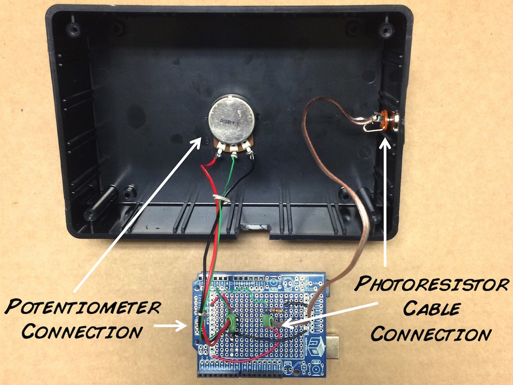](img/Connections_Fenomenogram.jpg)

  5. You can put all this inside a plastic box to protect the hardware and make the Phenomenogram look fancy. 
  6. Connect the photoresistor cable, the USB cable, add some sticker labels, and Voilà!, The hardware is complete. Once you've done this, just load the Arduino sketch using your computer USB interface and run the Processing sketch to begin exploring the changes of your perception! Use [this audio file](./files/Jamon_Monja_de_Ivo_Leiva.mp3) to test the switching of your perception. To record the data, press the "r" on your keyboard when the Processing Sketch is running. The .csv file has three columns_ time, reading of knob, and whether light was present or not (trial occurring or not), with a "1" or a "0". 

[ 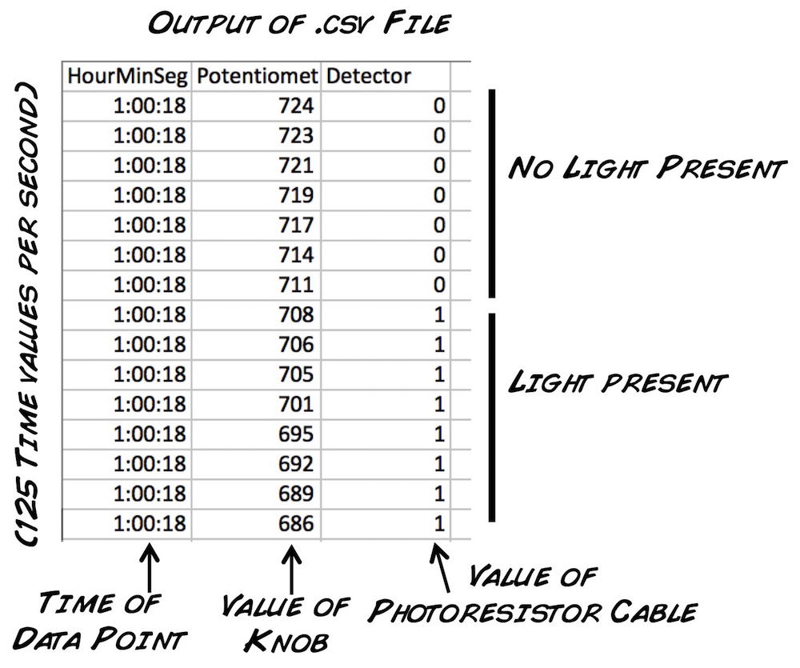](img/Output_csv_web.jpg)

  7. Now go and study your own bistabiliy or that of someone else! and [let us know](mailto_tim@backyardbrains.com) if you find something interesting lurking in the corners of your perception of reality. 

[ 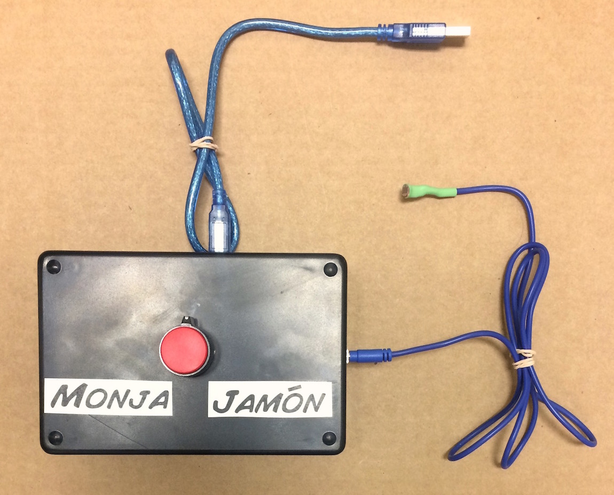](img/Fenomenograma_sin_labels.jpg)

## Discussion / Further Work

  1. We only tested the difference between the words jamón (ham) and monja (nun), but this equipment can be used for any kind of perception experiment where the subject must choose between two states. There was [a famous dress](https://www.wired.com/2015/02/science-one-agrees-color-dress/) that made a brief splash on the internet a few weeks ago, for example... 
  2. This phenomenogram also can be hacked rather easily to recreate a famous historical [diversion](https://en.wikipedia.org/wiki/Pong).