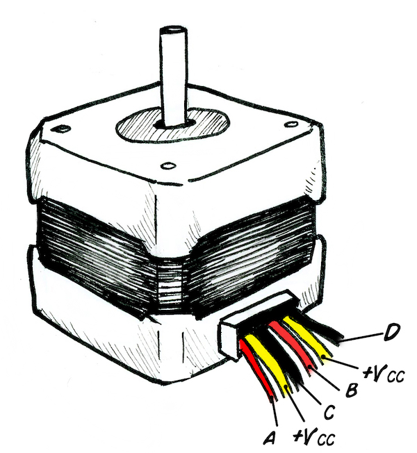
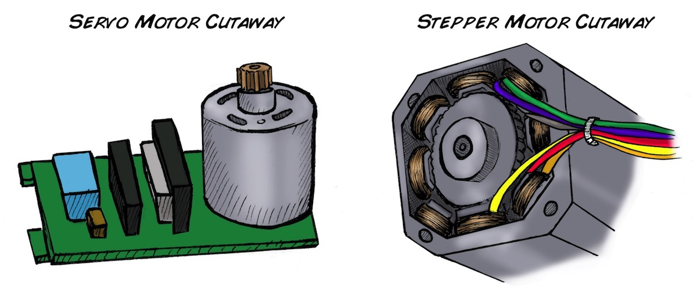

# Experiment_ Controlling a Stepper Motor with Your Muscles

What biology beyond flagella has never achieved_ Rotary Motion with Axles.
Here you will learn to make an interface with a Stepper Motor and enjoy making
precise circular movements.

Time  1 hour

Difficulty  Intermediate

#### What will you learn?

In this experiment, we will drive a stepper motor using EMG signals from the
Muscle SpikerShield. With this stepper motor, you can design your own
inventions that move things with your muscle signals.

##### Prerequisite Labs

  * [Getting started with the Muscle SpikerShield](https_//backyardbrains.com/experiments/musclespikershield)

##### Equipment

[Muscle
SpikerShield](https_//backyardbrains.com/products/muscleSpikershieldBundle)

[Stepper
Motor](https_//www.amazon.com/gp/product/B00PNEQKC0/ref=ppx_yo_dt_b_asin_title_o01_s00?ie=UTF8&psc=1)

[Stepper Motor
Driver](https_//www.amazon.com/gp/product/B07JV835SW/ref=ppx_yo_dt_b_asin_title_o02_s00?ie=UTF8&psc=1)

[Breadboard](https_//www.amazon.com/Pcs-MCIGICM-Points-Solderless-
Breadboard/dp/B07PCJP9DY/ref=sr_1_6?dchild=1&keywords=breadboard&qid=1626130451&s=industrial&sr=1-6)

[Jumper
Wires](https_//www.amazon.com/dp/B01EV47GI4/ref=redir_mobile_desktop?_encoding=UTF8&aaxitk=88cb0c9353a9a208eec99acacc715eb6&hsa_cr_id=4414025220401&pd_rd_plhdr=t&pd_rd_r=f63a3a8f-b5fb-43e0-ba94-21c0a81a1e51&pd_rd_w=8bwoc&pd_rd_wg=1ILZo&ref_=sbx_be_s_sparkle_mcd_asin_2_title)

[9 Volt Connectors](https_//www.amazon.com/Battery-Connector-I-Type-Plastic-
Housing/dp/B07TRKYZCH/ref=sr_1_3?dchild=1&keywords=9+volt+connector&qid=1626130518&s=electronics&sr=1-3)

* * *

## Background

_Designed and written by José Enrique López Pérez, student of Electronic
Engineering in Oaxaca, Mexico._

Updated by Miguel Cornejo, high school student at Colegio Alberto Blest Gana
in Santiago, Chile.

**Where can we find a stepper motor?** Instead of buying one, you can also get
a stepper motor by opening up an old printer. These motors are generally used
in devices controlled by digital systems, like robotics, automation, and, of
course, our favorite, 3D printers!

**What are advantages of Stepper motors?**() The axis of a stepper motor
rotates at regular intervals instead of doing it continuously like DC (direct
current) motors. A Stepper Motor is programmed by a micro controller and can
be used for precise positioning within a wide range of applications. Precise
positioning of a DC motor is not possible by simple methods.

**How does a stepper motor work?** The stepper motor is known for its ability
to convert a train of input pulses (typically square wave pulses) applied to
its coils, into a precisely defined increment of movement in the shaft's
position. Each pulse moves the shaft through a fixed angle. This is called a
step, hence the name stepper motor. The result of this movement is fixed and
repeatable, allowing accurate and reliable positioning.

**Why are there so many cables in a Stepper Motor?** Unipolar Stepper motors
can have 5, 6 or 8 terminals that connect to [magnetic
coils](http_//en.wikipedia.org/wiki/Stepper_motor) that allow precise
positioning, in addition to other cables such as power and ground.

**Circuit of Stepper Motor**

**How is a Stepper Motor different from a DC Motor?**

A DC (direct current) motor moves continuously, without steps. It´s used when
its important to continually regulate the velocity of a motor. These are the
common motors you find in radiocontrol cars and other toys.

A DC motor has two terminals, (+) and (-). Electric current is generated
through this terminals making the motor spin in a determinate direction.

**How is a Stepper Motor different from a Servo Motor?**

A Stepper Motor consists of electromagnetic coils that can move a axle in
"steps." The more coils, the smaller the "steps" and the finer control. A
servo motor consists of a DC motor than is controlled by circuitry and a
geared transmission (transmission gears not shown below.) The chips are
monitoring the position of the axis and maintaining its position via feedback
control.

#### Downloads

> Take our (.ino) Stepper Motor Sketch and load it on your Arduino / Muscle
> SpikerShield Board
>
> [StepperMotor SpikerShield
> Sketch.ino](https_//backyardbrains.com/experiments/files/ControlStepperMotor_Arduino_SpikerShield.ino.zip)

## Video

## Procedures

  1. First, upload the Stepper Motor sketch to your Arduino, as you have [previously learned how to do](https_//backyardbrains.com/experiments/muscleSpikerShield). 
  2. Now, we will have to add a library from the library manager. Go to Tools --> Manage Libraries and search in the search bar for "AccelStepper" and install it. 

  3. We now need to find the circuit diagram of the stepper motor driver. This can usually be downloaded from [ searching the part number on the internet](https_//components101.com/modules/a4988-stepper-motor-driver-module). You can also see it directly on the board sometimes, like below. 

  4. Put the Stepper Motor Driver in a protoboard, attach the heat sink, and hook up the stepper motor power supply (9 V battery). The + of the battery goes into VMOT (Voltage Motor) and the - goes into GND (Ground). 

  5. We will now hook up the four wires of the stepper motor. Which wire is which and what goes where? Again, look at the schematics of the stepper motor you bought. You will see an image such as this_ 

  6. Notice that there are two pairs for the two coils in the motor_ a black / green pair and a red / blue pair. These are the colors of the four wires that come out of our stepper motor. We will plug the black and green wires into the "1" pair on the driver board (polarity does not matter), and the red and blue wires into the "2" pair on the driver board. 

  7. We will now add the connections that go to the Arduino / Muscle SpikerShield. We will not connect the Vdd to the 5V on the Arduino / Muscle SpikerShield Pair and the GND to...ground. Why do we have two power pins on this board? Because the driver chip and the stepper motor need different power supplies. 

  8. We will connect the control signal wire from the Arduino / Muscle SpikerShield Pair to the Stepper Driver circuit. The Dir (direction) jumper wire goes into Digital Out 7 (pin 8) on the digital outputs, and the Step jumper wire goes into Digital Out 4 (pin 5). We also short the Sleep and Reset pins together. 

  9. Now it's time to test! Plug in your orange electrode cable, and put electrodes on your forearms and ground. The two signal alligator clips (red) go on your muscle, and the ground alligator clip (black) attaches to the electrode on the back of your hand. Plug in the battery for the stepper motor, and connect the USB cable to the Arduino and your computer to provide power for the Arduino. 

  10. Now, when you flex, you should see the stepper motor turn. Now it's time to hack it! Can you modify the speed of the motor, the direction, etc.? With this new experience, now you can make your own inventions. Tell us what you are making [info@backyardbrains.com](mailto_info@backyardbrains.com) and maybe we can start a friendship! 

**Code description_** This code will convert the electromyographic signal
(EMG) that comes from your muscle to a number of pulses that will be sent to
the motor. For each pulse input the motor will spin a determined angle; if
there is more muscle activity, the Arduino will send more pulses to the motor.
This means the more you flex, the more the motor will turn! Below you can see
the code, and to download it, just click
[here](files/ControlStepperMotor_Arduino_SpikerShieldxxx.ino.zip) or see the
download links above.

**The Code**

    
        /**
       Experiment_ Controlling A Stepper Motor With Your Muscles
       Link_ https_//backyardbrains.com/experiments/MuscleSpikerShield_StepperMotor
    
       Edited by_ Miguel Cornejo
       Date edit_ March 4th, 2021
    **/
    #include  //Include AccelStepper library, via Arduino or Internet
    
    #define DIR 7                   //DIR pin from A4988 to pin 7
    #define STEP 4                  //STEP pin from A4988 to pin 4
    #define MOTOR_INTERFACE_TYPE 1  //How many motors are connected (Maximum motors are 4)
    
    AccelStepper stepper = AccelStepper(MOTOR_INTERFACE_TYPE, STEP, DIR); //Create a new instance of the AccelStepper class
    
    #define MAX 60                  // Maximum reading possible. PLAY WITH THIS VALUE!
    #define MAX_STEPS 10            // This is the maximum number of steps that will advance (You can modify this value).
    int readings[10];               // Array of readings.
    int finalReading;               // Averaged out reading from readings array.
    byte multiplier = 1;            // Multiplier for analog readings.
    byte numSteps = 0;              // The number of steps to take.
    int currentSteps = 0;           // The current number of steps taken.
    void setup() {
      Serial.begin(9600);         //begin serial communications
      stepper.setMaxSpeed(500);    //Set the maximum speed in steps per second
    }
    
    void loop() {
      for (int i = 0; i < 10; i++) {                              //Takes ten readings in ~ 0.02 seconds.
        readings[i] = analogRead(A0) * multiplier;
        delay(2);
    
      }
      for (int i = 0; i < 10; i++) {                              //Average the 10 readings.
        finalReading += readings[i];
      }
      finalReading /= 10;
    
      finalReading = constrain(finalReading, 0, MAX);            //Restrict "readEnd" to a defined range (0-> MAX).
      numSteps = map(finalReading, 0, MAX, 0, MAX_STEPS);        //Convert the value of "readfinal" to a number of steps to advance.
    
      if (numSteps >= 10)                                         //If there is no reading, the engine stops.
      {
        stepper.setSpeed(1000);       //Set the speed in steps per second (If you want it to go from one side or the other, put the positive or negative number)
        stepper.runSpeed();          //Accelerate the motor with a constant speed set by setSpeed()
    
      }
    
      else {
        for (currentSteps = 0 ; currentSteps <= numSteps ; currentSteps++)
        {
          Serial.print("Current Steps_");
          Serial.print(currentSteps);
          Serial.print("   ");
          Serial.print("Final Reading_");
          Serial.print(finalReading);
          Serial.print("   ");
          Serial.print("Steps Advanced_");
          Serial.println(numSteps);
          stepper.stop();
          delay(50);
        }
      }
      delay(10);
    }
        

## Science Fair Project Ideas

     * Try to design some reaction time experiments that could be done with your own body and with the motor. How does the time differ with other kinds of reaction time tests? Does it depend on the sensory stimulus you're reacting to? 
     * Hook up people of differing levels of athleticism-does this affect the strength or speed of the motor? How about how long they can move the motor for? 
     * What are some other devices you could connect this to? What might be the limit to what or how many you could connect to?