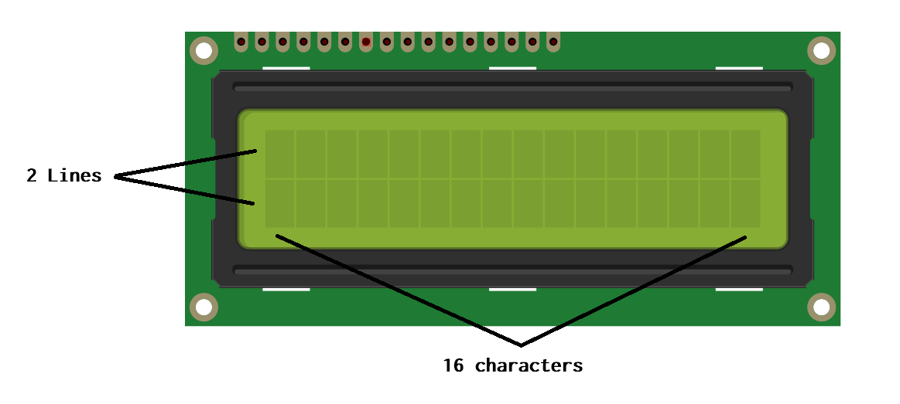
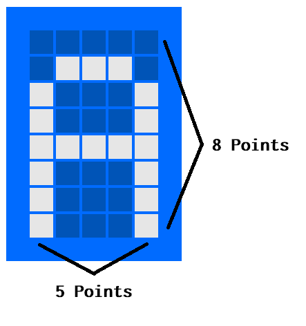
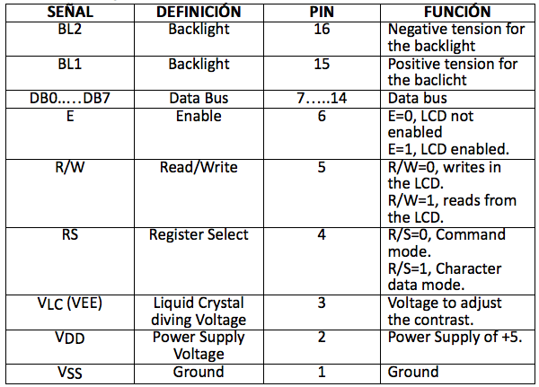
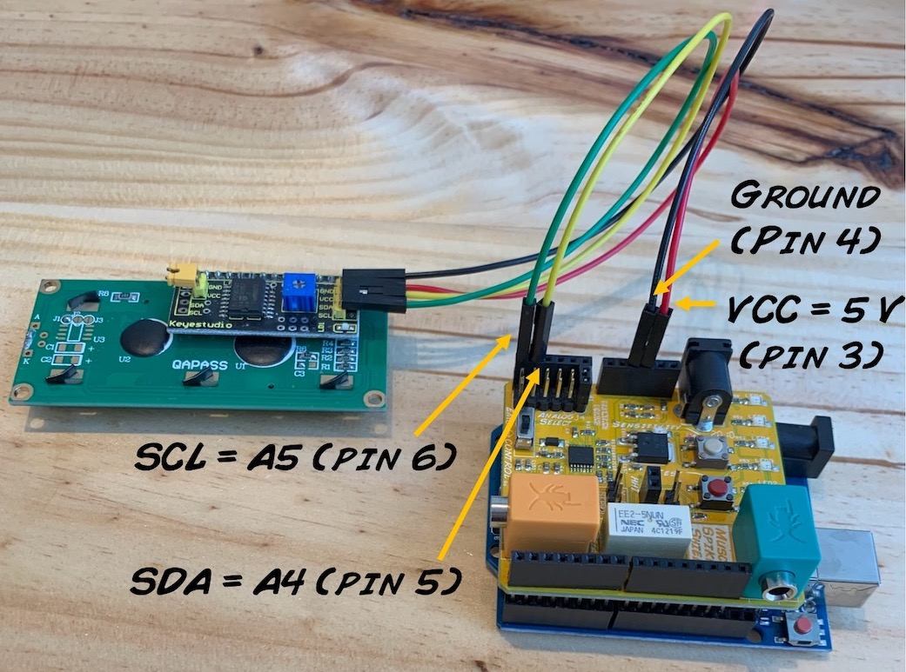
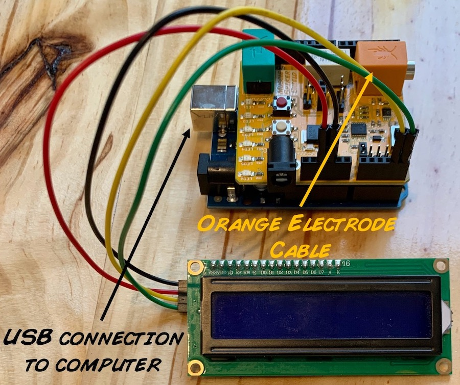
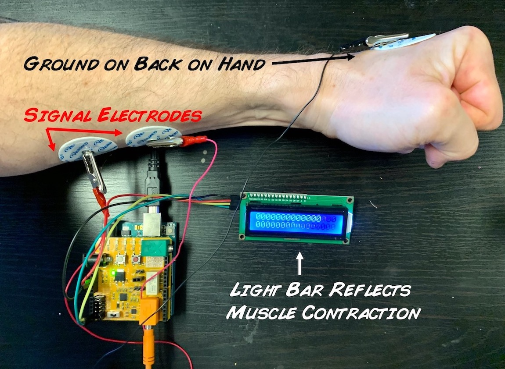
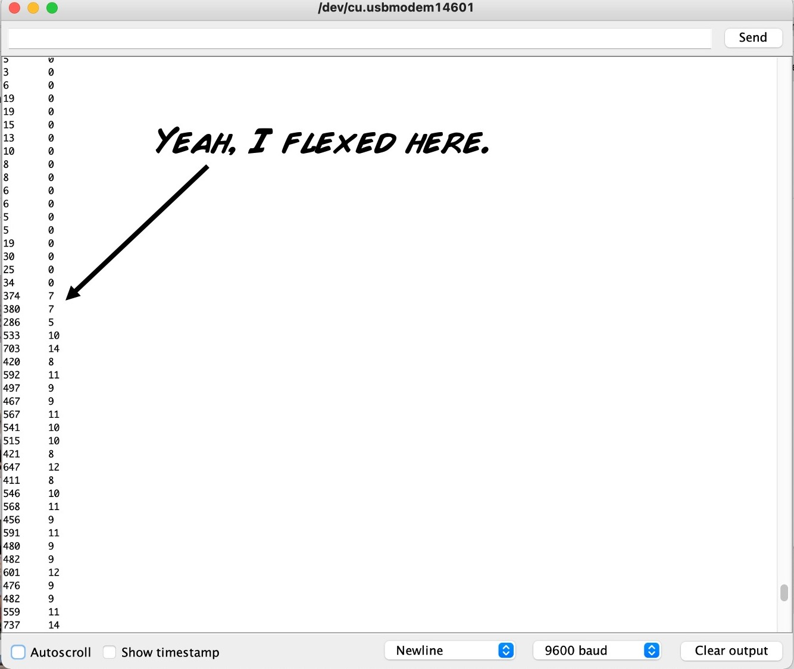

# Experiment: Controlling an LCD Screen with Your Muscles

In many projects it is necessary to display information on a low cost screen.
The best way to do it is using a display LCD.

Time  1 hour

Difficulty  Intermediate

#### What will you learn?

In this experiment you will be able to see a representation of the EMG signal
that comes from the SpikerShield. This is displayed via a bar that moves
proportionately to the muscle signal being read. Here we will use a common 16
x2 LCD model.

##### Prerequisite Labs

  * [Getting to know your Muscle SpikerShield](http_//backyardbrains.com/experiments/musclespikershield)

##### Equipment

* [Muscle SpikerShield](https://backyardbrains.com/products/muscleSpikershieldBundle)
* [LCD 16x2 Screen](https_//www.amazon.com/gp/product/B0177XQE7K/ref=ppx_yo_dt_b_search_asin_title?ie=UTF8&psc=1)

## Background

_Originally designed and written by José Enrique López Pérez, student of Electronic Engineering in Oaxaca, Mexico._

Updated by Miguel Cornejo, high school student at Colegio Alberto Blest Gana in Santiago, Chile.

**LCD screen_** Liquid Crystal Display screens (LCD) have the capacity to show every alphanumeric character, allowing it to represent the information generated by any electronic equipment in an easy way and at low cost. The screen has a matrix of characters (usually 5x8 points) distributed in one, two or four lines of 16, 20, or even 40 characters each line. The most common configuration is two lines of 16 characters each ( 16x2, the first digit indicates the number of characters per line, and the second, the number of lines).
every alphanumeric character, allowing it to represent the information
generated by any electronic equipment in an easy way and at low cost. The
screen has a matrix of characters (usually 5x8 points) distributed in one, two
or four lines of 16, 20, or even 40 characters each line. The most common
configuration is two lines of 16 characters each ( 16x2, the first digit
indicates the number of characters per line, and the second, the number of
lines).

[ ](img/lcdenglish.png)

A character of 5x8 points

[ ](img/lcdeng2.png)

**Pin functions in the LCD**

[ ](img/tabla.jpg)

There are two types of data that you can send to the LCD.

  1. Character data_ when letters and numbers are sent to the LCD. 
  2. Commands_ When the LCD receives instructions like “Delete Display”, “Move Cursor”, “Move left”, etc... 

**LCD Functionality_** The LCD modules are made of a crystal liquid screen and
a micro-controller circuit. The Arduino microcontroller is in charge of
receiving binary information through its pins D1 through D7 (it’s possible to
use only pins D4 through D7) and to control this data through pins E, RS, and
RW to show a group of characters and some symbols.

This LCD Module has an internal memory zone called CGROM where it stores a
table with the 192 characters that can be displayed. Each character has its
own binary representation of 8 bits. To display a character the LCD must
receive the corresponding code through the data bus. For example, to display
the character “A” the LCD must receive the following code_ b’01000001’.....

**But Wait!**. There is a actually a much easier way to control LCDs, with
only four cables using the more modern I&sup2C protocol. There are only four
cables connections we need between the LCD and the Arduino+Muscle
SpikerShield_ power, ground, SDL (serial data line), and SCL (serial clock
line). The instructions continue below.

#### Downloads

> Take our (.ino) LCD Sketch and load it on your Arduino
>
> [LCD_SpikerShield.ino](files/LCD_I2C_muscules_Arduino_Spiker.ino.zip)
>
> You will also need to add these two libraries (more info below).
>
> [Wire library](files/Wire.zip)
>
> [LiquidCrystal I2C library](files/LiquidCrystal_I2C.zip)

## Video

## Procedure

* First, upload the LCD sketch to your Arduino, as you have [previously learned how to do](https_//backyardbrains.com/experiments/muscleSpikerShield). 
* Now, we will have to add the libraries to your Arduino. Download the two libraries above_ LiquidCrystal I2C and Wire. To individually add them, in the file menu, go to "Sketch" --> "Include Library" --> "Add .ZIP Library." 
* Now it is time to wire up the LCD. Connect the four header wires in the the back of the LCD screen to the Arduino_ power, ground, SCL, and SDL. See below. Power goes into pin 3, and ground goes into pin 4 on the power and bank. SCL (serial cable line) goes into pin 6 (A5), and SDL (serial data line) goes into pin 5(A4). 

[ ](img/LCD_wiring_diagram_web.jpeg)

* Flip over the LCD. Plug a USB cable into the Arduino, and the other end into your computer. Plug in the orange muscle electrode cable. 

[ ](img/LCD_flipped_over_web.jpeg)

* Now, stick the three electrodes on your arm_ two on the forearm and one on the back of the palm. Clip the red alligator clips on your forearm, and the black alligator clip on the back of your hand. When you flex your forearm, you should see the light bar move. 

[ ](img/LCD_light_bar_web.jpeg)

* You can also click on the Serial Monitor (the magnifying glass symbol on the upper right of the Arduino software). The Serial Monitor will show the analog reading of your EMG on the left and the length of the LCD bar on the right column. 

[ ](img/SerialMonitor_web.jpeg)

* Congratulations! You are now controlling the LCD bar with the muscles. Play with the device to see if you can invent more sophisticated displays. 

**The code**

```cpp
    
    #include 
    #include 
    LiquidCrystal_I2C lcd(0x27,16,2); // set the LCD address to 0x27 for a 16 chars and 2 line display
    #define MAX 800 //maximum possible reading. TWEAK THIS VALUE!! 
    
    int finalReading;
    int Lit_Bank;
    
    void setup(){
    Serial.begin(9600); //begin serial communications
    lcd.init(); // initialize the lcd
    lcd.init();
    lcd.backlight();
    }
    
     
    void loop(){
    finalReading = analogRead(A0); // Reads in the Amplified EMG
    delay(25); // 10 ms delay
    lcd.clear(); // initialize the lcd
    
    Serial.print(finalReading);
    Serial.print("\t");
    finalReading = constrain(finalReading, 0, MAX); 
    Lit_Bank = map(finalReading, 0, MAX, 0, 16); // determines length of bar to light up depending on your EMG level
    Serial.println(Lit_Bank);
    
    if (Lit_Bank == 0) {
            lcd.setCursor(0,0);
            lcd.print("");
            lcd.setCursor(0,1);
            lcd.print("");
             }
    
    if (Lit_Bank == 1) {
            lcd.setCursor(0,0);
            lcd.print("0");
            lcd.setCursor(0,1);
            lcd.print("0");
             }
    
    if (Lit_Bank == 2) {
            lcd.setCursor(0,0);
            lcd.print("00");
            lcd.setCursor(0,1);
            lcd.print("00");
             }
    
    if (Lit_Bank == 3) {
            lcd.setCursor(0,0);
            lcd.print("000");
            lcd.setCursor(0,1);
            lcd.print("000");
             }
             
    if (Lit_Bank == 4) {
            lcd.setCursor(0,0);
            lcd.print("0000");
            lcd.setCursor(0,1);
            lcd.print("0000");
             }
             
    if (Lit_Bank == 5) {
            lcd.setCursor(0,0);
            lcd.print("00000");
            lcd.setCursor(0,1);
            lcd.print("00000");
             }
             
    if (Lit_Bank == 6) {
            lcd.setCursor(0,0);
            lcd.print("000000");
            lcd.setCursor(0,1);
            lcd.print("000000");
             }
             
    if (Lit_Bank == 7) {
            lcd.setCursor(0,0);
            lcd.print("0000000");
            lcd.setCursor(0,1);
            lcd.print("0000000");
             }
             
    if (Lit_Bank == 8) {
            lcd.setCursor(0,0);
            lcd.print("00000000");
            lcd.setCursor(0,1);
            lcd.print("00000000");
             }
             
    if (Lit_Bank == 9) {
            lcd.setCursor(0,0);
            lcd.print("000000000");
            lcd.setCursor(0,1);
            lcd.print("000000000");
             }
             
    if (Lit_Bank == 10) {
            lcd.setCursor(0,0);
            lcd.print("0000000000");
            lcd.setCursor(0,1);
            lcd.print("0000000000");
             }
             
    if (Lit_Bank == 11) {
            lcd.setCursor(0,0);
            lcd.print("00000000000");
            lcd.setCursor(0,1);
            lcd.print("00000000000");
             }
             
    if (Lit_Bank == 12) {
            lcd.setCursor(0,0);
            lcd.print("000000000000");
            lcd.setCursor(0,1);
            lcd.print("000000000000");
             }
             
    if (Lit_Bank == 13) {
            lcd.setCursor(0,0);
            lcd.print("0000000000000");
            lcd.setCursor(0,1);
            lcd.print("0000000000000");
             }
             
    if (Lit_Bank == 14) {
            lcd.setCursor(0,0);
            lcd.print("00000000000000");
            lcd.setCursor(0,1);
            lcd.print("00000000000000");
             }
             
    if (Lit_Bank == 15) {
            lcd.setCursor(0,0);
            lcd.print("000000000000000");
            lcd.setCursor(0,1);
            lcd.print("000000000000000");
             }
             
    if (Lit_Bank == 16) {
            lcd.setCursor(0,0);
            lcd.print("0000000000000000");
            lcd.setCursor(0,1);
            lcd.print("0000000000000000");
             }
    
      }
  ```  

* With this new experience, now you can make your own inventions. Tell us what you are making at [info@backyardbrains.com](mailto:info@backyardbrains.com) and maybe we can start a friendship! 

