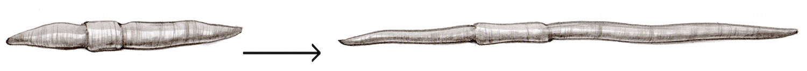
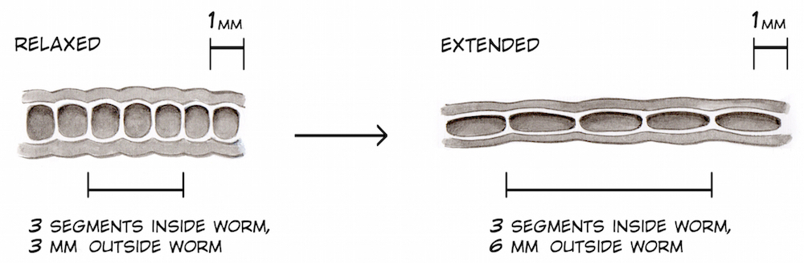
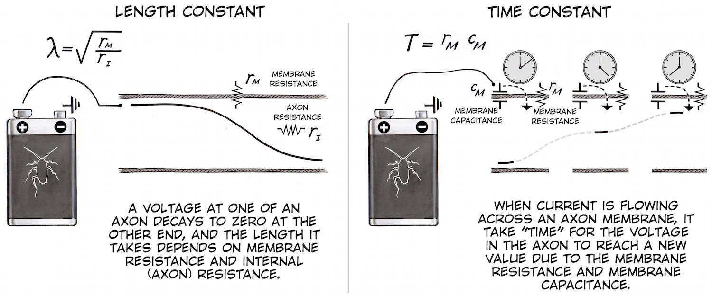
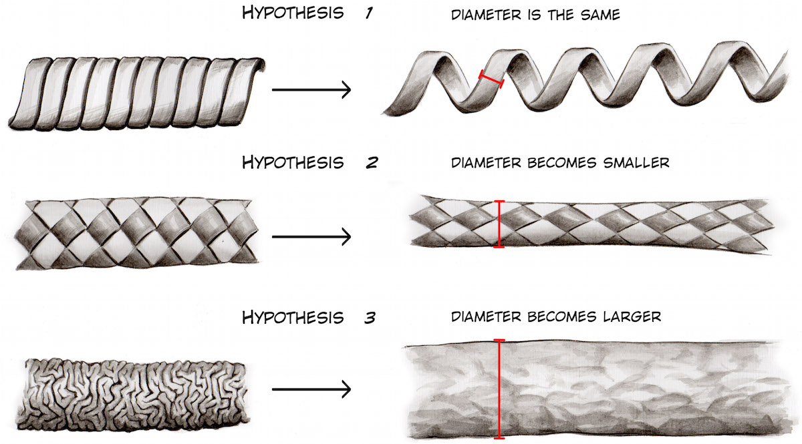
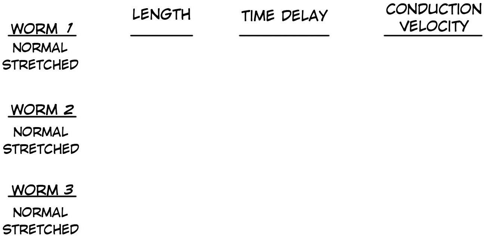
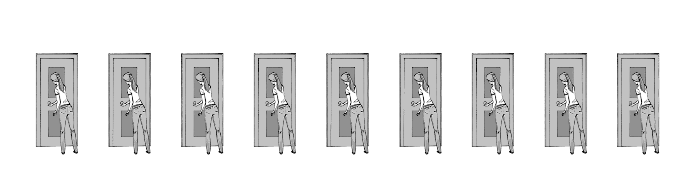
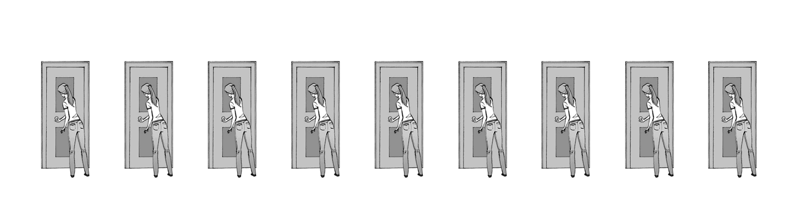
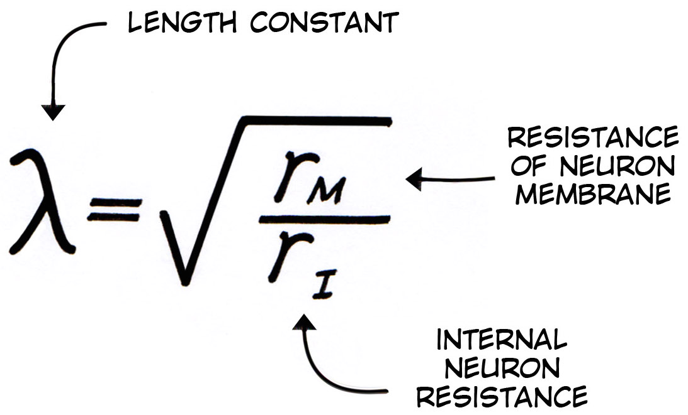
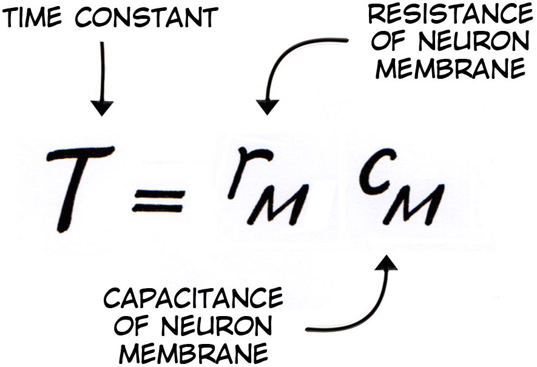

---
id_ experiment__effect_of_nerve_stretch_on_conduction_velocity
title_ "Experiment_ Effect of Nerve Stretch on Conduction Velocity"
slug_ /retired/experiments/effect_of_nerve_stretch_on_conduction_velocity
---

# Experiment_ Effect of Nerve Stretch on Conduction Velocity

A worm moves by extending and compressing its body. Perhaps this affects the
diameter of the nerves, and thus the speed of impulse conduction. Here we
investigate. The real question_ Is the nerve an antique telephone cord or a
Chinese finger trap?

Time  1 Hour

Difficulty  Advanced

#### What will you learn?

Here you will learn, using cable theory, how stretching an axon can affect the
time an impulse takes to travel along an axon.

##### Prerequisite Labs

  * [Introduction to Conduction Velocity](speed) \- You will find this experiment helpful to get a general idea of conduction velocity and how it is measured. 

##### Equipment

[2-Channel SpikerBox](/products/twochannelspikerbox)

[Faraday Cage](/products/faradaycage)

[Laptop Cable](/products/laptopcable)

[USB 2-Channel Adaptor](http_//www.amazon.com/Griffin-Technology-iMic-Audio-
Device/dp/B000BVV2IC)

* * *

## Background

_Note_ In 2014, older, related experiments by our team were peer-reviewed and
published by the American Physiological Society in the journal "Advances in
Physiology Education" -[Read the paper intrepid
scientists!](http_//advan.physiology.org/content/38/1/62) for a more
formalized treatment of cable theory and worm anatomy._

We return to the concept of [conduction velocity](speed). The earthworm is a
soft animal with distinct segments (rings) that can compress and extend
hydraulically, which the worm uses to crawl underground. Unlike we humans, the
worm does not have rigid structures like bones with which to move muscles
around on pivot points. Random fact_ if you brush a worm carefully down its
length with your finger, you may detect with your fingers, yet not see with
your eyes, bristles going in one vs. another direction. These
[bristles](img/estiramiento_bristles_web.jpg) allow a worm to grip the earth
as it moves.

When you watch the behavior of an earthworm as it moves in your backyard after
a rainy night, you will notice a worm can change its entire body length up to
2x as it compresses and extends. Since the tissues inside the worm must
stretch as well, how does such compression and extension affect the nerves?
Specifically, how does it affect the speed of the impulses (action potentials)
as they travel along axons inside the nerve? .

Presumably, the earthworm nerves have mechanisms to be tolerant of compression
and extension, and thus we can ask, _even without doing a dissection_ _ "What
is the structure of such a nerve?" Let's do a thought experiment whereby we
imagine the types of structures that could accommodate the elastic ability of
the earthworm and how such structures would affect impulse conduction. First,
we need to think in "worm relativity," where length is a more a state of being
than something fixed.

In worm relativity, we can think of two measures of velocity_

  1. meters per second 
  2. worm segments per second. 

Both concepts are important for understanding signal propagation from within
the worm and without the worm.

Given two concepts of length, we can imagine three scenarios of impulse
propagation in a stretched vs. relaxed worm.

**1)** The Nerve is similar to an old-fashioned coiled Telephone Cord, which
is a spiral structure that can extend and compress with ease. When two points
along the coil (the worm) are stretched, the time for a signal to travel
between the two points is the same, but the apparent length is greater.

**Prediction_ Worm Segments per Second will remain the same. Meters per Second
will increase.**

**2)** The Nerve is like a Chinese Finger Trap, with a structure whose
diameter decreases when extended. Recall from [our previous
experiments](https_//www.backyardbrains.com/experiments/comparingNerveSpeed)
that the two important components of cable theory are the length constant and
the time constant.

If stretching the nerve results in smaller diameter, the internal axon
resistance will increase (because when a cross-sectional area of wires
decreases, the resistance per unit length increases). And....when the internal
axon resistance increases, the length constant will decrease. A decrease in
length constant will result in a longer time delay between two points along
the nerve.

**Prediction_ Worms Segments per Second will decrease. Meters per second could
either increase, stay the same, or decrease, depending of magnitude of time
delay change between segments.**

**3)** The Nerve is highly wrinkled when compressed, and highly inflated when
stretched. Though difficult to divine, such a structure could be feasible. In
the inflated state, the nerve diameter is actually larger.

**Prediction_ Worms Segments per Second will increase. Meters per Second will
increase.**

To simplify, we have_

  1. **Hypothesis 1_** The nerve is like a telephone cord- Diameter will not change. 

**Prediction_** No change in Time Delay when worm is stretched.

  2. **Hypothesis 2_** The nerve is like a Chinese Finger Trap, Diameter will decrease. 

**Prediction_** Increase in Time Delay when worm is stretched.

  3. **Hypothesis 3_** The nerve goes from a wrinkled to highly inflated state. Diameter will increase.

**Prediction_** Decrease in Time Delay when worm is stretched.

Now we go to our lab and investigate!!!

#### Downloads

> [Spike Recorder Software](https_//backyardbrains.com/products/spikerecorder)

## Video

## Materials

The materials required for this lab are exactly the same as the experiment
["Introduction to Conduction
Velocity"](http_//backyardbrains.com/experiments/speed#Materials), save for
one-two extra items_

  1. Digital Vernier Calipers (available at [Auto parts stores](http_//www.autozone.com/clamps-and-measuring-tools/vernier-caliper/oem-6-in-electronic-digital-caliper/864649_0_0/), [hardware stores](http_//www.acehardware.com/product/index.jsp?productId=2278941), [Amazon](http_//www.amazon.com/60%25-OFF-Digital-Stainless-Precision/dp/B00TL1A4E6/ref=sr_1_3?s=industrial&ie=UTF8&qid=1433982876&sr=1-3&keywords=digital+vernier)) 
  2. Modern laptops, over the past four years, have stopped having stereo audio inputs. We recommend the [iMic](http_//www.amazon.com/Griffin-Technology-iMic-Audio-Device/dp/B000BVV2IC) to provide stereo audio input to your computer. 

## Procedure

_Note_ this procedure is very similar to our other conduction velocity
experiments, as shown above in the video._

  1. Place an earthworm in 10% ethanol for ~3 minutes (until it is no longer moving). This can be done most easily done be mixing 50 ml vodka with 150 ml water. 
  2. Briefly wash the earthworm in water to remove residual anesthetic, place the earthworm on the block of balsa wood, and insert the electrodes in the following order. Note_ Insert the electrodes near the side of the worm, and not directly in the center, to avoid damaging the intestines and nerves._ 
  3. Place the Red Electrode (channel one) 2-3 cm away from mouth. The mouth of the worm is the end closest to the fleshy "clitellum" in the worm. 
  4. Place the White Electrode (channel two) 6-8 cm away from mouth. 
  5. Place the Black Electrode (ground) some distance further away. 
  6. Plug the electrodes into your 2-channel SpikerBox, the stereo audio out cable into your USB stereo audio adaptor (typically an [iMic](http_//www.amazon.com/Griffin-Technology-iMic-Audio-Device/dp/B000BVV2IC)), and the USB end of the iMic into the USB port of your computer. 
  7. Open our [SpikeRecorder](https_//backyardbrains.com/products/spikerecorder) software, open preferences (the gear symbol), and enable your two iMic Audio channels. Also unmute the Speaker output in the preferences so you can hear the evoked spikes. 
  8. Using your Digital Vernier Calipers, measure the distance between the Red and Black electrode pins. 
  9. Press the record button on your Spike Recorder software, and using a plastic or glass probe, tap the mouth end of the worm. You should hear the evoked spikes caused by the tap. Make 3-4 taps, separated by about 3-4 seconds each. _Note_ USB sound adaptors like the iMac have a ~1 second delay due to the USB aquisition. This delay was edited in the video above for educational purposes, but you will hear the spikes about ~1 second after you touch the worm. This is due to the USB sound acquisition adding a delay, not the worm_
  10. Turn the SpikerBox off to cause a blank space in the recording as a reference space. 
  11. Now, harmlessly stretch the worm 1-2 cm, ensuring the electrodes are in the same relative location (same worm segments) in the worm. 
  12. Turn the SpikerBox back on, and tap the worm in mouth end again with your glass or plastic probe in a similar fashion as before, about 3-4 times. 
  13. Remove the electrodes from the worm, please the worm briefly in water to remoisterize it, and return the worm to its styrofoam container. It can tolerate the needle placement and be used for another experiment another day, or you can return it to the environment where you found if you live in wet climates where Earthworms can be harvested in your backyard. 

**Data Analysis**

  1. As shown in the video above (and in the [intro](https_//backyardbrains.com/experiments/speed), [comparing nerve speed](https_//backyardbrains.com/experiments/comparingNerveSpeed), and [temperature](https_//backyardbrains.com/experiments/WormTemperature) experiments), measure the time delay between the two channels. 
  2. Try doing it in multiple spikes in the same animal, and perhaps comparing the LGN vs. the MGN. 
  3. Use the following table below as a guide. 

  4. Statistically test your results (see our [intro to p-values](https_//backyardbrains.com/experiments/p-value) writeup for how to do this. You may notice that while the time delay ("segments per second") change is statistically significant, the conduction velocity ("meters per second") is not. Strange and interesting, why is such so? [E-mail us](mailto_tim@backyardbrains.com)if you think you have the answer 

## Discussion

1) Length Constants and Times Constants can be difficult concepts to
understand. Why, when length constant is reduced, does a time delay result?
When the length constant is reduced, more and more ion channels have to open
in sequence to propagate an action potential along the neural membrane. The
best analogy for this is "vigilants opening doors." Imagine a line of doors
(ion channels) with people (gates) ready to open them when they hear the full
phrase "open." And, when the vigilant finishes opening their own door, they
then repeat the command "Open" which the next person hears, as we illustrate
below_

A length constant can be thought of as a measure of how loud the voice of the
vigilants decreeing "open" is. If the "Open" is very loud, many vigilants can
hear the open command at once, thus allowing many doors to open at the same
time. This is equivalent to a high length constant.

The time constant is a measure of how fast the "Open" command is said. If
"Open" is said very slowly, there will be a delay in the transmission of the
"open" command, no matter how loud it is uttered. This is equivalente to a
high time constant.

2) While the video above only shows one measurement, we have repeated this
experiment ~10 times, and we have **always** (yes, as scientists, we are
saying "always") observed the time delay when stretching the worm. You can
view [some sample data](files/EarthwormStretch_SampleData.zip) (compressed
excel file) here.

3) It seems strange to imagine a form of locomotion where the conduction
velocity (measured in segments per second) of the sensory and motor nerves is
changing depending on which stride of the movement you are in. How does the
earthworm motor system compensate for these changes? Perhaps the time delay
can be measured in a freely locomoting worm? Perhaps in an awake, behaving
worm the time delay is not as pronounced...

4) We are not the first to observe this effect. As usual with visits to the
library when reading about invertebrates, the road leads to the Esteemed
Biologist [Theodore
Bullock](http_//en.wikipedia.org/wiki/Theodore_Holmes_Bullock) who noted in a
[1945
paper](files/Bullock_1945_Functional_Organization_of_the_Giant_Fiber_System_of_Lumbricus.pdf)
"The Functional Organization of the Giant Fiber System of the Lumbricus" that_

_"Confirming Jenkins and Carlson (12) and Carlson (7) it was found that the
elapsed time for conduction between any two points increases as the animal is
stretched. This is in accord with expectation from the fact that the diameter
of the fiber must be decreasing as the length of the animal increases, since
there is no great amount of coiling or sinuosity of the nerve cord or giant
fibers at moderate extension. (There is however marked coiling or zigzagging
of the neurofibrils which disappears as the specimen is stretched, so that the
present data constitute evidence that conduction is not mediated directly by
the neurofibrils.)"_

For a brief period we thought we had observed a new phenomenon, but we yield
to you Professor Bullock, as we always shall.

5) While this experiment provides a useful model for how to change the
internal neuron resistance (also called axon resistance) in an earthworm, and
thus the length constant, we are still looking for a way to reversibly change
the time constant in an animal preparation. For example, we have read that
since myelination increases the membrane resistance, it will make the length
constant higher, but that since myelin also decreases the membrane
capacitance, the increased membrane resistance and decreased membrane
capacitance will "cancel out," leaving the time constant unaffected.

 

Separating the oposite effects of increasing membrane resistance and
decreasing membrane capacitance remains a challenge that we have not found
well explained in the scientific literature, and we continue to search for the
appropriate experimental preparation.

6) What could be the minimum change in length constant an animal can tolerate
before you notice time delays in an animal. Is a buffer zone built-in to
permit slight changes in length constant?

## Notes / Further Work

    1. It is worth a trip to the your university library to spend a couple hours browsing Theodore Bullock's tome, [The Structure and Function of the Nervous System in Invertebrates](http_//www.worldcat.org/title/structure-and-function-in-the-nervous-systems-of-invertebrates/oclc/558128) and marvel on the scale of the unknown that exists in the world of the invertebrates. 
    2. Thanks go to the [Dunalastair Colegio](http_//www.dunalastair.cl/LasCondes/Pages/Index.aspx), a high school in Santiago, Chile, where we first observed this effect during a teacher training workshop, and to Alejandra Riveros Campos, a Chilean Colleague who then helped with the systematic experiments verifying the time difference. 
    3. What would happen if the nerve were cooled, as [in a previous experiment](https_//www.backyardbrains.com/experiments/WormTemperature), and then the stretched vs. unstretched time difference measured? 
    4. We have left out the pesky detail that [earthworm axons are actually myelinated](file/Hartline_Colman_2007_MyelinReview.pdf) and that saltatory conduction is occurring. How does this affect the interpretation of the results and our hypotheses? 

_Note_ _ Gracias to [Italo Ahumada
Morasky](http_//www.italoahumada.cl/about/), a Chilean artist who illustrated
this experiment with us.