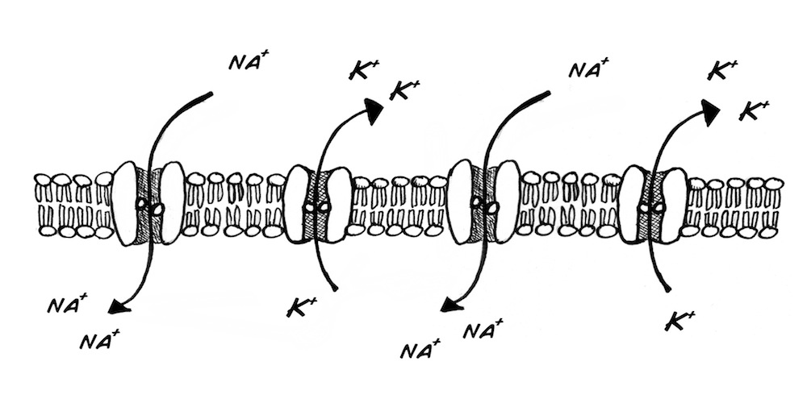
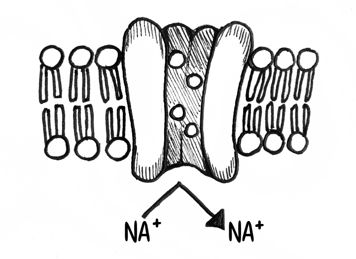
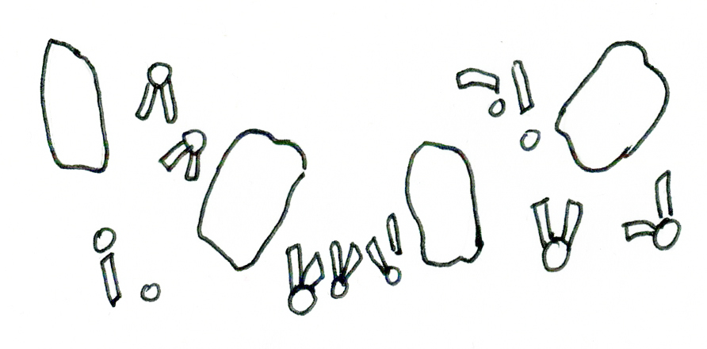
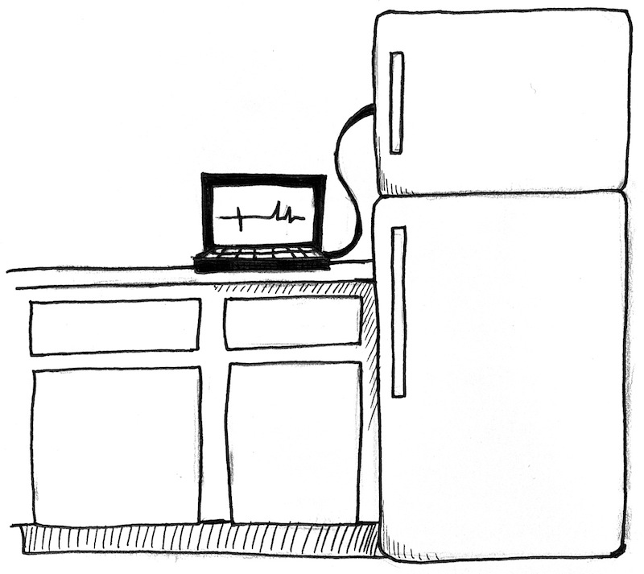
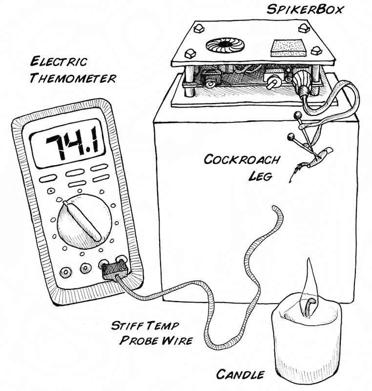

# Experiment_ Effect of Temperature on Neurons

Have you ever wondered how your neurons respond to hot and cold temperatures?
Exposing a cockroach leg's neurons to these environments will act as a perfect
model.

Time  30 Minutes

Difficulty  Intermediate

#### What will you learn?

In this experiment you will learn about ion channels and see how the spike
firing patterns of neurons changes with temperature.

##### Prerequisite Labs

  * [SpikerBox](spikerbox) \- You should become familiar with how to use your SpikerBox

##### Equipment

[SpikerBox](/products/spikerbox)

[Cable_ Laptop](/products/laptopcable) [Phone](/products/smartphonecable)

[Cockroaches](/products/cockroaches)

* * *

## Background

The electrical activity you are observing in the cockroach is caused by
special proteins called ion channels. These ion channels transport sodium
(Na+, in table salt) and potassium (K+, in bananas) across the neural membrane
to generate the spike. Using a sophisticated microscope not invented yet, the
neural membrane would look like this_

The delicate dance of the sodium & potassium ion channels is what causes the
change in electrical activity known as the "spike." Building and maintaining
these pumps requires energy (produced from the food creatures eat) and the
right temperature. If the temperature is too low, the channels will not open,
and electrical pulses cannot travel down the nerve.

If the temperature is too high, the ion channels and nerve membranes come
apart.

## Video

Video explanation of experiment.

##  Procedures

We can observe these two processes indirectly with the cockroach leg prep you
have [previously
learned](http_//www.backyardbrains.com/experiments/spikerbox). Take your
SpikerBox and place it in the freezer of a household refrigerator. Make sure
the cable from your laptop/smartphone/tablet stays connected to the SpikerBox
you placed inside. Also place a digital thermometer inside the freezer, and
wait and listen for 1-3 minutes ...

At a certain temperature the Spikes should go away. Open the freezer and
record the temperature from the thermometer. Once you take the SpikerBox out
of the freezer, how long does it take for the spikes to come back?

Note_ depending on your freezer model, you may find a lot of electrical noise
occurring when you put the SpikerBox in it. You can use a [Faraday
cage](http_//www.backyardbrains.com/experiments/faraday), but if you live in
cold land like Michigan, you can simply take your SpikerBox outside in deep
winter. Otherwise, if you have access to dry ice (solid carbon dioxide,
usually available at ice cream stores), you can put dry ice and the SpikerBox
in a cooler. This method is noise-free as it does not use electricity!

We will not reveal the temperature at which spikes go away, as that is for you
to find out, but we will give you a hint_ normal ice, which is typically 31-33
degrees Fahrenheit, is not cold enough. If you use water ice instead of dry
ice in your cooler, your spikes will not go away.

Now let's try in the opposite temperature. You need

  1. a candle 
  2. a box approximately 5-6 inches taller than the candle 

Place the SpikerBox on top of the box, and have the electrode with the
cockroach leg attached hanging out "in space" 5 to 6 inches over the top of
the candle. Position the wire of your digital thermometer such that you can
measure the precise temperature where the leg is. Now, to quote hero [Alan
Shephard](http_//en.wikipedia.org/wiki/Alan_Shepard), "light this candle!" As
the temperature slowly rises, you should hear the neurons responding, and at a
certain temperature, you will hear a very low "scream" of spikes as all the
neurons discharge. Record the temperature at which this happens, and exhaust
the candle. When the leg gets back to room temperature, test to see if the
spikes come back. Try this hot/cold experiment with a few legs.

As you know, different insects have different tolerances to heat and cold.
Because of environmental influences, each animal has properties unique to its
nervous system. Perhaps you should try this experiment with a variety of
different legs of different species!

#### Twitter

#### Recent Posts

  * [ It's The Backyard Brains 10-Year Anniversary!](http_//blog.backyardbrains.com/?p=4906)
  * [ Cincinnati Neuroscience Outreach by BYB Alumna](http_//blog.backyardbrains.com/?p=4870)
  * [ First Place at Science Fair for Student using BYB Gear](http_//blog.backyardbrains.com/?p=4861)

#### BYB Information

  * [Spike Counter](/About/SpikeCounter)
  * [Contact](/About/Contact)
  * [FAQ](/About/FAQ)
  * [Our Finances](/About/Finance)
  * [Privacy Policy](/About/Privacy)

* * *

Copyright © 2009-2017 [ Backyard Brains](http_//backyardbrains.com) | Protected under the Creative Common License 