# Experiment: How Fast Your Brain Reacts To Stimuli

How fast do you think you are? Do you know what a reflex and a reaction are?
This lesson plan tells all about the quickness of your nervous system and the
muscular system, which the nervous system innervates.

**Time**  1 - 1.5 Hours

**Difficulty**  Intermediate

#### What will you learn?

In this experiment you are going to be introduced to what a reflex and
reaction are and how we go about measuring them. Do not worry we won't be
throwing soccer balls at your face. . . yet!

##### Prerequisite Labs

##### Equipment

> **Note:** Backyard Brains has released a digital reaction timer that uses
> your body's electrical signals to measure your reaction time! If you enjoy
> this experiment and want to take it to the next level, check out the
> [Backyard Brains Reaction Timer](https://backyardbrains.com/products/ReactionTimer)!

The speed of your reactions play a large part in your everyday life. Fast
reaction times can produce big rewards, for example, like saving a blistering
soccer ball from entering the goal. Slow reaction times may come with
consequences.

[ 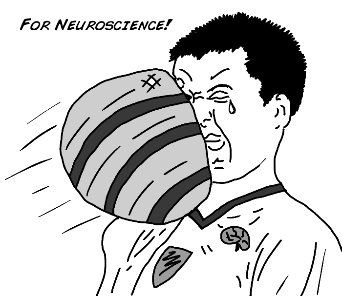](img/BYB_Exp3_Pic1.png)

Reaction time is a measure of the quickness an organism responds to some sort
of stimulus. You also have "reflexes" too. Reflexes and reactions, while
seeming similar, are quite different. Reflexes are involuntary, used to
protect the body, and are faster than a reaction. Reflexes are usually a
negative feedback loop and act to help return the body to its normal
functioning stability, or homeostasis. The classic example of a reflex is one
you have seen at your doctor's office: the patellar reflex.

[ 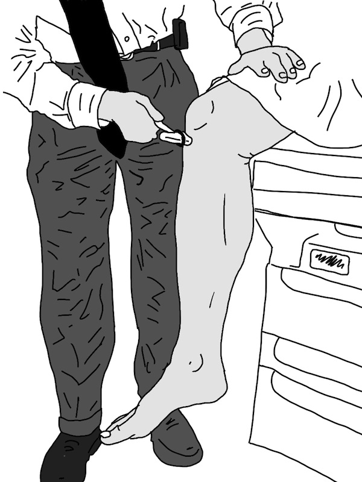](img/BYB_Exp3_Pic2.jpg)

This reflex is called a stretch reflex and is initiated by tapping the tendon
below the patella, or kneecap. It was first independently described in 1875 by
two German neurologists, Wilhelm Heinrich Erb and Carl Friedrich Otto
Westphal. In their original papers Erb referred to the reflex as the
"Patellarsehnenreflex" while Westphal denoted it as the
"Unterschenkelphanomen". Thankfully, we now refer to it as the patellar
reflex.

This reflex is also known as a "reflex arc". It is a negative feedback circuit
that is comprised of three main components:

* A sensory component or afferent neuron. These neurons take in information and translate it to an electrical signal that gets sent to the central nervous system, much like the spikes you hear when doing the cockroach leg experiments. 
* Integrating center or interneuron. These neurons act as sensory processing centers that determine the magnitude of the response to the incoming stimulus. They are located in the central nervous system (your spinal cord). 
* The efferent portion or motor neuron takes the information from the interneuron and sends it to the effectors which activate a response. The effectors are usually muscle fibers as in the patellar reflex or a gland such as the salivary gland. 

[ 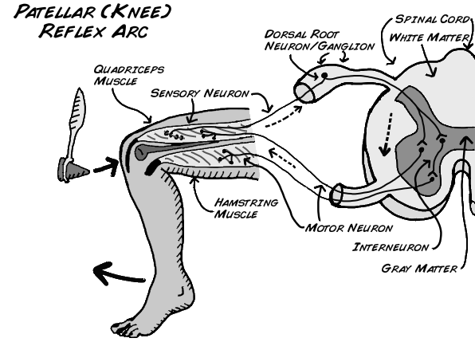](img/BYB_Exp3_Pic3.png)

## Quick! We're timing you...

More Neuroscience in your Inbox! If you're excited about Neuroscience, sign up
to get monthly newsletters about new experiments, events, workshops, and kits!

The knee reflex arc is a spinal reflex, and the circuit is drawn above. This
picture shows how the sensory (afferent) neuron sends information through the
dorsal root ganglion into the spinal cord; where the signal splits into two
different paths. The first is the motor neuron (efferent) leading back to the
quadriceps. When your quad muscle's motor neuron receives the information it
fires and causes your lower leg to spring forward up in the air. The second
signal from the sensory neuron travels to an interneuron which sends a signal
to the motor neuron (efferent) leading to the hamstring. This signal tells
your hamstring to relax so there is no negative force acting on the quadriceps
muscle when it contracts. Both signals work together and all of this happens
in the spinal cord without going to the brain. It never needs the brain.

You may be asking how a knee reflex arc and a soccer player dealing with an
oncoming ball are different. Are both not reflexes? While it may seem that a
soccer player negotiating an oncoming ball is a simple fast reflex, it is
actually a symphony of hundreds of thousands of neurons working together to
produce a conscious decision. Does the player catch, dodge, or bat away the
ball? This choice is what makes a reaction.

[ 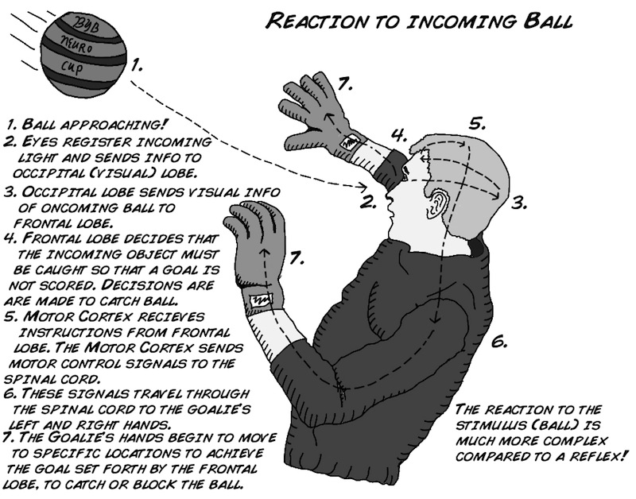](img/BYB_Exp3_Pic4.jpg)

When a soccer player realizes the ball is blistering towards him, there is
visual information that has to be processed and decisions regarding a correct
course of action. The brain then needs to send many signals to various
muscles. Feet begin to move, hands might travel in front of the face, and eyes
may close shut, along with many more processes. This is the work of many
neurons as well as numerous systems and circuits in the brain, and what's
more, and you can train and enhance your skill through practice. This is how
you get better at sports over time.

Like all science, the history of the reaction time discovery is peculiar.
Dutch physiologist F.C. Donders in 1865 began to think about human reaction
time and if it was measurable. Prior to his studies scientists thought that
human mental processes were too fast to be measured. This assumption was
proved incorrect with the help of Charles Wheatstone, an English scientist and
inventor. In 1840 Wheatstone invented a device, much like his early telegraph
system invention, that recorded the velocity of artillery shells. Donders used
that device to measure the time it took from when a shock occurred on a
patient's foot until when that patient pressed a button. The button had to be
pressed by the left or right hand matching the left or right foot that was
shocked. His study tested 2 conditions: in the first, the patient knew in
advance which foot was to be shocked; in the other condition, the patient did
not know. Donders discovered a 1/15 second delay between patients who knew
which foot was to be shocked versus patients that did not know. Notably, this
was the first account of the human mind being measured!

[ 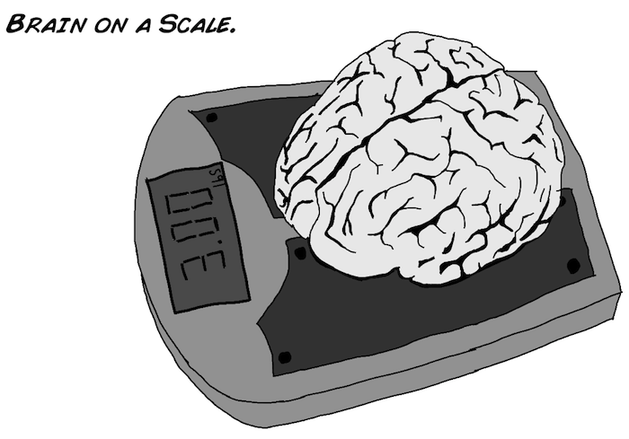](img/BYB_Exp3_Pic12.png)

These efforts continue today, with the improvement of "non-invasive" imaging
technologies like fMRI, PET, EEG, etc... You may have had one of these scans
in the hospital.

[ 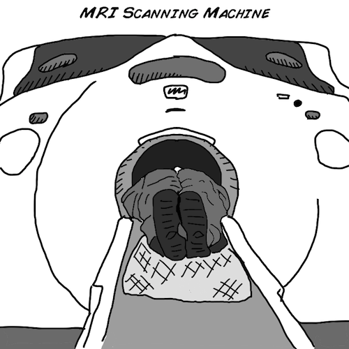](img/BYB_Exp3_Pic11.png)

How quickly neurons move information is called the "speed of neural
transmission"; we studied it in experiment 11 when we measured the conduction
speed of axons in earthworms. This is only one of the speed bottlenecks
though. You also have to deal with the synapse (which we studied in experiment
8). Furthermore, the quickness of reaction times can differ depending upon
what type of stimulus you are reacting to and what kind of task you are doing.

In this experiment you and a friend will be testing each other's reaction
times using a simple 12 inch ruler. You will be testing not only visual
stimulus, but also auditory and tactile stimuli.

## Procedure

This experiment will be broken into two phases. The first test will use one ruler, while the second test will use two.
ruler, while the second test will use two.

Experiment 1: In this phase you and your partner will test visual, auditory,
and tactile reaction times using one ruler.

[ 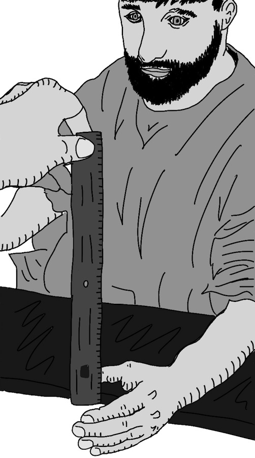](img/BYB_Exp3_Pic5.jpeg)

  1. Have your friend sit at a table with their dominant hand over the edge. 
  2. First we will test visual response. Hold the ruler at the 30 cm mark so that the 0 cm end is just at your friend's index finger. 
  3. Tell your friend that when you release the ruler they are to grab it as fast as possible. Do not make any sounds or gestures that you are releasing the ruler. They have to react to the visual stimulus of seeing the ruler being released. Record the centimeter mark. 
  4. Repeat the experiment three more times. Then switch places with your partner and redo it. 
  5. Now you will record auditory reactions. Have your partner sit at the table as before, also be sure your partner puts on the eye shades. 
  6. Again testing the dominant hand, tell your partner that you will say the word "Release" as you release the ruler. Once they grab it record the centimeter mark and repeat 3 times. Switch places with your partner again. 
  7. For the last test, have your partner sit at the table wearing the eye shades again. This time you will test the tactile response. Tell your partner that you will touch the shoulder of their non dominant arm as you release the ruler. 
  8. Give you partner no auditory cue that you are releasing, just a simple touch. Record the measurement and like before, repeat three times, then switch places and redo.

##### Here is the table for the first experiment:

[ 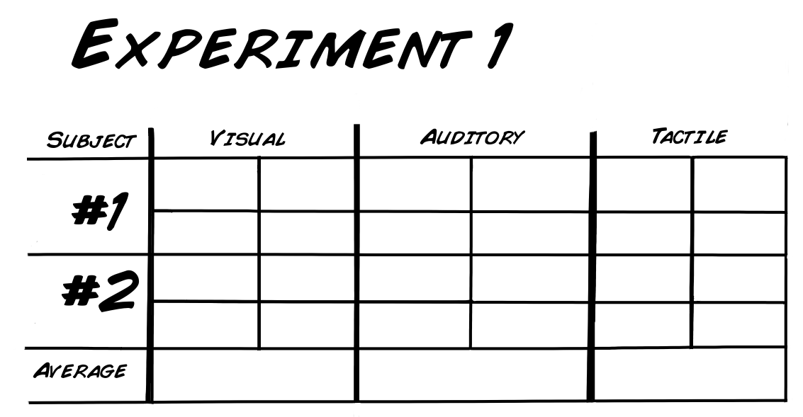](img/BYB_Exp3_Pic6.png)

Experiment 2: In this phase you and your partner will test visual and auditory
reaction times using two rulers.

  1. For the Visual portion of this experiment have your partner sit as the table, like before, but have both of their hands over the edge. 
  2. You will hold both rulers this time instead of just one. 
  3. Tell your partner that you will release just one ruler and they must pick the correct one and grab it as fast as possible…Tell them they must not squeeze both hands, only one. 
  4. When you are ready to begin, randomly decide one ruler to drop. It does not matter which one, you will perform this test 3 more times, but never tell your partner which ruler you will drop. 
  5. Again as before switch roles and redo. 
  6. Finally, we will test the auditory reaction again. This time using both rulers. 
  7. Get in the same position as before with both rulers. Make sure your partner has the eye shades on. 
  8. You will then proceed to say "left" or "right". As you say it you will drop the corresponding left or right ruler. Your partner must decide which ruler to grasp based on the auditory cue you give: "left" or "right". As before, your partner must only squeeze one hand. 
  9. Record the measurement and repeat 3 more times, remember to randomly decide which ruler to drop. Switch roles and repeat.

##### Here is the table for the second experiment:

[ 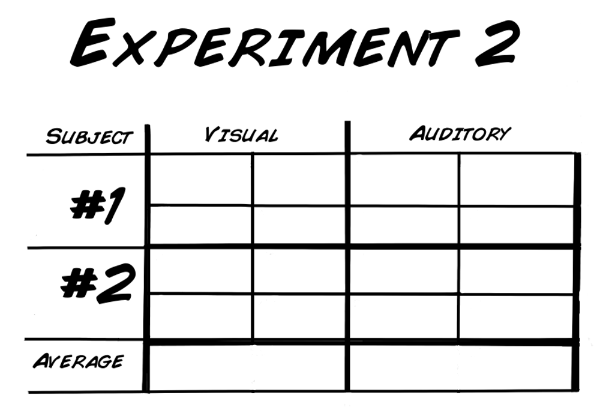](img/BYB_Exp3_Pic7.png)

## Math

In your chart above you are going to take all the centimeter measurements you
have collected and convert the measurement in centimeters to seconds. This
will tell you how long it takes, in seconds, an object (the ruler) to fall a
certain distance. The formula below is comprised of three variables.

* Y = the distance you measured in centimeters 
* g0 = the acceleration due to gravity constant (980 cm/sec2 ) 
* t = time in seconds 

[ 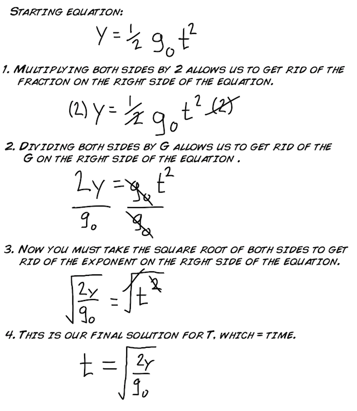](img/BYB_Exp3_Pic8.png)

Here is an example of the equation being used:

[ 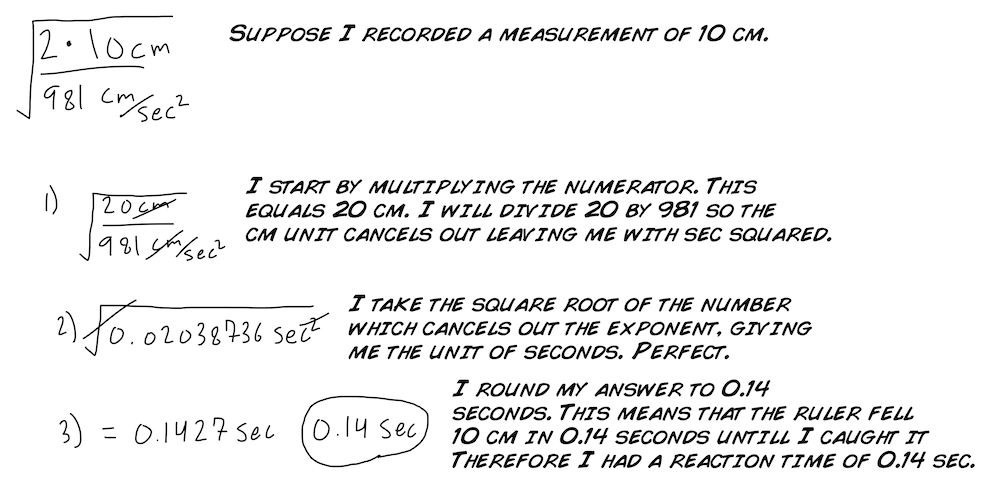](img/BYB_Exp3_Pic9.png)

It may seem tedious to convert by hand each number you recorded so instead you
will be provided with a quick chart to convert your centimeter measurement to
seconds. However, there are several values missing in the table. You will need
to fill them out to complete the table. Use the equation above to fill out the
remainder of the chart. If you are savvy you can also design a computer
program to do this.

[ 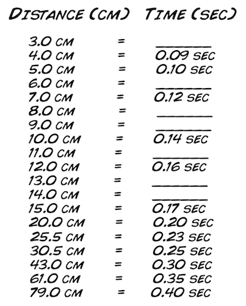](img/BYB_Exp3_Pic10.png)

After using the chart and converting your centimeter measurements into seconds
you will have your ruler reaction time in seconds. Looking at your data you
might be thinking how you compare to the human average reaction time. Here it
is! The average reaction time for humans is 0.25 seconds to a visual stimulus,
0.17 for an audio stimulus, and 0.15 seconds for a touch stimulus.

## Concise Handout for the Classroom

This handout was designed by Virginia Johnson, a graduate student who adapted
our experiment here to use as a teaching tool. This handout provides great
instruction for the visual, tacticle, and audible experiments performed here
condensed down into one page! Thanks Virginia for Sharing it with us!

[Download .docx](./files/Sensory Reflex Handout by Virginia Johnson.docx)

[Download .pdf](./files/Sensory Reflex Handout by Virginia Johnson.pdf)

## Science Fair Project Ideas

  * Why do you think touch and audio stimuli have a faster reaction time on average? How much faster is it? Do your results match the averages mentioned above? 
  * Would you expect a difference in the average reaction times between a male and female? What about a more athletic person compared to a more sedentary person? 
  * Why not test the "tactile" reaction time in the choice task? How could you redesign the experimental setup to test tactile reaction times in the choice task? 
  * As you know, you have a dominant vs. a non-dominant hand. With only four trials, it is too hard to see a difference. Perhaps you should repeat the experiment 10-20 times and with right and left dominant people to see if there is any difference between dominant and non-dominant hands. 
  * The average conduction velocity speed is approximately 20-80 m/s. It takes approximately 1 ms for a neurotransmitter to cross the synapses. 
  * Calculate the lower limit for your patella reflex vs. what you imagine for the patellar reflex of a giraffe. As a test, see if you can find a difference in reaction speed of people of differing heights. 
