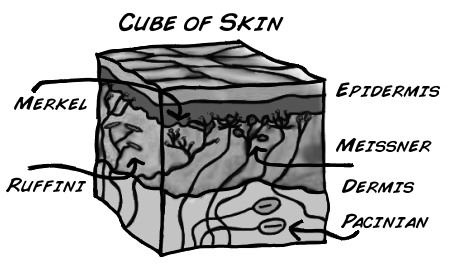
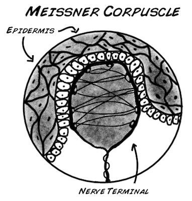
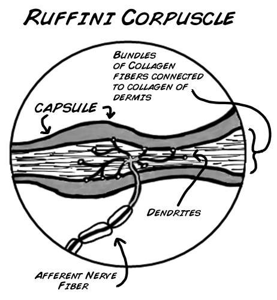
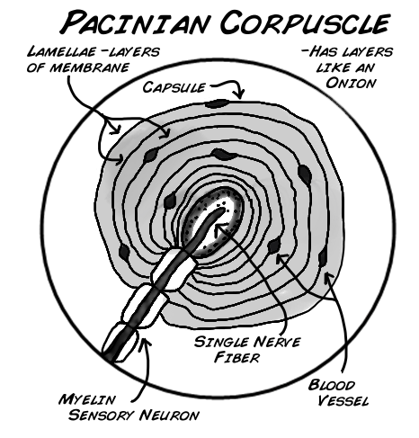
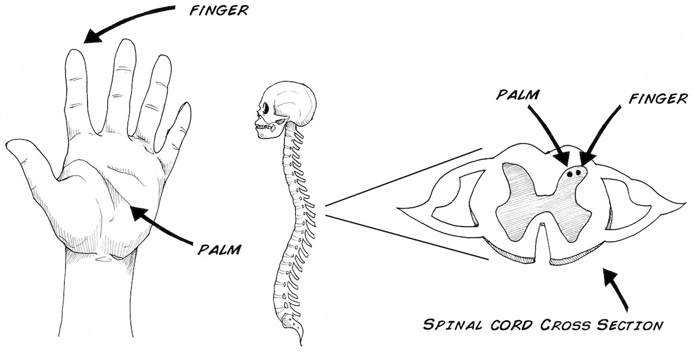
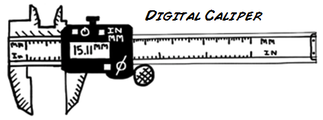
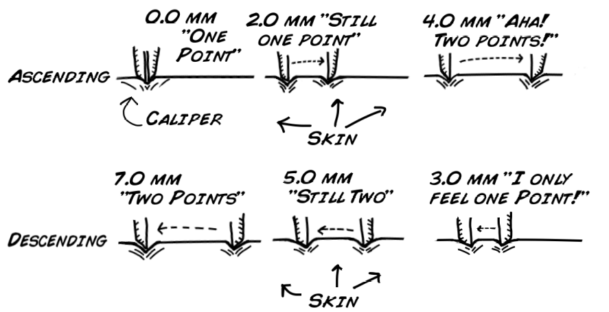

# Experiment_ How Your Skin Senses

Have you ever wondered how you can feel great detail with your fingers, but
not with your elbow? Follow along below and we will show you how to perform a
two point threshold test. This test illustrates what is going on inside your
head that allows for different degrees of skin sensation.

Time  1 hour

Difficulty  Intermediate

#### What will you learn?

In this lab you will learn how your skin senses the outside world. You will
also learn how your brain takes in and processes information from the sensing
cells and neurons in your skin. You will also learn about all the other senses
your body has and maybe a few you did not know you had.

##### Prerequisite Labs

##### Equipment

Calipers

Paper

Pen or Pencil

* * *

## Background

The somatosensory system is the largest sensing system in your body. This
system produces sensory feedback whenever you come in physical contact with
your environment. These sensory feedback include body position
(proprioception), sensing movement of your body and limbs (kinesthesis), pain
(nociception), temperature, and finally touch. In fact, the classical five
senses we are taught in school is incorrect, for example, most people are not
consciously aware of body position (proprioception), even though it is an
important sensing system. There are many other senses your body has that you
are not immediately aware of... Let's try to make a senses list_

* Vision (really two senses_ our conscious vision (color and intensity) and a subconscious one for regulating sleep) 
* Vestibular (balance), as your ear also senses for gravity 
* In the skin there are thermo (hot cold), pain (chemical, thermo, and mechanical), itch, and pressure sensors 
* Olfactory (chemical smell) 
* Tongue (chemical taste) 
* Muscles and joints have sensors for info regarding motion and tension of muscles 
* Bladder senses when it's time to urinate 
* Large intestine tells you when it's full 
* Senses for thirst and hunger (multiple ones probably come into play here) 
* Humankind has also "augmented" its senses through tools like Radar, Radio, and Sonar. Even a simple microscope is an example of an augmented "additional" sense, allowing us to see with our engineering expertise what was previously unknown 

The skin (cutaneous system) is a very important part of the somatosensory
system; it keeps bacteria out, fluids in, and helps maintain your body's
structural integrity. Furthermore, it provides your nervous system and brain
with important information gathered from the receptors embedded in your skin.
Here are a few examples_

  1. As you touch a hot stove, pain receptors in your skin fire signals forcing you to immediately pull your hand away from danger. Note that this movement occurs before you are ever conscious of the pain. 
  2. When you play a violin or guitar, as you become better at playing the instrument, you can play it without looking at the strings (remember the first time you tried and you had to look at the neck of the guitar to play it). Without looking at your arm and fingers, you always know where they are anyway. For example, close your eyes and touch your nose, ear and eye.

You are able to complete routine and complex tasks, because of a proper
working cutaneous system. Receptors found in your skin are the foundation of
this system. Thermoreceptors give your skin the feeling of hot and cold,
nociceptors allow you to feel pain, and mechanoreceptors respond to various
pressure, vibrations and stretching of the skin. Your skin is composed of
several layers, an epidermis, dermis, and hypodermis. The epidermis is the
outermost layer and is really just layers of dead skin cells that are
constantly being shed off and replaced.

Most of the tactile feel we receive is gathered by 4 types of mechanoreceptors
which are found in both layers of skin. The two receptors located near the top
of the dermis, are called Merkel receptors and Meissner corpuscles. These are
German.

  1. First discovered in 1875 by German anatomist, Friedrich Merkel, these mechanoreceptors constantly fire action potentials, that is, they constantly send signals to the brain as long as the stimulus is touching skin. This receptor is specifically tuned to sense fine detail; for example, the details of Lincoln's face on a penny. This receptor is located in between the dermis and epidermis. 
  2. Anatomist Georg Meissner, another German scientist, first described the "Meissner" receptors in 1852. Meissner corpuscles are specialized for controlling hand grip; These are found in the upper dermis. They also fire only when a stimulus is first applied and then when it is removed. For example, when you grab a glass of water they fire, and once again when you let go of the glass. Notice that this type of coding is very different from the cockroach and cricket "rate coding" responses we have observed in [Getting Started with your SpikerBox](spikerbox), [Rate Coding](ratecoding), [Neural Adaptation](somatotopy) and [Spike Referencing](referencing), but slightly similar to the earthworm touch coding experiments we see in [Introduction to Conduction Velocity (Neural Speed)](speed).

The other two mechanoreceptors located deep in the dermis and hypodermis layer
and are the Ruffini and Pacinian corpuscle. These are Italian.

  1. Italian embryologist Angelo Ruffini discovered the "Ruffini" corpuscle in the early 1900s. It is sensitive to stretching of the skin and much like Merkel receptors, it fires continuously to stimuli. It is located in both the deep dermis and hypodermis. 
  2. The Pacinian corpuscle was named after a famous Italian anatomist, Filippo Pacini, who discovered it in the 1830s. These receptors respond to very fine detail by moving fingers, such as reading Braille. They are also selective to vibrations. They are similar to Meissner receptors in the way they fire and send signals. They act like an on/off switch that responds when a stimulus is applied and again when it is removed. It is located deep in the dermis region.

All these receptors send signals to the spinal cord and eventually a part of
the brain called the somatosensory cortex in the parietal lobe. This part of
your brain integrates sensory information. This specific flow of information
follows the principle of "somatotopy", which we also discussed in the
experiment in [Neural Adaptation](somatotopy).

## Materials

#### For this experiment you need_

  1. Calipers [Measuring tool purchased at auto part or hardware store] [AutoZone Caliper](https://www.autozone.com/autozone/accessories/Tools-Garage-and-Equipment/Vernier-Caliper/OEM/_/N-26elZ1z141ur)
  2. Paper 
  3. Writing Utensil 
  4. Eye Shades 

## Procedure

Working with a friend you are going to test each other's two-point threshold.
A two-point threshold test seeks to find at what distance apart does a person
perceive one point as two separate points. To test this, two points start
together touching the skin. Incrementally they are pulled further apart and
reapplied to the skin until the subject can clearly tell there are two
different points.

You will take measurements from four different body part locations_ Fingertip,
Cheek, Forearm, and Calf. You will perform this experiment twice (ascending
and descending with the caliper). Finally, the test subject must always keep
their eyes closed (use the eye shades to be sure)!

#### Experiment Steps_

  1. Before you start this experiment, be sure that you know how to use the caliper and how to open and close it. Practice touching your arm with it at different millimeter (mm) readings. It is important during the experiment that you touch your partner's skin with both tips at the same time; otherwise, they will easily be able to tell there are two points. Once you have the hang of it you are ready to begin! 
  2. Have your partner place the eye shades on and sit in a chair with a table in front of them. Then your partner places their arm on the table with their palm facing up. Now you takes the calipers, make sure they read 0 mm, and start with your partner's finger tip. 
  3. Touch the calipers to their finger tip and ask them if they feel one point or two points. They should say one point, as the measurement is 0mm. Remove the calipers and increase the space by 2 mm. Reapply the calipers, be sure to touch both tips at the same time, and ask again. If they still only feel one point, increase by another 2 mm and reapply. 

  4. Continue this cycle until your partner feels two points. Record the millimeter measurement in the chart below. 
  5. Do this test again for the top of one forearm, one facial cheek, and the back of one calf. For the calf have the subject sit and rest their foot on a chair. 
  6. Switch positions of experimenter and subject; run the test again. 
  7. After you have both tested each other run the whole experiment again (Steps 1 to 5); however, this time instead of starting the caliper at 0mm and ascending, you will start at a large distance apart and descend from 2 points until your partner can only feel one point. 
  8. For example, if your partner could tell that one point became two points at 6 mm on their finger tip, start the descending experiment at 10 mm. This ensures that your partner will feel two different points. 

##### Here is a table for you to record your numbers and averages_

## Questions to Answer and Consider

  1. Why can your fingertip detect such small distances between points while your arms and legs cannot? 
  2. Would you expect to see a difference in males vs. females for the four recorded areas? What about children vs adults? 
  3. Why doesn't your brain have the sensitivity of your fingertips all over your body?