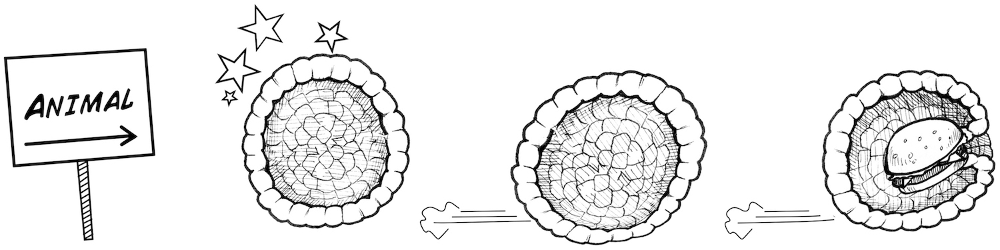

#  Background: Life, Animals, and Nervous System Theory

Earth is filled with Life, Yes. But what exactly is "Life?" And what forms of
Life have nervous systems? Here we give a brief primer on this active
scientific arena.

Time  30 Minutes

Difficulty  Basic

#### What will you learn?

In this write-up you will read about the organization of living beings and the
types of nervous systems therein.

##### Prerequisite Labs

  * This is a purely theoretical writeup where we speak of the origins. No background is necessary

##### Equipment

* [Your Brain](https://en.wikipedia.org/wiki/Brain)

## Background

The big questions of biology are_

* What is Life? 
* How did Life arise _de novo_ on Earth? 
* Does Life exist on other planets? 

These three questions have challenged scientists and thinkers since
civilization began, but we have made progress in answering questions one and
two [1]. Question three remains the unknown of unknowns [2].

We tackle question one here_ what is Life? In the 1970's, Chilean scientists
Humberto Maturana and Francisco Varela wrote of 4 properties common to all
living systems in their influential philosophical work
"[Autopoiesis](https://en.wikipedia.org/wiki/Autopoiesis)_ On Machines and
Living Things."

* All life systems consist of **separation** , be it cells or viruses, of an inside environment and an outside environment, typically using hydrocarbon "[micelles](https://en.wikipedia.org/wiki/Micelle)" than can spontaneously form in solutions [3]. 
* A living system also consists of **cycles** between chemical components_ metabolic activity among proteins, amino acids, fats, sugars, etc.
* Life begets more life, given its ability for **reproduction**.
* Life has **behavior** \- it seeks conditions ideal for its own existence. If Life is hungry, Life eats. If Life is cold, Life seeks warmth. If Life is damaged, Life self-repairs. 

The life we observe on Earth is typically divided into three domains_ the
Bacteria, the Archaea, and the Eukaryota. Archaea and Bacteria are both
single-celled life forms without nuclei, but the two groups have different
metabolic chemistry. Bacteria we are familiar with in both their friendly
(intestinal flora) and unfriendly forms (diseases). Archaea are famous for
living in extreme environments - hot springs, acidic depths, extreme cold,
etc, where not much else can live. Eukaryota (or euk

aryotes) have nuclei, organelles like mitochondria and chloroplasts, and are
themselves further classed into various groups such as the single-celled
"protist" forms, the intermediate forms (single cells that can form colonies),
and the true multicellular forms like us.

It is to these multicellular eukaryotic forms that we direct our attention.
Broadly speaking, there are three types of multicellular life [4]. First, we
have the plants. Wonderful multicellular lifeforms that use the energy of the
sun to grow and make their own food.

We also have the fungi, which are multicellular life forms that eat other
things to grow. Molds and mushrooms, for example, eat through absorption. Some
fungi can also be single-celled, like the yeast in your bread.

And finally, we have the animals. But what is an animal? When you open your
traditional biology textbooks, five things are typically spoken of, two of
which are actually not particularly important for classifying animals.

So, you may ask, what really is an animal? Here we present the most reduced
form.

The animal_ a multicellular entity that moves and eats other things. It also
often begins life as a hollow ball "blastula" but there are exceptions. You,
as an animal, as a human, can move to look for food. A mushroom cannot. The
ability to move is a key distinction, and a control system is required to
sense the external world quickly and coordinate such movement, thus almost all
animals have a....

What does a nervous system then do? It is a computational and communicative
system of specialized cells to quickly detect the environment, analyze it, and
move the body in an appropriate manner and time. To do this, nervous systems
have in general two principles of design_ Neural Nets and Ganglia.

A rule of thumb is that animals with radial symmetry (Jellyfish, Anemones,
Hydra) have neural nets, which is a general distribution of neurons throughout
the body. Animals with bilateral symmetry (insects, worms, us), however, have
collections of neurons grouped together in ganglia, often with an enlarged
ganglia in the anterior part of the animal called a "brain." As Neural Nets
are found only in fragile, difficult to study, soft-body marine creatures, we
know very little about how they function. All our knowledge of nervous system
physiology comes from bilateral animals with ganglia-based nervous systems.

But as biology is famous for, there are exceptions to nervous system
organization. A sea star has radial symmetry but does not have a neural net;
it has a type of ganglia called a "nerve ring." And not all animals have
nervous systems- specifically the two most basal animals_
[porifera](https://en.wikipedia.org/wiki/Sponge) (sponges) and
[placozoa](https://en.wikipedia.org/wiki/Placozoa) (the trichoplax). All other
animals though, be it jellyfish, clams, crustaceans, insects, fish, lizards,
birds, mammals, and of course we humans, have nervous systems.

We can further organize nervous systems between bilateral animals that are
vertebrate versus invertebrate. Vertebrates have a spinal cord encased in a
bony spinal column and consist of the birds, amphibians, lizards, fish, and
mammals (yep, those five are it). Invertebrates, a much larger and more
diverse group, lack spinal columns, can be soft bodied or have exoskeletons,
and consist of effectively every other type of animal (worms, insects,
mollusks, crustaceans. etc).

A notable difference between vertebrate nervous systems and invertebrate
nervous systems is the "degree of centralization." A cockroach, for example,
has ganglia spread along its nerve cord and a slightly larger ganglion in its
head (its brain). This ganglia (brain) is _much more enlarged_ in vertebrates,
and the ganglia of the nerve cord (spinal cord) are smaller relative to the
body.

And in general, the larger the organism, the more neurons it has.

What creature is the question mark? It is a ["sea-
squirt,"](https://en.wikipedia.org/wiki/Ascidiacea) a type of animal that is
motile in its larval phase, but once it finds a rock substrate, it undergoes
metamorphosis and sometimes dissolves its own nervous system in its sedentary
form! The world of invertebrate neuroanatomy is full of strange secrets on the
origin and function of nervous systems, such as.....

**Where did the Neuron come from?**

Due to morphology and genetic studies, the neuron is thought to have only
evolved once from a universal common ancestor, unlike eyes (6-7 times) or
wings (4 times - pterodactyls, birds, insects, and bats). What creature then
had the first nervous system? When did the 'first neuron' with electrical
signaling appear? The simplest nervous systems are thought to be the nerve
nets of the "Cnidaria" group, which includes anemones, hydra, and jellyfish.
Clues may lie in these creatures.

The neuron only evolving once [is now up for
debate](https://www.quantamagazine.org/20150325-did-neurons-evolve-twice/) due
to the recent genetic sequencing of comb jellies (Ctenophora). Comb jellies
are sometimes popularly considered jellyfish but are a completely different
type of marine creature. Notably, they are the largest life forms that [swim
with cilia along their bodies](https://www.youtube.com/watch?v=bW3sqB7RTIc)
(like super size protists). The genetic studies have revealed that comb
jellies have ion channels in their neurons that are distinct from all other
animals' ion channels. Perhaps it developed neurons independently. New
information becomes available every year.

Thus we leave you for now with the revelation that comparative neuroanatomy
and physiology is an area rich for discoveries. How the nervous systems of
jellyfish and anemones operate is virtually untouched. How neural nets
function is unknown. And the secrets into the first nervous systems may be
guarded by the comb jellies.....we await the unveiling.

##  Notes

[**1**] You can read about the [famous experiments of Miller-
Urey](https://en.wikipedia.org/wiki/Miller%E2%80%93Urey_experiment) if you are
curious into the question of abiogenesis and how living systems systems can
emerge from primordial terrestrial chemistry.

[**2**] Planet-Hunter Astronomers are trying to identify "["habitable
zone"](https://en.wikipedia.org/wiki/Circumstellar_habitable_zone) planets
that contain spectral evidence of water, considered a universal solvent of
life. The sub-surface sea on Jupiter's moon Europa also is an intriguing
candidate, as well as the strange "hydrocarbon" oceans on Saturn's moon Titan.

[**3**] Prions and isolated DNA fragments not withstanding.

[**4**] Biology Nerds - we know that the different types of multicellular
algae (brown, green, red, etc) are classed into their own individual families
- but to simplify things we leave them out for now and speak of only Plants,
Fungus, and Animals.

## Discussion Questions

* How starfish have radial symmetry but yet contain ganglia is due to their ancestors. Reading about their classification will reveal why. Hint_ They are more related to bilateral animals. 
* Robots that can self assemble is [an active research topic](https://news.mit.edu/2013/simple-scheme-for-self-assembling-robots-1004). What do you think would be required for a robot to be considered alive? 
* As stated before, we know very little how neural nets function, but this is beginning to change. ["Back to Basics_ Cnidarians Start to Fire"](https://www.ncbi.nlm.nih.gov/pubmed/28041633) (paywall) by Rafael Yuste and colleagues, summarizes emerging studies of creatures with neural nets and where we are. 

## Acknowledgements

* We thank an anonymous visitor to our Detroit Maker Faire stand way back in 2010. When we said_ "All animals have nervous systems," he responded with "What is an animal then?" We realized we did not have a satisfactory answer and were ignorant. 
* We also thank Biologist Daniela Flores of the Chilean Science outreach group [MicroMundo](https://micromundo.microscopiavirtual.cl/) for advising us on comparative biology and classification. 

##  References

* [The Tree of Knowledge](https://www.amazon.com/Tree-Knowledge-Biological-Roots-Understanding/dp/0877736421) by Humberto Maturana and Francisco Varela - An accesible work on the properties life has and its development, based on the famous academic philosophical work by the same authors_ [On Machines and Living Things](https://www.amazon.com/Maquinas-Seres-Vivos-Spanish/dp/9870003869/ref=sr_1_1?s=books&ie=UTF8&qid=1480638335&sr=1-1&keywords=maquinas+y+seres+vivos) (Spanish)
* [Biology](https://www.amazon.com/Campbell-Biology-11th-Lisa-Urry/dp/0134093410/ref=pd_cp_14_4?_encoding=UTF8&pd_rd_i=0134093410&pd_rd_r=HVM5K5Y06ZCHHYY1MJ6P&pd_rd_w=LgWhO&pd_rd_wg=C6CYO&psc=1&refRID=HVM5K5Y06ZCHHYY1MJ6P) by Neil Campbell - Our go-to general biology reference. You can find previous editions usually very cheaply or free at used bookstores or libraries.