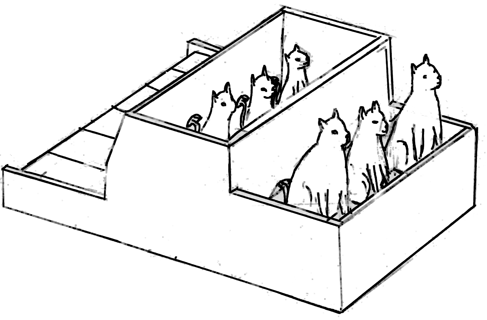
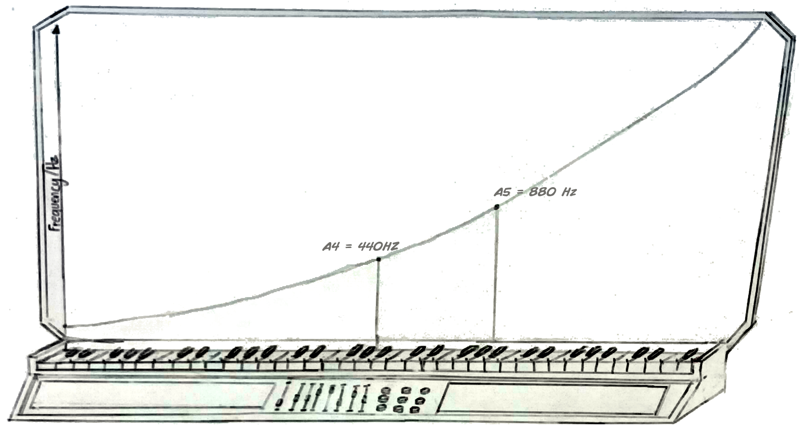
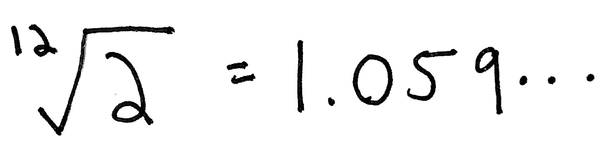
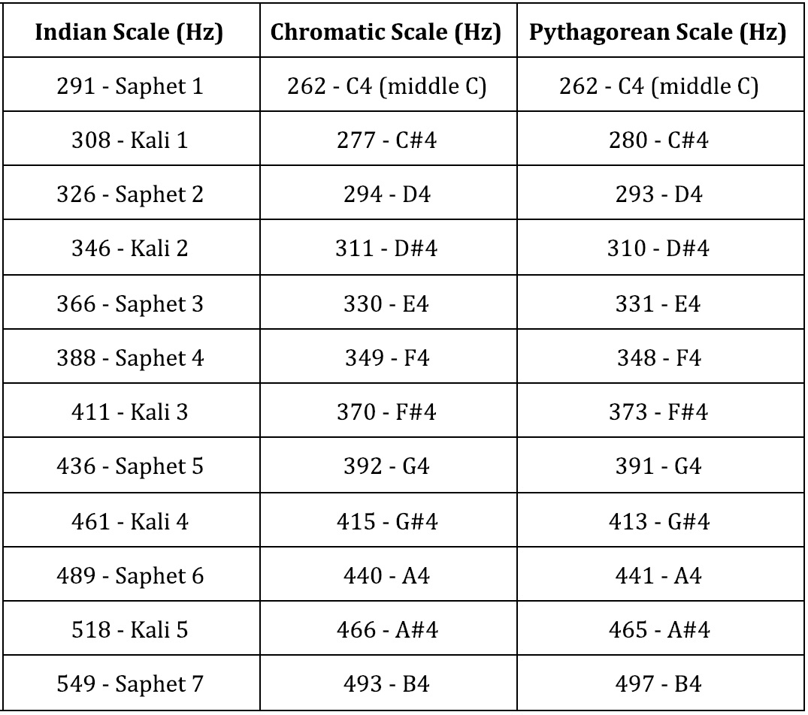
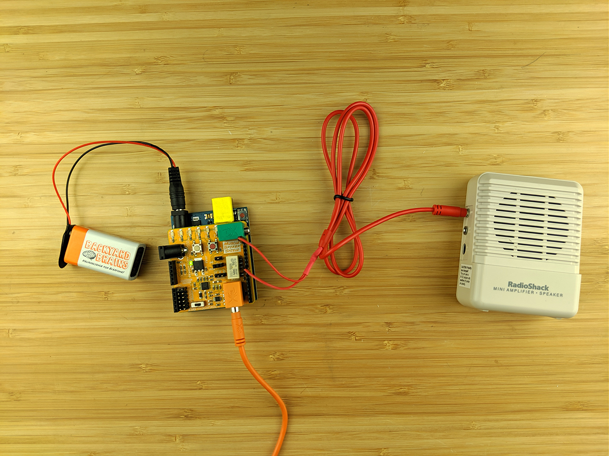
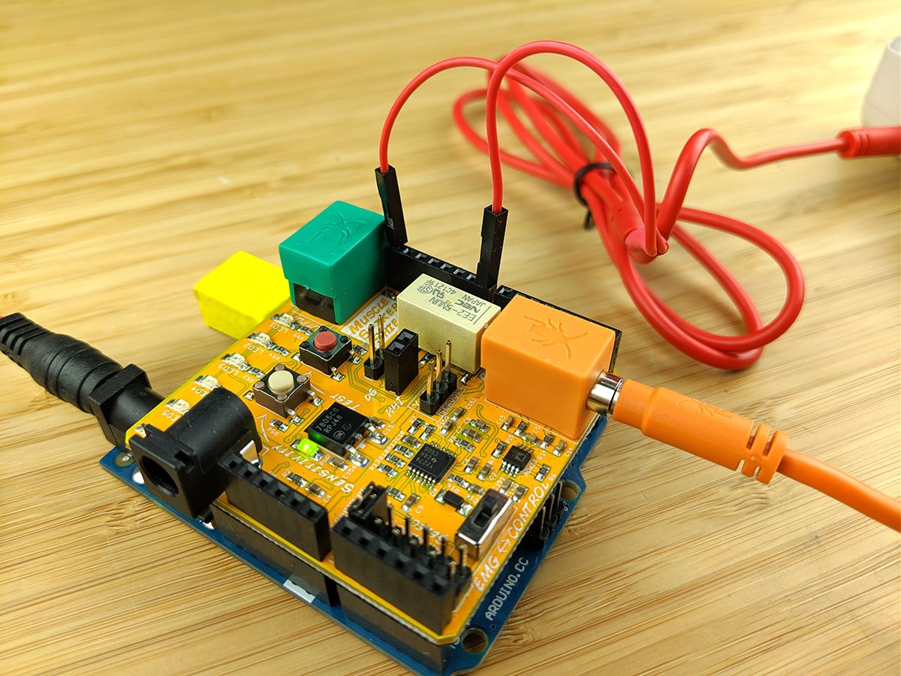

# Experiment_ Make Music with your Muscles

Flex your muscles to create different frequencies and play music.

Time  30 minutes

Difficulty  Beginner

#### What will you learn?

Here you will learn how to get the SpikerShield to play certain frequencies
and notes by reading your muscle's action potentials.

##### Prerequisite Labs

  * [Muscle SpikerShield](muscleSpikershield) \- You should be familiar with the Muscle SpikerShield for Arduino.

##### Equipment

[Muscle SpikerShield
Bundle](https://backyardbrains.com/products/muscleSpikershieldBundle)

[Music-Interface
Cable](https://backyardbrains.com/products/musicinterfacecable)

* * *

## Background

From [mammoth ivory
flutes](https://www.nature.com/news/2004/041213/full/041213-14.html) to
guitars to [cat pianos](https://en.wikipedia.org/wiki/Cat_organ), instruments
have been a central part of human existence for tens of thousands of years.
Most instruments, however, tend to be quite similar in the way they are
played; that is, by mechanical movement of the hands or feet. How else could
they possibly be played, you ask? Well, at Backyard Brains we've created one
of the world's first affordable and accessible instruments controlled by a
muscle's action potentials.

 Much like the cat piano pictured above, our
instrument incorporates both biology and music (in a more high-tech manner, of
course).

Our device also joins a long line of synthetic instruments going back to the
1960's. Beginning with the [Minimoog](https://en.wikipedia.org/wiki/Minimoog),
a synth used in classic albums like "Abbey Road", musicians started
incorporating artificially produced sounds into their work. One of the key
albums that popularized synthesisers, ["Switched on
Bach"](https://en.wikipedia.org/wiki/Switched-On_Bach), was in fact made using
only a Moog. You may also be familiar with the [Doctor Who
theme](https://www.youtube.com/watch?v=75V4ClJZME4), written by [Delia
Derbyshire](https://en.wikipedia.org/wiki/Delia_Derbyshire), which also helped
introduce the synth to the world. This development of synthesisers eventually
led to the rise of electronic music in the 70's and 80's, with artists like
[Giorgio Giovanni ](https://www.youtube.com/watch?v=5vu1MYRlpGg), [ Duran
Duran ](https://www.youtube.com/watch?v=6Uxc9eFcZyM) and [David Bowie
](https://www.youtube.com/watch?v=yadcdunOd7U) making heavy use of the synth.
Up until that point, however, synthesisers were expensive and could only be
purchased by music studios. It wasn't until the mid-80's, with the release of
the [Roland TR-808](https://en.wikipedia.org/wiki/Roland_TR-808) , that they
became accessible to most people. This allowed street genres like [hip-
hop](https://www.youtube.com/watch?v=6JhVgba8HX8) and
[trap](https://www.youtube.com/watch?v=LDIX43oMMxs) to emerge, making use of
[drum beats and chord
progressions](https://www.youtube.com/watch?v=NxhMUPpQzPk&list=RDYeZZk2czG1c&index=11)
on a loop combined with clever word play. You didn't need much else than the
creative urge to begin making music, much like [punk
music](https://www.youtube.com/watch?v=yCW7Aw8ugOI) with cheap electric
guitars and power chords.

Although admittedly not the most practical, our device is certainly one of the
more entertaining instruments out there, continuing the tradition of sound
invention with accessible electronics. It measures the spikes going through
your muscles and, according to how much your muscle is flexed and how many
spikes are generated, plays a certain frequency or note. Notes, after all, are
just certain frequencies that sound pleasant to the human ear. Below is a
graph that shows which frequencies correspond to each note on a piano.

  

  

As you can see, the frequency of the notes increases exponentially. If you
take the frequency of the middle A (440Hz), for instance, and double it, you
will get the frequency of the A one octave above that (880Hz). This pattern
applies to all notes. Since there are 12 notes in an octave, (not what you'd
expect given the name, I know), [you can multiply any note by the 12th root of
two](https://en.wikipedia.org/wiki/Twelfth_root_of_two), or 1.059, to get to
the next one. This number is also
[irrational](https://en.wikipedia.org/wiki/Irrational_number), just like pi!
The dots mean it just goes on and on without any repeating pattern.

  

  

As far as why this particular tuning sounds pleasant to the human ear, it
seems to be somewhat arbitrary. Other tunings, in fact, have used different
ratios in the past, such as the [pythagorean scale
](https://en.wikipedia.org/wiki/Pythagorean_tuning) and the classical [Indian
scale](https://dhrupadmusic.com/indian-western-music.html).

  

 Various Scale Scheme Comparison

  

Our device has six settings that produce six different outputs. You can change
between these settings by pressing the red button on the Muscle SpikerShield.
The first setting outputs a frequency that is proportional to how much you
flex your arm, so if you really tighten your arm, it'll output a high
frequency, and if you untighten it, it'll output a low frequency. Here's the
line of code that makes this happen_

The second setting outputs notes on a [chromatic
scale](https://en.wikipedia.org/wiki/Chromatic_scale), so you can play
different melodies by changing how much you flex your arm.

The third setting plays the same chromatic scale but slightly out of tune, so
it sounds a little spookier and like an old instrument that hasn't been cared
for in years.

The fourth setting plays an Indian scale that has different notes than the
ones western music listeners are used to.

The fifth setting plays "Mary had a Little Lamb" on repeat and, just like a
real [music box](https://en.wikipedia.org/wiki/Music_box), lets you alter the
speed at which the melody plays.

The sixth setting allows you to slightly alter the frequencies of the notes in
"Mary had a Little Lamb", so you can control how out of tune it sounds.

If nursery rhymes aren't really your thing, you can always alter the code and
change the melody. This is for all our [circuit bending
friends](https://blog.backyardbrains.com/2017/03/brainding-project-commences-
with-first-working-prototype/) out there! Now go make some music and entertain
your friends and loved ones!

## Tutorial Video of Experiment

#### Downloads

> This experiment assumes you have a basic understanding of how to use the
> Arduino Platform and you know how to upload code to your board. If you are
> new to arduino, or need a refresher, check out [Getting Started with Arduino
> on Windows](https://arduino.cc/en/guide/windows#.UyIUTYW3t4x) or [Getting
> Started with Arduino on Mac OS X
> ](https://arduino.cc/en/guide/macOSX#.UyIU2IW3t4w).
>
> [Arduino Software](https://arduino.cc/en/main/software#.Uxd6XYWhZMk)
>
> You can download the sketch here. Check out the comments for some insight
> into how it works!
>
> [Music
> Sketch](https://backyardbrains.com/experiments/files/musicalBox2.ino.zip)

### Procedure

  

  1. Your set up is easy! Upload the code to the Arduino, then unplug it from the computer and then plug in a battery to power up your Muscle SpikerShield. 
  2. Take your [Music-Interface Cable](https://backyardbrains.com/products/musicinterfacecable) and attach one pin out to digital pin 8 and another one to ground, then plug your cable into a speaker. 

  

  

  3. Then, you'll want to attach USB cable and upload the music code, using the video above as a guide. 
  4. Begin flexing! You should begin hearing the musical tones. Pressing the red button allows you to switch between the various modes. 
  5. Below is the code with comments to make it easier to understand. 

    
    
    #include 
    
    #define NOTE_C4  262    //These definitions specify the frequency of each note.
    #define NOTE_D4  294
    #define NOTE_E4  330
    #define NOTE_F4  349
    #define NOTE_G4  392
    #define NOTE_A4  440
    #define NOTE_B4  494
    #define NOTE_C5  523
    
    #define BUTTON 4
    #define NUM_LED 6  
    #define MAX 1160   //Maximum posible reading. >>>> TWEAK THIS VALUE!! <<<<
    #define MIN 300    //Minimum posible reading. >>>> TWEAK THIS VALUE!! <<<<
    
    int channel = 2;   //Determines what channel the musical box is in.
    
    int c4Note;
    int c4Duration = 600; //Determines the duration of each note in channel 4.
    int c4Scale[]{        //Inclues all the notes you can play on channel 4.
      NOTE_F4, NOTE_G4, NOTE_A4, NOTE_C5
      };
    int c2Note;
    int c2Duration = 300; //Determines the duration of each note in channel 2.
    int c2Scale[]{        //Inclues all the notes you can play on channel 2.
      NOTE_C4, NOTE_D4, NOTE_E4, NOTE_F4, NOTE_G4, NOTE_A4, NOTE_B4
      };
    int melody[] = {        //Includes the notes in the melody for "Mary had a Little Lamb".
      NOTE_A4, NOTE_G4, NOTE_F4, NOTE_G4, NOTE_A4, NOTE_A4, NOTE_A4, 
      NOTE_G4, NOTE_G4, NOTE_G4, NOTE_A4, NOTE_C5, NOTE_C5, 
      NOTE_A4, NOTE_G4, NOTE_F4, NOTE_G4, NOTE_A4, NOTE_A4, NOTE_A4,
      NOTE_G4, NOTE_G4, NOTE_A4, NOTE_G4, NOTE_F4
    };
    int noteDurations[] = { //Determines the duration of each note in the melody.
      4, 4, 4, 4, 4, 4, 2, 4, 4, 2, 4, 4, 2, 4, 4, 4, 4, 4, 4, 2, 4, 4, 4, 4, 2
    };
    int distortion;   //Used later for distoriting a melody.
    int note;
    
    int c5Scale[]{    //Inclues all the notes you can play on channel 4.
      291, 308, 326, 346, 366, 388, 411
    };
    int c5Note;
    int c5Duration = 300;    //Determines the duration of each note in channel 2.
    
    int thisNote = 0;   //Used later for changing between channels.
    int buttonState;
    int oldButtonState;
    
    int reading[10];    // Used later for reading the electrical signals in your arm. 
    int finalReading;
    byte litLeds = 0;
    byte multiplier = 1;
    byte leds[] = {8, 9, 10, 11, 12, 13};
    
    ///////////////////////////////////////////////////////////////////////////////////////////////////
    
    void setup() {
      pinMode(BUTTON, INPUT);   //Sets the button as an input.
    
      Serial.begin(9600); 
      for(int i = 0; i < NUM_LED; i++){     //Sets the LEDs as outputs.
        pinMode(leds[i], OUTPUT);
      }
    }
    
    ///////////////////////////////////////////////////////////////////////////////////////////////////
    
    void loop() {
      buttonState = digitalRead(BUTTON);
      if ((buttonState == HIGH) && (oldButtonState == LOW)){    //If the button used to not be pressed an is now pressed, change
        if (channel < 6){                                       //the channel and output a tone to indicate that it has changed.
          channel += 1;
          tone(8, 200, 300);
          digitalWrite(leds[channel-1], HIGH);
          delay(300);
        }
        else{
          channel = 1;
          tone(8, 200, 300);
          digitalWrite(leds[0], HIGH);
          delay(300);
        }
      }
      oldButtonState = buttonState;
      
    ///////////////////////////////////////////////////////////////////////////////////////////////////
    
    for(int i = 0; i < 10; i++){    //Take ten readings in ~0.02 seconds.
        reading[i] = analogRead(A0) * multiplier;
        delay(2);
      }
      for(int i = 0; i < 10; i++){   //Average the ten readings.
        finalReading += reading[i];
      }
      finalReading /= 10;
      for(int j = 0; j < NUM_LED; j++){   //Write all LEDs low.
        digitalWrite(leds[j], LOW);
      }
      Serial.print(finalReading);
      Serial.print("\t");
      finalReading = constrain(finalReading, 0, MAX);
      litLeds = map(finalReading, 0, MAX, 0, NUM_LED);
      Serial.println(litLeds);
      for(int k = 0; k < litLeds; k++){
        digitalWrite(leds[k], HIGH);
      }
        
    ///////////////////////////////////////////////////////////////////////////////////////////////////
    
    if (channel == 1){
       if(finalReading > MIN){
           tone(8, finalReading/1.5, 100); //Output a tone equal to the final reading divided by 1.5.
           delay(100);
       }
      }
      
    ///////////////////////////////////////////////////////////////////////////////////////////////////
    
      if (channel == 2){
        if (finalReading > MIN) {
          c2Note = map(finalReading, MIN, MAX, 0, 6);   //Map every frequency to a number between 0 and 6.
          tone(8, c2Scale[c2Note], c2Duration);         //Convert that number to a note and play it.
          delay(c2Duration);
        }
      }
    
    ///////////////////////////////////////////////////////////////////////////////////////////////////
    
      if (channel == 3){
        if (finalReading > MIN) {
          c2Note = map(finalReading, MIN, MAX, 0, 6);   //Map every frequency to a number between 0 and 6.
          tone(8, c2Scale[c2Note]*0.4 +8, c2Duration);         //Convert that number to a note and play it.
          delay(c2Duration);
        }    
      }
    
    ///////////////////////////////////////////////////////////////////////////////////////////////////
      
      if (channel == 4){
        if (finalReading > MIN) {
          c5Note = map(finalReading, MIN, MAX, 0, 6);   //Map every frequency to a number between 0 and 6.
          tone(8, c5Scale[c5Note], c5Duration);         //Convert that number to a note and play it.
          delay(c5Duration);
        }  
      }
    
      
    ///////////////////////////////////////////////////////////////////////////////////////////////////
    
      if (channel == 5){      
        //To calculate the note duration, take one second divided by the note type.
        int noteDuration = (1400 - finalReading*1.2) / noteDurations[thisNote];
        tone(8, melody[thisNote], noteDuration);
        delay(noteDuration * 1.30);   //To distinguish the notes, set a minimum time between them.
        noTone(8);
        if (thisNote == 24){    //If the melody has ended, go back to the first note.
          delay(400);
          thisNote = -1;
          }
        thisNote ++;
        }
        
    ///////////////////////////////////////////////////////////////////////////////////////////////////
    
      if (channel == 6){      
        int distortion = map(finalReading, MIN, MAX, 7, 14);
        Serial.println(distortion);
        //To calculate the note duration, take one second divided by the note type.
        int noteDuration = 1000 / noteDurations[thisNote];
        tone(8, (melody[thisNote]*distortion)/10, noteDuration);
        delay(noteDuration * 1.30);   //To distinguish the notes, set a minimum time between them.
        noTone(8);
        if (thisNote == 24){    //If the melody has ended, go back to the first note.
          delay(400);
          thisNote = -1;
          }
        thisNote ++;
        }
    }
    

### Experiment

Got it working? Great! Now it's time to personalize your instrument.

  1. First, let's teach our instrument a new song. 
  2. Choose your new song! For our example, we're going to teach the Arduino to play the Star Wars "Imperial March," but we're going to do it with the notes we already have programmed into the Arduino, so it'll sound a bit out of key! If you want to fix it, or if you want to find or write your own song, that works too - you'll just have to add more notes! 
  3. Find the notes needed to play your song. For the "Imperial March" we'll be teaching the Arduino this sequence of notes_ E, E, E, C, F, E, C, F, E, A, A, A, B, F, E, C, F, E 
  4. The Arduino doesn't read "notes." Look at the top of the code where we define what "notes" are_ 
    
        #define NOTE_C4  262    //These definitions specify the frequency of each note.
    #define NOTE_D4  294
    #define NOTE_E4  330
    #define NOTE_F4  349
    #define NOTE_G4  392
    #define NOTE_A4  440
    #define NOTE_B4  494
    #define NOTE_C5  523
    

Here we are defining the notes by the frequency of the sound the Arduino is
going to generate when that "note" is activated. So, "NOTE_C4" for example, is
a variable that is set to generate a tone at 262hz, which is a sound we
recognize as the note C!

  5. Find in the codewhere the notes for "Mary Had a Little Lamb" are set out. 
    
        int melody[] = {        //Includes the notes in the melody for "Mary had a Little Lamb".
      NOTE_A4, NOTE_G4, NOTE_F4, NOTE_G4, NOTE_A4, NOTE_A4, NOTE_A4, 
      NOTE_G4, NOTE_G4, NOTE_G4, NOTE_A4, NOTE_C5, NOTE_C5, 
      NOTE_A4, NOTE_G4, NOTE_F4, NOTE_G4, NOTE_A4, NOTE_A4, NOTE_A4,
      NOTE_G4, NOTE_G4, NOTE_A4, NOTE_G4, NOTE_F4
    };
    

This is section of code which "teaches" the Arduino how to play "Mary Had a
Little Lamb." Let's replace it with our new song.

  6. Write out your music using the defined variables (Note_ You may need to add more notes if your song has multiple octaves! Do some investigating and find out what frequency your new notes reasonate at.) For the "Imperial March" we'll write it out like this_ 
    
        NOTE_E4, NOTE_E4, NOTE_E4, NOTE_C4, NOTE_F4,
    NOTE_E4, NOTE_C4, NOTE_F4, NOTE_E4,
    NOTE_A4, NOTE_A4, NOTE_A4, NOTE_B4, NOTE_F4,
    NOTE_E4, NOTE_C4, NOTE_F4, NOTE_E4
    

  7. Replace the melody in our default code with your new melody, upload it, and try it out! Press the button like you saw in the video to change the kit to setting 5, where the melody will play and flexing will speed it up or slow it down - or bump it up once more to setting 6, where flexing will change the frequency of the notes themselves! 

Wait - something is still off... you likely noticed that, while the notes have
changed, the duration of the notes is still to the beat of "Mary Had a Little
Lamb," making for quite the strange mashup...

  8. Fix the note durations! Find this line in your code_ 
    
        int noteDurations[] = { //Determines the duration of each note in the melody.
      4, 4, 4, 4, 4, 4, 2, 4, 4, 2, 4, 4, 2, 4, 4, 4, 4, 4, 4, 2, 4, 4, 4, 4, 2
    };
    

You might notice something seemingly counter-intuitive here. If you hum to
"Mary Had a Little Lamb" while following along with those listed note
durations, the larger numbers are the shorter notes! In this code, the number
4 will create a quarter note, 2 a half note, and 1 a full note - this is why_

    
        if (channel == 5){      
        //To calculate the note duration, take one second divided by the note type.
        **int noteDuration = (1400 - finalReading*1.2) / noteDurations[thisNote];**
        tone(8, melody[thisNote], noteDuration);
        delay(noteDuration * 1.30);   //To distinguish the notes, set a minimum time between them.
        noTone(8);
        if (thisNote == 24){    //If the melody has ended, go back to the first note.
          delay(400);
          thisNote = -1;
          }
        thisNote ++;
        }
    

The value of "noteDuration" is a divisor, listed in the code that
"//Determines the duration of each note in the melody." So, to create a
quarter note, we divide by 4, to create a half note, we divide by two, so on
and so forth.... If you are writing out your own song, you may have to
experiment with how to get your notes to the correct duration, but I think you
can follow this logic! Sixteenth note? Divide by 16! One trillionth of a note?
Divide by 1,000,000,000,000!

  9. So for the "Imperial March," we'll fix the note duration by like this_ 
    
        int noteDurations[] = { //Determines the duration of each note in the melody.
      4, 4, 4, 8, 8, 4, 8, 8, 2, 4, 4, 4, 8, 8, 4, 8, 8, 2
    };
    

  10. Replace the original note durations with the new, upload your code, and try it out! 

**One last change...**

  11. Right now on setting 5, flexing changes up the duration of the notes. What if we set all the notes to the same duration, then you used your muscles to speed up the melody during the shorter notes? Change all the notes to quarter notes_ 
    
        int noteDurations[] = { //Determines the duration of each note in the melody.
      1, 1, 1, 1, 1, 1, 1, 1, 1, 1, 1, 1, 1, 1, 1, 1, 1, 1
    };
    

  12. Upload your code, now the melody will play at a boring, constant beat, with all the notes being played for the same duration (whole notes). Flex to speed it up, and relax to slow it down. Can you use your muscles to play the song well enough to make Darth Vader proud? 

### What will you create?

Keep looking through the code, modify it, personalize your instrument! Make
changes and see what happens. If you followed along with our example, we'd
encourage you to transcribe or write your own song now. Or, would a challenge
encourage you? Email us a video of your original musical creation at
[hello@backyardbrains.com](mailto_tim@backyardbrains.com) and we'll post it to
our social medias and mail you a free BYB Sticker Pack!

### Troubleshooting

    1. Due to timing and delays I used in the two "Mary had a little lamb" sequences (settings 5 and 6), sometimes when you press the button to switch settings, the Arduino won't switch. Just press it again a couple more times until the code gets out of the timing loop it is in. This is our first prototype of the code ;) 
    2. This pictures above show how to connect the SpikerShield to your headphones, and the video shows how to connect the SpikerShield to a portable speaker. The procedure is virtual identical between the two. 

### Discussion

    1. This technology could potentially be used to make "air" instruments, such as air drums or an air guitar. If you hooked up the electrodes to your wrist extensors, could you create a "drumming" type percussion sound? 
    2. We did not implement a [Pythagorean scale](https://charlesames.net/sound/tuning.html) in this code, but we leave it to you to play more with different scale arrangements. 
    3. We dealt with pure frequencies here given the limitations of Arduino, but if we wanted to generate more complex sounds, we need to generate more than 1 frequency at once. This is why an A4 note at 440 Hz sounds different on a flute, piano, and guitar, as it deals with the harmonics of the fundamental frequencies generated. Arduino actually allows you to generate three tones at once, if you hook up to three different digital outputs. We haven't tried this though and, again, leave it to you. 
    4. Music theory is new to us, did we miss something or do you have ideas for other music projects? Let [let us know!](mailto_tim@backyardbrains.com)